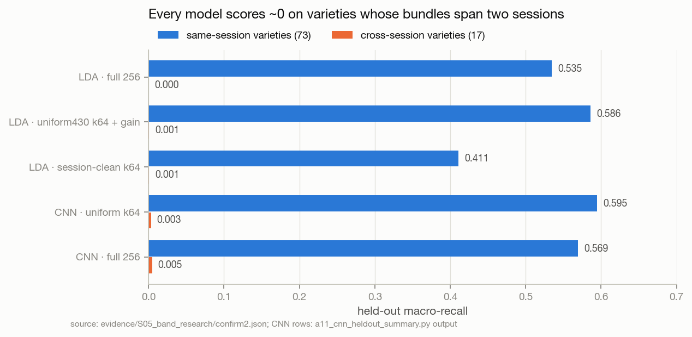
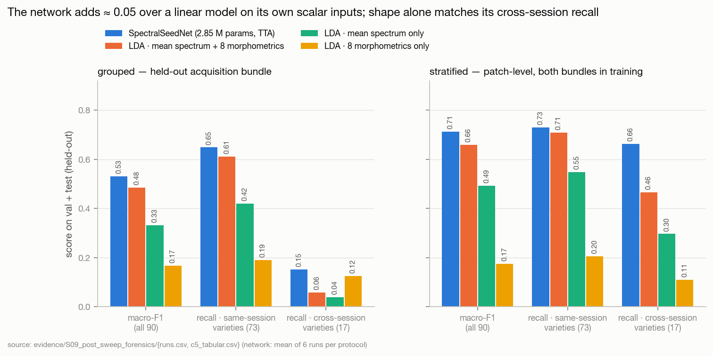

# Research log — rice-variety identification from VIS–NIR hyperspectral seed images

This directory is the **single place** where the project's research is recorded: what we asked,
why we asked it, what we did, what came out, what we decided because of it, and what is still
open. The engineering documents in `docs/01`–`07` describe *how the code works*; this log
describes *what we have learned and why the code is the way it is*.

> **Start here if you are new:** read [§1](#1-where-the-research-stands-today) below, then
> [`TIMELINE.md`](TIMELINE.md) (the story, in order), then the study you care about.
> **Start here if you are about to run something:** [`WORKFLOW.md`](WORKFLOW.md), then
> [`FUTURE_WORK.md`](FUTURE_WORK.md).

---

## 1 · Where the research stands today

*Last revised 2026-10-03 (after S14). Update this section whenever a finding or decision changes status.*

**The question.** 90 rice varieties, 8,624 single-kernel hyperspectral patches (Zenodo 3241923).
Can a model identify the *variety* of a kernel — and how much of what a model scores on this
dataset is variety recognition rather than recognition of *how and when the kernel was imaged*?

**What we know, with evidence:**

1. **The original 0.847 / 87.8 % results do not measure variety recognition.** They came from a
   patch-level split in which every acquisition bundle was in both training and test, with bands
   chosen using test labels, and a score maximised over ~944 checkpoints on the split it was
   reported from. [F02–F05](FINDINGS.md) · [S01](studies/S01_independent_audit/README.md)
2. **Held out by acquisition bundle, the honest level is far lower** — about 0.42 macro-F1 for a
   linear model on mean spectra and 0.44–0.46 for a small spatial-spectral CNN. [F21](FINDINGS.md)
3. **Even that held-out score is almost entirely session recognition.** 73 of 90 varieties had
   both bundles imaged in the *same session*. On the 17 varieties whose bundles span two
   sessions, every model we have run scores **≈ 0 recall**. [F23–F25](FINDINGS.md) ·
   [S06](studies/S06_session_confound/README.md)
4. **More bands are not better.** For the spatial-spectral proxy, 24–64 evenly spaced bands beat
   the full cube on both calibration and held-out data, and no supervised band selector beats
   even spacing on held-out data. [F17–F19](FINDINGS.md) · [S05](studies/S05_band_research/README.md)
5. **The dataset is now white-tile reflectance (215 bands),** not per-pixel SNV (256 bands),
   because the illumination's spectral shape is a session fingerprint that SNV cannot remove.
   Reflectance moved that fingerprint from the lamp peak to a broad NIR offset rather than removing
   it. [F27, F40](FINDINGS.md) · [S07](studies/S07_reflectance_calibration/README.md)
6. **The network's first honest numbers** (SpectralSeedNet, k32 reflectance): grouped **0.530 ± 0.009**,
   stratified 0.712 ± 0.033 macro-F1; cross-session recall 0.152 — but morphometrics *alone* reach 0.124.
   [F30, F33](FINDINGS.md) · [S09](studies/S09_post_sweep_forensics/README.md)
7. **What limits it is split.** The network adds only ≈ 0.05 over LDA on its own 40 scalar inputs. Within
   the acquisition it scores as well as it fits, and it under-fits; 63 % of the grouped shortfall is
   already there in-distribution. S09 read this as **score → model/training, claim → data/protocol**; S12 tested the
   first half and revised it (item 10): fitting better did not move the score. [F31–F38](FINDINGS.md) · [D16, D17](DECISIONS.md)
8. **Why it under-fits: the regime, demonstrably; the architecture, in specific places.** The clean-label objective
   gets 3.6 % of the learning rate, most of it spent on a margin few training kernels can meet; measured cleanly the
   network fits 0.87–0.95 of its training kernels, and within the acquisition held-out moves with fit one for one. The
   regime that ran is not the documented one (aux weight 0.65 → 0.25, not 0.2). The spatial tail collapses to 1 × 1
   (11.5 % of parameters never train), the spectral path's chemometric blocks are inert, and the network cannot see
   reflectance level. Training was repaired first (X1, X4) — and fit is no longer the limit (item 10).
   [F44–F56](FINDINGS.md) · [D19–D21](DECISIONS.md) · [S10](studies/S10_training_architecture_review/README.md)
9. **The code now measures what the next experiments need, without changing what they are compared against.** Clean
   fit on a fixed training subset, the aux weight actually applied, per-module gradients, logits, the code revision, and
   every kernel scored once; a before/after gate shows none of it moves a training number. [F57, F58](FINDINGS.md) ·
   [D22](DECISIONS.md) · [S11](studies/S11_frozen_arms_execution/README.md)
10. **Fitting was not the bottleneck after all.** A fit-first regime makes the network classify 0.98–0.99 of its training
    kernels, and every held-out number stays where it was (grouped 0.531, stratified 0.727); the extra fit is
    memorisation, and with every regulariser removed the network fits 1.000 and generalises worse. Capacity is ample;
    the remaining errors are systematic. [F59–F62](FINDINGS.md) · [S12](studies/S12_frozen_arms_reading/README.md)
11. **The 3-D spatial pathway is where the network's extra accuracy comes from — and where the session lives.** Without
    it the network has the best cross-session recall measured on this dataset (0.214) and much less session attraction;
    the morphometric scalars are not what carries cross-session recall; training the two pathways jointly adds nothing
    over fusing them afterwards (under the shipped regime — S14 found this robustness does not survive R1). Across bundles the network is no better than a linear model on within-kernel pixel
    statistics. **The bottleneck is representation under acquisition shift (route A):** no more capacity or regime
    work; the next round tests decoupled pathways, style randomisation and a leaner architecture, and the larger
    headroom is in new information (RGB shape, more bands, transfer standards). [F63–F71](FINDINGS.md) ·
    [D23–D27](DECISIONS.md)
12. **A leaner network is the first change since the audit that moves every held-out number at once — at one seed so
    far.** Removing what S10 found inert or broken (the chemometric descriptor blocks, the 1 × 1 tail end, a CBAM on a
    2 × 2 map) gave grouped **0.562** and stratified **0.746**, above every run of the current reference in all three
    cells, with same- *and* cross-session recall up (0.678 / 0.186) and session attraction down — off the trade-off
    frontier S12 thought only new data could leave. It is a screening result (one seed); replication and a dissection
    of which removal carries it are frozen (S15). [F74, F75](FINDINGS.md) · [D30, D33](DECISIONS.md) ·
    [S14](studies/S14_screen_reading/README.md)
13. **The two session-robustness ideas failed the screen, for informative reasons.** Training the pathways separately
    and fusing them keeps the score but loses its robustness under the fit-first regime: fitting more moves each single
    pathway toward session recognition, and a fusion weight chosen on calib — which shares the training session —
    favours the session-carrying pathway. Mixing the 3-D stem's feature statistics across kernels weakens that pathway
    without removing its session. The 80/20 split scores the same as 70/30 (0.728). The training-rows session κ is
    reproducible but cannot rank networks that share the spatial pathway. [F76–F81](FINDINGS.md) · [D31, D32](DECISIONS.md)

**What we do not know yet** (frozen in `evidence/S14_screen_reading/preregistration_s14.json` for S15, unless marked CPU):

- Does the lean network's gain replicate at seeds 1–2, and is it a gain (≥ +0.02, CI excluding 0) and a robustness gain
  on fresh seeds? → [FW-35](FUTURE_WORK.md)
- Which removal carries it — the spectral descriptor or the spatial repair? → [FW-36](FUTURE_WORK.md)
- Does a tabular foundation model or a per-pixel set encoder beat the lean network on kernel summaries (CPU)?
  → [FW-28, FW-27](FUTURE_WORK.md)
- What do high-resolution RGB shape and the 215-band cube add — still the levers with the most headroom? → [FW-18,
  FW-03](FUTURE_WORK.md)
- What is the within-acquisition (80/20) tier of the reference architecture, at 3 seeds? → [FW-37](FUTURE_WORK.md)

**The two most important figures so far** — the session confound, and how little the network adds:





---

## 2 · How this log is organised

```
docs/research/
├── README.md          ← you are here: state of knowledge, index, conventions
├── WORKFLOW.md        how a study is run here: lifecycle, gates, leakage rules, templates
├── TIMELINE.md        the narrative: each study, why it was started, what it changed
├── FINDINGS.md        register of every finding  (F01 …)  — claim · evidence · strength · status
├── DECISIONS.md       register of every decision (D01 …)  — context · evidence · reversal trigger
├── HYPOTHESES.md      every pre-registered hypothesis and planned ablation, with outcome
├── FUTURE_WORK.md     the prioritised backlog  (FW-01 …)  — what to run next, and why
├── GLOSSARY.md        the project's vocabulary (bundle, session, grouped, calib, uniform430 …)
├── studies/
│   ├── _TEMPLATE.md   copy this to start a new study
│   └── S00 … S14/     one folder per study, each with its own README.md
├── figures/<study>/   every figure the log shows (generated or copied — never hand-edited)
├── evidence/<study>/  snapshot of the raw results each claim rests on (outputs/ is git-ignored)
└── tools/build_assets.py   regenerates evidence/ and figures/ from outputs/ and dataset/
```

**Registers are the spine.** Every study writes into the same four registers (findings,
decisions, hypotheses, future work). A study page explains; a register entry is what other pages
link to. That is what keeps the log *centralised* (one place to look up any claim) while each
study stays *modular* (it can be read, revised or superseded on its own).

## 3 · Study index

| ID | Study | Dates | Status | Key output |
|---|---|---|---|---|
| [S00](studies/S00_pre_refactor_baseline/README.md) | Pre-refactor SpectralQuadNet baseline | 2026-02-16 → 03-24 | **superseded** by S01 | 87.8 % / 89.4 % TTA accuracy — leaky, not reproducible |
| [S01](studies/S01_independent_audit/README.md) | Independent audit of run `stratified_benchmark_rtx3060` | 2026-08-13 | complete | 7 findings, 14 implementation changes, ablation plan A1–A12 |
| [S02](studies/S02_architecture_protocol_revision/README.md) | Architecture & protocol revision (SpectralSeedNet, grouped, calib) | 2026-08-13 → 08-14 | implemented, **not yet validated by training** | 3.0 M-param two-pathway model, single stage, enforced protocol |
| [S03](studies/S03_band_study_proxy/README.md) | Band study on mean-spectrum proxies (12 methods × 20 budgets × 3 proxies) | 2026-08-13 | complete (calib only) | even spacing is the best method at k ≤ 40; plateau 192–224 bands |
| [S04](studies/S04_compute_engineering/README.md) | Compute & data-path engineering | 2026-08-06 → 10-01 | ongoing | Metal 2.1× step, mmap I/O fixes, Kaggle T4×2 profile |
| [S05](studies/S05_band_research/README.md) | Band research with pre-registered held-out confirmation | 2026-09-29 → 09-30 | complete | 430 nm floor, uniform430 finalists, CNN peak at 24–64 bands |
| [S06](studies/S06_session_confound/README.md) | The acquisition-session confound | 2026-09-29 → 09-30 | complete (diagnosis); remedy open | cross-session recall ≈ 0 for every model |
| [S07](studies/S07_reflectance_calibration/README.md) | White-tile reflectance calibration | 2026-09-30 | complete (data built); effect unmeasured | 215-band reflectance cube replaces the SNV cube |
| [S08](studies/S08_neural_confirmation/README.md) | Neural confirmation on the reflectance cube | 2026-10-01 → | protocol sweep run (u430k32); budget arms open | grouped 0.530 · stratified 0.712 |
| [S09](studies/S09_post_sweep_forensics/README.md) | Post-sweep forensics: data/protocol or model/training? | 2026-10-01 | complete (analysis); next arms frozen | +0.05 over LDA; fit-limited; 3 reporting tiers |
| [S10](studies/S10_training_architecture_review/README.md) | Training & architecture review: why it under-fits, what to change first | 2026-10-01 | complete (specification); X4–X6 frozen | 3.6 % of the LR on clean labels; aux weight not as documented; dead tail; level-blind |
| [S11](studies/S11_frozen_arms_execution/README.md) | Executing the frozen diagnostics (X1, X2, X4) | 2026-10-01 → 10-02 | complete — instrumentation validated; 22/23 cells run and scored (read in S12) | neutral instrumentation (G-neutral); clean-fit probe; pathway switch; `run_frozen.py` |
| [S12](studies/S12_frozen_arms_reading/README.md) | Reading X1, X2, X4: what binds now that the network fits | 2026-10-02 | complete (analysis); S13 arms frozen | fit solved, held-out unmoved; the 3-D pathway is the session channel; route A |
| [S13](studies/S13_representation_screening/README.md) | Route-A arms Y1–Y4 as a single-seed screen | 2026-10-02 → | complete — run 2026-10-03 (10 + 2 cells), read in S14 | one seed, all arms/folds/contrasts (D28); P0 fixed (F72) |
| [S14](studies/S14_screen_reading/README.md) | Reading the S13 screen: what passed, what failed and why | 2026-10-03 | complete (analysis); S15 frozen | lean network passes (grouped 0.562, stratified 0.746, cross 0.186); decoupling and MixStyle rejected; Y3 replication + dissection frozen |

## 4 · Conventions

**Identifiers are permanent.** `S##` study, `F##` finding, `D##` decision, `H#`/`A#` hypothesis
or ablation, `FW-##` future work. An ID is never reused or renumbered; a wrong entry is marked
`superseded by …` or `retracted`, never deleted. Links between documents use IDs, so history
stays navigable.

**Evidence strength** (used in every register):

| Level | Meaning |
|---|---|
| **E4 · confirmed** | Pre-registered, held-out, ≥ 2 folds; or a structural fact of the data/code checked directly |
| **E3 · held-out** | Measured on held-out bundles, but not pre-registered or only one proxy |
| **E2 · in-sample** | Measured on calib / within the training bundle only (optimistic by construction — see F21) |
| **E1 · indicative** | Single run, single seed, leaky split, or a number quoted from a log not in the repo |
| **E0 · claim** | Stated somewhere, no artifact reproduces it |

**Which split a number comes from is part of the number.** Every result in this log names its
split: `stratified` (leaky, patch-level), `calib` (same bundle as training), or `held-out`
(the other bundle, `val ∪ test`). Never compare across splits without saying so.

**Which band axis.** Results from S03, S05 and S06 were measured on the former **256-band
per-pixel-SNV** cube. `./dataset` is now the **215-band reflectance** cube (S07). Band *indices*
from one axis must never be used on the other; *wavelengths* may be compared.

## 5 · Keeping this log current

The full procedure is in [`WORKFLOW.md`](WORKFLOW.md) §5. In short, when a study finishes:
add its folder from the template, add its rows to the registers, add one entry to
`TIMELINE.md`, re-run `python docs/research/tools/build_assets.py`, and revise §1 above.
