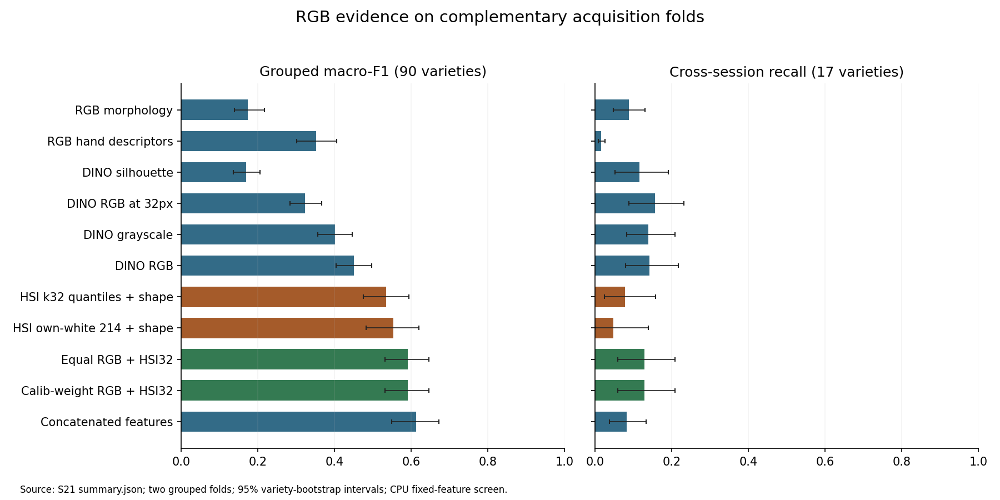

# Research log — rice-variety identification from VIS–NIR hyperspectral seed images

This directory is the **single place** where the project's research is recorded: what we asked,
why we asked it, what we did, what came out, what we decided because of it, and what is still
open. The engineering documents in `docs/01`–`07` describe *how the code works*; this log
describes *what we have learned and why the code is the way it is*.

> **Start here if you are new:** read [§1](#1-where-the-research-stands-today) below, then
> [`TIMELINE.md`](TIMELINE.md) (the story, in order), then the study you care about.
> **Start here if you are about to run something:** [`WORKFLOW.md`](WORKFLOW.md), then
> [`FUTURE_WORK.md`](FUTURE_WORK.md).

---

## 1 · Where the research stands today

*Last revised 2026-10-05: S27–S29 complete; development screening closed (D52); S30 confirmation proposed, not frozen.*

**Selected development system (S29, D51):** frozen v5 HSI encoder (k32 reflectance, R1 TTA) +
frozen DINOv2 **ViT-L/14** RGB probe + calibrated equal probability fusion + a 43,994-parameter
additive head trained against that TTA anchor. On S21's corrected folds (seed-0 encoders, both
folds) its macro-F1 is **.627150**, against HSI TTA alone .559098, fixed equal fusion with ViT-S .601595,
and fixed equal fusion with ViT-L .620455. Same/cross-session recall .7408/.2480.
- [S27](studies/S27_tta_trained_head/results.md): training the head against the TTA anchor adds
  +.0131 [.0044, .0216] over fixed fusion.
- [S28](studies/S28_tta_head_seeds/README.md): stable across head seeds (SD .0009).
- [S29](studies/S29_rgb_backbone_screen/README.md): ViT-L adds +.0124 [.0057, .0198] at system level.
- On ViT-L, the head's own margin over fixed fusion is only +.0067 [.0001, .0133]. Whether the
  head is kept is S30's C2 test with matched encoder seeds.

**Dominant bottleneck (F113):** away-from-session-8 cross recall is ≈ .18 for *every* system;
all cross gains go to session-8 destinations, and 57% of cross errors land on a class trained in
the test kernel's session (14% chance). This is acquisition-limited: next compute is the
[S30 matched confirmation](studies/S30_final_confirmation/README.md) (four GPU fits, needs
authorization); next science is crossed sessions/lots (FW-42).


*Earlier state (2026-10-05, before S27), retained below.*

**RGB is now an established data pathway and a measured research candidate.** All
8,624 retained kernels in 180 scans have validated grid identities, native RGB masks,
foreground crops and exact historical k32 parity. Full215 compact spectral summaries
and occupied-region spectra are available; strict 214-band excludes pooled-white values.
[S20 data/experiment report](studies/S20_rgb_pathway/README.md).

**Current evidence:** on S21's corrected complementary folds, RGB DINOv2 probe
macro-F1 is **.450520**, HSI32 quantile+morph LDA **.534850**, and equal probability
fusion **.591820**. Fusion cross-session recall is **.127858**, versus HSI32 **.077941**.
RGB appearance helps; extra bands and concatenation improve aggregate F1 but reduce
transfer, and correct kernel pairing offers no advantage over a within-scan shuffle.
These are fixed-feature CPU screens on reused acquisitions, not neural/external
replication. [All S21 controls](studies/S21_complementary_rgb/results.md).

**Historical v5 remains the neural reference:** S16's original-prediction grouped
F1 .570816 (three seeds), stratified .744788, same/cross recall .682841/.199401.
S20's matched saved-logit fusion increases F1 by .040896 but cross-recall difference
.009490 has interval [−.039544,.058211]. No established transfer gain over v5.
Float16 argmax ties explain the tiny reconstructed-baseline difference.
[S16](studies/S16_replication_reading/README.md), [S20](studies/S20_rgb_pathway/README.md).

**Protocol correction:** historical grouped folds were individually group-disjoint
but did not exhaust both scan directions:1,772 rows repeated and 1,776 never held out.
S21's independently keyed splitter holds all 8,624 rows out exactly once. Historical
matched comparisons/records remain intact. All17 cross-session bridges still touch
session8;73 classes remain same-session, and calibration shares training acquisitions.
New session/lot claims require new crossed acquisitions. [F102](FINDINGS.md).

**Complete:** [S22's corrected-fold screen](studies/S22_complementary_v5/results.md),
seed 0 on both folds under explicit amendments. v5 F1 .558909→.601595 with fixed
RGB fusion; no supported cross-session gain. [S23](studies/S23_frozen_multimodal/results.md)
implemented a 23,514-parameter frozen-feature additive head. [S24](studies/S24_branch_multimodal/results.md)
found no qualifying smaller branch correction. [S25](studies/S25_head_seed_screen/results.md)
selectively tested three head seeds on encoder0: F1 .604054, gain+.010522 over
single-view fusion, but only+.002459 with an interval spanning zero over TTA.
[S26](studies/S26_tta_anchor/results.md) rejected a fixed TTA-anchor swap on calib,
without new test scores. **Next proposed:** [S27](studies/S27_tta_trained_head/README.md),
train the same head against TTA from the outset, seed0 both folds first. No job is
running. Preserve matched controls; independent encoder-seed and new-acquisition
confirmation remain necessary for final claims. All frozen parents remain preserved.
S17/S18 remain reserved and unchanged.

Read the [master plan](MASTER_RESEARCH_PLAN.md), [current handoff](RESEARCH_PROGRESS.md),
[S19 rationale/prior art](studies/S19_next_generation_strategy/README.md) and
[decisions D41–D46](DECISIONS.md). Earlier optimistic scores, SNV-era band preferences
and architecture proposals remain dated evidence, not current generalization claims.



## 2 · How this log is organised

```
docs/research/
├── README.md          ← you are here: state of knowledge, index, conventions
├── WORKFLOW.md        how a study is run here: lifecycle, gates, leakage rules, templates
├── TIMELINE.md        the narrative: each study, why it was started, what it changed
├── FINDINGS.md        register of every finding  (F01 …)  — claim · evidence · strength · status
├── DECISIONS.md       register of every decision (D01 …)  — context · evidence · reversal trigger
├── HYPOTHESES.md      every pre-registered hypothesis and planned ablation, with outcome
├── FUTURE_WORK.md     the prioritised backlog  (FW-01 …)  — what to run next, and why
├── GLOSSARY.md        the project's vocabulary (bundle, session, grouped, calib, uniform430 …)
├── studies/
│   ├── _TEMPLATE.md   copy this to start a new study
│   └── S00 … S16, S19 … S30/     one folder per study, each with its own README.md
├── figures/<study>/   every figure the log shows (generated or copied — never hand-edited)
├── evidence/<study>/  snapshot of the raw results each claim rests on (outputs/ is git-ignored)
└── tools/build_assets.py   regenerates evidence/ and figures/ from outputs/ and dataset/
```

**Registers are the spine.** Every study writes into the same four registers (findings,
decisions, hypotheses, future work). A study page explains; a register entry is what other pages
link to. That is what keeps the log *centralised* (one place to look up any claim) while each
study stays *modular* (it can be read, revised or superseded on its own).

## 3 · Study index

| ID | Study | Dates | Status | Key output |
|---|---|---|---|---|
| [S00](studies/S00_pre_refactor_baseline/README.md) | Pre-refactor SpectralQuadNet baseline | 2026-02-16 → 03-24 | **superseded** by S01 | 87.8 % / 89.4 % TTA accuracy — leaky, not reproducible |
| [S01](studies/S01_independent_audit/README.md) | Independent audit of run `stratified_benchmark_rtx3060` | 2026-08-13 | complete | 7 findings, 14 implementation changes, ablation plan A1–A12 |
| [S02](studies/S02_architecture_protocol_revision/README.md) | Architecture & protocol revision (SpectralSeedNet, grouped, calib) | 2026-08-13 → 08-14 | implemented, **not yet validated by training** | 3.0 M-param two-pathway model, single stage, enforced protocol |
| [S03](studies/S03_band_study_proxy/README.md) | Band study on mean-spectrum proxies (12 methods × 20 budgets × 3 proxies) | 2026-08-13 | complete (calib only) | even spacing is the best method at k ≤ 40; plateau 192–224 bands |
| [S04](studies/S04_compute_engineering/README.md) | Compute & data-path engineering | 2026-08-06 → 10-01 | ongoing | Metal 2.1× step, mmap I/O fixes, Kaggle T4×2 profile |
| [S05](studies/S05_band_research/README.md) | Band research with pre-registered held-out confirmation | 2026-09-29 → 09-30 | complete | 430 nm floor, uniform430 finalists, CNN peak at 24–64 bands |
| [S06](studies/S06_session_confound/README.md) | The acquisition-session confound | 2026-09-29 → 09-30 | complete (diagnosis); remedy open | cross-session recall ≈ 0 for every model |
| [S07](studies/S07_reflectance_calibration/README.md) | White-tile reflectance calibration | 2026-09-30 | complete (data built); effect unmeasured | 215-band reflectance cube replaces the SNV cube |
| [S08](studies/S08_neural_confirmation/README.md) | Neural confirmation on the reflectance cube | 2026-10-01 → | protocol sweep run (u430k32); budget arms open | grouped 0.530 · stratified 0.712 |
| [S09](studies/S09_post_sweep_forensics/README.md) | Post-sweep forensics: data/protocol or model/training? | 2026-10-01 | complete (analysis); next arms frozen | +0.05 over LDA; fit-limited; 3 reporting tiers |
| [S10](studies/S10_training_architecture_review/README.md) | Training & architecture review: why it under-fits, what to change first | 2026-10-01 | complete (specification); X4–X6 frozen | 3.6 % of the LR on clean labels; aux weight not as documented; dead tail; level-blind |
| [S11](studies/S11_frozen_arms_execution/README.md) | Executing the frozen diagnostics (X1, X2, X4) | 2026-10-01 → 10-02 | complete — instrumentation validated; 22/23 cells run and scored (read in S12) | neutral instrumentation (G-neutral); clean-fit probe; pathway switch; `run_frozen.py` |
| [S12](studies/S12_frozen_arms_reading/README.md) | Reading X1, X2, X4: what binds now that the network fits | 2026-10-02 | complete (analysis); S13 arms frozen | fit solved, held-out unmoved; the 3-D pathway is the session channel; route A |
| [S13](studies/S13_representation_screening/README.md) | Route-A arms Y1–Y4 as a single-seed screen | 2026-10-02 → | complete — run 2026-10-03 (10 + 2 cells), read in S14 | one seed, all arms/folds/contrasts (D28); P0 fixed (F72) |
| [S14](studies/S14_screen_reading/README.md) | Reading the S13 screen: what passed, what failed and why | 2026-10-03 | complete (analysis); S15 frozen | lean network passes (grouped 0.562, stratified 0.746, cross 0.186); decoupling and MixStyle rejected; Y3 replication + dissection frozen |
| [S15](studies/S15_y3_replication/README.md) | Replicating the lean network (Y3) and dissecting it (Y5) | 2026-10-03 | complete — run 2026-10-03 (10/10 cells), read in S16 | 10 runs, one command; training code = `aed5257` (digest guard, F82, F83) |
| [S16](studies/S16_replication_reading/README.md) | Reading S15: replication, dissection, and the next round | 2026-10-03 | complete (analysis); S17 frozen | Y3 replicates → SeedNet v5 (grouped 0.571, stratified 0.745, cross 0.20); robustness = the spatial repair; S17 = tier-1 row + k64 + 4 × 4 end-map screens |
| [S19](studies/S19_next_generation_strategy/README.md) | Whole-project and current prior-art reassessment; next-generation strategy | 2026-10-03 | complete synthesis; no new training | paired RGB/full-spectrum opportunity; controlled band/geometry tests; crossed acquisition and paper plan; S17/S18 reserved |
| [S20](studies/S20_rgb_pathway/README.md) | RGB identity/preprocessing and 30-arm CPU screen | 2026-10-04 | complete | all 8,624 pairs; useful RGB/simple fusion; uncertain v5 transfer gain; legacy fold defect |
| [S21](studies/S21_complementary_rgb/README.md) | Complementary-fold 24-arm RGB/HSI follow-up | 2026-10-04 | complete | exhaustive coverage; appearance/fusion gates pass; coupling/band transfer gates fail |
| [S22](studies/S22_complementary_v5/README.md) | v5 rebaseline and fixed RGB fusion | 2026-10-04 → 05 | complete amended screen | seed 0, both folds; F1 .558909→.601595; H40-screen pass, transfer unsupported |
| [S23](studies/S23_frozen_multimodal/README.md) | Small additive learned head over frozen HSI/RGB | 2026-10-05 | complete | H41-screen pass; F1 .604312; TTA advantage uncertain |
| [S24](studies/S24_branch_multimodal/README.md) | Learned-branch removal controls | 2026-10-05 | complete | no qualifying simplification; strict H42 fails |
| [S25](studies/S25_head_seed_screen/README.md) | Selective full-head seed sensitivity | 2026-10-05 | complete | H43 pass; F1 .604054; three heads on fixed encoder0 |
| [S26](studies/S26_tta_anchor/README.md) | Fixed TTA-anchor inference substitution | 2026-10-05 | complete, calib rejection | no new fits/test scores; H44 unevaluated |
| [S27](studies/S27_tta_trained_head/README.md) | Train the small head against equal TTA | 2026-10-05 | complete | H45 pass: +.0131 over equal TTA; F1 .614719 |
| [S28](studies/S28_tta_head_seeds/README.md) | Head-seed sensitivity of the TTA-trained head | 2026-10-05 | complete | H46 pass: +.0139, seed SD .0009 |
| [S29](studies/S29_rgb_backbone_screen/README.md) | Frozen RGB backbone capacity (DINOv2 B/L) at system level | 2026-10-05 | complete | H47 pass: ViT-L head .627150; head over fixed ViT-L only +.0067; away-from-session-8 recall flat |
| [S30](studies/S30_final_confirmation/README.md) | Matched final confirmation (encoder seeds 0/1/2) | — | **superseded by S39** (D55/D58); never frozen | its system was retired by S32/S34 |
| [S31](studies/S31_rgb_readout_audit/README.md) | Frozen ViT-L readout audit + label-free RGB acquisition audit | 2026-10-05 | complete; H48 fails (cross clause) | readout +.126 RGB / +.050 fused F1 without training, no transfer; colour = session channel; metric morph transfers |
| [S32](studies/S32_rgb_finetune/README.md) | Trained foreground-token RGB branch (ViT-B / partial ViT-L) | 2026-10-05 | complete; H50, H51 pass | RGB .664, fused .698; away-from-session-8 recall .104 → .239 (first move) |
| [S33](studies/S33_rgb_acquisition/README.md) | Measured-nuisance (blur) RGB training + test rendering | 2026-10-05 | complete; H52, H53 fail | lowers away-from-s8 recall (−.031); optics not the bottleneck |
| [S34](studies/S34_multimodal_reassessment/README.md) | Strong-RGB multimodal reassessment | 2026-10-05 | complete; H54 pass | equal fusion +.071 over the S29 learned system; matched pairing < shuffled; HSI encodes session more |
| [S35](studies/S35_regime_rendering/README.md) | Class-conditional acquisition rendering (CCAR) | 2026-10-05 | complete; H55, H56 fail | no effect (±.003); candidate novel mechanism falsified |
| [S36](studies/S36_next_generation_architecture/README.md) | Next-generation architecture from first principles | 2026-10-05 | complete (design) | SeedNet-MX: two trained encoders, independent evidence, fixed fusion; kernel/scan error decomposition |
| [S37](studies/S37_rgb_multilayer/README.md) | Trained RGB with multi-layer readout + metric morphometrics | 2026-10-05 | frozen; running | decides the S36 RGB readout (H57) |
| [S38](studies/S38_modality_roles/README.md) | HSI role specialization (spectral shape only) | 2026-10-05 | complete; H59 fails | trained v5 is the best HSI partner; hand spectra encode the session more |
| [S39](studies/S39_final_confirmation/README.md) | Matched final confirmation of SeedNet-MX (seeds 0/1/2) | 2026-10-05 → | frozen; RGB cells queued locally; HSI cells need Kaggle authorization | M1–M4 with G3 |

## 4 · Conventions

**Identifiers are permanent.** `S##` study, `F##` finding, `D##` decision, `H#`/`A#` hypothesis
or ablation, `FW-##` future work. An ID is never reused or renumbered; a wrong entry is marked
`superseded by …` or `retracted`, never deleted. Links between documents use IDs, so history
stays navigable.

**Evidence strength** (used in every register):

| Level | Meaning |
|---|---|
| **E4 · confirmed** | Pre-registered, held-out, ≥ 2 folds; or a structural fact of the data/code checked directly |
| **E3 · held-out** | Measured on held-out bundles, but not pre-registered or only one proxy |
| **E2 · in-sample** | Measured on calib / within the training bundle only (optimistic by construction — see F21) |
| **E1 · indicative** | Single run, single seed, leaky split, or a number quoted from a log not in the repo |
| **E0 · claim** | Stated somewhere, no artifact reproduces it |

**Which split a number comes from is part of the number.** Every result in this log names its
split: `stratified` (leaky, patch-level), `calib` (same bundle as training), or `held-out`
(the other bundle, `val ∪ test`). Never compare across splits without saying so.

**Which band axis.** Results from S03, S05 and S06 were measured on the former **256-band
per-pixel-SNV** cube. `./dataset` is now the **215-band reflectance** cube (S07). Band *indices*
from one axis must never be used on the other; *wavelengths* may be compared.

## 5 · Keeping this log current

The full procedure is in [`WORKFLOW.md`](WORKFLOW.md) §5. In short, when a study finishes:
add its folder from the template, add its rows to the registers, add one entry to
`TIMELINE.md`, re-run `python docs/research/tools/build_assets.py`, and revise §1 above.
