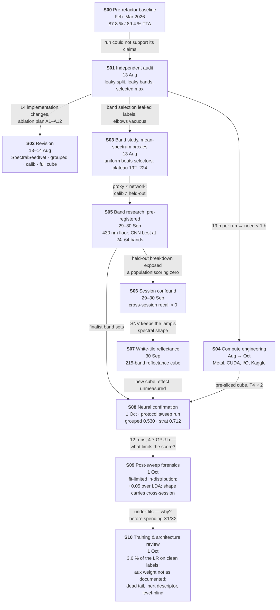

# Timeline — how we got here, and why each step followed the last

The research in order. Each entry answers three questions: **what triggered it**, **what it
found**, and **what it changed**. Details live in the study pages; this page is the thread that
connects them.

---

## Phase 1 · Building a model (Feb – Mar 2026)

### S00 · Pre-refactor baseline — 2026-02-16 → 03-24
**Triggered by:** the start of the project — classify 90 rice varieties from the Zenodo 3241923
hyperspectral seed dataset.
**What happened:** ~35 commits of iteration on a monolithic training script (`hsi pipeline v6 → v8.5
→ v3 model → v3.5 → … → "87 percent acc"`). A four-branch `SpectralQuadNet` on 40 mRMR/SPA-selected
bands, three-stage curriculum, patch-level split.
**Found:** 87.8 % test accuracy, 89.4 % with TTA (F01) — the figures in `figures/`.
**Changed:** nothing durable; it set the target the audit would examine. The code was preserved as a
baseline (`886560f`) and refactored into the `spectralquadnet` package (Aug 6).

## Phase 2 · Asking what the number means (Aug 2026)

### S01 · Independent audit — 2026-08-13
**Triggered by:** a full run (`stratified_benchmark_rtx3060`, 19 h on an RTX 3060) that reached
0.847 val macro-F1 — and a need to know whether any of the architecture's claims were supported.
**Found:** the evaluation could not separate variety from acquisition (F02); band selection used
test labels (F03); the headline was a selected maximum (F04); two of three stages and three of four
branches contributed nothing measurable (F05, F06); the objective and optimiser were misbehaving
(F07, F08); the hard classes were immovable (F09); half the telemetry was lost (F10).
**Changed:** everything downstream. The project's question moved from *"how high can we score?"* to
*"how much of the score is variety recognition?"* (Q1).

### S02 · Architecture & protocol revision — 2026-08-13 → 08-14
**Triggered by:** S01's implementation list (IC-1 … IC-14).
**Did:** grouped split + calibration split, enforced by code (D01, D02); reporting rules (D03);
SpectralSeedNet and a single-stage curriculum (D05, D06, D07); full cube as default input (D04); an
ablation registry and protocol driver. Verified non-regressive on the control arm (F29).
**Changed:** the codebase's contract. **Not yet done:** any training run of the new design.

### S03 · Band study on mean-spectrum proxies — 2026-08-13
**Triggered by:** F03 — "how many bands?" had never been asked by an experiment that could return
a different answer.
**Found:** evenly spaced bands beat every named selector at small budgets (F11); proxies plateau at
192–224 bands (F12); selected bands depend on which bundle is held out (F13).
**Changed:** D04 kept the full cube, treating the plateau as a lower bound — a judgement S05 would
revisit. **Left open:** the study warned that mean-spectrum proxies are not the network, and that
calib is not held-out.

### S04 · Compute engineering — 2026-08-06 → 10-01 (ongoing)
**Triggered by:** S01's observation that a 19-hour run makes a 40-run research programme impossible,
and by local development on Apple Silicon.
**Found:** Metal-specific wins and traps (F28); page-cache thrashing on the mmapped cube; DDP/CUDA
device bugs; Turing GPUs needing compile off.
**Changed:** runtime knobs that are guaranteed never to change a metric; Oct 1 added the Kaggle T4 × 2
profile and a pre-sliced 2.3 GB cube for S08.

## Phase 3 · Following the bands to the session (Sep 2026)

### S05 · Band research with pre-registered confirmation — 2026-09-29 → 09-30
**Triggered by:** S03's open items — does the budget answer change for a model that sees spatial
structure, and does anything decided on calib hold on held-out bundles?
**Did:** characterised the spectrum (SNR, redundancy, discriminant dimension); within-training-bundle
budget curves with nested selection; a 2-D CNN proxy on a pooled cube; then a frozen,
hash-checked confirmation on held-out bundles.
**Found:** < 430 nm is noise (F14); the spectrum has few independent directions (F15); the CNN scores
best with 24–64 evenly spaced bands (F17); supervised selection gives no held-out gain (F18); calib
overstates held-out by ≈ 0.15 (F21).
**Changed:** the 430 nm floor (D10); `uniform430` finalist sets (D11, with a recorded deviation);
D04 put under review. And — via the held-out breakdown — it opened S06.

### S06 · The acquisition-session confound — 2026-09-29 → 09-30
**Triggered by:** S05's held-out predictions, broken down per class, showing a block of classes at
exactly zero recall.
**Found:** those are the 17 varieties whose two bundles were imaged in different sessions (F22, F23);
their kernels are predicted as varieties from their *own* session (F24); the session fingerprint is
not in a removable band subset (F25) and is strongest at the lamp peak (F26).
**Changed:** the project's central result. The grouped protocol is honest about bundles but still
mostly measures session recognition. Session reporting became mandatory (D14).

### S07 · White-tile reflectance — 2026-09-30
**Triggered by:** S06 — per-pixel SNV removes brightness but keeps the illumination's spectral shape,
which is exactly what a session fingerprint at the lamp peak would be.
**Found:** a Spectralon tile in every scene, but saturated across 608–706 nm in 8 of 9 sessions (F27).
**Changed:** `./dataset` is now a 215-band reflectance cube (D12); band indices became axis-specific
(D13); finalist sets were re-cut on the new axis.

## Phase 4 · Confirmation (Oct 2026 →)

### S08 · Neural confirmation — 2026-10-01 (protocol sweep run)
**Triggered by:** everything above is proxy evidence. The network itself had not been trained under
the revised protocol.
**Did:** the A1 + A12 protocol sweep on Kaggle T4 × 2 — grouped 2 folds × 3 seeds, stratified 6 seeds, LDA
and LinearSVC baselines — on the pre-sliced `uniform430_k32` reflectance cube. 4.7 GPU-pair-hours.
**Found:** grouped 0.530 ± 0.009, stratified 0.712 ± 0.033; cross-session recall 0.152, no longer ≈ 0.
**Changed:** nothing yet. Interpreting the sweep became its own study.

### S09 · Post-sweep forensics — 2026-10-01
**Triggered by:** S08's numbers raised the question the project could not answer from proxies: is the
limit the data and protocol, or the model and its training?
**Did:** extracted every run's curves, predictions and session reports, then ran five CPU controls on mean
spectra (matched-size learning curves, acquisition mixing, representation, session F on reflectance,
tabular models). Checked what the literature's numbers measure.
**Found:** the network barely beats LDA on its own 40 scalars (+0.05, F32). Within the acquisition, its
score tracks its training fit (r = −0.98), and it under-fits (F34, F35); the clip binds on every step (F36).
63 % of the grouped shortfall exists in-distribution (F31), and every model keeps ≈ 0.73 of its
in-distribution score across bundles (F37). The leakage gap is acquisition coverage, not data volume
(F38). Shape is the one acquisition-invariant cue and matches most of the cross-session recall (F33).
Reflectance moved the session fingerprint rather than removing it (F40). Prior 78–96 % results are
within-acquisition with RGB morphology (F43).
**Changed:** three reporting tiers with 80/20 as tier 1, never the headline (D16); two frozen diagnostics
before any architecture work (D17); instrumentation fixes (D18); D06, D07 under review.

### S10 · Training & architecture review — 2026-10-01
**Triggered by:** S09's verdict that the network under-fits within the acquisition (F34, F35) and beats LDA on its own
scalars by only 0.05 (F32) — and the need to know *why* before X1 and X2 spend ≈ 8 GPU-pair-hours.
**Did:** reconstructed the network, loss, optimiser and selection from the code path that ran; re-read every logged
scalar of the 12 runs; worked out the objective's geometry and the schedule's LR budget; opened all 12 selected
checkpoints on CPU (train and calib rows only) — clean fit, angular geometry, linear probes of every representation,
knock-outs, gain response, the learned index bank, per-module gradients. No model or training code was changed.
**Found:** the clean-label objective gets 3.6 % of the cumulative LR, most of it spent on a margin 0–52 % of training
kernels satisfy (F44, F47); measured cleanly the network fits 0.87–0.95 of its training kernels and, within the
acquisition, held-out moves with fit one for one (F45, F46). The auxiliary weight that ran was 0.65 → 0.25, not the
documented 0.2 (F54). Three component defects: the spatial tail collapses to 1 × 1 and 11.5 % of the parameters never
train (F48); the spectral path's chemometric blocks are inert, leaving SNV + morph (F49); reflectance level reaches the
network only through a 6-parameter gate (F50). Weight decay is inert (F55); clipping is mostly harmless under AdamW
(F53).
**Changed:** the order of work — training is repaired first on the unchanged architecture (D19); instrumentation
scope widened, with the applied aux schedule frozen at `legacy` until X1/X2 run (D20); guards on how X1's frozen
outcomes are read (D21); three new frozen arms — X4 fit ceiling, X5 tail stride, X6 reflectance level
(`preregistration_s10.json`). D05, D06, D07, D12 annotated.

### S11 · Executing the frozen diagnostics, part 1: instrumentation — 2026-10-01
**Triggered by:** S10 §9 — the P0 instrumentation is a gate before X1, X2 and X4 spend ≈ 8 GPU-pair-hours, and X2
needed a pathway switch that did not exist.
**Did:** implemented S10 P0.1–P0.7: DDP de-duplication, code revision + applied regime in `run.json`, float16 logits
(held-out and calib, ±TTA), pathway labels, the fixed-subset clean-fit probe, honest training telemetry
(`sched/aux_weight_applied`, `train/acc_dominant`, `train/acc_plain`), the aux schedule as a named choice with a
`legacy` default, model-declared gradient groups with finite-step means, structural tests, docs. Added
`model.pathways` (X2) and `scripts/run_frozen.py`, which builds the 23 X1/X2/X4 cells from the hashed
pre-registrations. Validated with a before/after gate on miniature runs, the S08 checkpoints, a 2-rank DDP run and
both test tiers.
**Found:** the changes move no training number and the gate detects a real change (F57); the clean-fit probe
reproduces S10's offline numbers (F57); the old DDP evaluation scored one kernel twice per grouped run, but S09's
frozen reference had already counted each kernel once (F58). Two gaps in the plan: S10's model-declared clip partition
is not neutral at the shipped clip, and the frozen X1 commands lacked a launcher and output directories.
**Changed:** D22 — the clip partition stays `legacy` (the new one is opt-in), the frozen commands run under `torchrun`
with one directory per cell; D18, D20 implemented. X1, X2, X4 are ready to run (S11 §10); X5/X6 wait for X1 (D19).

### S11 part 2 · The frozen arms run — 2026-10-02
**Did:** X1 (9 cells), X2 (12) and X4 (2) on Kaggle T4 × 2 at commit `413a11e`, built from the hashed pre-registrations
by `scripts/run_frozen.py`. 22 of 23 cells scored; `X2/spatial_only__f1_s0` crashed in its final evaluation (F71a). Read
in S12.

### S12 · Reading X1, X2 and X4 — 2026-10-02
**Triggered by:** the S11 cells — the frozen rules turn them into a route, but a route is not a design.
**Did:** read H12a–H14b and H16 exactly as frozen, with hierarchical bootstrap intervals; checked every cell against its
frozen regime and traced the unscored cell; then asked why — the generalisation ladder from clean fit to cross-session
recall, F46 against X1's intervention, late fusion of the single-pathway networks, seed ensembles, linear controls on
mean spectra, level, within-kernel pixel statistics and detector noise, a training-rows session probe validated on 13
representations and 11 checkpoints, and a CPU pre-test of noise-floor equalisation; plus a literature pass (multimodal
fusion, domain generalisation, calibration transfer, MIL, HSI and tabular foundation models). No training or model code
was changed.
**Found:** the network now fits (0.98–1.00) and nothing held-out moved — the extra fit is memorisation and F46 was a
correlation, not a lever (F59, F60); capacity is ample and the regularisers are load-bearing (F61); errors stay
systematic (F62). Morph scalars do not carry cross-session recall (F63); the 3-D spatial pathway adds +0.10 and is the
session channel — spectral-only reaches the highest cross-session recall yet measured, 0.214 (F64); joint training is no
better than late fusion of the two pathways and loses robustness (F65); the spectral pathway behaves as shrinkage LDA
(F66); a linear model on within-kernel pixel statistics matches the network across bundles (F67); detector noise steps
at session 5 but is not the main session channel (F68); session reliance can be measured on training rows (F69); level
trades cross-session robustness for same-session accuracy (F70); three infrastructure defects (F71).
**Changed:** route A (D23); R1 becomes the reference regime and the margin goes (D24); X5/X6 not run standalone (D25);
a training-rows session κ in every report (D26); infrastructure fixes before the next session (D27). The next GPU round
— decoupled pathways, masked MixStyle, a lean architecture, the 80/20 tier — is frozen in `preregistration_s12.json`.
F34 and F46 challenged.

### S13 part 1 · The route-A arms, as a single-seed screen — 2026-10-02
**Triggered by:** S12's frozen S13 round (30 runs, `preregistration_s12.json`) and its P0 (FW-34); then the PI's request,
before any S13 run, for a fast screen with one seed.
**Did:** recorded the seed reduction as a hashed amendment (`preregistration_s13.json`, D28) — every arm, control,
protocol contrast and grouped fold kept, 10 GPU runs at seed 0; implemented P0 (atomic checkpoint writes + end-of-stage
barrier with a 2-rank regression test, `dataset_*` in `.gitignore`, a calib-weighted late-fusion scorer, the
training-rows session κ in every report) and the Y2/Y3 model changes behind default-off keys; a runner that builds the
cells from both hashed files; validated with S11's G-neutral gate against `413a11e`, a 2-rank `torchrun` run of every
arm, unit and smoke tests.
**Found:** the S13 defaults are bit-identical to the S11 network and the gate detects both new arms; the F71a race
reproduces on `413a11e` and is fixed — by the barrier: atomic writes alone turn the crash into a silent stale reload
(F72).
**Changed:** D28 (single-seed screen; verdicts are screening verdicts, passes are replicated — FW-35); D29 (P0 and arms
as implemented; D24's config-default switch deferred); D26, D27 implemented. The Kaggle run is one command,
≈ 4.4 h (S13 §8).

