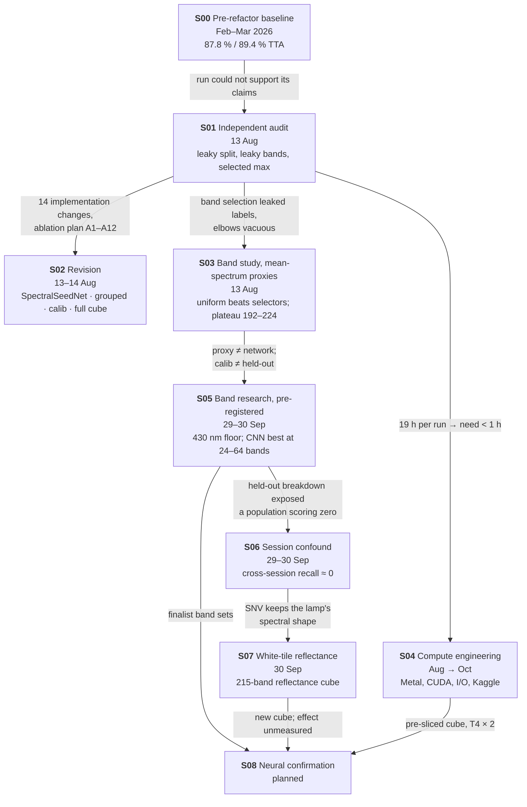

# Timeline — how we got here, and why each step followed the last

The research in order. Each entry answers three questions: **what triggered it**, **what it
found**, and **what it changed**. Details live in the study pages; this page is the thread that
connects them.

---

## Phase 1 · Building a model (Feb – Mar 2026)

### S00 · Pre-refactor baseline — 2026-02-16 → 03-24
**Triggered by:** the start of the project — classify 90 rice varieties from the Zenodo 3241923
hyperspectral seed dataset.
**What happened:** ~35 commits of iteration on a monolithic training script (`hsi pipeline v6 → v8.5
→ v3 model → v3.5 → … → "87 percent acc"`). A four-branch `SpectralQuadNet` on 40 mRMR/SPA-selected
bands, three-stage curriculum, patch-level split.
**Found:** 87.8 % test accuracy, 89.4 % with TTA (F01) — the figures in `figures/`.
**Changed:** nothing durable; it set the target the audit would examine. The code was preserved as a
baseline (`886560f`) and refactored into the `spectralquadnet` package (Aug 6).

## Phase 2 · Asking what the number means (Aug 2026)

### S01 · Independent audit — 2026-08-13
**Triggered by:** a full run (`stratified_benchmark_rtx3060`, 19 h on an RTX 3060) that reached
0.847 val macro-F1 — and a need to know whether any of the architecture's claims were supported.
**Found:** the evaluation could not separate variety from acquisition (F02); band selection used
test labels (F03); the headline was a selected maximum (F04); two of three stages and three of four
branches contributed nothing measurable (F05, F06); the objective and optimiser were misbehaving
(F07, F08); the hard classes were immovable (F09); half the telemetry was lost (F10).
**Changed:** everything downstream. The project's question moved from *"how high can we score?"* to
*"how much of the score is variety recognition?"* (Q1).

### S02 · Architecture & protocol revision — 2026-08-13 → 08-14
**Triggered by:** S01's implementation list (IC-1 … IC-14).
**Did:** grouped split + calibration split, enforced by code (D01, D02); reporting rules (D03);
SpectralSeedNet and a single-stage curriculum (D05, D06, D07); full cube as default input (D04); an
ablation registry and protocol driver. Verified non-regressive on the control arm (F29).
**Changed:** the codebase's contract. **Not yet done:** any training run of the new design.

### S03 · Band study on mean-spectrum proxies — 2026-08-13
**Triggered by:** F03 — "how many bands?" had never been asked by an experiment that could return
a different answer.
**Found:** evenly spaced bands beat every named selector at small budgets (F11); proxies plateau at
192–224 bands (F12); selected bands depend on which bundle is held out (F13).
**Changed:** D04 kept the full cube, treating the plateau as a lower bound — a judgement S05 would
revisit. **Left open:** the study warned that mean-spectrum proxies are not the network, and that
calib is not held-out.

### S04 · Compute engineering — 2026-08-06 → 10-01 (ongoing)
**Triggered by:** S01's observation that a 19-hour run makes a 40-run research programme impossible,
and by local development on Apple Silicon.
**Found:** Metal-specific wins and traps (F28); page-cache thrashing on the mmapped cube; DDP/CUDA
device bugs; Turing GPUs needing compile off.
**Changed:** runtime knobs that are guaranteed never to change a metric; Oct 1 added the Kaggle T4 × 2
profile and a pre-sliced 2.3 GB cube for S08.

## Phase 3 · Following the bands to the session (Sep 2026)

### S05 · Band research with pre-registered confirmation — 2026-09-29 → 09-30
**Triggered by:** S03's open items — does the budget answer change for a model that sees spatial
structure, and does anything decided on calib hold on held-out bundles?
**Did:** characterised the spectrum (SNR, redundancy, discriminant dimension); within-training-bundle
budget curves with nested selection; a 2-D CNN proxy on a pooled cube; then a frozen,
hash-checked confirmation on held-out bundles.
**Found:** < 430 nm is noise (F14); the spectrum has few independent directions (F15); the CNN scores
best with 24–64 evenly spaced bands (F17); supervised selection gives no held-out gain (F18); calib
overstates held-out by ≈ 0.15 (F21).
**Changed:** the 430 nm floor (D10); `uniform430` finalist sets (D11, with a recorded deviation);
D04 put under review. And — via the held-out breakdown — it opened S06.

### S06 · The acquisition-session confound — 2026-09-29 → 09-30
**Triggered by:** S05's held-out predictions, broken down per class, showing a block of classes at
exactly zero recall.
**Found:** those are the 17 varieties whose two bundles were imaged in different sessions (F22, F23);
their kernels are predicted as varieties from their *own* session (F24); the session fingerprint is
not in a removable band subset (F25) and is strongest at the lamp peak (F26).
**Changed:** the project's central result. The grouped protocol is honest about bundles but still
mostly measures session recognition. Session reporting became mandatory (D14).

### S07 · White-tile reflectance — 2026-09-30
**Triggered by:** S06 — per-pixel SNV removes brightness but keeps the illumination's spectral shape,
which is exactly what a session fingerprint at the lamp peak would be.
**Found:** a Spectralon tile in every scene, but saturated across 608–706 nm in 8 of 9 sessions (F27).
**Changed:** `./dataset` is now a 215-band reflectance cube (D12); band indices became axis-specific
(D13); finalist sets were re-cut on the new axis.

## Phase 4 · Confirmation (Oct 2026 →)

### S08 · Neural confirmation — planned
**Triggered by:** everything above is proxy evidence. The network itself has not been trained under
the revised protocol.
**Ready:** Kaggle T4 × 2 runtime, pre-sliced `uniform430_k32` cube, mid-stage resume, JSONL metrics.
**Next:** FW-01 (does reflectance restore cross-session recall — on proxies first), FW-02 (σ),
FW-03 (budget), FW-04 (leakage gap).
