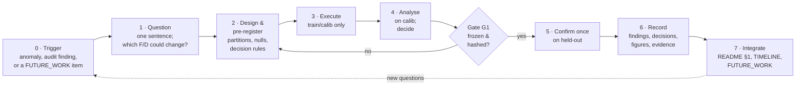

# Research workflow

How a study is run in this project — from "something looks off" to a recorded, citable
conclusion. The rules here are not generic good practice; each exists because the project
broke it once and paid for it, and the finding that taught it is named beside it.

---

## 1 · The lifecycle of a study



| Stage | What you produce | Where it goes |
|---|---|---|
| **0 · Trigger** | The observation that started it, quoted with its source | study page §2 |
| **1 · Question** | One sentence. Which findings it tests, which decisions it could reverse | study page §1; a new `S##` row in README §3 |
| **2 · Design** | Partitions, arms, nulls, metric, thresholds, the rule that turns results into a decision | study page §3–4; `HYPOTHESES.md` rows |
| **3 · Execute** | Code (in `src/` or `scripts/`; one-off analysis scripts get archived under `evidence/<study>/code/`), outputs under `outputs/<study>/` | git commit hashes on the study page |
| **4 · Analyse** | Curves, tables, the decision — **on calib or within-train only** | study page §5 |
| **5 · Confirm** | Held-out scores of the *already fixed* list, once, with intervals | study page §5 |
| **6 · Record** | `F##` and `D##` entries; figures via `tools/build_assets.py`; evidence snapshot | registers; `figures/`, `evidence/` |
| **7 · Integrate** | Revise README §1, add the TIMELINE entry, move FW items, mark superseded entries | registers |

## 2 · Gates

A gate is a check that must pass before moving on. Failing a gate is not a failure of the study;
skipping one is.

| Gate | Before … | Check | Why (the finding that taught it) |
|---|---|---|---|
| **G0** | starting | The question names the findings it tests and the decisions it could reverse | S00 ran for weeks without a falsifiable question (F01) |
| **G1** | touching held-out rows | Arm list, hypotheses and decision rule frozen to JSON + SHA-256; script refuses on hash mismatch | Selecting on the reported split inflated the headline (F04) |
| **G2** | recording a decision | Evidence is ≥ E3, or the decision is marked provisional with its reversal trigger | D05/D06 were taken on E1 evidence and now carry open falsification tests |
| **G3** | claiming an improvement | Δ exceeds 2σ of measured run-to-run variance, on the same splits, mean over folds × seeds | Stages 2–3's +0.005 was inside noise (F05) |
| **G4** | quoting any score | It names its split (strat / calib / held-out), its band axis (SNV-256 / refl-215), and same- vs cross-session recall | calib is +0.15 optimistic (F21); cross-session is ≈ 0 (F23) |

## 3 · Rules of evidence

### 3.1 Partition discipline

| Partition | May be used to | Must never |
|---|---|---|
| `train` | fit models, fit band selectors, fit normalisation statistics | — |
| `calib` (carved from train, by group) | choose budgets, methods, checkpoints, hyperparameters; fit margins/weights | be quoted as performance (F21) |
| `val ∪ test` (the held-out bundle) | confirm an already-fixed list, once | select anything; be scored twice for the same question |

Under `grouped`, `val` and `test` are halves of one bundle — they are scored together. The data
supports exactly two folds; report both, never their maximum (D01, D03).

### 3.2 Pre-registration

1. Write the JSON: `frozen_at`, `repo_commit`, protocol, arm list (explicit band indices per fold),
   hypotheses with thresholds, decision rule, and how held-out results may and may not be used.
2. Store `sha256(json)` beside it. The confirmation script asserts the hash before reading a
   held-out row (pattern: `evidence/S05_band_research/code/a7_confirm_lda.py`).
3. A second, exploratory round is allowed — as its own frozen file that names what motivated it
   (`preregistration2.json` does this).
4. If what ships departs from the frozen rule, record the deviation in `DECISIONS.md` (D11 is the
   model).
5. A change to a frozen design approved **before any of its arms has run** is an *amendment*: its own frozen,
   hashed file naming the parent's hash, the single change, why, and what is unchanged — never an edit of the parent.
   The runner verifies both hashes (`evidence/S13_representation_screening/preregistration_s13.json`, D28).

### 3.3 Mandatory controls

- **Nulls.** Any selection or design method is compared with a label-free null of equal size
  (`uniform`, `random`). On this data the null usually wins (F11, F18).
- **The full reference.** Any reduction is compared with the unreduced input, and any sweep
  extends past its candidate elbow (F03).
- **The session breakdown.** Every held-out score is reported for same-session and cross-session
  varieties separately (D14).

### 3.4 Reporting

Macro-F1 is primary; accuracy alongside. Mean ± range over folds × seeds; 2,000-resample
bootstrap CI on every number; a delta whose interval crosses zero is "no effect shown". TTA is
reported separately from single-view. Never a maximum over epochs, seeds or folds.

### 3.5 Saving

Every number that a hypothesis outcome will depend on is *written to a file*, not only printed.
H4 is `undetermined` today because its within-bundle value was printed and lost.

## 4 · How a conclusion changes

Conclusions are revised by adding, never by editing history:

- A finding contradicted by newer evidence → set its status to `challenged` (and link the
  newer finding) or `superseded by Fxx`. Keep the text.
- A decision whose reversal trigger fires → status `reversed`, add the new decision as a new ID,
  and link both ways.
- A number found to be wrong → status `retracted`, with one line saying why.
- README §1 is the only place that is *rewritten*; it always reflects the current registers.

## 5 · Adding a study — checklist

1. `cp studies/_TEMPLATE.md studies/S##_short_name/README.md`; next free `S##`.
2. Add the row to README §3 (status `planned`), and move the FW item if it came from one.
3. Write hypotheses into `HYPOTHESES.md` **before** running. Freeze if held-out will be touched.
4. Run. Commit code; note commit hashes on the study page.
5. Add the study's evidence files to `SNAPSHOT` and any new figure function to
   `tools/build_assets.py`; run it:
   ```bash
   python docs/research/tools/build_assets.py            # snapshot evidence + draw figures
   python docs/research/tools/build_assets.py --figures  # redraw from the snapshot only
   ```
6. Add `F##` / `D##` entries; fill hypothesis outcomes from saved evidence only.
7. Add the TIMELINE entry (what triggered it, what it changed).
8. Revise README §1 and FUTURE_WORK.

## 6 · Figures

- Every figure in this log is produced by `tools/build_assets.py` from files under `evidence/`,
  or copied from a tool that generated it (S03's band-study CLI). None is hand-edited.
- Each figure carries a `source:` line naming the exact evidence file.
- The title states the finding; the axes state the split and the units.
- Pre-refactor figures in the top-level `figures/` directory are referenced in place (S00), not
  copied.

## 7 · Entry templates

**Finding**
```markdown
### Fxx · <short title>
<one-sentence claim>. **Evidence:** <numbers, split, folds × seeds, file>. **Caveat:** <what
would make this wrong>. → [Sxx](studies/Sxx_.../README.md)
```
and a row in the summary table: `| Fxx | claim | Sxx | split | E# | standing |`.

**Decision**
```markdown
### Dxx · <short title>
**Context.** <findings>. **Decision.** <what, where in code/config>.
**Alternatives rejected.** <…>. **Deviation.** <only if any>. **Reverse if** <a concrete result>.
```
