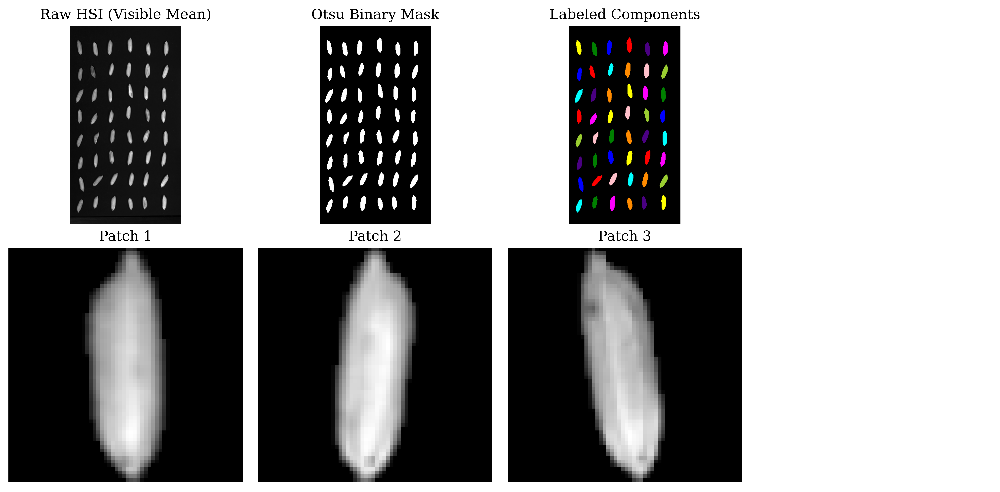
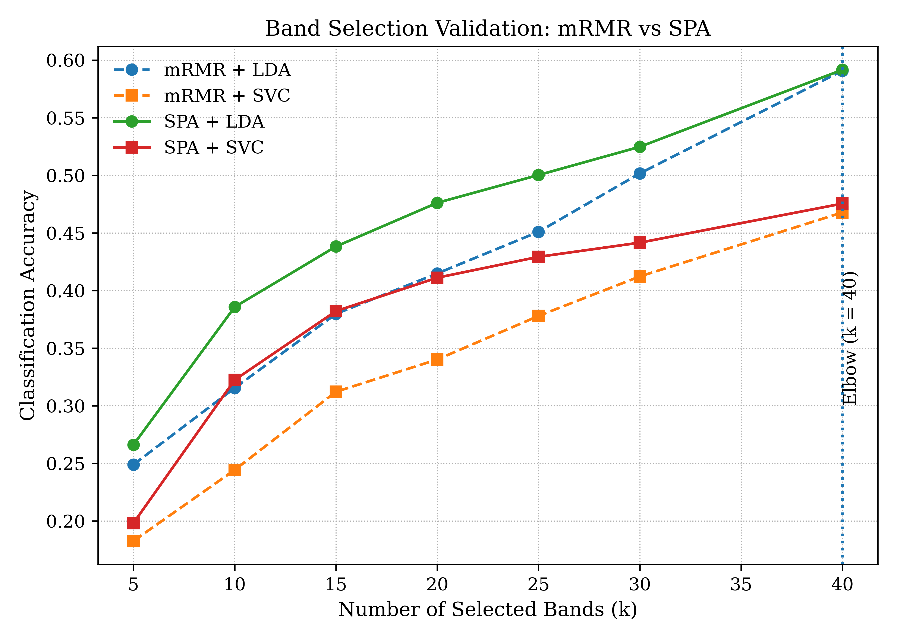
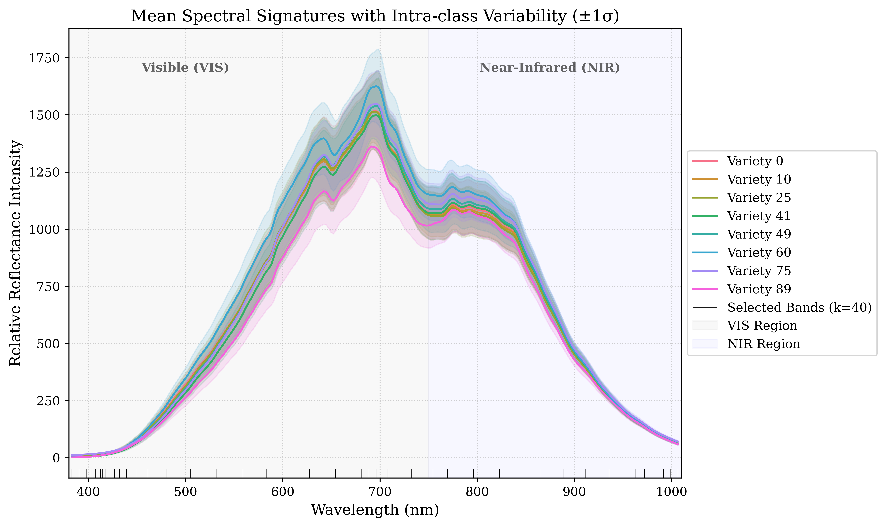

# S00 · Pre-refactor SpectralQuadNet baseline

| | |
|---|---|
| **Status** | superseded by [S01](../S01_independent_audit/README.md) — its numbers are not evidence of variety recognition |
| **Dates** | 2026-02-16 → 2026-03-24 |
| **Commits** | `eb00e61` … `af44e97` (≈ 35 commits: "hsi pipeline v6 … v8.5", "v3 model", "v3.5", "87 percent acc", "stage2 refined"); preserved as `886560f` (hsi_training.py v12) |
| **Data** | 256-band SNV cube → 40 mRMR/SPA bands (`patches_spa_40b.npy`), stratified patch-level split |
| **Code** | monolithic `hsi_training.py`, `data_setup_v3.py`, `band_selection.py` — absorbed into `src/spectralquadnet/` in Aug 2026 |
| **Raw outputs** | none in the repository |
| **Figures** | top-level [`figures/`](../../../../figures/) (May 2026) |
| **Findings** | [F01](../../FINDINGS.md#f01--pre-refactor-reported-accuracy--claim-only) |

## 1 · Question
Can a deep spectral-spatial model classify 90 rice varieties from single-kernel VIS–NIR
hyperspectral patches with high accuracy?

## 2 · Why we did this
Project start. The dataset (Vu et al., Strathclyde; Zenodo 3241923) offers 90 varieties × 96
kernels imaged with a Specim V10E, 256 bands over 383–1006 nm. Published work on it reports
92.7–96.2 % precision (Taheri et al. 2024).

## 3 · Hypotheses
None written down. The working target was "> 90 % accuracy", later "> 95 %".

## 4 · Method
- **Preprocessing.** Dark-current correction, Otsu × 0.4 segmentation over 450–700 nm, shape gate
  (300 < area < 800, eccentricity > 0.6, solidity > 0.85), 64 × 64 area-resized patches with an
  exact-zero background, per-pixel SNV.
  
- **Band selection.** mRMR + SPA on the mean spectra of **all 8,624 labelled patches**, 256 → 40.
  
- **Model.** `SpectralQuadNet`: four branches (spectral profile, index bank, spatial 3-D CNN,
  SpecFormer), gated bilinear fusion, sub-centre ArcFace head; 5.19 M parameters.
- **Training.** Three stages (progressive augmentation → ArcFace + SupCon → SAM + SWA).
- **Split.** Stratified at patch level: 70 / 15 / 15.

## 5 · Results

Reported: **87.8 %** test accuracy without TTA, **89.4 %** with 12-view TTA; mean per-class F1
0.89, median 0.92; classes 49, 52, 41 below 0.6. A t-SNE of embeddings is in
`figures/embedding_visualization_tsne.png`.

## 6 · Findings
- [F01](../../FINDINGS.md) — the reported accuracy is a **claim (E0)**: no run directory, prediction
  file or config in the repository reproduces it.

## 7 · Decisions this led to
None that survived. The audit (S01) of a later run of the same design replaced the protocol.

## 8 · Threats to validity — why these numbers are not used
1. Patch-level split: every acquisition bundle in both train and test (F02).
2. Bands chosen with test labels in scope (F03).
3. One run, one seed; no baseline; no ablation.
4. Not reproducible from the repository.

## 9 · What would change this
Nothing can rehabilitate these numbers; the same model re-run under grouped is ablation A1's
`stratified` arm vs its `grouped` arm (FW-04), which would tell how much of them was bundle recognition.

## 10 · Reproduce
Not reproducible as-is. The two notebooks that produced these figures import the deleted monolith
(`notebooks/README.md`). The closest current equivalent is the control arm
`python train.py experiment=quadnet_audited`.

## 11 · Provenance
`figures/*.png` (committed, May 2026). Stale notebooks: `notebooks/embedding_overview.ipynb`,
`notebooks/pipeline_overview.ipynb`.
