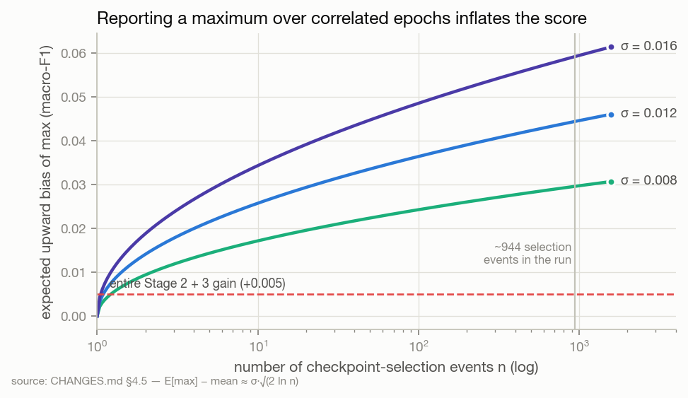
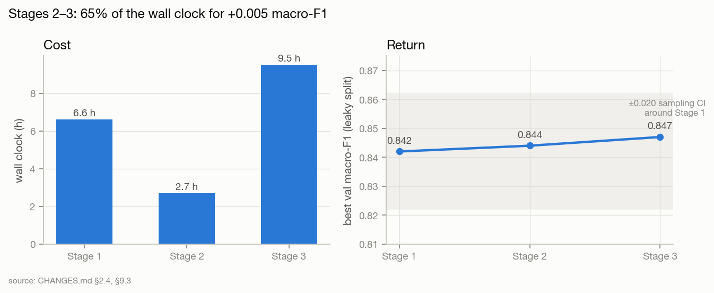
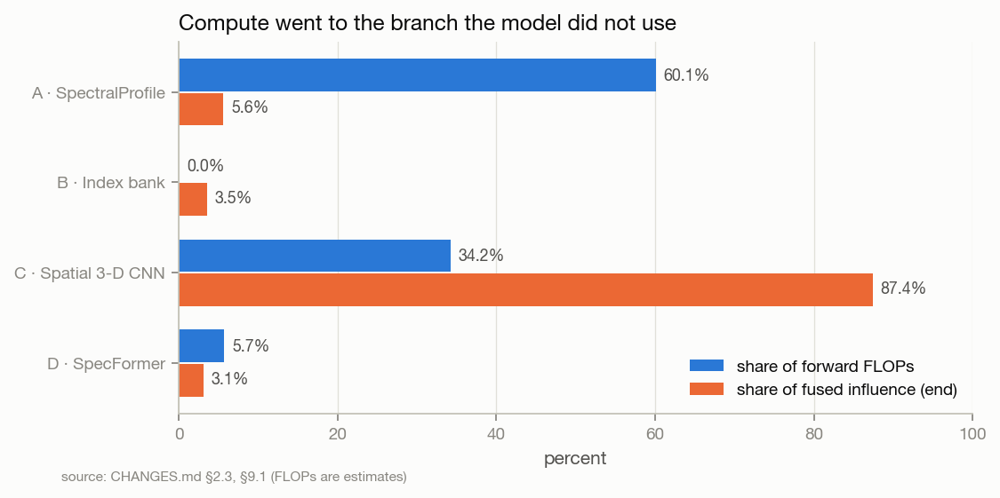

# S01 · Independent audit of run `stratified_benchmark_rtx3060`

| | |
|---|---|
| **Status** | complete |
| **Dates** | 2026-08-13 |
| **Full report** | [`CHANGES.md`](../../../../CHANGES.md) (1,700 lines — this page is its research summary) |
| **Data audited** | 40 SPA bands (SNV-256 axis), stratified split, one run: Stage 1 336 ep, Stage 2 49 ep, Stage 3 truncated at 87/120 |
| **Inputs** | design docs 01–06, the run's console log, 7 W&B panels (Stage 1 only). The log and panels are **not in the repository**. |
| **Figures** | [`figures/S01_independent_audit/`](../../figures/S01_independent_audit/) — drawn from numbers quoted in CHANGES.md |
| **Findings** | F02–F10 · **Decisions** D01–D03, D05–D07 · **Hypotheses** A1–A12 |

## 1 · Question
Does the executed run support the claims the architecture was built to make — and if not, what
is the smallest set of changes and experiments that would?

## 2 · Why we did this
A 19-hour run reached 0.847 validation macro-F1. The design docs described 21 ablation levers, none
pulled; no test evaluation existed; and the architecture had grown to four branches, three stages
and eleven auxiliary mechanisms without any comparison.

## 3 · Hypotheses
The audit *produced* hypotheses (the ablation plan A1–A12, [HYPOTHESES §3](../../HYPOTHESES.md#3--audit-hypotheses-and-the-ablation-plan-s01--s02))
rather than testing pre-registered ones.

## 4 · Method
Reconstruction of the data path and model from code; forensic reading of the log and W&B panels;
FLOP estimates from the tensor-shape matrix (ratios only); selection-bias arithmetic; comparison
with the dataset's primary source to establish its acquisition structure.

## 5 · Results

**The protocol.** Each variety is two class-pure trays; the stratified split put all 180 trays in
both train and eval (F02). Band selection used every patch's label (F03). Val was used to fit four
mechanisms, then to select, then to report (F04):



**The curriculum.**



| | Stage 1 | Stage 2 | Stage 3 |
|---|---|---|---|
| Epochs (budget / actual) | 400 / 336 | 150 / 49 | 120 / ≥ 87 |
| Wall clock | 6 h 35 m | 2 h 39 m | ≈ 9.5 h |
| Best val macro-F1 | 0.842 | 0.844 (ep 19) | 0.847 |

**The architecture.**



**Training dynamics.** Aux : main loss ≈ 7.8 : 1 at epoch 20 with GradNorm weights pinned at their
clip bounds (F07). Backbone pre-clip gradient norm 25–50 against a clip of 1.0 (F08). At the
Phase 2 → 3 boundary training accuracy jumped 42 % → 96.6 % in one epoch while val did not move —
mixup was the only thing holding memorisation back. Hard classes {41, 49, 51, 52, 70} unchanged
across 470 epochs (F09). Stage 2/3 metrics never reached W&B (F10).

**Component verdicts (26 mechanisms).** Essential: supervised CE, mixup, EMA, D₄ augmentation.
Unjustified or harmful as configured: 11, of which 8 targeted the hard classes. Full table:
CHANGES §6.

## 6 · Findings
F02 (E4), F03 (E4), F04 (E1), F05 (E1), F06 (E1, confounded), F07 (E1), F08 (E1), F09 (E1), F10 (E4)
— see [FINDINGS](../../FINDINGS.md).

## 7 · Decisions this led to
D01 grouped protocol · D02 calibration split · D03 reporting rules · D05 SpectralSeedNet ·
D06 single stage · D07 objective/optimiser fixes — see [DECISIONS](../../DECISIONS.md). The audit's
verdict on the > 95 % target: not defensible under a bundle-disjoint protocol; reaching it under the
leaky one would reproduce the field's error.

## 8 · Threats to validity
- Every performance number is from one run, one seed, a leaky split, selected on the reporting split.
- The log and W&B panels are not in the repository; σ ≈ 0.012 and the influence numbers are quoted.
- FLOPs are estimates; only their ratios are used.
- F06's reading is confounded by asymmetric branch dropout.

## 9 · What would change these conclusions
A3 showing the four-branch model beats {B, C} by > 2σ under grouped (reverses D05); A8 showing
stages 2–3 add > 2σ (reverses D06). Neither has run.

## 10 · Reproduce
The audit itself is a document. Its figures:
```bash
python docs/research/tools/build_assets.py --figures   # fig_s01 uses numbers cited inline
```

## 11 · Provenance
CHANGES.md §1–§25 and the Final Research Judgment. Implementation changes IC-1 … IC-14 → S02.
