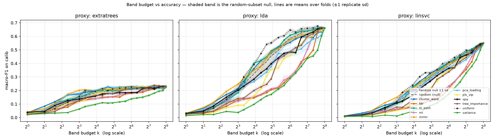
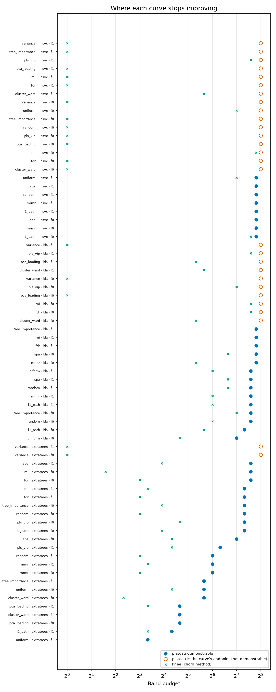
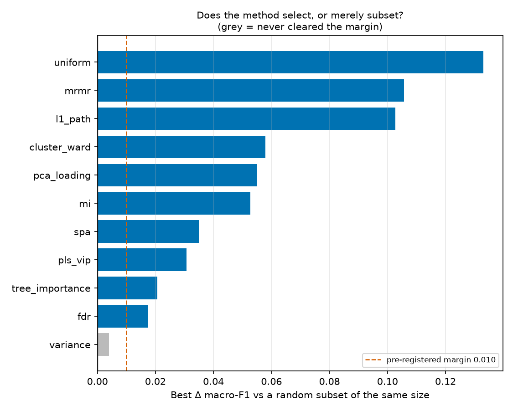
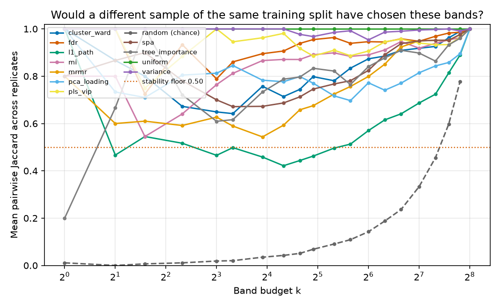
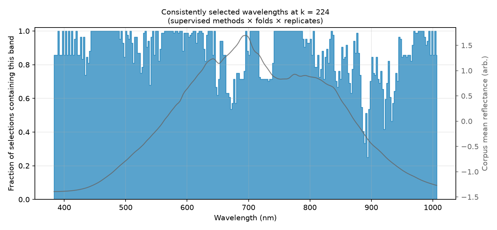

# S03 · Band study on mean-spectrum proxies

| | |
|---|---|
| **Status** | complete for calib; held-out `confirm` and `neural` stages **not run** (superseded in purpose by S05 and S08) |
| **Dates** | 2026-08-13 (run 17:32 → 18:54) |
| **Commits** | `e8dd0bc` (band study + tests) |
| **Data** | **SNV-256** cube, grouped, folds 0 and 1, `calib_frac = 0.15` — fold sizes: train 3,683 / 3,685, calib 630, held-out 4,311 / 4,309 |
| **Code** | `src/spectralquadnet/bandstudy/` (`python -m spectralquadnet.bandstudy.cli`), design in [`docs/07`](../../../07_BAND_SELECTION_PATHWAY.md) |
| **Raw outputs** | `outputs/band_study/` (fingerprint `4f1e8ccae3d5bd85`; 134 selections, 9,066 proxy fits) |
| **Evidence snapshot** | [`evidence/S03_band_study_proxy/`](../../evidence/S03_band_study_proxy/) — the generated `REPORT_2026-08-13.md`, curves, trends, method ranking, flags, recommendation |
| **Findings** | F11, F12, F13 · **Decisions** D04, D08 |

## 1 · Question
How many bands does the task need, which bands, and which selection method — decided without
touching held-out bundles, with nulls that can win?

## 2 · Why we did this
F03: both shipped reductions (40 and 100 bands) had vacuous elbows and one used test labels. Before
keeping or dropping band selection, "how many bands?" had to be asked by an experiment that could
answer "all of them" or "no method beats random".

## 3 · Hypotheses and decision rules
Pre-registered in `BandStudyConfig` ([HYPOTHESES §2](../../HYPOTHESES.md#2--pre-registered-decision-rules-of-the-band-study-s03)):
plateau tolerance 0.01; stability floor Jaccard 0.50; null margin 0.01.

## 4 · Method
12 methods (two nulls: `uniform`, `random`) × 20 budgets (k = 1 … 256, full budget mandatory) × 3
proxies (LDA, LinearSVC C = 0.1 fixed, ExtraTrees) × 2 folds × (1 canonical + 5 replicate 80 %
subsample selections). Features: the foreground-masked mean spectrum — **no spatial information**.
Selectors see train only; every decision reads calib only.

## 5 · Results



**How many bands?** 43 curves saturate, 28 rise to the end, 1 peaks and declines. Per-proxy
plateaus: ExtraTrees 192, LDA 224, LinearSVC 224. The best-of-everything envelope reaches 99 % of
the full-cube score at k = 64 and 100 % at 128 — but that envelope is a maximum over methods.



**Which method?** (calib, mean macro-F1 at k ≤ 40)

| method | mean F1 (k ≤ 40) | best Δ vs random | stability |
|---|---|---|---|
| **uniform** (null) | **0.211** | +0.133 | 1.000 |
| cluster_ward | 0.208 | +0.058 | 0.766 |
| mrmr | 0.208 | +0.106 | 0.637 |
| l1_path | 0.192 | +0.103 | 0.525 |
| random (null) | 0.183 | — | 0.032 |
| spa | 0.169 | +0.035 | 0.755 |
| variance | 0.068 | +0.004 | 0.994 |



**Which wavelengths?** At k = 224 supervised selections cover almost everything (one ≥ 50 % region
spanning 383–1006 nm). Below k = 40, folds disagree: 34 (method, budget) pairs have cross-fold
Jaccard < 0.4.




More: [`budget_curves_per_fold.png`](../../figures/S03_band_study_proxy/budget_curves_per_fold.png),
[`redundancy.png`](../../figures/S03_band_study_proxy/redundancy.png),
[`compute_tradeoff.png`](../../figures/S03_band_study_proxy/compute_tradeoff.png).

**Automated flags raised:** `null_wins` (the best method at k ≤ 40 is a null);
`worse_than_random` (fdr −0.086, mi −0.075, pls_vip −0.040, tree_importance −0.038, spa −0.017,
pca_loading −0.015, variance −0.120); `folds_choose_different_bands`; `more_bands_hurt` (1 curve);
`some_plateaus_not_demonstrable` (28 / 72). No critical flags.

**The study's own recommendation:** 224 bands via `l1_path` (aggressive: 192); pooled replicate σ
0.0088.

## 6 · Findings
- [F11](../../FINDINGS.md) even spacing is the method to beat (E2)
- [F12](../../FINDINGS.md) proxy plateau 192–224 (E2) — **challenged** by F17
- [F13](../../FINDINGS.md) supervised selections depend on the held-out bundle (E2)

## 7 · Decisions this led to
D04 (keep the full cube as default; treat the proxy plateau as a lower bound), D08 (band-study
discipline).

## 8 · Threats to validity
1. Mean spectra discard all spatial structure — the report says so three times. S05 shows a
   spatial-spectral proxy behaves *differently* (it peaks early).
2. Calib is from the training bundle: absolute scores are optimistic (F21).
3. SNV-256 axis — band indices do not transfer to the current refl-215 cube (D13).
4. The held-out `confirm` stage was never run, so nothing here is E3+.

## 9 · What would change these conclusions
Already partly changed: S05's CNN proxy peaks at 24–64 bands (F17), so "the network needs ≥ 192"
is not supported.

## 10 · Reproduce
```bash
python -m spectralquadnet.bandstudy.cli all            # ~2–3 h on a laptop; resumable
python -m spectralquadnet.bandstudy.cli all --quick    # minutes; machinery check
```
On the current dataset this runs on the refl-215 axis and will not reproduce these SNV-256 numbers.

## 11 · Provenance
`outputs/band_study/` — `study.json`, `REPORT.md`, `analysis/*.csv`, `proxy/records.jsonl` (4 MB,
not snapshotted), `bands/` (per-fold index files, SNV-256 axis).
