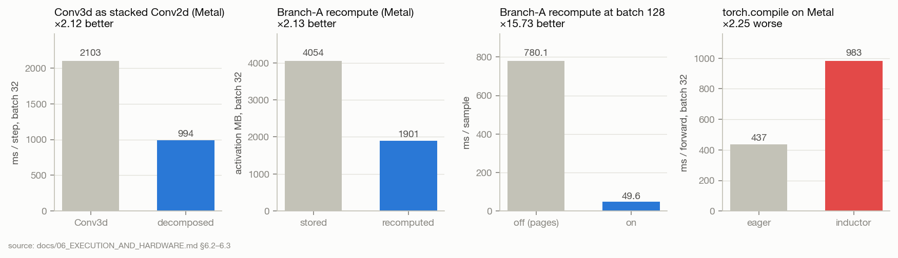

# S04 · Compute and data-path engineering

| | |
|---|---|
| **Status** | ongoing (engineering, not a hypothesis test) |
| **Dates** | 2026-08-06 → 2026-10-01 |
| **Commits** | `edfeaa4` Metal + AMP (08-06) · `e8e7b48` memory (08-09) · `887b816` Metal space/time (08-10) · `744ab11` cloud GPU / vast.ai (08-10) · `ce7da6b` Ampere overflow (08-12) · `ce3a4f9` profiling (08-12) · `db65a5c` CUDA/DDP device (08-14) · `9e764fd` mmap random-access hints (08-15) · `4e28313` compile off on Turing (08-16) · `78eea0d` decomposed Conv3d backward + batched loading (08-16) · `8d3a7d2` Kaggle T4 × 2 (10-01) |
| **Docs** | [`docs/06_EXECUTION_AND_HARDWARE.md`](../../../06_EXECUTION_AND_HARDWARE.md) — the full measurements |
| **Figures** | [`figures/S04_compute_engineering/`](../../figures/S04_compute_engineering/) |
| **Findings** | F28 · **Decisions** D15 |

## 1 · Question
How do we make one run cheap enough that the research programme (≈ 40 runs: 2 folds × 3 seeds ×
the ablation grid) is affordable — without any runtime setting changing a reported metric?

## 2 · Why we did this
S01: the audited run took 19 hours, 65 % of it in stages that added nothing, and Phase 3 ran 5–10×
slower per epoch from memory paging. "The real prize is converting a project that can afford one run
into one that can afford forty" (CHANGES §9.4).

## 3 · Invariant
Every field under `cfg.runtime` is a throughput knob; changing one must never change a reported
metric. Numerics-changing settings (TF32) are off by default for that reason.

## 4 · Method
Per-change micro-benchmarks on an Apple M5 (16 GB, Metal) and on CUDA cards (RTX 3060, vast.ai,
Kaggle T4); equivalence checks on logits for every re-expressed operator.

## 5 · Results



| Change | Measured | Note |
|---|---|---|
| Branch C `Conv3d` as stacked `Conv2d` (Metal) | 3.12× on the stem, 2.12× on the step (2,103 → 994 ms, batch 32) | Δ logits 1.9e-7; +9 % activation memory; Metal only |
| Branch A recompute in backward (Metal) | 4,054 → 1,901 MB (2.13×), +4.8 % time | bit-exact gradients |
| …at batch 128, 16 GB | 49.6 vs 780.1 ms/sample | without it the step pages |
| `torch.compile` on Metal | 983 vs 437 ms/forward | 2.25× *slower* → `auto` = off on Metal |
| Host data cost | 1.86 ms/sample, 1.41 ms of it mmap page-in | an I/O number; workers hide it ~50× |
| mmap random-access hints | resolved page-cache thrashing on the 30 GB cube | `9e764fd` |
| Turing (T4) | compile disabled; fp16 + GradScaler (no bf16 Tensor Cores) | `4e28313`, `8d3a7d2` |
| DDP | `DistributedSampler.set_epoch` was never called → every epoch replayed epoch 0's order | fixed `8d3a7d2` |
| Mid-stage resume | an interrupted single-stage run was treated as finished on restart | fixed `8d3a7d2` |
| Pre-sliced cube | `uniform430_k32` float16: 2.33 GB vs 30.4 GB; cast error recorded | `scripts/build_presliced_dataset.py` |

## 6 · Findings
- [F28](../../FINDINGS.md) engineering measurements (E3; hardware-specific).

## 7 · Decisions this led to
Runtime `auto` policies per backend (docs/06 §6.3); D15 Kaggle T4 × 2 with a pre-sliced cube.

## 8 · Threats to validity
Timings were measured at 40 bands on the four-branch model (docs/06 warns about this) and on
specific hardware; they rank options, they do not predict a run's wall clock on refl-215.
The DDP sampler bug means any earlier multi-GPU run saw a fixed shard order every epoch.

## 9 · What would change these conclusions
New hardware or torch versions — re-measure before relying on an `auto` choice.

## 10 · Reproduce
```bash
python scripts/benchmark_throughput.py
python scripts/build_presliced_dataset.py     # see README §10 for the Kaggle cells
```

## 11 · Provenance
docs/06 §6.2–6.5a; commit messages above.
