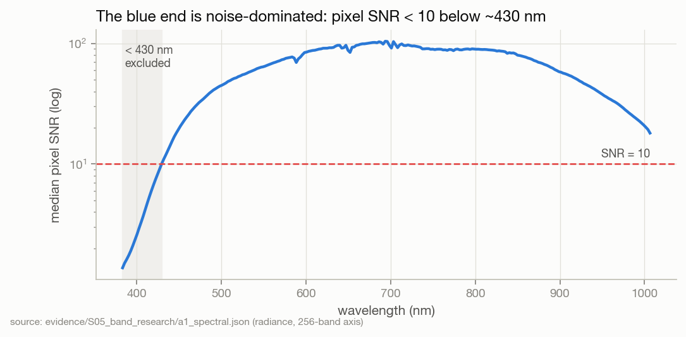
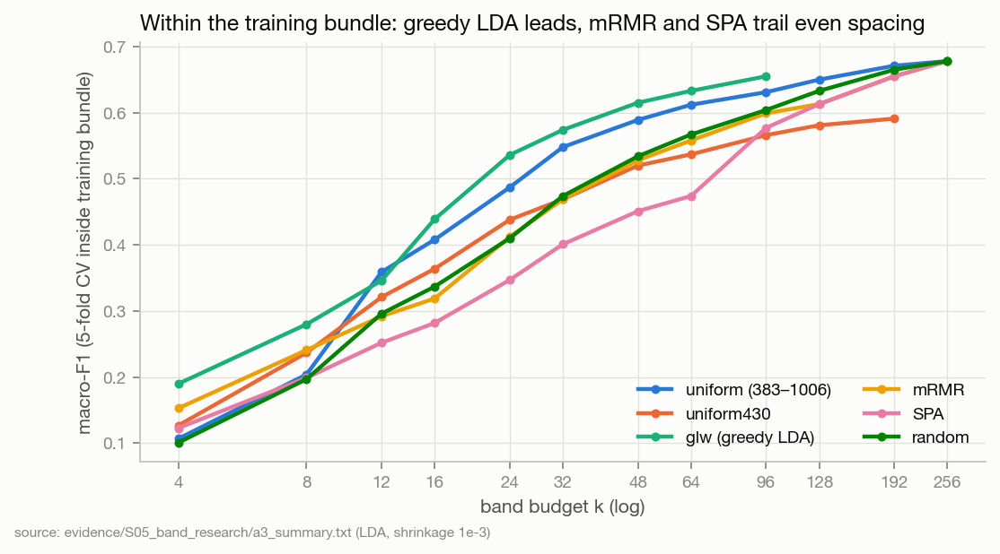
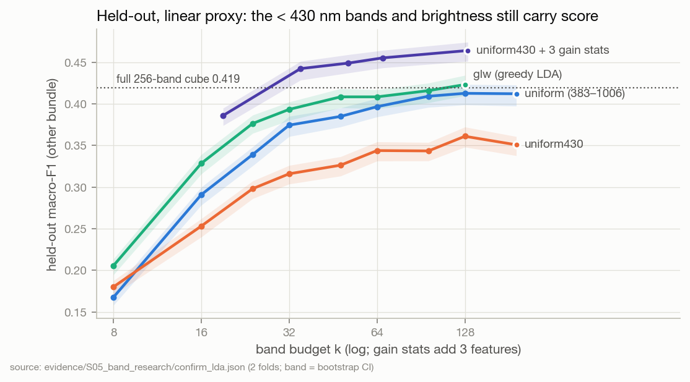
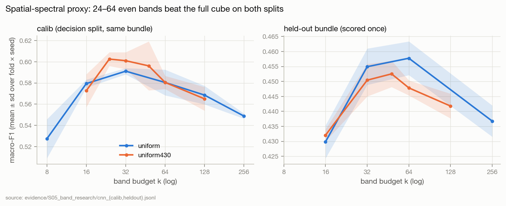
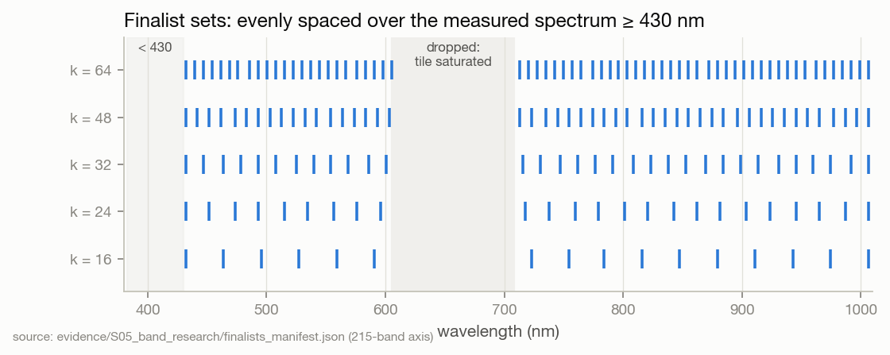

# S05 · Band research with pre-registered held-out confirmation

| | |
|---|---|
| **Status** | complete |
| **Dates** | 2026-09-29 → 2026-09-30 (pre-registrations frozen 2026-09-29 22:39 and 22:46 CEST) |
| **Commits** | analysis run against `78eea0d`; outcomes shipped in `962673f` (finalists), `afa0cd3` (finalists on the measured axis) |
| **Data** | **SNV-256** cube (since replaced, S07), grouped, folds 0 and 1, same splits as training (`grouped_split`, eval_frac 0.3, calib_frac 0.15) |
| **Code** | one-off scripts, **archived** in [`evidence/S05_band_research/code/`](../../evidence/S05_band_research/code/) (the originals in `outputs/band_research/` are git-ignored); the shipped rule is `src/spectralquadnet/bandstudy/finalists.py` |
| **Evidence snapshot** | [`evidence/S05_band_research/`](../../evidence/S05_band_research/) — both pre-registrations with hashes, decision rule, every held-out record, CNN records, spectral characterisation, derived summaries |
| **Findings** | F14–F21 · **Decisions** D09, D10, D11 · **Hypotheses** H1–H5 |

## 1 · Question
For a model that sees spatial structure, and judged on held-out bundles rather than calib: how many
bands, which ones, and does any supervised selection beat even spacing?

## 2 · Why we did this
S03 left two warnings unresolved: mean-spectrum proxies are not the network (they discard ~25 points
of spatial signal), and calib is not held-out. Both had to be addressed before choosing the band sets
the network would be trained on (S08).

## 3 · Hypotheses and decision rules
Frozen before any held-out row was read — `preregistration.frozen.json` (SHA-256 `5ae90caf…`),
verified by the confirmation script on every run:

- **H1** the < 430 nm advantage vanishes on held-out · **H2** uniform430 peaks at k ≤ 64 and is
  non-inferior to the full cube · **H3** no supervised selector beats uniform430 by > 0.01 at k ≥ 32 ·
  **H4** the brightness-statistic gain shrinks on held-out · **H5** low-pass DCT ≥ selected sets.
- **Decision rule** (`decision_rule.json`): track R1 (≥ 430 nm). Method: glw430 if its
  within-training-bundle advantage over uniform430 is ≥ 0.01, else uniform430. Budget: smallest k on
  the uniform430 CNN calib curve within 1 SE of the peak. Held-out results may test H1–H5; **no arm is
  picked by its held-out score**.

Outcomes: [HYPOTHESES §1](../../HYPOTHESES.md#1--pre-registered-held-out-hypotheses-s05-s06).

## 4 · Method

| Step | Script | Split used | Output |
|---|---|---|---|
| One pass over the 36 GB cube → mean / sd spectra, raw radiance, 48 sampled pixels per kernel, a 16 × 16 pooled cube, noise estimates | `extract.py` | all rows, no labels | `cache/` (git-ignored) |
| Spectral characterisation: SNR, correlation, PCA, MNF, Fisher eigen-spectrum, PSD | `a1_spectral.py` | train | `a1_spectral.json` |
| Which proxy is credible | `a2_proxy_check.py`, `a2b_where.py` | train / calib | printed |
| Budget curves, nested selection, 10 methods incl. glw and DCT | `a3_budget.py` | within training bundle, 2 folds × 5 outer CV | `a3_budget_all.json`, `a3_summary.txt` |
| Can a k-band *instrument* reproduce a k-band result? (SNV over S vs over 256) | `a4_snv.py` | train | printed |
| CNN proxy (2-D CNN on the pooled cube, 60 epochs) | `a5_cnn.py` | train → calib, then train ∪ calib → held-out | `cnn_*.jsonl` |
| Is < 430 nm just the global SNV statistic? | `a6_globalstat.py` | train | `kernel_gainstats.npy` |
| **Freeze** arm list (51 LDA arms, 15 CNN arms) | `make_prereg.py` | — | `preregistration.frozen.json` + `.sha256` |
| **Held-out confirmation**, LDA, once, bootstrap CI | `a7_confirm_lda.py` | held-out | `confirm_lda.json` |
| Session diagnostics → second freeze → confirmation | `a8`, `a9`, `make_prereg2.py`, `a10_confirm2.py` | train / held-out | → [S06](../S06_session_confound/README.md) |

## 5 · Results

### 5.1 The spectrum



Pixel SNR falls below 10 at ~430 nm (1.4 at 383 nm). The bands there are dark-clipped and their SNV
values are 85–91 % explained by one per-kernel brightness statistic (F14). The spectrum is extremely
redundant: median adjacent r = 0.9985; 6 PCs hold 99 % of variance; the Fisher discriminant needs 7
directions for 90 % of its power and 15 for 95 % (F15).

### 5.2 Inside the training bundle



LDA (shrinkage 1e-3), 5-fold CV within the training bundle, selection nested inside each CV fold.

| k | uniform | uniform430 | glw | glw430 | mRMR | SPA | random |
|---|---|---|---|---|---|---|---|
| 16 | 0.408 | 0.364 | 0.439 | 0.395 | 0.319 | 0.282 | 0.337 |
| 32 | 0.548 | 0.469 | 0.574 | 0.496 | 0.469 | 0.401 | 0.474 |
| 64 | 0.612 | 0.537 | 0.633 | 0.551 | 0.558 | 0.474 | 0.567 |
| 256 | 0.678 | — | — | — | 0.678 | 0.678 | 0.678 |

glw leads; mRMR and SPA sit at or below random (F16). This is the evidence the frozen rule used to
select glw430 (+0.022 over uniform430 at k 24–64).

### 5.3 Held-out, linear proxy (pre-registered, scored once)



| k | uniform | uniform430 | glw | glw430 | uniform430 + gstat3 | DCT |
|---|---|---|---|---|---|---|
| 16 | 0.291 | 0.253 | 0.329 | 0.282 | 0.386 | — |
| 32 | 0.374 | 0.316 | 0.393 | 0.323 | 0.442 | 0.365 |
| 64 | 0.397 | 0.344 | 0.408 | 0.349 | 0.455 | 0.394 |
| 128 | 0.413 | 0.361 | 0.423 | 0.357 | 0.464 | — |
| 256 | **0.419** | | | | | |

Repository incumbents: mRMR k40 0.332, SPA k40 0.282, l1_path k192 0.420 / k224 0.419. The < 430 nm
bands and the brightness statistics both still add held-out score for LDA (F19) — but both are
session-informative (F26), so the gain is not evidence of variety chemistry.
Full table: [`heldout_lda_summary.csv`](../../evidence/S05_band_research/heldout_lda_summary.csv).

### 5.4 The spatial-spectral proxy



| arm | calib (2 folds × 2 seeds) | held-out (2 folds × 2 seeds) |
|---|---|---|
| uniform k16 | 0.579 | 0.430 |
| uniform k32 | 0.591 | 0.455 |
| uniform k64 | 0.580 | **0.458** |
| uniform k256 (full) | 0.549 | 0.437 |
| uniform430 k24 | **0.602** | — |
| uniform430 k32 | 0.601 | 0.450 |
| uniform430 k48 | 0.596 | 0.453 |
| uniform430 k128 | 0.565 | 0.442 |
| glw430 k32 / k64 | — | 0.444 / 0.444 |
| repo l1_path k224 | — | 0.437 |

The CNN curve *peaks* at 24–64 bands and declines toward the full cube, on both splits (F17). The
< 430 nm advantage is ~0 for this model (H1 holds for the CNN). glw430 does not beat uniform430 on
held-out (F18). Calib sits ≈ 0.15 above held-out throughout (F21).

### 5.5 The finalist sets

The frozen budget rule gives **k\* = 24** (peak 0.6025, SE 0.0032; `r1_budget.json`). The shipped sets:



`uniform430` at k ∈ {16, 24, 32, 48, 64}, cut on the current refl-215 axis with the 608–706 nm gap
collapsed so bands spread evenly on either side (`afa0cd3`). Label-free, identical for both folds.

## 6 · Findings
F14 (E2), F15 (E2), F16 (E2), F17 (E4), F18 (E4), F19 (E4), F20 (E4), F21 (E4) — [FINDINGS](../../FINDINGS.md).

## 7 · Decisions this led to
- [D09](../../DECISIONS.md) pre-registration with hash, as the standard for held-out work.
- [D10](../../DECISIONS.md) the 430 nm floor.
- [D11](../../DECISIONS.md) uniform430 finalists — **deviation**: the frozen rule selected glw430 at
  k = 24; uniform430 shipped after held-out showed the two tie. Recorded, with reasoning.
- D04 (full cube by default) moved to *under review*.

## 8 · Threats to validity
1. Both proxies are stand-ins; the CNN is a 2-D net on a 4 × 4-pooled cube, not SpectralSeedNet.
2. SNV-256 cube. The current dataset is reflectance; whether the shapes of these curves survive the
   radiometry change is unmeasured (FW-01).
3. Two folds; CNN two seeds. CNN sd ≈ 0.002–0.011 per arm.
4. Every held-out number here is dominated by the 73 same-session varieties (S06).
5. Some intermediate numbers (a2, a4, a6) were printed, not saved — H4 is undetermined for that reason.

## 9 · What would change these conclusions
- S08 showing SpectralSeedNet prefers the full cube → F17 is a proxy property, D04 stands.
- A reflectance re-run (FW-01) showing a supervised set beats uniform430 by > 0.01 → revisit D11.

## 10 · Reproduce
The scripts expect the **SNV** cube, which `./dataset` no longer holds:
```bash
python scripts/prepare_dataset.py --radiometry snv --root ./dataset_snv   # rebuild, ~36 GB
# edit REPO / ROOT at the top of evidence/S05_band_research/code/common.py and extract.py
cd docs/research/evidence/S05_band_research/code
python extract.py cache/ && python a1_spectral.py && python a3_budget.py && python a3_summarise.py
python a5_cnn.py calib ../arms_cnn_calib2.json cnn_calib.jsonl 0,1
python make_prereg.py   # freezes — only on a fresh study
python a7_confirm_lda.py && python a5_cnn.py heldout ../arms_cnn_heldout.json cnn_heldout.jsonl 0,1
```
`python scripts/write_finalist_bands.py` regenerates the shipped finalist sets on the current axis.

## 11 · Provenance
`outputs/band_research/` (git-ignored): scripts, `cache/` features, `preds/` (76 prediction files),
every JSON. Snapshotted: pre-registrations + hashes (both verify), decision rule, `r1_budget.json`,
`a1_spectral.json`, `a3_summary.txt`, `confirm_lda.json`, `confirm2.json`, `cnn_*.jsonl`,
`glw_canonical.json`, `finalists_manifest.json`, the CNN arm lists, all 19 scripts. Not snapshotted: `a3_budget_all.json`
(770 KB; summarised by `a3_summary.txt`), `cache/`, `preds/`.
