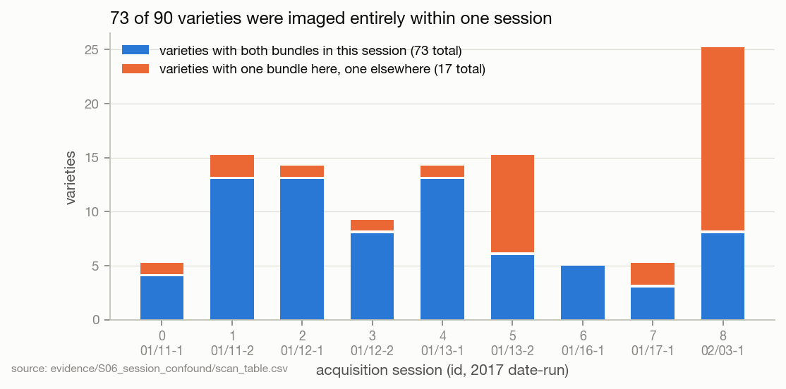
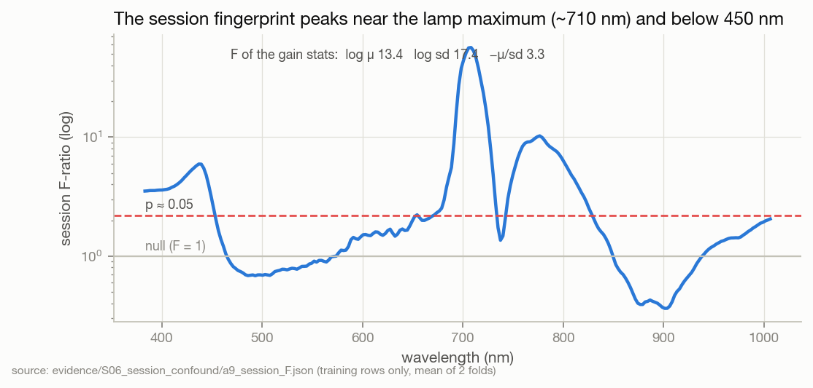

# S06 · The acquisition-session confound

| | |
|---|---|
| **Status** | diagnosis complete; remedy open (S07 built one, FW-01 tests it) |
| **Dates** | 2026-09-29 → 2026-09-30 (second pre-registration frozen 2026-09-29 22:46 CEST) |
| **Commits** | analysis against `78eea0d`; `reporting/session.py` shipped in `962673f` |
| **Data** | SNV-256 cube, grouped, folds 0 and 1; `scan_table.csv` session IDs |
| **Code** | `a8_session.py`, `a9_session_bands.py`, `make_prereg2.py`, `a10_confirm2.py`, `a11_cnn_heldout_summary.py` in [`evidence/S05_band_research/code/`](../../evidence/S05_band_research/code/); the shipped measurement: `src/spectralquadnet/reporting/session.py` |
| **Evidence snapshot** | [`evidence/S06_session_confound/`](../../evidence/S06_session_confound/) + `confirm2.json`, `preregistration2.json` in S05's snapshot |
| **Findings** | F22–F26 · **Decisions** D12, D14 · **Hypotheses** H6, H7 |

## 1 · Question
Why do some varieties score exactly zero on held-out bundles — and what does that say about what the
grouped protocol measures?

## 2 · Why we did this
S05's held-out predictions, broken down per class, showed a block of classes at 0 recall for every
arm, while the rest scored 0.4–0.6. A random failure pattern would not be that clean.

## 3 · Hypotheses
Diagnostic first (a8, a9 — no selection, no new arms), then a second frozen round
(`preregistration2.json`, SHA-256 `2077efc9…`):
- **H6** session-clean band sets raise held-out cross-session recall above 0.05.
- **H7** they lose macro-F1 vs unconstrained arms of equal k; the loss estimates the
  session-recognition share of the grouped score.

## 4 · Method
- **Session structure** from `scan_table.csv`: 180 scans, 9 sessions.
- **a8** splits held-out recall of the pre-registered round-1 arms into same- vs cross-session varieties.
- **a9** per-band session F-ratio on training rows only: between-session variance of class means
  over within-session variance; F ~ 1 under no session effect, > 2.2 ≈ p 0.05 for F(8, 81).
- **make_prereg2** builds "session-clean" candidate sets per fold (bands with F < 2.2 on that fold's
  training rows) and greedy / uniform selections within them; frozen; **a10** scores them once.
- **a11** applies the same breakdown to the CNN held-out predictions.

## 5 · Results

### 5.1 The structure



73 of 90 varieties had both bundles imaged in the same session. The 17 that span two are labels
4, 7, 12, 22, 38, 45, 59, 60, 61, 63, 64, 65, 66, 70, 71, 78, 79 (F22).

**Every one of the 17 has exactly one bundle in session 8** (2017-02-03); the other is in session 0,
1, 2, 3, 4, 5 (nine of them) or 7. Session 8 is also the only session in which the white tile never
saturates (S07, F27) — so its illumination level differed from every other session. "Cross-session"
on this dataset therefore means, concretely, *session 8 versus the rest*.

### 5.2 What every model does with it


| arm | held-out macro-F1 | same-session recall | cross-session recall |
|---|---|---|---|
| LDA uniform k256 (full cube) | 0.419 | 0.535 | **0.000** |
| LDA glw k128 | 0.423 | 0.542 | 0.000 |
| LDA uniform430 + gstat3 k64 | 0.455 | 0.586 | 0.001 |
| LDA session-clean uniform k64 | 0.318 | 0.411 | 0.001 |
| CNN uniform k64 | 0.458 | 0.595 | 0.003 |
| CNN uniform k256 | 0.437 | 0.569 | 0.005 |

Across **all 44 round-1 and round-2 LDA arms and all 15 CNN arms**, cross-session recall is between
0.000 and 0.013 (F23). The cross-session kernels are not scattered: 74–78 % (LDA) and 71 % (CNN) are
predicted as a variety trained in their *own* session, against ≈ 15 % by chance (F24).

**What this means.** Under grouped, a same-session variety's held-out bundle shares its session —
lamp, detector state, room — with its training bundle. Recognising the session narrows 90 candidates
to the 5–25 imaged that day. Every point of held-out score these proxies earn comes from that
population; on the population where session and variety are decoupled, they recognise nothing.

### 5.3 Where the fingerprint lives



Strongest at ~710 nm (F ≈ 60, the lamp maximum), then ~775 nm (≈ 10) and below 450 nm (≈ 6); below 1
at 470–570 and 860–930 nm. The SNV gain statistics log μ and log sd have F 13–17 (F26). The ~710 nm
peak coincides with the region where the white tile saturates (S07) — the lamp's spectral shape is
the fingerprint SNV leaves behind.

### 5.4 Can the fingerprint be cut out? (H6, H7)
Session-clean arms kept roughly 160 of 256 bands per fold. Cross-session recall: 0.0006–0.0012 —
**H6 rejected**. Macro-F1 fell ≈ 0.08 against unconstrained arms of equal k — H7's prediction holds,
but its interpretation does not: the session signal was not removed, so the loss is variety signal
removed with the bands (F25). The fingerprint is multivariate and spread thinly enough that a
univariate band filter cannot remove it.

## 6 · Findings
F22 (E4), F23 (E4), F24 (E3), F25 (E4), F26 (E2) — [FINDINGS](../../FINDINGS.md).

## 7 · Decisions this led to
- [D14](../../DECISIONS.md) — every final evaluation reports same/cross-session scores, attraction and
  entropy (`reporting/session.py`).
- [D12](../../DECISIONS.md) — reflectance calibration (S07), to remove the illumination shape at its source.
- D01 annotated: grouped is necessary but not sufficient.

## 8 · Threats to validity
1. 17 cross-session classes × ~48 held-out kernels: small, and every one pairs session 8 with
   another session, so "cross-session" is one specific contrast, not a sample of session pairs.
2. Proxies only; the network may differ — S08 reports it via D14.
3. SNV-256; reflectance may change the picture (the point of FW-01).
4. F24's attraction rates are quoted in `reporting/session.py`; the computation's output was not saved.
5. The 17 cross-session varieties may differ from the other 73 in ways other than session (e.g. the
   bundle that needed re-imaging) — the comparison is observational.

## 9 · What would change these conclusions
Cross-session recall clearly above chance (≈ 1/90) for any model or input → the confound is not
total, and that model/input becomes the project's reference (FW-01, FW-05).

## 10 · Reproduce
After S05's `extract.py`:
```bash
python a8_session.py && python a9_session_bands.py
python make_prereg2.py      # freezes — only on a fresh study
python a10_confirm2.py && python a11_cnn_heldout_summary.py
```
On any trained network, the same measurement runs automatically in final evaluation.

## 11 · Provenance
`outputs/band_research/{confirm2.json, a9_session_F.json, preregistration2.*}`; `dataset/scan_table.csv`.
Derived: `evidence/S06_session_confound/session_recall_summary.csv`.
