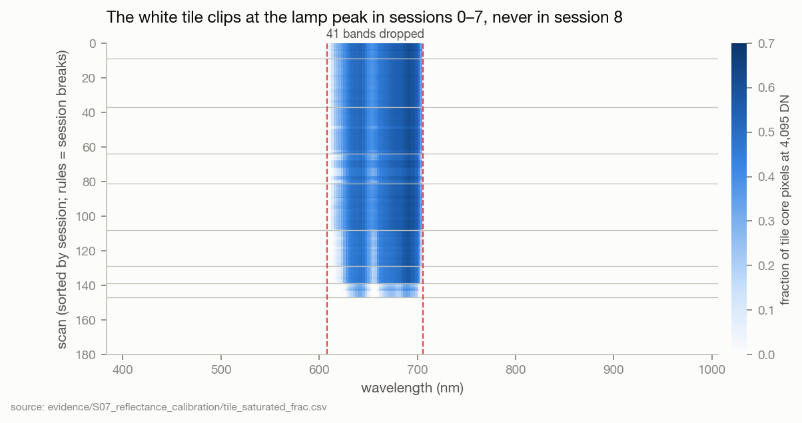

# S07 · White-tile reflectance calibration

| | |
|---|---|
| **Status** | complete as a data build; **its effect on the session confound is unmeasured** (FW-01) |
| **Dates** | 2026-09-30 |
| **Commits** | `962673f` (tile detection, reflectance extraction, session reporting) · `b3f323b` (drop bands no tile measured; write the band axis) · `afa0cd3` (finalists on the measured axis) · `f0cc50b` (refl215 configs) · `ab1949b` (dataset refinement) |
| **Data** | raw archive → `./dataset/`: 8,624 × **215** × 64 × 64 float32 reflectance (30.4 GB) |
| **Code** | `src/spectralquadnet/data/prep/white_tile.py`, `patch_extraction.py`; `scripts/prepare_dataset.py` |
| **Docs** | [`docs/02` §2.3](../../../02_DATASET_AND_PREPROCESSING.md) — full method and the real-archive probe |
| **Evidence snapshot** | [`evidence/S07_reflectance_calibration/`](../../evidence/S07_reflectance_calibration/) — `radiometry.json`, `white_tiles.csv` (per-scan QC), `tile_saturated_frac.csv`, the 215-band axis |
| **Findings** | F27 · **Decisions** D12, D13 |

## 1 · Question
Can every scene be converted to physical reflectance using its own in-scene white reference — and
what does that cost?

## 2 · Why we did this
S06: per-pixel SNV removes a scalar gain but keeps the illumination's spectral *shape*, and the
session fingerprint is strongest at the lamp maximum (F26). The dataset record states that every
scene contains a 100 % Spectralon tile; the original preprocessing cropped it away.

## 3 · Hypotheses
None pre-registered — this is a data build. The hypothesis it *enables* is H8 in FW-01: reflectance
raises held-out cross-session recall above 0.05.

## 4 · Method
1. **Detect** the tile on the uncropped raw scene (500–900 nm brightness; brightest compact
   component ≥ 1,000 px, ≥ 1.5× its surroundings, uniform after a 3 px erosion).
2. **Measure** the per-band median dark-corrected value over unsaturated core pixels; a band with
   > 1 % of core pixels at 4,095 DN is *unmeasured*, not clipped.
3. **Resolve** unmeasured bands from the session's median illumination shape scaled by the scan's
   gain; a band no scan in the session measured is *unresolved*.
4. **Drop** every band unresolved in any scan, from every scan (`--tile-drop-unresolved`), so all
   scans share one axis. Filling a window no tile measured would be a model of the lamp.
5. **Extract** patches from the reflectance cube with segmentation still run on radiance — so the
   cube is row-aligned with the SNV extraction (same labels, groups, masks, morphology).

## 5 · Results



- Tile found in **180 / 180** scans: full-width strip, ~26,000 core pixels, 5–13× its surroundings,
  core robust CV ≤ 0.07.
- In sessions 0–7 the lamp peak saturates the tile in the same 28–41 bands of every scan (up to 63 %
  of core pixels at the ceiling); session 8 never clips. **147 of 180 scans** had bands no tile in
  their session measured.
- White-reference sources across scans × bands: 40,391 own measurement, 104 filled from the session
  shape, 5,585 unresolved (`radiometry.json`).
- Result: **215 of 256 bands** — 383.2–605.6 nm and 708.2–1006.5 nm; 41 bands (608.0–705.8 nm)
  dropped. Seed reflectance: median 0.10 at 432 nm → 0.57 at 999 nm; p99.9 0.86; no negatives;
  3 × 10⁻⁶ of values above 1.
- In sessions 5–8 the tile's top edge (rows ~587–597) lies inside the seed crop (`SEED_ROWS = 600`);
  segmentation is unaffected (identical patch count and regions to the SNV extraction).

**Consequences carried forward.** The dropped window is most of the region where the session
F-ratio peaked (F26 peaks at ~710 nm, just past the kept edge at 708.2 nm). Finalist band sets were
re-cut on the new axis with the gap collapsed (`afa0cd3`; [S05 §5.5](../S05_band_research/README.md#55-the-finalist-sets)).
The k = 32 set shares only 5 of its 32 bands with its SNV-axis predecessor.

## 6 · Findings
- [F27](../../FINDINGS.md) the tile can calibrate 215 bands; 41 are unmeasurable in 8 of 9 sessions (E4).

## 7 · Decisions this led to
- [D12](../../DECISIONS.md) reflectance is the dataset; drop, don't fill; the SNV cube in `./dataset`
  replaced (rebuildable with `--radiometry snv --root …`).
- [D13](../../DECISIONS.md) band indices are axis-specific; `band_geometry` enforces agreement.

## 8 · Threats to validity
1. Removing illumination shape is a hypothesis about the confound, not a measured fix (FW-01).
2. Dropping 608–706 nm removes red-edge-adjacent bands that may carry variety information; their
   cost has not been measured.
3. Session 8 — the one session with no saturation and the session every cross-session variety
   touches — is calibrated from the full band range, the others from 215; after dropping, all share
   one axis, but the *quality* of the white reference may still differ by session.
4. S03, S05 and S06 numbers are on the SNV axis and are not directly comparable band-for-band.

## 9 · What would change these conclusions
FW-01 negative (no change in cross-session recall, lower same-session performance) → reconsider D12.

## 10 · Reproduce
```bash
python scripts/prepare_dataset.py --radiometry tile --probe-tiles 27   # probe only, no extraction
python scripts/prepare_dataset.py                                     # defaults: tile + drop unresolved
python scripts/write_finalist_bands.py                                # re-cut finalists on the new axis
```

## 11 · Provenance
`dataset/{radiometry.json, white_tiles.csv, white_spectra.npz, wavelengths.csv}` (git-ignored);
snapshotted as listed above.
