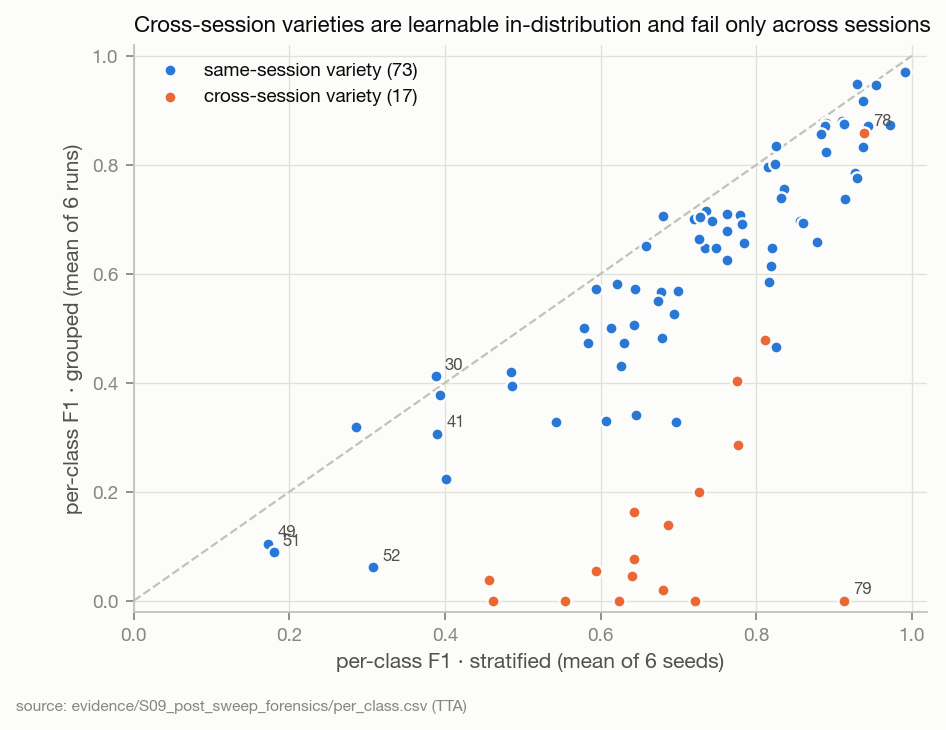
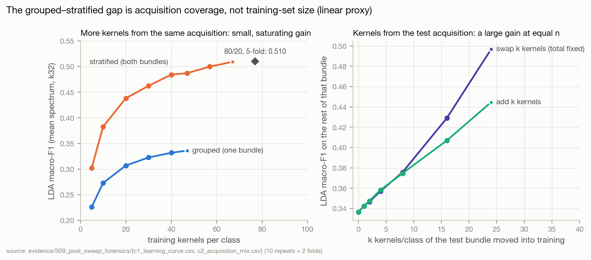
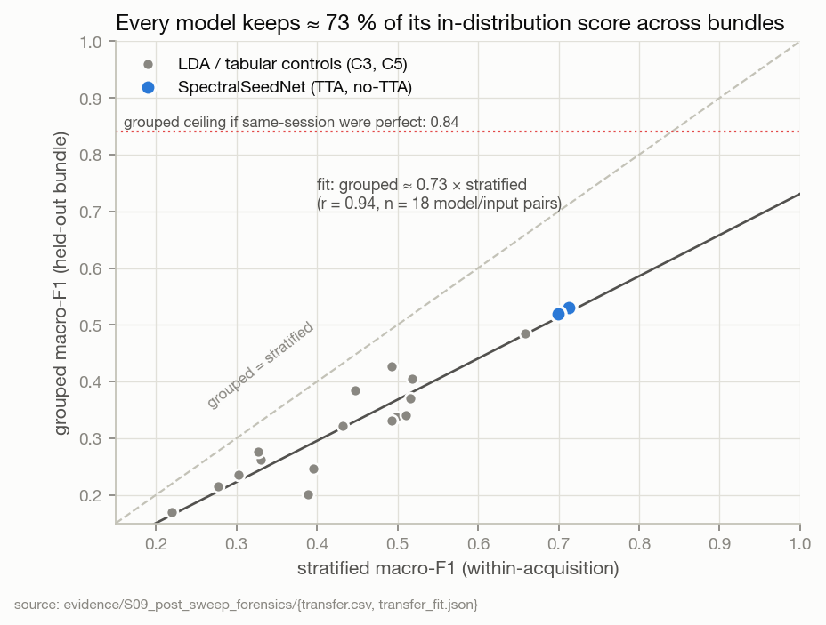
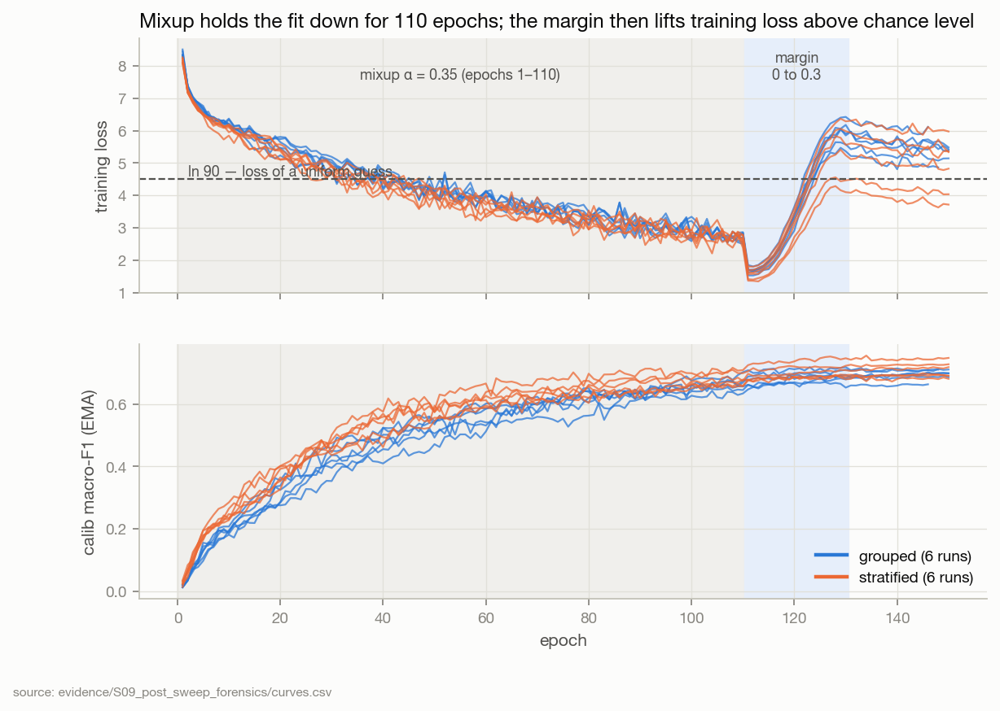
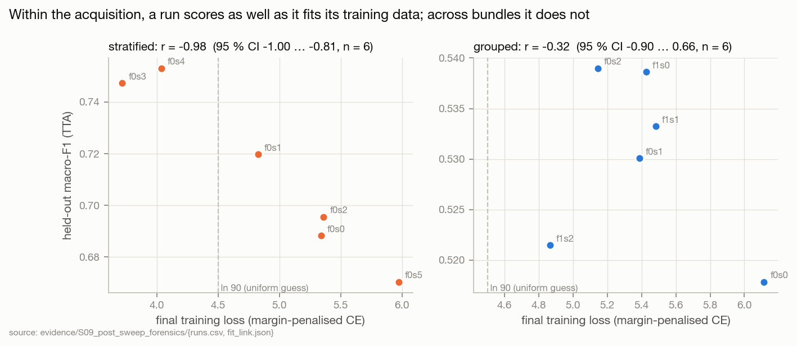
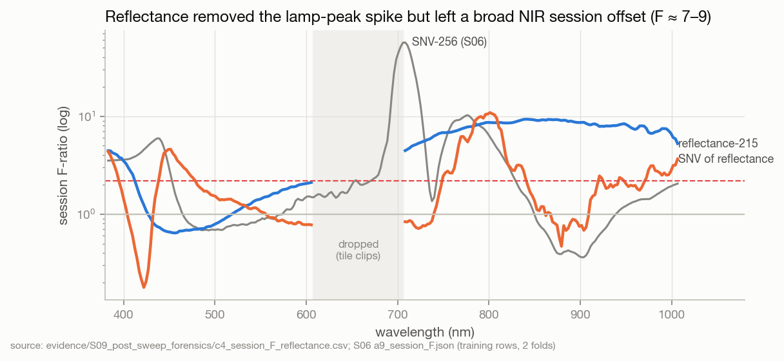

# S09 · Post-sweep forensics — what is limiting performance, data/protocol or model/training?

| | |
|---|---|
| **Status** | complete (analysis) — next experiments frozen in `preregistration_next.json` (SHA-256 `f896d0e5…`), listed in [HYPOTHESES §4](../../HYPOTHESES.md) |
| **Dates** | 2026-10-01 |
| **Commits** | sweep code `2879d1d` (inferred from timestamps — `run.json` records no commit, see §8); analysis: this study's commit |
| **Data** | refl-215 cube sliced to `uniform430_k32` (`dataset_u430k32`, float16); grouped folds 0, 1; stratified fixed split |
| **Code** | [`evidence/S09_post_sweep_forensics/code/`](../../evidence/S09_post_sweep_forensics/code/) — `extract_runs.py`, `spectra.py`, `controls.py`, `synthesis.py`; figures: `tools/build_assets.py::fig_s09` |
| **Raw outputs** | `outputs/experiments_u430k32/` (the sweep, 805 MB) · `outputs/s09_forensics/` (mean-spectrum caches) |
| **Evidence** | [`evidence/S09_post_sweep_forensics/`](../../evidence/S09_post_sweep_forensics/) |
| **Findings** | F30–F43 · **Decisions** D16–D18; D06, D07, D12, D14 annotated · **Hypotheses** S08 drafts H8–H11 observed; H12–H15 frozen |

## 1 · Question
After the first neural sweep, is the binding limitation on this project's performance the **data and
protocol** (acquisition/session structure, representation, amount of data) or the **model and its
training** — and what is the smallest set of experiments that would decide where to invest next?

Tests F17, F21, F23 on the network; could reverse D04, D05, D06, D07, D12; informs FW-01…FW-05.

## 2 · Why
S08's protocol sweep — the first training of SpectralSeedNet under the revised protocol — finished
on 2026-10-01. It is the most expensive evidence the project has; S09 extracts everything it can say
before any further GPU time is spent. No model was retrained. Everything below is either read from the
sweep's artifacts or is a CPU control on mean spectra; held-out rows were used **diagnostically only**
(no arm, band set, checkpoint or hyperparameter was selected on them).

## 3 · The protocol, reconstructed from the artifacts

| item | value (source) |
|---|---|
| runs | 12, all completed: grouped folds {0,1} × seeds {0,1,2}; stratified fold 0 × seeds {0…5} (`sweep.json`) |
| input | 32 reflectance bands, 432–999 nm, gap 601→716 nm (the dropped tile-saturated window), 64×64, foreground mask, 8 morphometrics in physical pixels (`band_axis.json`, `segmentation.py`) |
| model | SpectralSeedNet, **2,849,478** params: spatial path 2,267,510 (**79.6 %**), spectral path 118,640, fuse 131,840, embed 263,936, ArcFace 23,040, aux 44,506 (`metrics_*.json` context) |
| objective | single stage, ≤150 epochs, early-stop patience 25 on calib macro-F1; AdamW 5e-4 → 5e-6 cosine, 5-epoch warm-up, wd 2e-4, per-group clip 5.0; **mixup α 0.35 for epochs 1–110**; ArcFace s 32, **margin 0 → 0.3 over epochs 111–130**; label smoothing 0.10 → 0.04; aux 0.2; dropout 0.15; aug `medium`; EMA 0.999 (resolved `config.yaml`) |
| runtime | Kaggle T4 × 2, DDP + SyncBN, fp16 + GradScaler, compile off; 1,231 ± 32 s grouped, 1,599 ± 18 s stratified; **4.7 GPU-pair-hours total** |
| grouped split | per class: one bundle trains (3,683 / 3,685 train + 630 calib, calib = patch-level carve from the training bundle), the other bundle is held out (4,311 / 4,309 kernels = val ∪ test) |
| stratified split | fixed `random_state=42`: 5,130 train + 906 calib + 2,588 val ∪ test — **~1.39× the grouped training set and two acquisitions per class** |
| selection / report | checkpoint chosen on calib; val ∪ test scored once, without and with TTA (8 dihedral + 4 spectral-gain views); 2,000-resample bootstrap |
| baselines | StandardScaler → LDA (svd) and LinearSVC (C 0.1) on the masked mean spectrum, fit on `train` only |

Deviation carried forward: k = 32, not the frozen k\* = 24 (D15, FW-09).

## 4 · Method of this study
1. **`extract_runs.py`** reads every run's `metrics.jsonl`, checkpoint metadata, predictions (aligned by
   row id, DDP padding removed) and session reports; rebuilds the splits with the pipeline's own split
   builder and asserts the evaluated rows match. Writes `runs.csv`, `curves.csv`, `influence.csv`,
   `per_class.csv`, `tta_delta.csv`, `kernel_consistency.csv`, `error_structure.csv`,
   `session_direction.csv`, `confusion_pairs.csv`, `baselines.csv`, `summary.json`.
2. **`controls.py`** — five CPU experiments on foreground mean spectra (C0 reproduces the sweep's LDA to
   < 1e-6): C1 learning curves at matched kernels/class and an 80/20 5-fold arm; C2 acquisition mixing;
   C3 input representation; C4 session F-ratio on reflectance; C5 fixed-hyperparameter tabular models
   on the same scalar inputs the network receives.
3. **`synthesis.py`** — derived quantities from the evidence tables only: shortfall decomposition,
   grouped-vs-stratified transfer line, the network's margin over tabular models, fit ↔ held-out
   correlations with Fisher CIs.
4. Literature check of what prior work on this dataset reports and under which protocol (`literature.csv`).

## 5 · Results

All held-out numbers are **val ∪ test of the other bundle (grouped)** or **the fixed patch-level
val ∪ test (stratified)**, refl-215 → u430k32, TTA unless stated; mean over runs.

### 5.1 Headline (G4: split · band axis · session breakdown)

| | grouped (n = 6) | stratified (n = 6) |
|---|---|---|
| macro-F1, TTA | **0.530** ± 0.009 sd (0.518–0.539) | **0.712** ± 0.033 sd (0.670–0.753) |
| macro-F1, no TTA | 0.519 ± 0.010 | 0.700 ± 0.031 |
| accuracy, TTA | 0.554 | 0.718 |
| calib (selection split) macro-F1 | 0.703 | 0.715 |
| same-session recall (73 classes) | 0.648 | 0.730 |
| cross-session recall (17 classes) | **0.152** (0.132–0.183) | 0.663 |
| cross-session attraction to own session | 0.47 (chance 0.14–0.15) | — |
| LDA baseline (mean spectrum) | 0.331 | 0.493 |
| LinearSVC baseline | 0.208 | 0.274 |

Fold effect is nil (fold means 0.529 / 0.531); seed sd is **0.009 grouped vs 0.033 stratified**. The
`F1_stratified − F1_grouped` gap is **+0.182** — but it is not a pure leakage measurement, because the
stratified arm also trains on 39 % more kernels from two acquisitions (§5.4 separates the two).

### 5.2 Where the grouped score is lost

| component of the grouped macro-recall shortfall (total 0.445) | value | share |
|---|---:|---:|
| same-session varieties · already lost in-distribution (1 − stratified recall) | 0.219 | **49 %** |
| same-session varieties · lost to the bundle shift | 0.067 | 15 % |
| cross-session varieties · already lost in-distribution | 0.064 | 14 % |
| cross-session varieties · lost to the session shift | 0.097 | **22 %** |

**63 % of what the grouped model fails to recognise, it already fails to recognise in-distribution**
(`decomposition.json`). The cross-session population caps grouped macro-recall at **0.84** even for a
model that is perfect on the 73 same-session varieties.



Per class, the picture is two-tiered. The 17 cross-session varieties score 0.46–0.94 F1
in-distribution and 0.00–0.48 grouped except DT66 (78, 0.86); 13 of the 16 classes with grouped F1 < 0.2 are cross-session:
they are learnable and fail only across sessions. Same-session classes keep their in-distribution
ranking (r = 0.91 grouped vs stratified; fold 0 vs fold 1, r = 0.92). A separate cluster —
NBP (30), TB13 (41), KB16 (49), NBK (51), NPT1 (52), with BC15 (0) — fails **even in-distribution**
(stratified F1 0.17–0.39) through mutual confusion (`confusion_pairs.csv`): the F09 hard classes, now
seen to be a varietal-similarity cluster rather than a session effect.

Cross-session recall is **directional and concentrated** (`session_direction.csv`): trained on an older
session and tested on session 8, 0.22–0.25; trained on session 8 and tested on the older session,
0.07–0.08. Four varieties (78 DT66: 0.91, 60, 64, 22) carry most of it; five (7, 12, 38, 45, 79) score 0 in every run.
Errors are session-shaped even for same-session varieties: 29–31 % of their errors land on a class from
their own session, against 12 % chance (`error_structure.csv`).

### 5.3 The network against linear models on its own inputs


| | grouped | stratified |
|---|---|---|
| SpectralSeedNet (2.85 M params), TTA / no TTA | 0.530 / 0.519 | 0.712 / 0.700 |
| **LDA on mean spectrum + 8 morphometrics (3,600 params)** | **0.485** | **0.659** |
| network margin, TTA / no TTA | +0.045 / +0.035 | +0.054 / +0.041 |
| LDA on 8 morphometrics only | 0.167 (cross-session recall **0.124**) | 0.174 |
| LDA on mean spectrum only | 0.331 (cross 0.039) | 0.493 |

(`network_margin.csv`, `c5_tabular.csv`.) LDA is the strongest tabular model; logistic regression,
RBF-SVM, gradient boosting and a 256×256 MLP — all at fixed, untuned hyperparameters — score lower.
**The 2.27 M-parameter spatial pathway, the spectral MLP and the ArcFace head together add ≈ 0.04–0.05
over a linear discriminant on the 40 scalar numbers the network also receives.**

The morphometrics are the one measured input that is **acquisition-invariant**: they score the same
grouped and stratified (0.167 vs 0.174), have session F 0.8–1.6 (`c4_session_F_morphometrics.csv`),
and on their own reach a cross-session recall (0.124) close to the network's (0.152). Untuned logistic regression on
spectrum + morphometrics reaches 0.170 — above the network. The network's
non-zero cross-session recall therefore cannot yet be credited to the spectrum or to reflectance
calibration; an ablation is required (X2).

### 5.4 Data quantity versus acquisition coverage (linear proxy)



- **C1, matched size.** At 40 kernels/class, LDA scores 0.484 stratified vs 0.332 grouped: a 0.152 gap,
  against 0.162 at the arms' native sizes. **Training-set size explains ≈ 0.01 of the gap.**
- The grouped curve is flat: 30 → 47 kernels/class of the training bundle adds +0.01.
- **80/20 patch-level 5-fold** (the literature's protocol): LDA 0.510 (k32), 0.539 (215 bands) — +0.017
  over the 59 %-train stratified arm.
- **C2, acquisition mixing.** Swapping 24 training kernels/class for 24 from the held-out bundle (n fixed)
  lifts LDA on the rest of that bundle from 0.336 to **0.497** and cross-session recall from 0.04 to
  0.32. Adding them on top gives 0.445. What moves the score is *whether the test acquisition is in
  training*, not how many kernels are.

### 5.5 Transfer from in-distribution to held-out



Across 18 model/input pairs measured on both protocols, **grouped ≈ 0.005 + 0.73 × stratified
(r = 0.94)**; the network sits on the line (residual +0.008). No model here has bought acquisition
robustness beyond what its in-distribution score predicts. Read observationally, an in-distribution
gain of Δ has historically come with ≈ 0.73 Δ on grouped. That is a prediction for X1 to test, not a
law.

### 5.6 Training dynamics — the model is not fitting its training data



- **Under-fitting.** At epoch 111 — the first epoch without mixup or margin — training accuracy on
  augmented batches is **0.76–0.87**, with calib accuracy 0.66–0.73. A 2.85 M-parameter network on
  ~40–57 kernels/class that does not reach ~0.9 training accuracy is capacity-starved by its regime,
  not over-fitting.
- **The margin phase.** As the margin ramps 0 → 0.3, training loss rises from ≈ 1.6 to 3.7–6.1, and
  **10 of 12 runs finish above ln 90 = 4.50**, the loss of a uniform guess under the margin-penalised
  logits. Calib F1 is flat to +0.03 over the same epochs while the LR decays, so the margin's own effect
  cannot be separated from the schedule.
- **Clipping.** The backbone gradient is clipped on **100 % of steps of every epoch** (`clipped_backbone =
  1.0`). Pre-clip norm has median 8.9 against the 5.0 threshold, rising to ≈ 26 at epochs 111–130 and
  ≈ 44 at 131–150. D07 set clip 5.0 "so it clips outliers"; it clips everything — the F08 pattern at a
  higher threshold. Adam is largely invariant to a constant gradient scale, so the *size* of the harm is
  unknown.
- **Selection.** Best epochs are 121–150 (mean 138); every run trained to ≥ epoch 146 (two early-stopped, at 146 and 148), so "best on
  calib" is almost always "near the end of the cosine".
- **Pathway use** (leave-one-pathway-out KL on calib): spectral ≈ 91 % in epochs 1–10, spatial rising to
  59 % (grouped) / 67 % (stratified) by epochs 131–150. Both pathways are used — yet together add only
  ≈ 0.05 over LDA (§5.3).



**The decisive pattern** (`fit_link.json`): within the acquisition (stratified), held-out F1 tracks how
well the run fitted its training data — **r = −0.98** with final training loss (95 % CI −1.00 … −0.81),
r = 0.96 with clean training accuracy. The seed spread (0.670 → 0.753) is an optimisation outcome:
the two best seeds are the two that fit best. Across bundles (grouped) the relationship is not
detectable (r = −0.32, CI −0.90 … 0.66). With n = 6 per arm this second number is weak evidence.

### 5.7 TTA, seeds, ensembling

| | grouped | stratified |
|---|---|---|
| TTA − no TTA (paired bootstrap per run) | +0.011 mean; 5 of 6 runs CI > 0; **f1_s2 −0.0095 (CI < 0)** | +0.013; 5 of 6 CI > 0 |
| predictions changed by TTA | 7.5–11.8 % | 5.9–8.9 % |
| 3-seed majority vote − mean single | +0.015 (f0), +0.009 (f1) | +0.012 (6-seed vote: 0.730) |
| pairwise seed agreement | 0.77–0.78 | 0.83 |
| kernels wrong in all 3 seeds / single-model error | 0.36 / 0.45 (**80 %** of errors shared) | 0.21 / 0.29 (72 %) |

Errors are systematic, not seed noise: ensembling recovers ≈ 0.01, and four in five grouped errors are
made by every seed.

### 5.8 Representation and the session fingerprint after reflectance

- **C3 (LDA, grouped / stratified).** 215 bands 0.371 / 0.516 vs k32 0.331 / 0.493. Dropping < 430 nm
  costs 0.05 grouped (F19's pattern persists on reflectance). SNV hurts (0.246 / 0.395): reflectance
  level is informative. Morphometrics add +0.15 / +0.17.
- **Cross-session recall of spectra alone, reflectance vs SNV** (LDA, not pre-registered): S06's SNV-256
  arms were 0.000–0.013; reflectance gives 0.039 (k32) and 0.053 (215). Above chance (0.011), far below
  same-session recall.



- **C4.** Reflectance removed the ≈ 710 nm lamp-peak spike (F ≈ 60 on SNV-256), partly by dropping the
  clipped bands. But it left a **broad NIR session offset**: F ≈ 7–9 across 715–1000 nm, where SNV-256
  sat below 1 at 860–930 nm. SNV of reflectance suppresses most of it (median 1.3–2.6), except a peak
  near 800 nm (F 10.9). The fingerprint moved; it did not disappear.

### 5.9 What prior work measures (`literature.csv`)
The dataset's own authors (Fabiyi et al. 2020) report **78.3 % average F1 for 90 varieties**. They used a
random 4:1 kernel split, so the same acquisitions appear in train and test, with **high-resolution RGB
shape features** + LDA projections of all 256 bands, and took the maximum over the number of LDA
components. Taheri et al. 2024's 92.7–96.2 % precision also uses RGB, and its split is not stated. Both
are within-acquisition numbers that lean on high-resolution morphology. That is the cue S09 finds to be
acquisition-invariant, and the HSI-mask morphometrics here capture it only coarsely.

## 6 · Findings
Strength per README §4. All are recorded in [FINDINGS](../../FINDINGS.md).

| ID | Finding | Strength |
|---|---|---|
| F30 | SpectralSeedNet: grouped 0.530 ± 0.009, stratified 0.712 ± 0.033; seed σ is 4× larger within-acquisition | E4 |
| F31 | 63 % of the grouped shortfall is already present in-distribution; cross-session caps grouped at 0.84 | E3 |
| F32 | The network adds only +0.035–0.054 over LDA on mean spectrum + 8 morphometrics | E3 |
| F33 | Morphometrics are acquisition-invariant, and alone match most of the network's cross-session recall | E3 |
| F34 | Within-acquisition, held-out F1 tracks training fit (r = −0.98); across bundles, no detectable link | E3 |
| F35 | The network under-fits: clean training accuracy 0.76–0.87; the margin phase pushes loss above ln 90 | E4 |
| F36 | Backbone gradient clipped on 100 % of steps — D07's intent not realised | E4 |
| F37 | Grouped ≈ 0.73 × stratified across 18 model/input pairs (r = 0.94); the network is on the line | E3 |
| F38 | The leakage gap is acquisition coverage, not training-set size (LDA: size ≈ 0.01 of 0.15) | E3 |
| F39 | Cross-session recall is directional (→ session 8: 0.22–0.25; ← 0.07–0.08) and concentrated in 4 varieties | E3 |
| F40 | Reflectance moved the session fingerprint from the lamp peak to a broad NIR offset (F ≈ 7–9) | E2 |
| F41 | Errors are systematic: 80 % shared by all seeds; vote +0.01; TTA +0.011 and not always positive | E4 |
| F42 | Hard in-distribution cluster {0, 30, 41, 49, 51, 52} confuses mutually under both protocols | E3 |
| F43 | Prior 78–96 % results are within-acquisition and use high-resolution RGB morphology | E1 |

## 7 · Decision: what is limiting performance

**Both, in different places — and quantified:**

| evidence status | data / protocol (A) | model / training (B) |
|---|---|---|
| **demonstrated** | Cross-session recall 0.15 vs same-session 0.65 on the same model; cross-session classes are learnable in-distribution (0.66). For a linear model, the test acquisition's presence in training — not training-set size — is what moves the score (C1, C2). Cross-session caps grouped at 0.84. | Run-level score tracks training fit within-acquisition (r = −0.98). Clean training accuracy 0.76–0.87. Margin-phase loss above chance in 10/12 runs. Clip on 100 % of steps. Only +0.05 over LDA on the same scalars. |
| **strongly suggested** | Of the acquisition-invariant information measured, shape dominates; spectral cross-session recall stays small for linear models even on reflectance (0.04–0.05; chance 0.011). | 63 % of the grouped shortfall exists in-distribution, where the model is fit-limited. In-distribution gains have carried ≈ 0.73× to grouped across every model measured. |
| **plausible** | High-resolution RGB morphology would raise both tiers (prior work's main ingredient). | A fit-first schedule lifts stratified ≥ 0.05; part of the spatial pathway's 2.27 M params is wasted. |
| **unknown** | Whether *any* spectral feature transfers across sessions (needs X2). Probability calibration (no logits saved). | Whether in-distribution gains transfer to grouped *for this network* (needs X1). The in-distribution ceiling of the data. |

**Verdict.** For the **score**, the next bottleneck is predominantly **model/training (B)**. It holds
the largest measured and demonstrably reducible share: the in-distribution 63 %, where the network
under-fits and barely beats a linear model. For the **claim**, the ceiling is **data/protocol (A)**:
nothing measured moves cross-session spectral recognition, and with one acquisition per class in
training none is expected. The investment order therefore follows ([D17](../../DECISIONS.md)): first
establish whether better fitting transfers (X1) and what the network actually uses (X2), before any
architectural novelty is designed. A novel architecture built on the current training regime would be
measured through an under-fitting optimiser and against a linear model it beats by 0.05.

**Should 80/20 be the main protocol?** No ([D16](../../DECISIONS.md)). On this data, an 80/20 split
places ≈ 38 kernels of every test bundle in training. C2 shows that 24 such kernels already add +0.16 to
a linear model at equal n, so an 80/20 number measures within-acquisition separability. The data also
says a larger training share is not what separates 0.71 from 0.92: 59 → 80 % train is worth ≈ +0.02
(C1, linear). The gap to the literature is model fit plus high-resolution RGB morphology, not data
volume. 80/20 is nevertheless scientifically useful, as a clearly labelled **within-acquisition tier**:

1. **comparability** with prior work, which reports this tier;
2. **a capacity diagnostic** — it is where the model's measured headroom lives (F34) and where an
   architecture's representational power is visible without the acquisition shift.

Claim it supports: *"given the same acquisition, the representation separates 90 varieties to X."* It
cannot support *"identifies the variety of a kernel from a new acquisition"* — only grouped (bundle)
and the cross-session subset (session) can. The paper reports all three tiers in one table with the
protocol as a column; abstract-level claims come from grouped and cross-session.

## 8 · Threats to validity
1. **n = 6 runs per protocol**: the fit ↔ score correlations have wide CIs. The stratified one is
   strong (CI −1.00 … −0.81); the grouped "no link" is not evidence of absence.
2. **The CPU controls are linear proxies.** C1/C2 conclusions about size vs coverage are demonstrated
   for LDA and inferred for the network. F17 showed proxies can rank band budgets differently from a CNN.
3. **The transfer line is observational** across heterogeneous models, not an intervention.
4. **Stratified differs from grouped in three ways at once** — leakage, +39 % data, two acquisitions
   per class. §5.4 bounds the size part (linear), not the diversity part.
5. **Calib selection** is optimistic by 0.17 (calib 0.703 vs held-out 0.530 grouped) and over 630
   kernels (7/class) is noisy; within-acquisition it ranks runs well (r = 0.90), across bundles poorly
   (r = 0.37).
6. **Measurement defects, all negligible in size but worth fixing**: reported metrics count one
   DDP-padded kernel twice (4,312 vs 4,311; Δ < 1e-4; the session report drops it); `run.json` records
   no git commit; SpectralSeedNet has no `pathway_labels()`, so influence is logged as A/B/C/D with
   C = D = 0; no logits are saved, so probability calibration cannot be assessed.
7. **Literature numbers** are from reading two papers; Taheri's protocol was not checked in full text.
8. **k = 32 rather than k\* = 24** (D15) — all S09 network numbers are for one band budget.

## 9 · What would change these conclusions
- X1 lifts stratified by ≥ 0.05 and grouped by **< 0.3×** that → in-distribution gains do not transfer:
  the bottleneck is data/protocol; stop investing in capacity and move to representation and data (FW-12, X5).
- X2 shows the morphometrics-zeroed network keeps cross-session recall ≥ 0.10 → the spectrum does carry
  transferable variety signal on reflectance (FW-01 positive for the network; D12 vindicated).
- X2 shows the spatial-only pathway ≥ the full network → the spectral MLP is redundant (the reverse of
  the S01 story); D05's architecture rationale needs rewriting.

## 10 · Next experiments (frozen; details in FUTURE_WORK)

| order | experiment | cost (T4 × 2) | decides |
|---|---|---|---|
| 0 | **D18 instrumentation** (FW-19): logits, commit, DDP de-dup, pathway labels, clean train accuracy | code only | makes X1's fit hypothesis (H13) measurable |
| 1 | **X1 fit-first** (FW-15): mixup 30 epochs, no margin, clip 50, 200 epochs; grouped 2 × 3 + stratified 3 | ≈ 4 h | H12a/b — **route A vs B** |
| 2 | **X2 attribution** (FW-16): no-morph, spectral-only, spatial-only; grouped 2 × 2 each | ≈ 4 h | H14a/b — what carries cross-session recall; is the spatial path dead weight |
| 3 | **X3 within-acquisition 80/20** (FW-17): 3 seeds under X1's chosen regime | ≈ 1.5 h | H15 + the D16 tier-1 number |
| 4 | **Band budget on the network** (FW-03, revised): k32 vs 215 vs k64 under the chosen regime | ≈ 4 h (215 is I/O-heavy) | D04 |
| 5 | **RGB morphology, CPU first** (FW-18): LDA on spectrum + RGB-resolution shape, grouped and cross-session | CPU | whether the paper's architecture should fuse RGB shape |

X1 and X2's no-morph arm need no code change; X2's two pathway arms need a `model.pathways` switch.

## 11 · Reproduce
From the repository root, with `outputs/experiments_u430k32/` present (≈ 5 min total, CPU):
```bash
python docs/research/evidence/S09_post_sweep_forensics/code/spectra.py        # 3 min (reads the 30 GB cube once)
python docs/research/evidence/S09_post_sweep_forensics/code/extract_runs.py   # 10 s
python docs/research/evidence/S09_post_sweep_forensics/code/controls.py       # ~10 min (C5 boosting/SVM)
python docs/research/evidence/S09_post_sweep_forensics/code/synthesis.py      # 1 s
python docs/research/tools/build_assets.py --figures
```

## 12 · Provenance
`outputs/experiments_u430k32/protocol/{grouped,stratified}__f*_s*/` (metrics.jsonl, stage1_meta.json,
last_stage1.json, results/*) and `baselines/*/results/*` → `extract_runs.py`. `dataset_u430k32/` and
`dataset/` (mean spectra, morphometrics, scan table) → `spectra.py`, `controls.py`. Checkpoints
(`*.pth`, 69 MB per run) stay in `outputs/` and are not snapshotted. Every table in §5 is a file in the
evidence folder; every figure names its source file.
