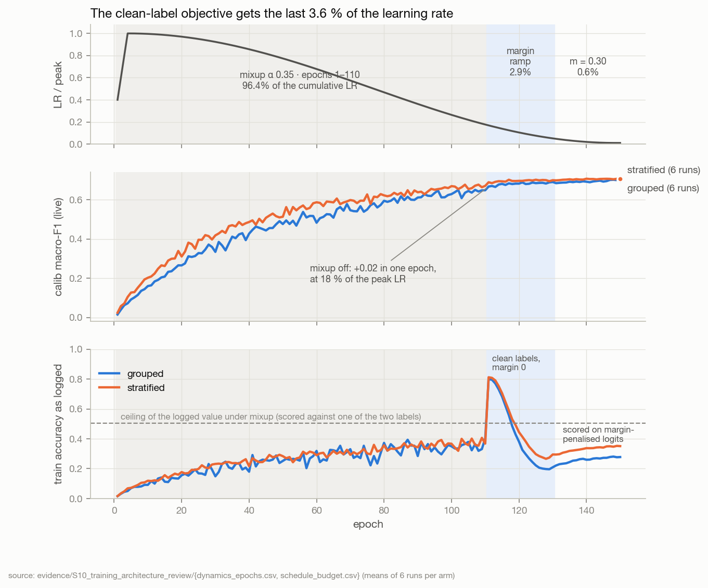
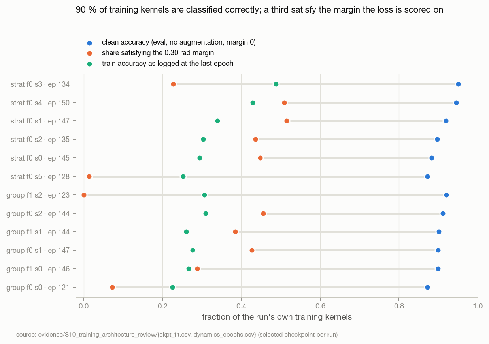
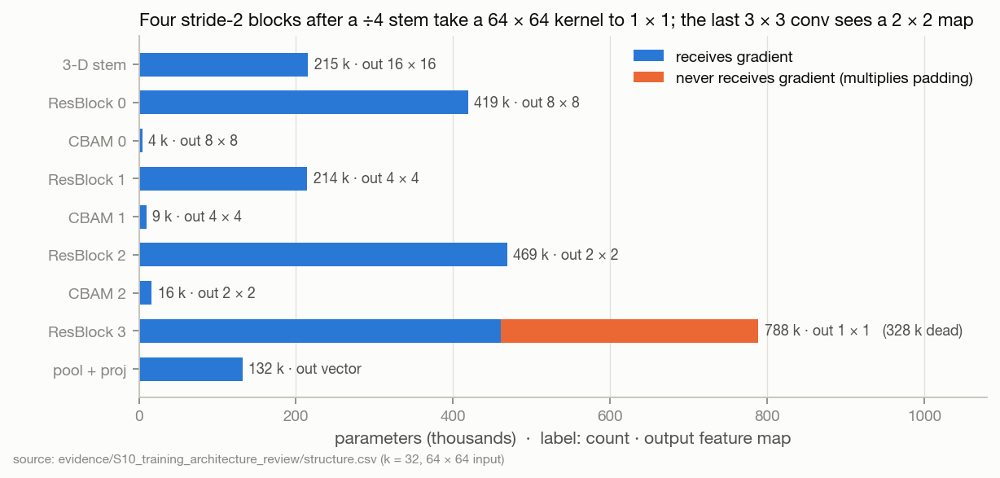
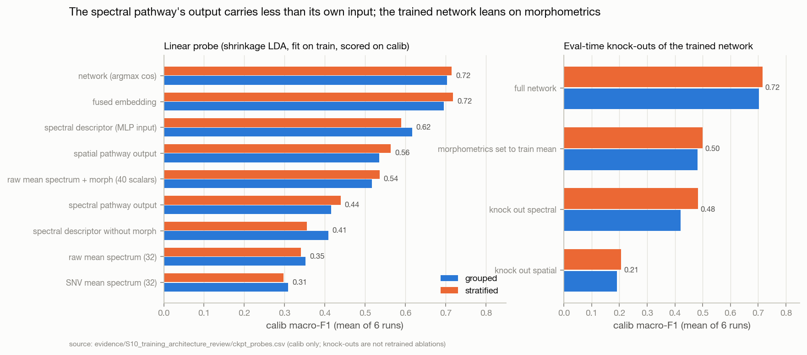

# S10 · Training & architecture review — why SpectralSeedNet under-fits, and what to change first

| | |
|---|---|
| **Status** | complete (analysis + remediation specification). **No model or training code was changed here** — P0 and the X2 switch were implemented in [S11](../S11_frozen_arms_execution/README.md) (D22). New arms X4–X6 frozen in [`preregistration_s10.json`](../../evidence/S10_training_architecture_review/preregistration_s10.json) (SHA-256 `1c8ae693…`, full hash in the `.sha256` beside it) |
| **Dates** | 2026-10-01 |
| **Commits** | base `8050ba2` (S09). This study's code, evidence and page are not yet committed. The sweep it reads: `2879d1d` (S09 §8) |
| **Data** | the 12 S08 sweep runs (`outputs/experiments_u430k32/protocol/`, u430k32, refl-215 axis): `metrics.jsonl`, `best_stage1.pth`, resolved configs. **Train and calib rows only** — no S10 script loads a held-out row; the only held-out numbers on this page are S09's, already reported |
| **Code** | [`evidence/S10_training_architecture_review/code/`](../../evidence/S10_training_architecture_review/code/) — `dynamics.py`, `objective.py`, `aux_weight.py`, `structure.py`, `checkpoints.py`, `descriptor_probe.py`, `gradients.py`, `mixup_geometry.py`; figures `tools/build_assets.py::fig_s10` |
| **Raw outputs** | `outputs/s10_review/` (markers only; every table is small and lives in the evidence folder) |
| **Evidence** | [`evidence/S10_training_architecture_review/`](../../evidence/S10_training_architecture_review/) |
| **Findings** | F44–F56 · refines F35, F36 · **Decisions** D19–D21; D05, D06, D07, D12, D18 annotated · **Hypotheses** H16–H18 frozen; interpretation guards on H12–H13 |

## 1 · Question
S09 showed the network is fit-limited within the acquisition (F34, F35) and barely beats LDA on its own
scalar inputs (F32). **Why does it under-fit — which parts of the regime, the objective, the optimiser and the
architecture are responsible — and what is the minimum set of changes, in which order, that would isolate
the cause?**

Tests F32, F34, F35, F36 mechanistically. Could reverse or amend D05, D06, D07, D12, D18. Must not reopen D16
(the protocol) or the frozen S09 plan unless new evidence demands it (§12).

## 2 · Why
S09's decision D17 routes the next compute through X1 (fit-first) and X2 (attribution) before any architecture
work. Before ≈ 8 GPU-pair-hours are spent, every mechanism that could make those experiments uninterpretable —
or that X1 cannot fix by construction — needs to be found from the artifacts already on disk. S09 read the logs;
S10 also reads the code path that produced them and opens the checkpoints.

## 3 · Method
1. **Code reconstruction** of the network, loss, optimiser and selection as executed, cross-checked against the
   runs' logged configs (§4). Every claim about behaviour is traced to a line of code.
2. **Dynamics** (`dynamics.py`): every per-epoch scalar of the 12 runs, phase medians, the mixup → clean
   transition, clip and pre-clip statistics, EMA vs live.
3. **Objective analytics** (`objective.py`): the cosine-softmax geometry implied by label smoothing at s = 32 and
   what a 0.30 rad margin adds to it; the share of the cumulative learning rate each phase receives; EMA and Adam
   memory in epochs; how strongly Beta(0.35, 0.35) mixes.
4. **Checkpoint forensics** (`checkpoints.py`, `descriptor_probe.py`, `gradients.py`, `structure.py`): each run's
   selected checkpoint, rebuilt with its exact initialisation (verified: the never-trained parameters equal the
   reconstructed init × 0.9998, the weight-decay factor), evaluated on CPU in eval mode on its own train and calib
   rows — clean fit, angular geometry, shrinkage-LDA probes of every representation (train → calib), eval-time
   knock-outs, response to a global reflectance gain, the learned index bank, the descriptor's normalisation,
   per-module gradient norms.
5. **Data geometry** (`mixup_geometry.py`): what input mixup does to two segmented kernels.

Partitions: train and calib only. Calib is used here to *compare representations inside one checkpoint*, not to
select anything. Where a train-only measurement is set beside S09's existing held-out scores (F46), no held-out
row was re-read and nothing was selected on it.

---

## 4 · A — The current system, reconstructed

Everything below is read from code and from the runs' resolved configs (`metrics.jsonl` → `hyperparams`). Where a
design document or a log disagrees with the code, the code is quoted and the discrepancy is listed in P0.

### A.1 Input

| item | value at the sweep's input | source |
|---|---|---|
| cube | 32 reflectance bands, 432–999 nm, gap 601 → 716 nm; 64 × 64; stored float16, read as float32 | `dataset_u430k32/band_axis.json`, `datasets.py::_load_patch` |
| mask | fill map α ∈ [0, 1]; foreground ≈ 26 % of the patch | `masks.npy` |
| morphometrics | 8 shape features, standardised on the run's *train* rows | `loaders.py::standardised_morphometrics` |
| wavelengths | min–max normalised to [0, 1] before any operator is built | `mmap_store.py::load_wavelengths` |
| augmentation (`medium`) | per kernel, independent Bernoulli: band dropout 0.05, band cutout 0.04, noise 0.03 (σ 0.014), spectral warp 0.02, per-band gain 0.03 (σ 0.035), same-class spectral CutMix 0.08 (6 bands), same-class spatial CutMix 0.08 (24 × 24); then a random D₄ element | `datasets.py::_augment_and_wrap` |
| mixup | one λ ~ Beta(0.35, 0.35) per batch, epochs 1–110; pixels, fill maps, morphometrics and both heads' targets mixed with the same λ | `train_epoch.py`, `losses/mixup.py` |

### A.2 Network — SpectralSeedNet at k = 32: 2,849,478 parameters

```
x (B,32,64,64), α (B,64,64), morph (B,8)
 │
 ├─ MaskedSpectralECA: x' = x ⊙ (1 + σ(Conv1d 2→1, k=3 ([mean_c, max_c] over the foreground)))       6 params
 │
 ├─ SPATIAL  2,267,510 (79.6 %)
 │    stem  Conv3d 1→16  k(7,3,3) s(2,1,1) → GN(4) → GELU → ×α            → (16, 16, 64, 64)
 │          Conv3d 16→32 k(5,3,3) s(2,2,2) → GN(8) → GELU → ×α            → (32,  8, 32, 32)
 │          Conv3d 32→64 k(5,3,3) s(1,2,2) → GN(8) → GELU → ×α            → (64,  8, 16, 16)
 │          fold (512,16,16) → Conv2d 1×1 → 192 → GN → GELU                 215,120 params
 │    tail  ResBlock2D 192→128 s2 → 8×8  · CBAM                             419,072 + 4,194
 │          ResBlock2D 128→192 s2 → 4×4  · CBAM                             214,272 + 9,314
 │          ResBlock2D 192→256 s2 → 2×2  · CBAM                             468,736 + 16,482
 │          ResBlock2D 256→256 s2 → 1×1                                     788,480  ← 327,680 never trained (B8)
 │    pool  signed-√ mean ‖ signed-√ max (identical at 1×1) → ℓ2 → Linear 512→256 → BN → GELU   131,840
 │
 ├─ SPECTRAL  118,640 (4.2 %)
 │    r = foreground mean of x'  (32)
 │    [index bank 64 | continuum depths, top-16 sorted | SNV(r) 32 | D₁SNV 32 | D₂SNV 32 | morph 8] = 184
 │    → LayerNorm(184) → Linear 184→256 → LN → GELU → Dropout → Linear 256→256 → LN → GELU
 │
 ├─ FUSE   concat 512 → Dropout → Linear 512→256 → LN                                              131,840
 ├─ EMBED  x + Dropout(MLP 256→512→256 (LN x)) → LN → ℓ2                                            263,936
 ├─ HEAD   s · cos(ê, w_c), s = 32, K = 1; training target logit s·cos(θ_y + m), m ≤ π/2 − θ_y        23,040
 └─ AUX    MLP 256→128→90 on the spatial output, training only                                       44,506
```

### A.3 Objective, optimiser, selection — as executed

| item | as executed | source |
|---|---|---|
| loss | CE(ε) on `main` + **w_aux(t)** × CE(ε) on `aux_spatial` | `train_epoch.py:269, 372` |
| **w_aux(t)** | **max(0.25, 0.65 · (1 − 0.7 t/T))** — 0.65 at epoch 1, 0.32 at 110, 0.25 from 132. *Configured and logged as a fixed 0.2*; that value is never read (B7) | `losses/auxiliary.py::_aux_loss_weight` reads `stage1.aux_loss_weight_{init,final}` |
| ε(t) | linear 0.10 → 0.04 over the configured epochs | `schedulers.py::single_stage_label_smoothing` |
| mixup | α 0.35, epochs 1–110, both heads interpolated | `one_stage.yaml` |
| margin | 0 to epoch 110; cosine 0 → 0.30 over 111–130; 0.30 to 150 | `schedulers.py::single_stage_margin` |
| optimiser | AdamW β (0.9, 0.999), lr 5e-4, linear warm-up 0.2 → 1 over 5 epochs, cosine to 5e-6 at 150; wd 2e-4 on ≥ 2-D weights, 0 on norms/biases; fused on CUDA | `param_groups.py`, `schedulers.py::single_stage_lr` |
| clipping | per group at 5.0. `head` = `arcface_head`; `fusion` = `embed_net` only (the `cross_interaction.` prefix is SpectralQuadNet's and matches nothing here); `backbone` = everything else, **including `fuse` and the aux head** | `param_groups.py::CLIP_GROUPS` |
| precision | fp16 autocast + GradScaler on T4; head and margin algebra fp32; 0 skipped batches in all runs | `kaggle_t4x2.yaml`, `heads.py`, `train/skipped_batches` |
| distribution | DDP 2 × 64 = batch 128, SyncBN (one BN: `spatial.proj`), `drop_last` → **28 steps/epoch grouped, 40 stratified** (4,200 / 6,000 optimiser steps) | `loaders.py`, `train/steps` |
| dropout | 0.15 everywhere (`single.dropout` overrides `fusion_drop`) | `single_stage.py` |
| EMA | decay min(0.999, (1+n)/(10+n)) per optimiser step; buffers copied from live | `ema.py` |
| selection | each epoch: live and EMA on calib (630 / 906 kernels); save when max(F1_live, F1_ema) improves; stop after 25 stale epochs | `single_stage.py` |

---

## 5 · B — Failure analysis

### 5.1 What the training did, epoch by epoch



| phase (epochs) | share of cumulative LR | train loss (logged) | calib F1 live / EMA | backbone pre-clip ‖g‖ | influence spatial / spectral |
|---|---:|---:|---|---:|---|
| warm-up 1–5 | 4.0 % | 6.99 | 0.06 / 0.07 | 6.2 | 7 / 93 % |
| mixup 6–30 | 32.2 % | 5.66 | 0.25 / 0.29 | 5.8 | 16 / 84 % |
| mixup 31–60 | 32.3 % | 4.33 | 0.46 / 0.50 | 8.4 | 36 / 64 % |
| mixup 61–110 | 28.0 % | 3.19 | 0.60 / 0.62 | 9.3 | 46 / 54 % |
| clean, margin ramp 111–130 | **2.9 %** | 3.52 | 0.68 / 0.69 | 27.8 | 54 / 46 % |
| clean, margin 0.30 131–150 | **0.6 %** | 5.57 | 0.70 / 0.70 | 44.9 | 60 / 40 % |

Grouped medians (stratified in `dynamics_phases.csv`, same shape). Epochs 1–110 together receive **96.4 %** of the
cumulative LR (`schedule_budget.csv`).

- **When learning happens.** Almost all calib gain is made under mixup (0.06 → 0.62), at high LR.
- **The mixup → clean boundary (epoch 110 → 111)**, at 18 % of the peak LR: logged training accuracy jumps
  0.30–0.45 → 0.76–0.87 in one epoch; calib F1 (live) rises in all 12 runs, by +0.001 to +0.042 (mean 0.660 → 0.679,
  ≈ 12× its per-epoch trend over epochs 90–110, 0.0016); the best calib
  F1 after epoch 110 exceeds the best before it by **+0.016 to +0.044** in every run (mean +0.028, `transitions.csv`).
- **The margin phase (111–150)**: training loss 1.4–1.9 → 3.7–6.1; calib F1 changes by 0 to +0.03 while the LR
  falls from 18 % to 1 % of peak. Every selected checkpoint is from this phase (epochs 121–150).
- **Selection**: calib F1 varies epoch to epoch by sd 0.004 in 131–150; the selected epoch sits on a plateau, so
  early stopping hid nothing here (patience never fired before epoch 146). EMA was selected in 5 of 12 runs.

### 5.2 Summary — what is wrong, how sure we are, and whether X1 fixes it

| # | problem | status | confidence | fixed by frozen X1? | priority |
|---|---|---|---|---|---|
| B1 | Clean-label fitting is confined to the last 3.6 % of the cumulative LR | **demonstrated** (F44) | high | **yes** | P1 |
| B2 | The ArcFace margin changes the target geometry when the optimiser can no longer follow; its loss rise is margin, not chance-level prediction | **demonstrated** (F47) | high (mechanism); unknown effect on held-out | **yes** (m = 0) | P1 |
| B3 | Regularisation stacked on ~41 kernels/class: mixup 110 epochs + LS + a heavy aux term + dropout + CutMix + D₄ | strongly suggested (F44, F45) | medium-high | partly (mixup) | P1 |
| B4 | Fit is the within-acquisition bottleneck: 0.87–0.95 clean train accuracy; held-out tracks it 1 : 1 | **demonstrated** (F45, F46) | high (stratified), weak (grouped) | target of X1 | — |
| B5 | Clipping binds on ≥ 82 % of steps, but under Adam it re-weights batches rather than shrinking steps | binding demonstrated (F36); harm **suspected small** (F53) | medium | yes (clip 50) | P0 telemetry |
| B6 | Label smoothing at s = 32 caps the cosine gap at 0.21–0.24 and is where the selected geometry sits | **demonstrated** (F47) | high (math); effect minor | no (kept) | P3 |
| B7 | **The aux weight is not the configured 0.2**: the loop applies 0.65 → 0.25 and logs 0.2 | **demonstrated** (F54) | certain | no — and must *not* be fixed before X1 (§12) | **P0** (log) / P1 (fix) |
| B8 | The spatial tail collapses the kernel to 1 × 1; 327,680 parameters (11.5 %) never receive a gradient | **demonstrated** (F48) | certain | no | **P2** (X5) |
| B9 | Reflectance level reaches the learned layers only through a 6-parameter gate | **demonstrated** (F50) | certain (structure); effect suspected | no | **P2** (X6) |
| B10 | The spectral pathway is in effect SNV(32) + morphometrics: the index bank never left uniform; continuum and derivative blocks carry ≈ 1 % of the descriptor's variance | **demonstrated** (F49) | certain | no | P3 (after X2) |
| B11 | The trained network leans on morphometrics in-distribution (eval knock-out −0.22 calib F1) | demonstrated in-sample (F51) | medium (eval-time, not retrained) | no — X2 tests it | — (X2) |
| B12 | Weight decay is ≈ 0 in effect (total shrink 2 × 10⁻⁴) | **demonstrated** (F55) | certain | no | P3 |
| B13 | EMA and Adam second-moment memory ≈ 25–36 epochs; EMA helps only while the LR is high | demonstrated (F56) | high | n/a | keep |
| B14 | Telemetry misreports fit and objective (train/acc under mixup and margin; aux weight; clip groups; A–D labels; non-finite epoch means) | **demonstrated** | certain | no | **P0** |

**Diagnosis.** The network is **optimisation-limited by its schedule and over-regularised by its objective**,
not demonstrably capacity-limited: (i) it gets almost no learning rate on clean labels (B1); (ii) the one clean
phase it gets is spent re-shaping its geometry for a margin (B2); (iii) the loss it optimises before that is
mixup-softened, label-smoothed and carries an auxiliary CE weighted up to 0.65 (B3, B7). At the same
time two components are **structurally degenerate** — the last spatial block (B8) and the spectral descriptor's
chemometric blocks (B10) — and the architecture is **blind to absolute reflectance by construction** (B9). These do
not explain the under-fit (the network still has ≥ 2.5 M trainable parameters for 3,683 kernels) but they waste
capacity and remove an input the linear baseline uses. Whether capacity is *sufficient* is not yet measured: X4
(§12) is the direct test.

### 5.3 The problems in detail

Each entry: **symptom · evidence · mechanism · confidence · alternatives · code/config · if left unchanged.**

#### B1 · Clean-label fitting is confined to the LR tail
- **Symptom.** Training accuracy jumps from mixup-bounded values to ≈ 0.8 the moment mixup stops (epoch 111),
  and calib F1 rises with it — at 18 % of the peak LR, with 40 epochs left.
- **Evidence.** Epochs 1–110 (mixup) receive **96.4 %** of the cumulative LR; epochs 111–130 receive 2.9 %,
  131–150 receive 0.6 % (`schedule_budget.csv`). Calib F1 +0.016…+0.044 after mixup stops in 12/12 runs, despite the
  margin ramp (`transitions.csv`). The selected checkpoints fit only 0.87–0.95 of their own training kernels (F45).
- **Mechanism.** Mixup ends where the cosine schedule has already decayed: the network sees its real objective
  only at LR ≤ 0.18 × peak, too little to fit it, and spends that budget on the margin.
- **Confidence.** High that this limits fit (arithmetic + 12/12 runs). Medium that it limits held-out (F46 is
  observational, 6 seeds).
- **Alternatives.** (a) Mixup is load-bearing for generalisation and its removal will widen the train–calib gap
  (S01 saw 42 % → 96.6 % train accuracy in one epoch in a larger leaky model); X1 measures this directly. (b) The
  late calib rise is just LR annealing — but annealing alone produced no such step inside the mixup phase (calib
  rose 0.0016/epoch over epochs 90–110, against +0.019 in the single epoch after mixup stopped).
- **Code/config.** `configs/single/one_stage.yaml` (`mixup_epochs: 110`, `epochs: 150`);
  `optim/schedulers.py::single_stage_lr`.
- **If unchanged.** Every model and data comparison is made through a regime that cannot fit; differences between
  arms will reflect how much each arm learns *under mixup*, not what it can represent.

#### B2 · The margin phase: a new geometry asked for when the LR is gone


- **Symptom.** Training loss rises from ≈ 1.6 to 3.7–6.1 over epochs 111–150 (S09 F35: above ln 90 in 10/12 runs);
  calib F1 barely moves.
- **Evidence.** On their own training kernels, in eval mode, the selected checkpoints have **plain-cosine CE
  0.15–0.39 and 0.87–0.95 accuracy**, but **margin-penalised CE (m 0.30, ε 0.04) 2.9–6.7** (`ckpt_fit.csv`) — the
  logged loss is reproduced without augmentation or dropout, so it is the margin, not the inputs. Median target
  cosine gap 0.10–0.27 against the label-smoothing optimum of 0.21–0.24 at s = 32; a 0.30 rad margin needs a plain
  gap of 0.45–0.48 at θ_y = 45–60° (`objective_geometry.csv`). Only **0–52 %** of training kernels satisfy the
  margin at the end (median target angle 53–72°); the three runs selected during the ramp (epochs 121–128) satisfy
  it for 0–7 %.
- **Mechanism.** With s = 32, every kernel whose margin-penalised target falls below its rival contributes
  ≈ s·Δcos (a cosine shortfall of 0.1 costs ≈ 3.2 nats), so the mean loss is dominated by the ~70 % of kernels the
  margin pushes across the boundary. "Above ln 90" is therefore not chance-level prediction (the same checkpoints
  are 90 % accurate); it is a geometry the optimiser had 3.5 % of its LR to build.
- **Confidence.** High for the mechanism. The margin's effect on held-out is **unknown** — it is confounded with
  the LR decay, and nothing here shows it helps or hurts held-out.
- **Alternatives.** A margin applied with an adequate LR budget might help: ArcFace-type margins help when classes
  are many and separable; here 90 classes overlap (F42), and S01 measured +0.002 for the audited Stage 2.
- **Code/config.** `single.arcface_m`, `margin_warmup_*`; `models/heads.py::_margined_target`.
- **If unchanged.** The end of every run optimises an objective the network cannot meet, inflating the training
  loss and making "training loss" useless as a fit measure (S09 F34 used it).

#### B3 · Regularisation stacked on ~41 kernels per class
- **Symptom.** Under-fit (B4) despite 2.85 M parameters for 3,683 training kernels.
- **Evidence.** Six simultaneous softeners: mixup α 0.35 (a minor share > 0.2 in 32 % of batches,
  `mixup_strength.csv`); label smoothing 0.10 → 0.04; an auxiliary CE weighted 0.65 → 0.25 (B7);
  dropout 0.15 at four sites; same-class CutMix; D₄. The logged mixup-phase accuracy cannot exceed 0.506 by
  construction (scored against one of two labels), so the mixup phase's fit was never measured.
  Mixup is not off-manifold for the spectral input — the mixed kernel's SNV mean spectrum is within 0.4 % of the
  mixture's (`mixup_geometry.csv`) — but it superimposes two kernels whose foregrounds overlap by 67 % (median).
- **Mechanism.** Each mechanism trades fit for smoothness; on a training set this small, together they cap the
  fit before the schedule (B1) runs out.
- **Confidence.** Medium-high that the stack, not one member, is the problem; which members matter is unknown.
- **Alternatives.** The regularisers may be what keeps the train–calib gap at "only" 0.19 (F45); X1 removes most of
  mixup and the margin and will show whether the gap grows.
- **Code/config.** `one_stage.yaml`, `datasets.py::_PROFILES`, `losses/auxiliary.py`.
- **If unchanged.** Capacity claims about any architecture are unmeasurable.

#### B4 · Fit is the within-acquisition bottleneck — but not as severe as S09 measured
- **Symptom / evidence.** Measured as D18 defines clean fit (eval mode, no augmentation, margin 0), the selected
  checkpoints classify **0.872–0.951** of their training kernels (mean 0.900 grouped, 0.911 stratified), calib
  0.690–0.758, a train–calib gap of 0.17–0.21 in every run (`ckpt_fit.csv`). S09's 0.76–0.87 was train mode, on
  augmented batches, at epoch 111. Within the acquisition, held-out macro-F1 rises **≈ 1 : 1** with clean training
  accuracy (stratified, n = 6: r = 0.99, 95 % CI 0.92–1.00, slope 1.01); across bundles r = 0.36 (CI −0.64…0.91).
- **Mechanism.** Stratified seeds that fit better generalise better by the same amount: the train–calib gap does
  not widen as fit improves over this range.
- **Confidence.** High within acquisition (6 seeds, one split); weak across bundles.
- **Alternatives.** The 1 : 1 slope is over a narrow range (0.87–0.95) and need not continue to 1.0.
- **If unchanged.** H13's threshold (≥ 0.95) sits only +0.05 above the shipped regime's value under its own
  definition — see the guard in §12.

#### B5 · Clipping binds, but under Adam it is mostly a batch re-weighting
- **Evidence.** After epoch 30 the backbone group is clipped on ≥ 82.5 % of steps in every epoch (100 % in 55–98 %
  of epochs); the head and `embed_net` groups are never clipped. Pre-clip backbone norm: median 8–10 under mixup,
  25–28 in the ramp, 37–49 after it. 2–6 epochs per run have a non-finite mean pre-clip norm (GradScaler overflow
  steps; 0 batches were skipped). Split by module on the selected checkpoints (`grad_modules.csv`), the backbone
  group's norm (16.6 under the clean objective) is set by the stem's first Conv3d — 1,008 parameters, 11.2 — and the
  spectral MLP (9.2); no tail block exceeds 2.3, the index bank receives 0.03, the aux term adds 3.1. The margin
  triples every main-path norm (backbone 49.2) and leaves the aux term unchanged. Signed-√ pooling amplifies little
  (median derivative 1.22, p99 9–15).
- **Mechanism.** AdamW's update m̂/√v̂ is invariant to a constant gradient scale; clipping every step to norm 5
  multiplies each step's gradient by 5/‖g_t‖, which changes how batches are weighted inside Adam's ≈ 1,000-step
  (25–36-epoch) memory, not the step size, which the LR sets. The one place it matters is a fast change of ‖g‖ —
  the margin ramp tripled it in 20 epochs, faster than v̂ adapts; there the clip *stabilised* the step. And the
  clip factor itself is decided by the stem's first layer and the spectral MLP, not by the bulk of the network.
- **Confidence.** Medium: the argument is exact for a constant scale and approximate for a slowly varying one.
- **Alternatives.** The clip removes per-batch information about difficult batches (high ‖g‖), which could slow
  learning of hard classes; not measurable from these logs.
- **Code/config.** `grad_clip`, `optim/param_groups.py::CLIP_GROUPS`.
- **If unchanged.** Small. But an X1 gain must not be credited to the clip (§12).

#### B6 · Label smoothing at s = 32
- **Evidence.** The CE-with-ε optimum is a target-vs-rival logit gap ln((1−ε+ε/C)/(ε/C)) = 6.7–7.7, i.e. a
  **cosine gap of 0.21–0.24** at s = 32 (`objective_geometry.csv`); the selected checkpoints' median gaps on
  training kernels are 0.10–0.27 — the network sits at, not beyond, the LS optimum. LS's loss floor is 0.34–0.77.
- **Mechanism / confidence.** LS limits confidence, not argmax accuracy; on its own it is a mild, standard
  regulariser (high confidence). Combined with a margin it doubles the cosine gap the network must build (B2).
- **If unchanged.** Minor once the margin is gone.

#### B7 · The auxiliary weight that was configured is not the one that was applied
- **Symptom.** `model.aux_head_weight = 0.2`, `single.aux_loss_weight = 0.2`, the banner ("aux w=0.2 (fixed)") and
  `sched/aux_weight` (0.2 every epoch) all say 0.2.
- **Evidence.** `train_one_epoch` always computes `aux_w = _aux_loss_weight(cfg, ep, T)`, which reads the
  three-stage curriculum's `stage1.aux_loss_weight_init/final` (0.65 / 0.25): **0.647 at epoch 1, 0.468 at 60,
  0.316 at 110, 0.25 from 132**; mean 0.42 over the run. Neither 0.2 key is read anywhere in `src/`.
  `test_protocol_guard.py::test_gradnorm_is_off_and_the_aux_weight_is_a_constant` checks the *config value*, not the
  applied weight. Every SpectralSeedNet run in the repository, and every description of them (D07, S08, S09, the
  docs), is affected.
- **Mechanism.** The auxiliary CE on the spatial path carried 3.2× its intended weight early and 1.25× at the end.
  It acts only on the spatial pathway, so the spatial path was supervised by two heads and the spectral path by one.
- **Confidence.** Certain (code + the repository's own function evaluated on the logged config, `aux_weight_applied.csv`).
- **Alternatives.** None for the fact. Its *effect* is unknown — the aux head is itself poorly fitted (clean
  training accuracy 0.53–0.81, F52).
- **Code/config.** `losses/auxiliary.py::_aux_loss_weight`, `engine/train_epoch.py:269`, `single_stage.py:240, 399`.
- **If unchanged.** The documented regime is not the run regime; D07's "one aux head at fixed 0.2" was never
  tested. X1 (200 epochs) inherits the same schedule as a function of training progress (mean 0.425 vs 0.424), so
  X1 stays comparable with the sweep **only if the fix does not land first** (§12, D20).

#### B8 · The spatial tail collapses the kernel to 1 × 1

- **Evidence.** The stem's spatial strides (1, 2, 2) take 64 → 16; four stride-2 ResBlocks then take 16 → 8 → 4 →
  2 → **1** (`structure.csv`). The last block's 3 × 3, stride-2, padding-1 conv sees a 2 × 2 map: kernel rows and
  columns 0 multiply padding only, so 5 of 9 taps — **327,680 parameters, 11.5 % of the model, 14.5 % of the spatial
  path** — receive exactly zero gradient (verified by backward pass) and end every run at init × 0.9998, the
  weight-decay factor (`ckpt_dead_taps.json`, all 12 runs). At 1 × 1 the "mean ‖ max" pooling concatenates two
  copies of one vector. CBAM 2's 7 × 7 spatial gate runs on a 2 × 2 map (40 of 49 taps on padding). `docs/03` §3.0
  gives the tail's output as (B, 256, 4, 4); it is (B, 256, 1, 1). The audited Branch C had the same geometry.
- **Mechanism.** A kernel covering ~26 % of the patch spans a few cells of the 4 × 4 map and one cell after it; the
  last 1.27 M parameters (ResBlock 2 onward) produce 2 × 2 or 1 × 1 maps, i.e. act as an MLP over pooled features.
- **Confidence.** Certain for the defect; its effect on accuracy is **unknown** (2.52 M trainable parameters
  remain).
- **Alternatives.** The collapse may act as useful global pooling; a stride-1 last block would keep the parameter
  count and pool over 2 × 2 instead — X5 measures it.
- **Code/config.** `models/branches/spatial_cnn.py::SpatialCNNBranch` (four `ResBlock2D(…, 2)`, `SPATIAL_STRIDES`).
- **If unchanged.** 11.5 % of the parameter budget is decoration; "79.6 % of parameters in the spatial path"
  (S09, H14b) overstates its trainable share (2.27 M → 1.94 M).

#### B9 · Absolute reflectance reaches the learned layers only through a 6-parameter gate
- **Evidence.** By construction: the stem's convolutions are bias-free and each is followed by a per-sample
  GroupNorm, so x → a·x leaves the spatial path unchanged; every spectral feature except morph — SNV, D₁/D₂ of SNV,
  normalised differences, hull-ratio depths — is scale-invariant. Measured: a gain applied *after* the ECA gate moves
  the spatial output by ≤ 0.09 % and the spectral descriptor by 0.000 %; applied before it (what the network sees),
  a ×0.8 / ×1.25 gain moves them by 6.6–8.4 % and 1.2–1.9 %, the spectral output by 12–22 %, and flips **8–18 %** of
  calib predictions (`level_channel.csv`, `ckpt_gain.csv`).
- **Mechanism.** The network was designed (S02, August) for the SNV-era cube, before D12 made the input
  reflectance; there, level was a nuisance. On
  reflectance, level is the kernel's albedo: removing it costs a linear model 0.085 grouped / 0.098 stratified macro-F1
  (S09 C3, k32), and the same holds in-sample here (SNV 0.31 vs raw 0.35 calib F1, `descriptor_probe.csv`). The
  network receives level only as a side effect of the ECA gate's per-band re-weighting — enough to make it unstable
  to gain, not enough to use it as a feature.
- **Confidence.** Certain for the structure; **suspected** for the cost to the network (the LDA evidence is linear).
- **Alternatives.** Level may be largely session information (F26: log μ session F 13.4 on SNV-256; F40: a broad
  NIR offset F ≈ 7–9 on reflectance); invariance may be *protecting* grouped and cross-session scores. On linear
  models it did not (C3: raw > SNV on grouped and on cross-session recall, 0.039 vs 0.034) — X6 must report
  cross-session recall and session attraction (H18b).
- **Code/config.** `models/spectral_seed_net.py::SpectralPath.features`, `models/front_end.py::snv`,
  `branches/spatial_cnn.py::SpectralSpatialStem3D`, `blocks/attention.py::MaskedSpectralECA`.
- **If unchanged.** The network cannot represent what LDA on its own scalars uses, which is part of why it beats LDA
  by only 0.05 (F32).

#### B10 · The spectral pathway is, in effect, SNV + morphometrics
- **Evidence.** Learned index bank: softmax entropy 0.9998 of its maximum (31.98 effective bands of 32), largest
  weight 0.033–0.038 against uniform 0.031, cos(π⁺, π⁻) = 0.998 — each index is (u − v)/(u + v) of two near-identical
  averages: |z| ≈ 0.008, sd across kernels 0.001 (`ckpt_index_bank.csv`). In the shared per-sample LayerNorm(184),
  SNV carries 79 % of the variance, morph 20 %, D₁ 0.7 %, D₂ 0.09 %, continuum 0.07 %, index bank 0.08 %
  (`ckpt_spectral_scale.csv`); the LayerNorm's gains moved 8–13 % from 1 — nothing re-amplified the small blocks.
  These blocks are not information-free — alone, shrinkage LDA gets 0.20–0.22 (index bank) and 0.06 (continuum) calib
  F1, chance 0.011 — but D₁/D₂ are fixed linear maps of SNV, so they add no information, only conditioning
  (`descriptor_probe.csv`). At k = 32 the Savitzky–Golay window spans ~110–125 nm (≈ 15 nm at 256 bands): the
  "derivatives" are heavily smoothed slopes. The spectral pathway's *output* is less linearly separable than its
  *input* (calib F1 0.42 vs 0.62 grouped).
- **Mechanism.** (i) A near-uniform softmax initialisation makes u ≈ v, so z ≈ 0 and ∂z/∂θ is tiny; Adam's per-
  parameter normalisation does not rescue a gradient whose sign is noise (the entries moved 0.02–0.06 RMS in 4,200–6,000
  steps). (ii) One LayerNorm over blocks of very different scale lets the two large blocks set the per-sample
  statistics; the small blocks enter the MLP at ≈ 1 % amplitude.
- **Confidence.** Certain for the state; the mechanism is high-confidence but untested.
- **Alternatives.** The MLP may not need these blocks: SNV + morph already gives 0.52 linear calib F1.
- **Code/config.** `branches/spectral_stats.py::SoftIndexBank`, `spectral_seed_net.py::SpectralPath` (`in_norm`).
- **If unchanged.** The "chemometric" claims of the architecture (D05: "the signal the NIR-chemometrics literature
  is built on") are not realised by the trained network; a paper cannot attribute anything to the index bank.

#### B11 · The trained network leans on the morphometrics
- **Evidence.** Eval-time, on calib: morphometrics set to the training mean → macro-F1 0.70 → **0.48 / 0.50**;
  spatial path zeroed → 0.19 / 0.21; spectral path (incl. morph) zeroed → 0.42 / 0.48 (grouped / stratified,
  `ckpt_probes.csv`). Linear: morph alone 0.15–0.17; SNV + morph 0.52; SNV alone 0.31.
- **Mechanism.** Morph is the one acquisition-invariant input (F33) and enters through 20 % of the descriptor's
  normalised variance; the network uses it as a primary cue.
- **Confidence.** Medium: eval-time knock-outs measure reliance, not what a network trained without morph would do.
- **Alternatives.** A no-morph network may re-learn the information from the spatial pathway (shape is visible in
  the mask-weighted cube). X2's `no_morph` arm decides.
- **If unchanged.** Reported cross-session gains cannot be attributed to the spectrum (D14 extension, H14a).

#### B12 · Weight decay is effectively off
- **Evidence.** AdamW's decoupled decay multiplies weights by (1 − lr·wd) per step; Σ lr·wd over the run ≈ 2 × 10⁻⁴.
  The never-trained taps end at init × 0.99980 (grouped) / 0.99971 (stratified) — the whole effect of wd.
- **Confidence.** Certain. **Consequence.** wd is not a regulariser here (neither a cause of under-fit nor a
  control of over-fit); the config's 2e-4 reads like a choice but does nothing. Typical AdamW values are 0.01–0.05.

#### B13 · EMA and Adam memory are long relative to the phases
- **Evidence.** τ = 1,000 optimiser steps = 36 epochs grouped / 25 stratified (half-life 25 / 17,
  `horizons.csv`). EMA − live calib F1: +0.032…+0.041 per run during mixup (epochs 11–110), −0.005…+0.008 after 130.
- **Interpretation.** EMA is useful exactly when live weights are noisy (high LR); at the end it is neutral.
  Selecting max(live, EMA) doubles the selection events on calib (bias on calib only; not reported). Keep 0.999 for a
  200-epoch run; report which source was selected.

#### B14 · Telemetry that misled S09 and will mislead X1 unless fixed
`train/acc` is scored against one of two labels under mixup (ceiling 0.506) and on margin-penalised logits under the
margin; `train/loss` mixes the main CE, the aux CE at an unlogged weight, and label smoothing; `sched/aux_weight`
logs a value that is not applied (B7); the clip groups and `grad_norm/branch_*` use SpectralQuadNet names, so
`fuse` is clipped with the backbone and per-module norms are not logged; influence is labelled A–D with C = D = 0;
GradScaler-overflow steps make 2–6 epoch means non-finite; `docs/03` gives the wrong tail shape; `docs/04` §4.5
still describes clip 1.0 and SupCon-disabled AMP. **None changes a metric; all change what a reader concludes.**

### 5.4 Is the architecture's complexity justified?



| question | evidence (this study unless noted) | answer now |
|---|---|---|
| Is the spatial pathway carrying its budget? | Knocking it out drops calib F1 0.70 → 0.19; its output alone is linearly worth 0.54 / 0.56 (more than the spectral output's 0.42 / 0.44). Influence rises to 60–67 %. But 11.5 % of the model never trains (B8), its own aux head fits only 0.53–0.81 of the training kernels, and its 1.92 M-param tail moved 18–25 % from init (dense layers 55–85 %). | **Used, under-trained, partly dead.** Not dead weight in-sample; whether it beats spectral-only on held-out is H14b (X2). |
| Is the spectral pathway useful? | Knocking it out: 0.70 → 0.42 / 0.48 (it carries morph). Its chemometric blocks are inert (B10); its output is less separable than its input. | **Useful as SNV + morph; its design is not functioning.** X2 decides held-out. |
| Is fusion useful? | The fused embedding is as separable as the network (0.70 / 0.72 vs 0.70 / 0.72); either pathway alone is far below. | Concat + Linear does its job; no evidence for anything richer. |
| Is the auxiliary head helping? | Never ablated; its weight was not what was documented (B7); its own fit is poor. | **Unknown.** P3 ablation after X1. |
| Is ArcFace justified? | At m = 0 the head is NormFace and fine. The margin was only ever applied at < 4 % of the LR budget, sits against LS, and is satisfied by ≤ 52 % of training kernels; S01's Stage 2 gained +0.002. | **Margin: not justified on current evidence** (remove, X1). The cosine head stays. |
| Are morphometrics masking weak spectral learning? | Eval knock-out −0.22; linear SNV alone 0.31 vs + morph 0.52; spectral blocks inert. | **Likely, in-sample.** X2 (`no_morph`) is the test. |
| Redundant / counterproductive modules | Dead taps (B8), index bank (B10), D₁/D₂ (linear in SNV), duplicated mean ‖ max at 1 × 1, CBAM at 2 × 2, wd (B12). | Remove or repair in P2/P3 — never before X1/X2 report (D19). |

---

## 6 · C — Proposed changes

Minimum intervention, one variable per arm, ordered so each result is interpretable. "Changes the research
question?" = does the change alter what the model is allowed to know (input/representation), as opposed to how it
is optimised.

### P0 — correctness and instrumentation (code only; none may change a metric)

| ID | change | files | old → new | why | risk | question? | validation | rollback if |
|---|---|---|---|---|---|---|---|---|
| P0.1 | **D18 as decided**: de-duplicate DDP eval rows; git commit + dirty flag in `run.json`; save calib and held-out logits (fp16, ±TTA); `SpectralSeedNet.pathway_labels() → ("SPATIAL", "SPECTRAL")` | `engine/stages/final_eval.py`, `engine/evaluate.py`, `engine/pipelines/context.py`, `models/spectral_seed_net.py` | as D18 | S09 §8 | none | no | unit tests; one CPU smoke run | a golden digest moves |
| P0.2 | **Clean-fit telemetry** (D18's last item, made precise): fixed 1,000-kernel class-stratified training subset (ids saved), eval mode, no augmentation, margin 0; log `fit/clean_train_acc`, `fit/clean_train_ce` (no LS), live **and** EMA, every diagnostics interval, at every checkpoint improvement and at the end | `single_stage.py`, `pipelines/single.py` | absent → logged | H13 is otherwise unmeasurable; B4 | none | no | value on a shipped checkpoint reproduces `ckpt_fit.csv` within 0.01 | — |
| P0.3 | **Honest training telemetry**: log the *applied* aux weight (`sched/aux_weight_applied`) next to the configured one; `train/loss_main`; `train/acc_dominant` (argmax vs the label with λ ≥ 0.5) under mixup; `train/acc_plain` (unpenalised cosine) under a margin; banner prints the applied schedule | `train_epoch.py`, `single_stage.py` | misleading → explicit | B7, B14 | none | no | unit test: logged weight == `_aux_loss_weight(cfg, ep, T)` | — |
| P0.4 | **Do not yet change the applied aux weight.** Add `single.aux_weight_schedule ∈ {legacy, fixed}`, default **`legacy`** (= today's 0.65 → 0.25), so X1/X2 run the sweep's regime; `fixed` uses `model.aux_head_weight` | `train_epoch.py`, `config/schema.py`, `one_stage.yaml` | hidden → explicit, behaviour unchanged | B7; keeps X1 comparable (§12) | none at default | no | bit-identical 2-epoch CPU loss at default; `fixed` gives 0.2 | default changes behaviour |
| P0.5 | **Model-declared gradient groups**: `SpectralSeedNet.grad_groups()` (stem, tail, proj, spectral, fuse, embed, head, aux); per-module `grad_norm/*`; clip groups `head` / `fusion = fuse + embed_net` / `backbone`; epoch means over finite steps + `grad_norm/nonfinite_steps` | `optim/param_groups.py`, `engine/diagnostics.py` | QuadNet prefixes → model-declared | B5, B14 | changes clipping **only where a clip binds**: neutral at X1's clip 50 (verify `clip_fraction` = 0) | no | unit test of the partition; X1 telemetry shows clip_fraction ≈ 0 | any X1 run reports clip_fraction > 0.01 |
| P0.6 | **Structural regression tests**: (a) no parameter with a structurally zero gradient (one backward at 64 × 64, 32 and 215 bands) — `xfail(strict=True)` citing F48 until X5; (b) spatial-tail output ≥ 2 × 2 — `xfail` likewise; (c) gain response: after-gate invariance holds, before-gate response recorded (documents B9, flips deliberately with X6); (d) the 9 frozen X1 commands and the X4 overrides compose (`train.py --cfg job`) | `tests/unit/` | absent → present | B8, B9, §12 | none | no | `pytest` | — |
| P0.7 | **Docs**: `docs/03` §3.0 tail shape (1 × 1), a k = 32 parameter table, the dead-tap note; `docs/04` §4.0 (fp16 on T4, the applied aux schedule), §4.5 (clip 5.0, IC-7 AMP, clip-group membership); `docs/05` influence labels | `docs/03–05` | wrong → right | B8, B14 | none | no | review | — |

### P1 — training fixes to test first

| ID | change | files / config | old → new | expected benefit | scientific risk | question? | experiment | rollback if |
|---|---|---|---|---|---|---|---|---|
| **P1.1** | **X1 fit-first, exactly as frozen** (mixup 30, m = 0, clip 50, 200 epochs, patience 40) | overrides only | shipped → X1 | clean-label LR share 3.6 % → 72.6 %; H12a/b, H13 | the train–calib gap widens (B3 alt.) | no — optimisation | X1, 9 runs (frozen) | H12a rejected → regime is not the limit |
| **P1.2** | **X4 fit ceiling**: X1's schedule with every softener off (mixup 0, ε 0, aux 0, dropout 0, no augmentation) | overrides (`stage1.aux_loss_weight_{init,final}=0` while P0.4 is `legacy`) | — | answers *capacity vs regularisation* directly: H16 | none (diagnostic, never a candidate) | no | grouped f0 s0 + stratified s0, 2 runs ≈ 1 h | — |
| P1.3 | **Aux weight as documented**: `aux_weight_schedule=fixed` (0.2) | config | 0.65 → 0.25 → 0.2 | removes an undocumented 2× aux term; D07 finally tested | might cost the spatial path's supervision | no | one arm under the chosen regime, grouped 2 × 3, after X1 | Δ < −2σ → keep legacy and record |
| P1.4 | Margin re-test (A7) **only with an adequate LR budget**: ramp over epochs 31–60 of R1, so ≈ 70 % of the cumulative LR is spent with the margin (≥ 25 % required), ε = 0 throughout | config | m 0 → 0.15 / 0.30 from epoch 31 | tests B2's alternative fairly | adds a phase | no | A7 arm, after X1 | no gain > 2σ → margin stays out (D06) |

### P2 — architecture changes justified by evidence (each one arm, after X1, under the regime X1 selects)

| ID | change | files | old → new | expected benefit | scientific risk | question? | experiment | rollback if |
|---|---|---|---|---|---|---|---|---|
| **P2.1 (X5)** | **Spatial tail without dead parameters**: last `ResBlock2D` stride 2 → 1 (final map 2 × 2; mean ≠ max; parameter count unchanged). New key `model.spatial_tail_strides: [2,2,2,1]`; the old `[2,2,2,2]` stays selectable | `branches/spatial_cnn.py`, `config/schema.py`, `seed_net.yaml` | 327,680 dead → 0 | correctness; a usable 2 × 2 pooling; small accuracy effect expected | < 1 % more MACs (the last block runs at 2 × 2); a new architecture version (schema field) | no — capacity layout | X5, grouped 2 × 3 (H17, non-inferiority) | H17 rejected |
| **P2.2 (X6)** | **Give the spectral pathway reflectance level**: append log masked-mean reflectance (32), standardised per band with train-split statistics (exactly as morph is), to the descriptor; nothing else | `spectral_seed_net.py::SpectralPath`, `data/loaders.py` (stats), `config/schema.py` | invariant → level-aware | recovers what LDA uses (+0.085 linear, C3) | **session leakage** (F40) — guarded by H18b | **yes, mildly** — the model may now use albedo; on reflectance that is physical, and H18b reports whether it is session | X6, grouped 2 × 3 + cross-session (H18a/b) | H18a or H18b rejected |

### P3 — exploratory (after X1/X2; each needs its own pre-registration)

| ID | change | why | when |
|---|---|---|---|
| P3.1 | Spectral descriptor repair: per-block standardisation (train statistics) instead of one per-sample LayerNorm; index bank initialised from sharp random band pairs (or temperature-scaled softmax); drop D₁/D₂ (linear in SNV) | B10 — makes the chemometric blocks usable, or proves them useless | only if X2 shows the spectral path matters (H14b rejected) |
| P3.2 | Masked GroupNorm in the stem (statistics over the foreground only) | GN over a 74 %-zero map ties activation scale to kernel area — confounding size with spectrum | with X5 data in hand |
| P3.3 | Weight decay at an effective value (AdamW 0.01–0.05) once the network fits | B12 | only if X1 over-fits (train → 1.0, calib falls) |
| P3.4 | Label smoothing 0.10 → 0 / constant 0.05; s ∈ {16, 24} | B6 | after X1, one arm each |
| P3.5 | Aux head off (`aux_weight_schedule=fixed`, 0) | B7, §5.4 | after P1.3 |
| P3.6 | Shallower tail (strides 2, 2, 1, 1 → 4 × 4) or width × 0.5 (A10) | B8 alt., capacity | only if X4 shows capacity is ample and X5 helps |
| P3.7 | Band budget on the network (FW-03), RGB morphology (FW-18) | representation | as already planned, under the chosen regime |

---

## 7 · D — Candidate training regime

**R1 is X1, unchanged.** Every knob below either *is* one of X1's five frozen overrides or is deliberately held at
the sweep's value so that X1 remains a one-regime test. The table says why each value was chosen, and what S10's
evidence adds.

| knob | R1 value | shipped | reason |
|---|---|---|---|
| epochs | **200** | 150 | the clean phase needs LR budget *and* time to anneal; 200 × 28 = 5,600 steps (grouped) |
| LR / schedule | 5e-4 peak, 5-epoch warm-up, cosine → 5e-6 | same | unchanged so X1 tests the regime, not the LR; with Adam the clip change does not alter the effective LR (B5) |
| mixup | **α 0.35, epochs 1–30** | 1–110 | an early, high-LR smoother; the clean objective then receives **72.6 %** of the cumulative LR (from 3.6 %), starting at 0.96 × peak (B1) |
| ArcFace margin | **0 throughout** (NormFace, s = 32) | 0 → 0.30 at 111–130 | B2: no evidence it helps; it re-defines the target late; postponed to P1.4 with an adequate budget |
| gradient clip | **50** (≈ never binds at ‖g‖ 6–12) | 5 (binds ≥ 82 %) | removes F36's confound; kept as an fp16 spike guard; expected effect small (B5) |
| label smoothing | 0.10 → 0.04 over 200 epochs | over 150 | kept: a mild regulariser that does not cap argmax fit (B6); removed only in X4 and P3.4 |
| aux weight | **as applied in the sweep**: 0.65 → 0.25 over the run (`legacy`) | same function of progress | B7: fixing it now would add a second change to X1; P1.3 tests the documented 0.2 afterwards |
| dropout | 0.15 | same | unchanged; X4 shows whether it matters |
| augmentation | `medium` + D₄ + same-class CutMix | same | light (3–8 % per op); unchanged |
| weight decay | 2e-4 (≈ inert, B12) | same | unchanged; P3.3 if X1 over-fits |
| EMA | 0.999 (half-life 25 epochs grouped) | same | it helps while LR is high (+0.03–0.05), which in R1 is most of the run (B13) |
| early stopping | patience 40 on calib | 25 | the clean phase is long; report the stop epoch (a stop before 160 truncates the anneal — §12) |
| checkpoint selection | max(F1_live, F1_ema) on calib; report the source; held-out scored once | same | protocol unchanged (D02, D16) |
| batch / precision / DDP | 128 (2 × 64), fp16 + GradScaler, SyncBN | same | runtime only |

**R0 — the fit-ceiling companion (X4).** R1 with mixup 0, ε 0, aux 0, dropout 0, augmentation `none`. Never a
candidate; it answers whether *this architecture* can fit its training bundle at all (H16).

**R2 — contingent next regime (written now so it cannot be tuned on held-out later).**
- H12a ∧ H12b supported → R1 becomes the default single-stage regime (new decision); then P1.3 and P2.1/P2.2 under R1.
- H12a supported, H13 rejected, H16 supported → the softeners, not capacity, cap the fit: next arm drops label
  smoothing and the aux term (P3.4, P3.5).
- H16 rejected → capacity/optimisation-limited: P2.1 first, then P3.6; no further regime work.
- H12a rejected → the regime is not the limit; X2 decides (D17).

---

## 8 · E — Architecture decision

**Keep SpectralSeedNet structurally unchanged and repair training first; then modify two specific components,
one arm each. Do not simplify or redesign until X1 and X2 report.** (Options 1 → 3 of the brief; not 2 or 4 yet.)

Why, without relying on final F1:
1. **The dominant, demonstrated limiter is the regime.** 96 % of the LR is spent under mixup; the clean objective
   gets 3.6 %, and most of that is spent on a margin that 48–100 % of training kernels never satisfy. No architecture
   change can be evaluated through that regime: every arm would be measured by how well it learns under mixup.
2. **The architectural defects are real but not what limits the fit.** The dead taps remove 0.33 M of 2.85 M
   parameters; ≥ 2.5 M trainable parameters for 3,683 kernels is not a capacity shortage on its face. X4 tests this
   directly in ≈ 1 GPU-hour instead of assuming it.
3. **Two component defects are demonstrated and independent of the regime** — the 1 × 1 tail (B8) and the
   level-blind input path (B9) — so each gets a pre-registered arm (X5, X6) after X1, under X1's regime.
4. **Simplification is premature.** The spectral pathway's chemometric blocks are inert (B10) and the spatial path
   is partly dead, but whether either pathway earns its place on held-out is exactly H14b; removing modules before X2
   would pre-empt a frozen test.
5. **Redesign is not warranted by this evidence.** Nothing here shows the two-pathway idea failing; it shows it
   untrained (B1–B3), mis-weighted (B7) and mis-wired in two places (B8, B9). The novel-architecture work (D17 route B)
   should start from a version that fits.

What would change this: H16 rejected (the network cannot fit even without softeners) → P2.1 and P3.6 move ahead
of regime work; H14b supported (spatial ≈ spectral-only) → the spatial-spectral pathway is redesigned, not repaired.

---

## 9 · F — Implementation plan for the next phase

An ordered checklist for the next session. **Gate** = must pass before the next item starts.

1. **Pre-flight.** Read S09 §10 and this page. Verify both frozen files:
   `shasum -a 256 docs/research/evidence/S09_post_sweep_forensics/preregistration_next.json` → `f896d0e5…`;
   `…/S10_training_architecture_review/preregistration_s10.json` → the hash in its `.sha256`.
2. **P0.1–P0.5** (code). Keep each a separate commit.
   - Unit tests: P0.3 (logged weight equals the applied one), P0.4 (`legacy` default bit-identical; `fixed` = 0.2),
     P0.5 (every parameter in exactly one group; `fuse` in `fusion`).
   - **Gate G-neutral:** a 2-epoch CPU run (`device=cpu`, small model, per the MPS-crash note) on a fixed 256-kernel
     subset gives the same per-step training loss before and after P0, to 1e-6; `scripts/capture_golden.py --verify`
     passes; `pytest --run-all` passes except the two known golden-drift failures (FW-11).
3. **P0.6** tests (xfails reference F48/F50) and **P0.7** docs. **Gate:** `ruff`, `mypy --strict`, `pytest`.
4. **Model switch for X2** (`model.pathways: [spatial, spectral]`, masking a pathway in train *and* eval, zeroing
   its aux term). Tests: a masked pathway's parameters receive zero gradient; logits independent of its input.
5. **Dry-run every command**: `PYTHONPATH=src python train.py --cfg job <overrides>` for the 9 X1, 12 X2 and 2 X4
   commands; check mixup/margin/aux/clip/epochs/patience in the printed config. **Gate:** all compose.
6. **Record the P0 commit** in a new study page `S11` (execution of X1–X4) and in FUTURE_WORK.
7. **Run X1** (9 runs) and **X4** (2 runs) — X4 can share the Kaggle session. Confirm in telemetry:
   `clip_fraction` ≈ 0; `sched/aux_weight_applied` matches the legacy schedule; 0 skipped batches; the stop epoch.
8. **Run X2** (12 runs, shipped regime) in parallel with or after X1.
9. **Analyse** with the frozen decision rules (S09 `preregistration_next.json`, S10 `preregistration_s10.json`) and
   the interpretation guards in §12. Write findings to the registers. Decide R1/R2.
10. **Implement P2.1 / P2.2** (each behind a config key whose default reproduces today's model bit-for-bit — gate
    G-neutral again), then run X5 and X6 under the regime step 9 selected.
11. Then X3 (within-acquisition tier), FW-03 (band budget), P1.3, P1.4, P3 as the results route.

Regression gates that apply to every step: golden digests unchanged unless a step intends a model change; the X1
reference is the S09 sweep, never a re-run of it; no held-out score selects anything (D09).

---

## 10 · Findings
Recorded in [FINDINGS](../../FINDINGS.md). Strength per README §4.

| ID | Finding | Strength |
|---|---|---|
| F44 | The clean-label phase gets 3.6 % of the cumulative LR; mixup-off lifts calib F1 +0.016…+0.044 in 12/12 runs at 18 % of peak LR | E4 |
| F45 | Clean fit (D18 definition) of the selected checkpoints is 0.87–0.95 (mean 0.90 / 0.91), calib 0.69–0.76, gap ≈ 0.19 in every run — refines F35 | E4 |
| F46 | Within acquisition, held-out F1 rises ≈ 1 : 1 with clean training accuracy (r 0.99, slope 1.01, n 6); across bundles r 0.36 | E3 |
| F47 | The margin phase's loss is the margin, not chance: plain-cosine CE 0.15–0.39 vs margin-penalised 2.9–6.7 on the same kernels; only 0–52 % satisfy m = 0.30; LS fixes the cosine gap at 0.21–0.24 — refines F35 | E4 |
| F48 | 327,680 parameters (11.5 %) of the spatial tail never receive a gradient: the last 3 × 3 stride-2 conv sees a 2 × 2 map | E4 |
| F49 | The spectral pathway is in effect SNV + morph: the index bank never left uniform; four of six descriptor blocks carry ≈ 1 % of its variance | E4 |
| F50 | Reflectance level reaches the learned layers only through the ECA gate; a ±20–25 % gain flips 8–18 % of calib predictions | E4 |
| F51 | Eval-time, calib: morph → train mean costs 0.22 macro-F1; spatial off → 0.19; spectral off → 0.42–0.48 | E2 |
| F52 | Linear probes (train → calib): fused ≈ network 0.70; spatial output 0.54; spectral output 0.42 < its own input 0.62; aux head fits 0.53–0.81 of training kernels | E2 |
| F53 | The backbone clip norm is set by the stem's first Conv3d (1,008 params) and the spectral MLP; the margin triples it; under AdamW the clip re-weights batches, not step size | E2 |
| F54 | The applied auxiliary weight is 0.65 → 0.25, not the configured and logged 0.2 | E4 |
| F55 | Weight decay is inert: total shrink 2 × 10⁻⁴ over a run | E4 |
| F56 | EMA leads live by +0.03–0.04 calib F1 during mixup, ≈ 0 after 130; EMA/Adam memory 25–36 epochs | E2 |

## 11 · Decisions
- **[D19](../../DECISIONS.md) · Repair training before architecture.** X1, X2, X4 run on the unchanged
  SpectralSeedNet. No architectural change lands before X1 reports; X5 and X6 are separate pre-registered arms
  under the regime X1 selects. Simplification and redesign wait for X2.
- **[D20](../../DECISIONS.md) · Instrumentation scope (extends D18).** P0.1–P0.7. The applied aux schedule is made
  explicit but kept at `legacy` until X1/X2 have run.
- **[D21](../../DECISIONS.md) · Interpretation guards for the frozen S09 plan (no change to the frozen file).** §12.
- Annotated: D05 (dead tail, inert spectral blocks), D06 (F47), D07 (F53–F55: the documented aux weight was never
  applied; clipping's harm is small under Adam; wd inert), D12 (the network sees level only via the ECA gate), D18.

## 12 · Pre-registration

### 12.1 New arms, frozen — `preregistration_s10.json`
SHA-256 `1c8ae6937796cd7867f58ae901c1630671869f949ef8067cfefd72b2d4922739`. Frozen 2026-10-01, before any of these arms exist. Reference = the same-regime grouped mean: X1's grouped runs if
H12a is supported, otherwise the S09 sweep (0.530, σ 0.009). σ_ref = max(observed sd of the reference runs, 0.009).

| ID | hypothesis | arm | decision |
|---|---|---|---|
| H16 | Under R1's schedule with every softener off, clean training accuracy (D18 subset) ≥ 0.98 at the final epoch, grouped fold 0 | X4 | rejected → capacity/optimisation-limited: P2.1, P3.6 move ahead of regime work |
| H17 | X5 (last tail block stride 1) grouped macro-F1 (TTA) ≥ reference − max(2σ_ref, 0.018) | X5 | supported → adopt as default (correctness); claim a gain only if Δ ≥ +2σ_ref |
| H18a | X6 (log-reflectance level block) grouped macro-F1 ≥ reference + max(2σ_ref, 0.02) | X6 | with H18b → adopt |
| H18b | X6 cross-session recall ≥ reference − 0.03 **and** cross-session attraction ≤ reference + 0.05 | X6 | H18a ∧ ¬H18b → do not adopt; record level as session evidence |

### 12.2 Interpretation guards on the frozen S09 plan (D21)
The S09 file is not modified. What S10 found changes how its outcomes must be read:
1. **H13's baseline.** Under its own definition (eval mode, no augmentation, margin 0) the shipped regime already
   reaches **0.90 grouped / 0.91 stratified** clean training accuracy, not 0.76–0.87. H13 (≥ 0.95) is evaluated as
   frozen, but its reading is "+0.05 over the reference", and X4 (H16) — not H13 — answers the capacity question.
2. **Attribution of an X1 gain.** Clip 50 is near-neutral under Adam (B5); the aux schedule is unchanged as a
   function of progress (B7). An X1 effect is attributed to mixup duration, the margin and the extra epochs — jointly.
   Dissection arms follow only if X1 moves (as frozen).
3. **The applied aux weight.** S09's prereg (and D07) describe the reference regime's aux weight as 0.2; it was
   0.65 → 0.25. Both the reference and X1 run the same schedule as a function of training progress (mean 0.424 vs
   0.425), so the comparison stands — **provided P0.4 keeps `legacy` as the default for X1 and X2.**
4. **Early stopping.** If an X1 run stops before epoch 160, the anneal was truncated; report it beside the result.

## 13 · Threats to validity
1. **The checkpoints are the calib-selected ones**, mostly from the margin phase. Clean-fit and geometry numbers
   describe those checkpoints, not the network at epoch 110 or a fully converged one.
2. **Calib is a patch-level carve from the training bundle** (F21): the train → calib probes measure
   within-acquisition separability only.
3. **Eval-time knock-outs are not ablations.** A network trained without morph or without a pathway adapts; X2 is
   the test (F51 is E2 for that reason).
4. **The B5 argument about clipping** is exact for a constant gradient scale and approximate otherwise.
5. **F46 is observational**, six seeds on one split, over a narrow range of fit.
6. **The reconstruction of initialisation** assumes the pipeline's RNG order; it is verified only through the
   never-trained parameters (exact to the weight-decay factor in 12/12 runs).
7. **The aux-weight bug (F54)** means every SpectralSeedNet number in the log was produced under a regime other
   than the documented one. This does not change any reported score; it changes their description.
8. **The LDA probe of the descriptor blocks** uses shrinkage, whose regularisation geometry depends on redundant
   columns (D₁/D₂); the per-block numbers are indicative, not decompositions.

## 14 · What would change these conclusions
- **H16 rejected** (X4 cannot fit) → the under-fit is capacity/optimisation, not the softeners; reverse the order in
  D19 (P2.1, P3.6 first).
- **X1 fits (H13 supported) but H12a rejected** → fit is not what limits held-out, contradicting F46's extrapolation;
  route per D17 (X2 decides).
- **X5 worse than reference beyond 2σ** → the 1 × 1 collapse was acting as useful pooling; keep it, record why.
- **X6 helps only through session** (H18b rejected) → level is a session cue on this data; the invariant design was
  right for the claim, if not for the score (D12 annotation stands).
- **The aux head turns out load-bearing** (P1.3 or P3.5 worse by > 2σ) → D07's single-aux design needs its own
  justification.

## 15 · Reproduce
From the repository root, with `outputs/experiments_u430k32/` and `dataset_u430k32/` present (CPU only):
```bash
python docs/research/evidence/S10_training_architecture_review/code/dynamics.py          # 5 s
python docs/research/evidence/S10_training_architecture_review/code/objective.py         # 2 s
python docs/research/evidence/S10_training_architecture_review/code/aux_weight.py        # 2 s
python docs/research/evidence/S10_training_architecture_review/code/structure.py         # 5 s
python docs/research/evidence/S10_training_architecture_review/code/mixup_geometry.py    # 30 s
python docs/research/evidence/S10_training_architecture_review/code/checkpoints.py       # ≈ 30 min, 4 threads
python docs/research/evidence/S10_training_architecture_review/code/descriptor_probe.py  # ≈ 10 min
python docs/research/evidence/S10_training_architecture_review/code/gradients.py         # ≈ 30 min
python docs/research/tools/build_assets.py --figures
```

## 16 · Provenance
`outputs/experiments_u430k32/protocol/{grouped,stratified}__f*_s*/` — `metrics.jsonl` (all scalars, resolved
config), `best_stage1.pth` (live and EMA weights, selected epoch, source), `stage1_meta.json`. `dataset_u430k32/`
— patches, masks, morphometrics, labels, wavelengths. Splits rebuilt with S09's `grouped_rows` / `stratified_rows`
(which assert they match the evaluated rows). Every table in this page is a file in the evidence folder; every
figure names its source file. Checkpoints are not snapshotted (69 MB per run).
