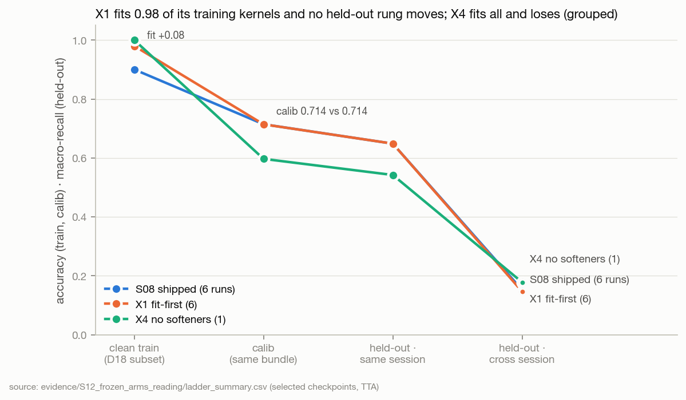
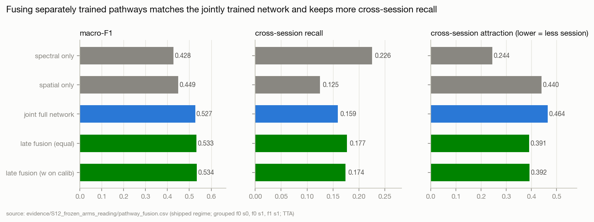
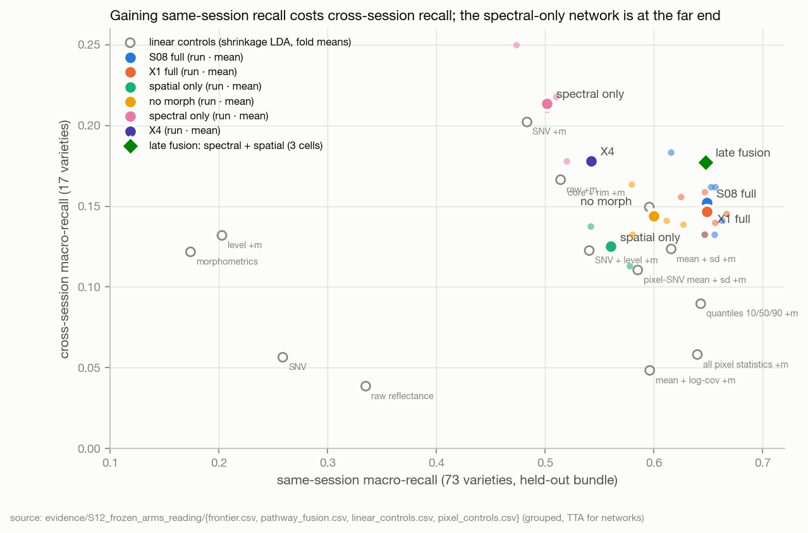
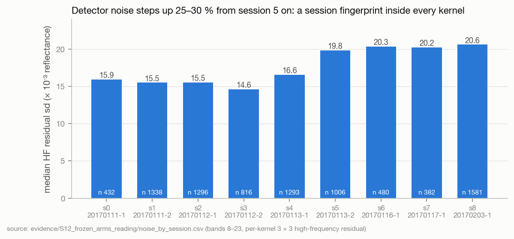
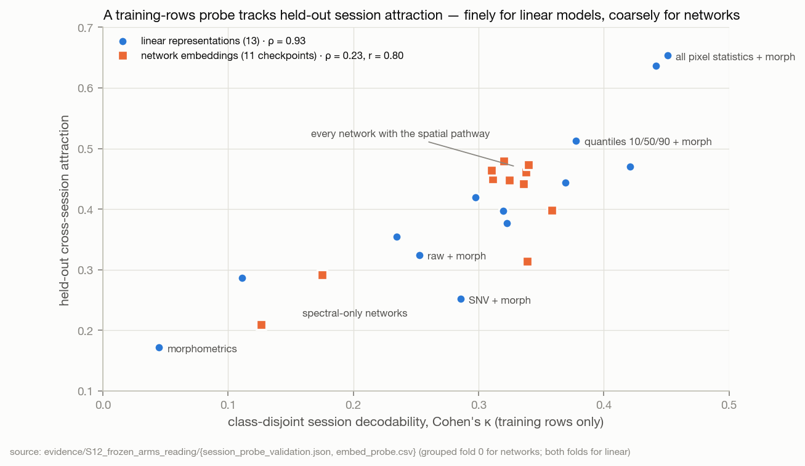

# S12 · Reading X1, X2 and X4 — the network now fits; what binds is representation under acquisition shift

| | |
|---|---|
| **Status** | complete (analysis + next-step design). **No training or model code was changed.** The next GPU round (S13) is frozen in [`preregistration_s12.json`](../../evidence/S12_frozen_arms_reading/preregistration_s12.json) (SHA-256 `88b377c5…`, full hash in the `.sha256` beside it) |
| **Dates** | 2026-10-02 |
| **Commits** | the arms ran on `413a11e` (S11) on Kaggle T4 × 2 (`run.json → run.code`; the `dirty` flag is explained in §5.1). This study's scripts, evidence, figures and page are uncommitted at the time of writing |
| **Data** | the 23 S11 cells (`outputs/experiments_u430k32/s11/{X1,X2,X4}`) and the 12 S08 reference runs; `dataset_u430k32` (refl-215 axis, uniform430 k = 32) for CPU controls and checkpoint probes; grouped folds 0, 1 and stratified |
| **Code** | [`evidence/S12_frozen_arms_reading/code/`](../../evidence/S12_frozen_arms_reading/code/) — `extract_cells.py`, `hypotheses.py`, `generalisation.py`, `pathways.py`, `session.py`, `ensembles.py`, `pixel_stats.py`, `session_probe.py`, `embed_probe.py`, `noise_channel.py`, `noise_equalisation_pretest.py`; figures `tools/build_assets.py::fig_s12` |
| **Raw outputs** | `outputs/experiments_u430k32/s11/` (the cells) · `outputs/s12_reading/` (pixel / noise feature caches) |
| **Evidence** | [`evidence/S12_frozen_arms_reading/`](../../evidence/S12_frozen_arms_reading/) |
| **Findings** | F59–F71; F46 challenged · **Decisions** D23–D27; D06, D16, D19, D22 annotated · **Hypotheses** H12a–H14b, H16 read; H17/H18 not run (D25); H19–H21 frozen |

## 1 · Question
X1 (fit-first), X2 (attribution) and X4 (fit ceiling) were frozen to decide where the next investment goes (S09 D17,
S10 D19). **Read them exactly as frozen, then establish what now limits the score and the claim, and which
architectural changes — removals, repairs, additions — the evidence and the current literature support.**

Tests H12a, H12b, H13, H14a, H14b, H16. Could reverse D05, D06, D12, D19; re-reads F32–F34, F46, F51.

## 2 · Why
S11 part 2 ran on 2026-10-02: 23 cells, 22 scored. The frozen rules turn their outcome into a route; S12 reads them,
checks that the cells are what they claim to be, and then asks *why* — because a route ("representation/data") is
not yet a design.

## 3 · Hypotheses read (as frozen; reading map S11 §6.1)

| ID | Frozen claim | Measured | Outcome |
|---|---|---|---|
| H12a | X1 stratified ≥ 0.712 + 0.05 | **0.727** (Δ +0.015, CI −0.012…+0.041) | **rejected** |
| H12b | X1 grouped ≥ 0.530 + 0.02 and Δg/Δs ≥ 0.37 | **0.531** (Δ +0.001, CI −0.010…+0.011); ratio 0.05 | **rejected** |
| H13 | X1 clean training accuracy ≥ 0.95 | **0.980** grouped / **0.992** stratified (selected checkpoint; final 0.992 / 0.998) | **supported** |
| H14a | no-morph cross-session recall ≤ 0.07 | **0.144** (full 0.152) | **rejected** |
| H14b | full − spectral-only ≤ +0.02 | **+0.099** (CI +0.087…+0.112), either definition of "full" | **rejected** |
| H16 | X4 clean fit ≥ 0.98 | **1.000** (live and EMA; stratified companion 1.000) | **supported** |

CIs: hierarchical bootstrap, 2,000 resamples, runs within fold × held-out kernels (`hypotheses.py`).

**Routes, as frozen.** S09: *H12a rejected → read X2; H14b rejected → "the representation binds" (route A): stop
capacity work; next = representation/data.* S10: *H16 supported → the architecture can fit;* *H12a rejected → X5/X6,
if run, use the shipped regime.* S12 follows both (D23) and records two deviations (D24, D25).

## 4 · Method
Partitions: train and calib for everything that motivates a design; held-out only as already scored by each cell's own
final evaluation, aggregated here (hypotheses, fusion, ensembles), plus S09-style linear diagnostic controls. No
arm, epoch, weight or threshold was selected on held-out.

1. **Integrity** (`extract_cells.py`): frozen hashes; commit; the regime *as applied* against each arm's frozen
   overrides; clip, overflow and skipped-batch telemetry; stop epochs; the unscored cell's failure traced in its logs.
2. **Frozen hypotheses** (`hypotheses.py`) with hierarchical bootstrap CIs.
3. **Generalisation ladder** (`generalisation.py`): clean train → calib → held-out same-session → cross-session per
   run; F46's slope tested against X1's intervention; S09's shortfall decomposition recomputed for X1.
4. **Pathways** (`pathways.py`): complementarity and late fusion of the X2 single-pathway networks' saved logits vs the
   jointly trained S08 network of the same fold and seed; paired kernel bootstrap.
5. **Session** (`session.py`, `pixel_stats.py`, `noise_channel.py`): linear controls on mean-spectrum, SNV, level,
   within-kernel pixel statistics and noise; the same/cross-session frontier; per-class and per-direction recall.
6. **A training-rows session probe** (`session_probe.py`, `embed_probe.py`): class-disjoint session decodability
   (GroupKFold by class, shrinkage LDA, Cohen's κ) of 16 representations and of 11 checkpoints' embeddings and pathway
   outputs (training rows only, CPU), validated against held-out attraction.
7. **Variance vs bias** (`ensembles.py`): X1 seed ensembles from logits, error sharing, calibration, per-class change.
8. **One candidate remedy pre-tested on CPU** (`noise_equalisation_pretest.py`).
9. **Literature** (§9 references): multimodal fusion, domain generalisation, calibration transfer, MIL, HSI
   foundation models, tabular foundation models, CNN-vs-linear in Vis-NIR chemometrics.

## 5 · Results

### 5.1 Integrity — the cells are what they claim, with three defects
| check | result |
|---|---|
| frozen files | both hashes match (`f896d0e5…`, `1c8ae693…`) |
| commit | all 22 scored cells `413a11e` (the S11 commit) |
| `dirty: true` (every cell) | **explained, not code drift.** `provenance.code_revision` counts untracked files; README §10 links the Kaggle dataset with `ln -sfn … dataset_u430k32`, and `.gitignore`'s `dataset_*/` matches directories only, so the symlink is untracked. Reproduced in a scratch repository: `?? dataset_u430k32` is the only porcelain line (F71b) |
| regime as applied | every cell matches its frozen overrides (`integrity.json → regime_deviations` empty); aux applied 0.648 → 0.25 (X1, X2), 0 (X4) |
| D22 reversal trigger (clip_fraction > 0.01) | **fires literally in all 9 X1 and 2 X4 cells**, but clip 50 bound on only **5–18 of 11,004–24,000 group-steps per run** (≤ 0.08 %), in epoch 1 and in epochs containing an fp16-overflow step (which GradScaler discards). The partition choice touched ≤ 18 steps per run: X1/X4 are legacy-partition results with a negligible partition effect (F71c) |
| skipped batches | 0 everywhere; 4–10 non-finite (overflow) steps per run |
| D21 guard 4 | X1 grouped f0 s1 stopped at epoch 131 (checkpoint 91); all other X1 cells ≥ 177. Without it the X1 grouped mean is 0.533 (Δ +0.003): no reading changes |
| **unscored cell** | `X2/spatial_only__f1_s0` trained 150/150 epochs but was never scored. Its best checkpoint was saved **at the final epoch**; rank 0 writes `best_stage1.pth` synchronously and non-atomically, rank 1 reloads it with no barrier and read a truncated file (`EOFError`), entered its error-path barrier, and rank 0's `gather_concat` paired its size exchange with that barrier — the size it received, `0x3F80000000000000`, is the barrier's float buffer. Deterministic whenever best epoch = last epoch (F71a). It decides nothing: spatial-only enters no frozen hypothesis, and with three runs at 0.449 a fourth would need ≥ 0.85 to reach the full network |

### 5.2 Fit is solved; generalisation did not move


| grouped, selected checkpoint (mean) | clean train | calib acc | held-out same-session recall | cross-session recall | held-out F1 (TTA) |
|---|---:|---:|---:|---:|---:|
| S08 shipped (6) | 0.900 | 0.714 | 0.648 | 0.152 | 0.530 |
| **X1 fit-first (6)** | **0.980** | **0.714** | **0.648** | **0.147** | **0.531** |
| X4 no softeners (1, f0) | 1.000 | 0.597 | 0.542 | 0.178 | 0.443 |

(`ladder_summary.csv`; stratified: S08 0.911 → 0.720 → F1 0.712; X1 0.992 → 0.723 → 0.727.)

- **The extra fit is memorisation.** X1 classifies 0.98–0.99 of its training kernels (+0.08) and the *unseen kernels of
  the same bundle* exactly as well as before (calib 0.714 vs 0.714). F46's within-regime slope (1.01, from seeds that
  happened to fit better) predicted X1 stratified 0.794; X1 delivered 0.727 — a realised slope of 0.18 stratified,
  0.01 grouped (`fit_transfer.json`). **F46 is challenged**: fit ↔ held-out was an optimisation-noise correlation,
  not a lever. Its trace: X1's stratified seed sd fell 0.033 → 0.006 once every seed fitted.
- **Capacity is ample and the softeners are load-bearing.** X4 fits 1.000 (H16) and loses −0.090 grouped (CI −0.107…
  −0.072) and −0.174 stratified against X1 (TTA; no-TTA −0.064 / −0.113 — TTA *hurts* a network never trained with
  augmentation, F61); its calib F1 peaks at epochs 36–46 and declines (`calib_saturation.csv`).
- **The remaining error is systematic.** A 3-seed X1 ensemble adds +0.013 grouped / +0.015 stratified (TTA);
  80 % of grouped errors are made by all three seeds (S09 F41 unchanged); per-class X1 − S08 has sd 0.04 with 4 classes
  beyond ±0.10 (`ensembles.csv`, `per_class_x1_vs_s08.csv`). Under shift the network is over-confident (grouped ECE
  0.15, stratified 0.04, `calibration.csv`).
- **Where the shortfall sits (X1):** 61 % of the grouped macro-recall shortfall is already lost in-distribution (S08:
  63 %); 17 % to the bundle shift, 23 % to the session shift (`decomposition_x1.json`).

### 5.3 What the network uses (X2)


| grouped, TTA (shipped regime) | F1 | Δ vs matched full | same-session | cross-session | attraction |
|---|---:|---:|---:|---:|---:|
| full, S08 matched cells | 0.530 | — | 0.645 | 0.160 | 0.467 |
| no morphometrics (4) | 0.490 | −0.040 (−0.056…−0.025) | 0.600 | 0.144 | 0.459 |
| spatial pathway only (3) | 0.449 | −0.081 (−0.094…−0.067) | 0.560 | 0.125 | 0.440 |
| **spectral pathway only (4)** | 0.431 | −0.099 (−0.112…−0.087) | 0.501 | **0.214** (+0.054, CI +0.025…+0.082) | **0.265** |

- **Morphometric scalars add same-session accuracy, not cross-session recall** (H14a rejected). The network's
  0.15 cross-session recall survives their removal; F33's "shape alone matches it" is a coincidence of size, not
  attribution.
- **The spatial (3-D CNN) pathway carries +0.10 (H14b rejected) — and the session.** Without it the network has the
  highest cross-session recall measured on this dataset (0.214) and the lowest attraction (0.265 vs 0.47).
- **The spectral pathway is a regularised linear discriminant.** Its numbers (0.431 / 0.214 / 0.265) are those of
  shrinkage LDA on SNV + morphometrics (0.416 / 0.202 / 0.252); un-shrunk LDA on the *same* 40 features trades the
  other way (0.449 / 0.073 / 0.480). Which end of the trade-off a model lands on is set by how much it trusts
  low-variance directions — where, with one session per class in training, the session lives (F66).
- **Joint training adds nothing over fusing separately trained pathways** (F65). On three matched cells, equal-weight
  late fusion of `spectral_only` and `spatial_only` scores 0.533 vs the joint network's 0.527 (+0.006, CI +0.000…
  +0.012), with cross-session recall +0.018 (+0.008…+0.028) and attraction 0.46 → 0.39. A 2-seed ensemble of *full*
  networks gains +0.009 F1 but only +0.003 cross-session and no attraction change (`ensemble_session.csv`) — the
  robustness comes from keeping the spectral pathway independent. On the cross-session kernels only the spectral
  pathway gets right, the joint network is right 27 % of the time; on those only the spatial pathway gets right, 66 %:
  **the joint network defers to its spatial pathway exactly where that pathway is session-driven.** This is the
  modality-imbalance pattern of the multimodal literature (Wang et al. 2020; Du et al. 2023).

### 5.4 The session channel, located


- **A frontier, not a ceiling.** Across 22 network runs and 12 linear controls, models that gain same-session recall
  lose cross-session recall and gain attraction (`frontier.csv`). Late fusion is the one point that sits slightly above
  the joint networks on both axes.
- **Within-kernel pixel statistics hold what the network adds — and the session.** Shrinkage LDA on per-band
  quantiles (10/50/90) + morphometrics, 104 numbers, reaches grouped **0.518** and calib 0.700 — the network's no-TTA
  0.519–0.523 and calib 0.70–0.72 (`pixel_controls.csv`). Every spread statistic raises attraction (0.44–0.65 vs 0.32
  for mean + morph). Against this linear model the network is +0.09 within acquisition but **+0.01 grouped**: its
  within-acquisition advantage does not survive a change of bundle (F67).
- **Level, again.** Adding reflectance level to a level-blind representation buys +0.02–0.04 F1 and costs 0.02–0.08
  cross-session recall and +0.05–0.13 attraction, under both LDA estimators (`linear_controls.csv`): the H18a ∧ ¬H18b
  pattern X6 was frozen to detect (F70).
- **Detector noise is one fingerprint, not the main one.**

  

  The per-kernel high-frequency residual is ≈ 0.015 in sessions 0–4 and ≈ 0.020 in sessions 5–8; it is the most
  session-decodable within-kernel statistic (κ 0.35) and its variety signal does not transfer (cross 0.039, attraction
  0.53; `noise_channel.csv`). The shipped augmentation adds noise to 3 % of kernels. But **equalising every kernel's
  noise floor removes this channel entirely (κ 0.354 → 0.005) and leaves the spread statistics' session information
  almost untouched** (κ 0.369 → 0.358, attraction 0.44 → 0.43; `noise_equalisation_pretest.csv`): the session in
  within-kernel statistics is mostly low-frequency (candidates, untested: illumination geometry, shading, tissue
  layout) (F68). Noise-floor
  equalisation is therefore not carried into S13.
- **A selection signal that never touches held-out** (F69).

  

  Class-disjoint session decodability on *training rows* ranks held-out attraction across 13 linear representations
  (Spearman 0.93, Pearson 0.88). On 11 network checkpoints it separates spectral-only networks (κ 0.13–0.18) from
  every network with the spatial pathway (κ 0.31–0.36) — Pearson 0.80 — but does not rank within the latter
  (Spearman 0.23). Inside every joint network the spatial pathway's output is 2–4× more session-decodable than the
  spectral pathway's (κ 0.26–0.32 vs 0.08–0.15; `embed_probe.csv`): the mechanistic counterpart of §5.3.
- **Who is rescued.** The spectral-only network recovers cross-session varieties the full networks never get: classes
  4 (0.38 vs 0.02), 7, 12, 59, 65, 70 — and kernels imaged in sessions 0 and 1 (0.34 / 0.17 vs 0.00 for every full
  network); it loses DT66 (78: 0.59 vs 0.91) (`cross_per_class.csv`, `cross_direction.csv`).

## 6 · Findings
Recorded in [FINDINGS](../../FINDINGS.md).

| ID | Finding | Strength |
|---|---|---|
| F59 | Fit-first (X1) fits 0.98–0.99 of training kernels but moves held-out by +0.001 grouped / +0.015 stratified (CIs span 0) | E4 |
| F60 | The extra fit is memorisation: calib accuracy unchanged (0.714 → 0.714); F46's slope fails under intervention (realised 0.18 / 0.01); stratified seed sd 0.033 → 0.006 | E4 |
| F61 | Capacity is ample (X4 fits 1.000); the softeners are worth +0.06–0.09 grouped / +0.11–0.17 stratified; TTA hurts an augmentation-free network | E3 |
| F62 | Errors stay systematic: 3-seed ensemble +0.013; 80 % of grouped errors shared; per-class change sd 0.04 | E4 |
| F63 | Morphometric scalars add same-session accuracy (−0.040 without them) but not cross-session recall (0.144 vs 0.152) | E4 |
| F64 | The spatial pathway adds +0.10 F1 and is the session channel: spectral-only cross-session recall 0.214 (+0.054), attraction 0.265 vs 0.47 | E4 / E3 |
| F65 | Joint training ≈ late fusion of separately trained pathways on F1 (+0.006 for fusion); fusion keeps more cross-session recall (+0.018) and less attraction; the joint network follows the spatial pathway on cross-session kernels | E3 |
| F66 | The spectral-only network ≈ shrinkage LDA on SNV + morph; the same/cross trade-off follows regularisation of low-variance (session) directions | E3 |
| F67 | Shrinkage LDA on within-kernel pixel quantiles + morph ≈ the network on grouped (0.518) and calib (0.70); spread statistics carry the session; network − linear: +0.09 stratified, +0.01 grouped | E3 |
| F68 | Detector noise steps +25–30 % at session 5 and is decodable, but equalising it leaves the session information in within-kernel spread intact | E4 (step) / E3 |
| F69 | A training-rows class-disjoint session κ ranks held-out attraction for linear representations (ρ 0.93) and separates spectral-only from spatial networks (r 0.80, ρ 0.23 within) | E3 |
| F70 | Reflectance level buys same-session accuracy at the price of cross-session robustness (linear, both estimators) | E3 |
| F71 | Infrastructure: final-epoch checkpoint race (cell unscored); `dirty` = dataset symlink; clip 50 bound ≤ 18 steps per run | E4 |

## 7 · Decision — what the evidence says the next bottleneck is

| evidence status | the score (grouped F1) | the claim (cross-session) |
|---|---|---|
| **demonstrated** | Not fit (H13, H16), not capacity (H16), not the regime (H12a/b): fitting 0.98 instead of 0.90 changed no held-out rung. The network is at the level of a linear model on kernel-level statistics on grouped (F67). Errors are systematic (F62). | The spatial pathway is the session channel (F64, F69 mechanism); spectral-only gets the highest cross-session recall measured (0.214). Morph scalars do not carry it (H14a). |
| **strongly suggested** | What the network adds over linear models is acquisition-specific: +0.09 within acquisition, +0.01 across bundles (F67); 61 % of the grouped shortfall is in-distribution, where calib saturates at ≈ 0.71 for every regime. | Same- and cross-session recall trade off along a frontier set by how much a model trusts low-variance directions (F66); within-kernel spread is session-laden beyond the noise floor (F68). With one session per class in training, no supervised objective can separate session from variety (identifiability). |
| **plausible** | Representation changes that add *transferable* information — high-resolution shape (RGB), more bands (215: +0.04 for LDA, C3), within-kernel structure modelled per pixel — can move grouped; architecture changes that only re-arrange existing information cannot do much beyond the ≈ +0.01–0.02 seen for fusion and ensembles. | Decoupling the pathways (F65) or randomising early feature statistics can move a model *along* the frontier toward cross-session robustness; moving *off* it needs external information (transfer standards, a second acquisition per class, RGB shape). |
| **unknown** | Whether a per-pixel set model extracts the within-kernel information with less session than the 3-D CNN; whether a tabular foundation model beats the network on kernel summaries. | Whether any representation exceeds ≈ 0.25 cross-session recall without new data. |

**Verdict.** The bottleneck has moved from **optimisation** to **representation under acquisition shift**. The network
fits everything it is shown and generalises within an acquisition exactly as far as before; its advantage over a
linear model on kernel statistics is real inside an acquisition and vanishes across bundles; and the component that
supplies most of that advantage — the 3-D spatial pathway — is also the one that encodes the session. Route A (D23):
no further capacity or regime work; next = representation (session-robust, sample-efficient) and data/protocol.

## 8 · Architecture — what to keep, remove, repair and add

| component | evidence | verdict | where it is tested |
|---|---|---|---|
| ArcFace margin (m = 0.30) | m = 0 is non-inferior (X1); S10 F47 | **remove** (cosine/NormFace head stays) | adopted with R1 (D24) |
| Fit-first schedule (R1) | held-out equal, stratified seed sd ÷ 6, honest loss | **adopt as the reference regime** | D24 |
| Mixup, label smoothing, dropout, augmentation | X4: worth +0.06–0.17 | **keep** (load-bearing) | — |
| Index bank, continuum depths, D₁/D₂ | inert (F49); spectral pathway ≈ shrinkage LDA on SNV + morph (F66) | **remove** | Y3 (non-inferiority) |
| Last tail block stride 2 (327,680 dead parameters) | F48; capacity ample (H16) so a correctness fix, not a gain | **repair** ([2,2,2,1]) | Y3 |
| CBAM on 2 × 2 maps | 40 of 49 taps on padding (S10 B8) | **remove** | Y3 |
| Morphometric scalars | −0.040 F1 without them; session-invariant (κ 0.045) | **keep** | — |
| Spatial 3-D pathway | +0.10 F1, but the session channel (F64) | **keep, but decouple and regularise its statistics** | Y1, Y2 |
| Joint concat fusion | no better than late fusion; defers to the session-driven pathway (F65) | **replace by decoupled pathways + calib-weighted late fusion, if Y1 confirms** | Y1 (H19) |
| Reflectance-level block (X6) | the linear analogue shows the H18a ∧ ¬H18b pattern (F70) | **do not add now** (D25) | deferred |
| Noise-floor equalisation | removes the noise channel only (F68) | **not pursued** | — |
| Masked MixStyle in the 3-D stem | instance feature statistics carry acquisition "style" (Zhou et al. 2021; Li et al. 2022); here the session is in within-kernel statistics (F67–F69) | **add as a test** | Y2 (H20) |
| Per-pixel set (MIL) spectral encoder | within-kernel statistics are linearly worth +0.08 over the mean (F67); pixel-wise seed models with voting are standard (Zhu et al. 2019; Zhou et al. 2021) | **CPU-first**, gated on calib | FW-27 |
| Session-adversarial heads, GroupDRO, DFR | need session to vary *within* class in training; under grouped it never does | **rejected** for grouped training | — |
| HSI foundation-model encoders | cross-domain transfer to proximal sensing helps in small data (Theisen & Neubert 2026), but those are remote-sensing scenes, other sensors | **later**, after the representation questions | FW-30 |
| Seed ensembles + TTA | +0.013 and +0.007–0.010; systematic errors remain | **report separately** (deployment lever, not a model result) | — |

## 9 · The next study (S13) — frozen
`evidence/S12_frozen_arms_reading/preregistration_s12.json`, SHA-256
`88b377c5bc32f31a9ccb95356a88eb0be35e8cb51216b035c88f1761919ae7f4`, frozen before any of its arms or code exist.
Reference = X1 (R1), grouped 0.531 (σ 0.0099), cross 0.147 (σ 0.0098), attraction 0.464 (σ 0.020), stratified 0.727.

| arm | change | runs | hypothesis | adopt if |
|---|---|---|---|---|
| **Y1** decoupled pathways | spectral-only + spatial-only under R1, log-prob fusion, weight on calib | 12 | H19a F1 ≥ 0.511; H19b cross ≥ 0.167 ∧ attraction ≤ 0.424 | H19a ∧ H19b |
| **Y2** masked MixStyle | per-(channel, spectral slice) foreground statistics mixed in stem blocks 1–2, p 0.5, Beta(0.1, 0.1) | 6 | H20 cross ≥ 0.167 ∧ same-session ≥ 0.629 | H20 |
| **Y3** lean architecture | descriptor = SNV + morph; tail [2,2,2,1]; no CBAM on ≤ 2 × 2 | 9 | H21a grouped ≥ 0.511; H21b stratified ≥ 0.709 | H21a ∧ H21b |
| **Y4** 80/20 tier | S09 X3 under R1 | 3 | H15 (S09, unchanged) | — |

> **Amended 2026-10-02, before any S13 arm ran (D28):** S13 runs every cell at seed 0 only — 10 GPU runs ≈ 4.4 h, one
> session — as a screening study; `evidence/S13_representation_screening/preregistration_s13.json`; see
> [S13](../S13_representation_screening/README.md). This file and its hash are unchanged.

30 runs ≈ 12.5 GPU-pair-hours (two Kaggle sessions). **P0 first** (code, not model): the checkpoint race fix with a
2-rank regression test, `.gitignore` for the dataset link, a late-fusion scorer, the session κ in the final report,
and re-scoring `spatial_only f1 s0`. Then Y1 + Y4 (no model code), Y3 (config keys, default bit-identical, G-neutral
gate), Y2 (one module).

**CPU-first track (FUTURE_WORK FW-27…FW-30).** A pixel-set spectral encoder (DeepSets / attention-MIL, Ilse et al. 2018)
trained on CPU and gated on calib (≥ quantile-LDA + 0.03, with the κ guard); TabPFN-3 on kernel summaries as the
paper's strongest tabular baseline; a transfer-standard protocol tier (EPO-style nuisance projection estimated from
paired varieties, cross-fitted by variety; needs a D16 extension); RGB morphology (FW-18; needs the raw archive —
not on disk).

**What S13 can and cannot deliver.** Its arms move the model along the same/cross frontier and remove what does not
work; on S12's evidence none is expected to lift grouped F1 by more than ≈ 0.02. The levers with that kind of
headroom are new information — RGB shape (prior work's main ingredient, F43), the 215-band cube (+0.04 for LDA), and
acquisition design (FW-12).

## 10 · Threats to validity
1. **Small n.** 4–6 runs per arm; the X4 conclusions rest on one seed per protocol; X2's spatial-only arm has 3 runs.
2. **The fusion and linear analyses are post-hoc on held-out predictions that already existed.** No weight or
   threshold was chosen on them (equal weight; calib-chosen weight), but they were not pre-registered: E3, and the
   reason Y1 re-tests fusion under its own frozen file.
3. **The session probe is validated on 13 linear representations and 11 checkpoints of one fold.** For networks it is
   a coarse guard (ρ 0.23 within spatial-pathway networks), not a ranking tool.
4. **"Session" and "variety group" are partly confounded** in the probe: if varieties imaged together are related, a
   class-disjoint session decoder can exploit relatedness. Held-out attraction (cross-session kernels) does not share
   this ambiguity; the probe's validity rests on its agreement with it.
5. **The noise/low-frequency split is an operational filter** (3 × 3 box residual), not a physical noise model.
6. **H14b's "full" was not fixed before X2 was read** (S11 risk 6). Both definitions are reported; they agree to 10⁻⁴.
7. **Linear controls are proxies** for what a network would do (S05 F17 showed proxies can mis-rank); they motivate
   arms, they decide nothing about the network.
8. **k = 32 only.** Every network number is on one band budget (D15).

## 11 · What would change these conclusions
- Y1 fused cross-session recall ≤ the joint network's under R1 → F65 was regime-specific; decoupling is not a
  robustness lever.
- A pixel-set encoder (FW-27) that beats quantile-LDA on calib by ≥ 0.03 *and* has spectral-pathway-level κ → the
  within-kernel information can be had without the session; the spatial pathway's role is re-opened.
- Any representation with cross-session recall ≥ 0.25 and same-session ≥ 0.60 → the frontier is not fixed by the
  data; D23's "move off it needs new data" is wrong.
- TabPFN-3 on kernel summaries ≥ the network on grouped → the paper's network must beat a tabular foundation model,
  not LDA, and the architecture story changes.

## 12 · Reproduce
From the repository root (CPU; needs `outputs/experiments_u430k32/{s11,protocol}/`, `dataset_u430k32/`,
`outputs/s09_forensics/mean_k32.npy`):
```bash
E=docs/research/evidence/S12_frozen_arms_reading/code
python $E/extract_cells.py                 # seconds — cells.csv, curves.csv, integrity.json
python $E/hypotheses.py                    # ≈ 10 s — arm_summary.csv, hypotheses.json
python $E/generalisation.py                # seconds — ladder*, fit_transfer, calib_saturation, decomposition_x1
python $E/session.py                       # seconds — linear_controls, frontier, cross_per_class, cross_direction
python $E/pixel_stats.py                   # ≈ 20 s (reads the 2.3 GB cube once) — pixel_controls
python $E/session_probe.py                 # ≈ 5 s — session_probe*, needs pixel_stats first
python $E/pathways.py                      # seconds — pathway_fusion*, pathway_complementarity
python $E/ensembles.py                     # seconds — ensembles, ensemble_session, calibration, per_class_x1_vs_s08
python $E/noise_channel.py                 # ≈ 20 s — noise_channel, noise_by_session
python $E/noise_equalisation_pretest.py    # ≈ 75 s — noise_equalisation_pretest
python $E/embed_probe.py                   # ≈ 8 min (11 checkpoints, training rows only) — embed_probe*
python docs/research/tools/build_assets.py --figures
```

## 13 · Provenance
Cells: `outputs/experiments_u430k32/s11/{X1,X2,X4}/<variant>__f<fold>_s<seed>/` (`results/run.json`, logits,
predictions, `clean_fit.json`, `metrics.jsonl`, `frozen_cell.json`, `sweep.log`); reference:
`outputs/experiments_u430k32/protocol/`. Checkpoints (`best_stage1.pth`, 23–69 MB) stay in `outputs/`. Feature caches
`outputs/s12_reading/{pixel,noise}_features.npz` are regenerated by the scripts. Every table on this page is a file in
the evidence folder; every figure names its source.

## References (grounding for §8–§9)
- Wang, Tran, Feiszli. *What makes training multi-modal classification networks hard?* CVPR 2020. [arXiv:1905.12681](https://arxiv.org/abs/1905.12681)
- Peng et al. *Balanced multimodal learning via on-the-fly gradient modulation.* CVPR 2022. [arXiv:2203.15332](https://arxiv.org/pdf/2203.15332)
- Du et al. *On uni-modal feature learning in supervised multi-modal learning.* ICML 2023. [arXiv:2305.01233](https://arxiv.org/abs/2305.01233)
- Zhou et al. *Domain generalization with MixStyle.* ICLR 2021. [arXiv:2104.02008](https://arxiv.org/abs/2104.02008)
- Li et al. *Uncertainty modeling for out-of-distribution generalization (DSU).* ICLR 2022. [arXiv:2202.03958](https://arxiv.org/abs/2202.03958)
- Chen et al. *Spectral property-driven data augmentation for hyperspectral single-source domain generalization.* 2026. [arXiv:2603.16662](https://arxiv.org/pdf/2603.16662)
- Ilse, Tomczak, Welling. *Attention-based deep multiple instance learning.* ICML 2018. [arXiv:1802.04712](https://arxiv.org/abs/1802.04712)
- Zhu et al. *Identification of soybean varieties using hyperspectral imaging coupled with CNN* (pixel-wise vs object-wise, majority vote). Sensors 2019. [doi:10.3390/s19194065](https://doi.org/10.3390/s19194065)
- Zhou et al. *Identification of the variety of maize seeds based on hyperspectral images coupled with CNNs and subregional voting.* JSFA 2021. [PubMed 33452811](https://pubmed.ncbi.nlm.nih.gov/33452811/)
- Roger, Chauchard, Bellon-Maurel. *EPO–PLS external parameter orthogonalisation.* Chemom. Intell. Lab. Syst. 2003. [ScienceDirect](https://www.sciencedirect.com/science/article/abs/pii/S0169743903000510)
- Mishra, Passos et al. *Deep learning for near-infrared spectral data modelling: hypes and benefits.* TrAC 2022. [doi:10.1016/j.trac.2022.116804](https://doi.org/10.1016/j.trac.2022.116804)
- Passos. *Convolutional neural networks in Vis-NIR chemometrics: from contradiction to conditional design.* 2026. [arXiv:2605.02636](https://arxiv.org/abs/2605.02636) — validation design as a hidden hyperparameter; random splits reward batch/instrument structure
- Theisen, Neubert. *Cross-domain transfer of hyperspectral foundation models.* ICPR 2026. [arXiv:2604.26478](https://arxiv.org/abs/2604.26478)
- Grinsztajn et al. *TabPFN-3: technical report.* 2026. [arXiv:2605.13986](https://arxiv.org/abs/2605.13986); *A closer look at TabPFN v2* (10-class limit, ECOC-style extension), 2025. [arXiv:2502.17361](https://arxiv.org/abs/2502.17361)
- Fabiyi et al. *Varietal classification of rice seeds using RGB and hyperspectral images.* IEEE Access 2020. [Strathclyde](https://pureportal.strath.ac.uk/en/publications/varietal-classification-of-rice-seeds-using-rgb-and-hyperspectral/)
