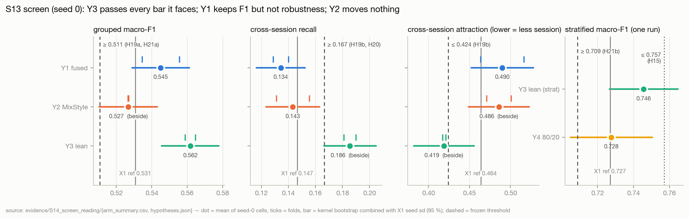
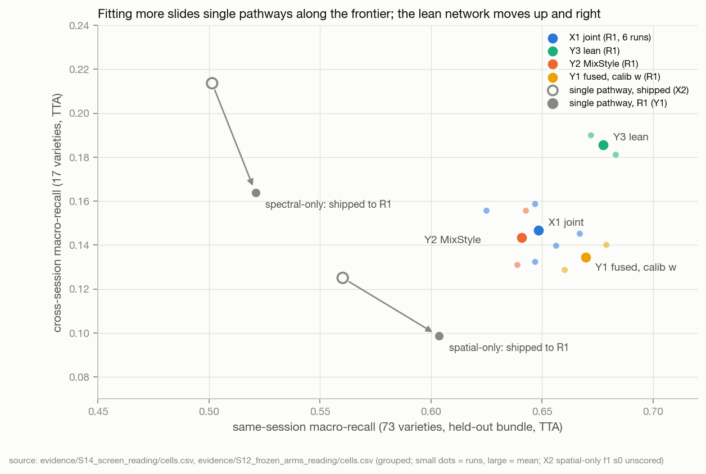
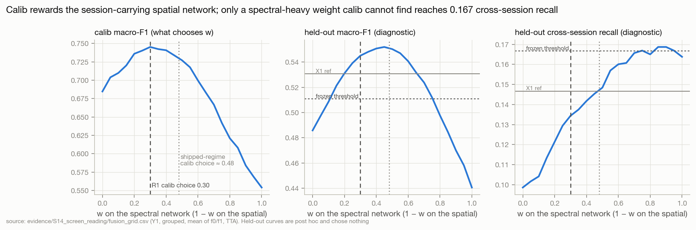

# S14 · Reading the S13 screen — the lean network passes; decoupling and style mixing buy no robustness under R1

| | |
|---|---|
| **Status** | complete (analysis + next-round design). **No training or model code was changed.** The next GPU round (S15: Y3 replication + dissection) is frozen in [`preregistration_s14.json`](../../evidence/S14_screen_reading/preregistration_s14.json) (SHA-256 `9e182670…`, full hash in the `.sha256` beside it) |
| **Dates** | 2026-10-03 |
| **Commits** | the cells ran on `aed5257` (S13) on Kaggle T4 × 2, 2026-10-03 05:04–09:40 UTC (`run.json → run.code`, `dirty: false` everywhere). This study's scripts, evidence, figures and page are uncommitted at the time of writing |
| **Data** | the 10 S13 GPU cells and 2 fused cells (`outputs/experiments_u430k32/s13/`); the S11 X1/X2 cells as references; `dataset_u430k32` (refl-215 axis, uniform430 k = 32) for training-rows κ only; grouped folds 0, 1 and stratified |
| **Code** | [`evidence/S14_screen_reading/code/`](../../evidence/S14_screen_reading/code/) — `s14common.py`, `extract_cells.py`, `hypotheses.py`, `session_kappa.py`, `pathways_regime.py`, `lean.py`; figures `tools/build_assets.py::fig_s14` |
| **Raw outputs** | `outputs/experiments_u430k32/s13/` (the cells) · `outputs/experiments_u430k32/s11/` (references) |
| **Evidence** | [`evidence/S14_screen_reading/`](../../evidence/S14_screen_reading/) |
| **Findings** | F73–F81; F65 challenged; F67, F69 annotated · **Decisions** D30–D33; D24 under review; D26 annotated · **Hypotheses** H19a–H21b, H15 read as screening verdicts; H21c–H21e, H22a, H22b frozen |

## 1 · Question
**Read the S13 screen exactly as frozen (S13 §9, D28's screening semantics), check that the cells are what they claim,
explain each verdict, and decide what deserves confirmatory compute.**

Tests H19a, H19b, H20, H21a, H21b, H15. Could reverse D24 (R1 as reference), D26 (κ as a guard), F65 (late fusion is
more robust), F67 (the network ≈ a linear model across bundles).

## 2 · Why
S13 part 2 ran in one Kaggle session on 2026-10-03: 10 GPU cells (4.6 h; estimate 4.4 h, cap 4.8 h) and Y1's two fused
cells, all scored. The frozen rule turns them into verdicts; S14 reads them and asks *why* each arm landed where it did,
because the next round depends on the mechanism, not only on pass/fail.

## 3 · Hypotheses read (as frozen; screening verdicts, D28)

| ID | Frozen claim | Measured (seed 0) | Screen interval (95 %) | Outcome | Frozen route |
|---|---|---|---|---|---|
| H19a | Y1 fused grouped F1 ≥ 0.5108 | **0.545** (folds 0.556 / 0.535) | 0.529…0.561 | **supported** (clear) | — |
| H19b | Y1 fused cross ≥ 0.1666 **and** attraction ≤ 0.4240 | cross **0.134**, attraction **0.490** | 0.116…0.153 · 0.453…0.528 | **rejected** (clear) | H19a ∧ ¬H19b → **no adoption; joint network stays** |
| H20 | Y2 cross ≥ 0.1666 **and** same ≥ 0.6285 | cross **0.143**, same 0.641 | 0.123…0.163 · 0.619…0.663 | **rejected** (cross clear) | not a frontier move → **instance statistics not separable into session and variety here** |
| H21a | Y3 grouped F1 ≥ 0.5108 | **0.562** (0.565 / 0.559) | 0.546…0.578 | **supported** (clear) | with H21b → **passes the screen** → replicate (FW-35) |
| H21b | Y3 stratified F1 ≥ 0.7090 | **0.746** (one run) | 0.727…0.765 | **supported** (clear) | |
| H15 | Y4 (80/20) − 0.727 ≤ +0.03 | **+0.001** (0.728) | −0.022…+0.024 | **supported** (clear) | the D16 tier-1 number (no adoption attached) |

*Screen interval* = kernel bootstrap (2,000 draws, within fold) combined with X1's measured run-level sd under R1 divided by
√n runs — the uncertainty a one-seed estimate carries (`hypotheses.py`). *Clear* = the interval does not cross the
threshold. D28's reversal check (an arm's two folds straddling its threshold) fires for no arm: every per-fold value is
on the same side of its threshold as the mean (`hypotheses.json → decision_routes`).

## 4 · Method
Held-out rows were scored once by each cell's own final evaluation; S14 aggregates them and selects nothing on them.

1. **Integrity** (`extract_cells.py`): both frozen hashes; commit and dirty flag; the regime *as applied* against R1 and
   each arm's intent stated independently of the runner; the guards (clip fraction, stop epoch); cross-session attraction
   re-derived from the saved predictions; the P0.3 re-score; wall clock.
2. **Frozen hypotheses** (`hypotheses.py`) with kernel-bootstrap and screen intervals; fold- and seed-matched deltas against
   X1 seed 0 on the same held-out kernels (reported beside, decide nothing).
3. **Session κ** (`session_kappa.py`): the in-pipeline probe (P0.5) validated against S12's offline probe; the fold-1
   references S12 lacked computed on training rows (X1 f1 s0; X2 spectral/spatial f1 s0 — the latter was never scored on
   held-out, but κ needs none); D26's trigger checked.
4. **Pathways × regime** (`pathways_regime.py`): Y1 (R1) against X2 (shipped) cell by cell; joint vs fused under both
   regimes; the calib curve that chose Y1's weight; a held-out weight grid as a **post-hoc diagnostic that chooses
   nothing**; complementarity on cross-session kernels.
5. **Lean network** (`lean.py`): rank among X1 runs, generalisation ladder, per-class and per-session change, error
   overlap, pathway influence and κ, held-out calibration (ECE).

## 5 · Results

### 5.1 Integrity — the cells are what they claim
| check | result |
|---|---|
| frozen files | `88b377c5…` (S12) and `ef598213…` (S13) verify |
| commit / dirty | all 12 cells `aed5257`, `dirty: false` — **P0.2 works**: the dataset symlink no longer marks runs dirty (F71b closed) |
| regime as applied | 0 deviations from R1 + each arm's intent (pathways, descriptor, tail, CBAM, MixStyle, eval fraction) |
| scored | 10/10 GPU + 2/2 fused; every held-out kernel once (4,311 / 4,309 grouped, 2,588 stratified, 1,725 for 80/20). No cell had its best epoch last, so the race fix (F72) was not exercised here |
| clip guard (> 0.01 outside epoch 1 and overflow epochs) | fires literally in Y1 spatial-only f0 (10 epochs), f1 (5), Y2 f0 (1) — each one or two **clipped group-steps** in an epoch (of 84); 3–22 clipped group-steps per run, ≤ 0.15 % of all. Negligible, as F71c |
| stop epoch < 160 | none (stops 176–200; best epochs 136–184) |
| skipped batches / non-finite steps | 0 / 4–9 per run (fp16 overflow, discarded by GradScaler) |
| attraction | re-derived from saved predictions = `run.json` for all 8 grouped cells |
| `torch.compile` | auto-disabled on T4 (sm_75) in every cell, as in S11 — S13 risk 5 (Y2 compile on CUDA) did not arise |
| in-pipeline κ vs S12's offline probe | |Δκ| 0.001–0.021 on 5 representations of 2 checkpoints (`session_kappa_validation.json`) |
| **P0.3 re-score of `X2/spatial_only__f1_s0`** | **not done** — the S11 output was not attached to the session; S13 §8's guard skipped it. It decides nothing; its training-rows κ is now computed (§5.6) |
| wall clock | 274 min of training (estimate 266, cap 287) |

### 5.2 The screen


Every S13 cell against its fold- and seed-matched X1 cell (same held-out kernels; kernel-bootstrap 95 % CI; `arm_summary.csv`,
`matched_deltas.csv`):

| arm (seed 0, 2 folds) | Δ F1 | Δ same-session | Δ cross-session | Δ attraction | κ embedding (X1: 0.336 / 0.358) |
|---|---:|---:|---:|---:|---:|
| **Y3 lean** | **+0.026** (+0.018…+0.035) | +0.026 | **+0.036** (+0.024…+0.050) | **−0.038** (−0.057…−0.020) | 0.372 / 0.334 |
| Y1 fused (calib w = 0.30) | +0.010 (+0.002…+0.018) | +0.018 | −0.015 (−0.028…−0.001) | +0.033 (+0.015…+0.052) | — |
| Y2 MixStyle | −0.009 (−0.016…−0.001) | −0.011 | −0.006 (−0.019…+0.006) | +0.029 (+0.011…+0.049) | 0.351 / 0.320 |
| Y1 spectral-only | −0.095 | −0.131 | +0.015 (−0.002…+0.031) | −0.147 | 0.190 / 0.200 |
| Y1 spatial-only | −0.050 | −0.048 | −0.051 | +0.062 | 0.363 / 0.370 |
| Y3 lean, stratified (1 run) | +0.022 (+0.008…+0.036) | | | | 0.337 |

These CIs carry test-set sampling only; a single run also carries seed variance (X1 sd 0.0099 grouped), which §3's
screen intervals add.

### 5.3 Y3 — a real, broad gain, off the S12 frontier; attribution unknown
- **Larger than the seed spread.** Y3 beats every X1 run of its fold/protocol in all three cells — grouped f0 0.565 vs
  X1 {0.535, 0.518, 0.546}; f1 0.559 vs {0.535, 0.526, 0.524}; stratified 0.746 vs {0.724, 0.734, 0.724} — and does so on
  same- and cross-session recall too (8/8 comparisons; `lean_rank.csv`). If Y3 were a draw from X1's distribution, each
  cell would do this with probability 1/4; all three, 1/64 ≈ 0.016. z against X1's sd: +3.2, +3.1, +3.2. The S13
  environment does not inflate scores: Y2 (X1's network plus MixStyle, same session) lands at or below X1's level.
- **It moves off the frontier S12 drew.** Same-session +0.026 and cross-session +0.036 together, attraction −0.038
  (0.419, below H19b's 0.424 bar, which Y3 was not tested against). In S12 every network and linear control that gained
  one lost the other (F66, `frontier.csv`); Y3 gains both (figure below).
- **Gains are broad.** Per-class recall: 7 classes up by > 0.10, 1 down, mean +0.026 same-session / +0.036 cross-session
  classes (`lean_per_class.csv`). Cross-session rescue is concentrated in sessions 8 (0.25 → 0.29, 0.23 → 0.32) and 2
  (0.23 → 0.31) — kernels imaged in sessions 0, 1, 3, 4, 7 stay at ≈ 0, as for every joint network; only the
  spectral-only network ever reached sessions 0/1 (F64).
- **In-distribution too, but less.** Clean fit 0.999 (X1 0.98), calib F1 +0.014 / +0.013, held-out +0.029 / +0.024:
  the gain grows with distance from the training bundle — the opposite of X1's memorisation pattern (F60).
- **A different solution, not a better copy.** Error-set Jaccard Y3 vs X1 seeds 0.70–0.73; X1 seed vs seed 0.75–0.78
  (`lean_errors.csv`). Held-out over-confidence falls: ECE 0.098 / 0.111 vs 0.124 / 0.151 grouped, 0.019 vs 0.032
  stratified (`lean.json`).
- **How it uses its pathways.** Y3 leans *more* on the spatial pathway (leave-one-out KL influence 75 % / 74 % vs X1's
  62 % / 64 %), and its spectral output is half as session-decodable (κ 0.075 / 0.063 vs 0.133 / 0.131); spatial-output κ
  is unchanged or higher (0.361 / 0.347 vs 0.317 / 0.334). So the robustness gain is not "more spectral reliance".
- **What carried it is not identifiable from these cells.** Y3 changed three things at once — the chemometric descriptor
  blocks (inert by F49, ≈ 1 % amplitude), the 1 × 1 tail end (F48: 327,680 parameters that never trained; the last map is
  now 2 × 2, so mean- and max-pooling differ), and a CBAM on a 2 × 2 map. Plausible: the spatial repair (the influence shift
  points there); also plausible: the descriptor (the spectral output's κ halves). The dissection (Y5, §9) decides it.

### 5.4 Y1 — decoupling bought robustness only because the shipped regime under-fitted


- **The single pathways moved along the frontier, not the fusion.** Seed- and fold-matched, R1 vs the shipped regime
  (`pathway_regime.csv`): the spectral-only network fits 0.96 / 0.94 of its training kernels instead of 0.75 / 0.74 and
  loses cross-session recall (0.218 → 0.181, 0.178 → 0.147; means 0.214 → 0.164) for +0.006 / −0.002 F1; the spatial-only
  network gains +0.056 F1, all of it same-session, and loses 0.042 cross-session recall with attraction 0.40 → 0.53. The
  joint network, by contrast, did not move between regimes (F59). S12's spectral-only 0.214 — "the best cross-session
  recall measured" — was partly a product of under-fitting, which acted like shrinkage (F66).
- **Calib picks the session-carrying pathway.** The fusion weight on calib peaks at w = 0.30 on the spectral network
  in both folds (the shipped-regime cells chose 0.35–0.55, mean 0.48): under R1 the spatial network got stronger on calib
  (0.60 → 0.67 F1) far more than the spectral one (0.52 → 0.55). Calib shares its bundle's session with the training
  rows, so any calib-driven choice rewards session-aligned evidence — the identifiability problem of S12 §7, now in a
  selection step.

  

- **No weight calib could find would have passed.** As a post-hoc diagnostic that chooses nothing (`fusion_grid.csv`):
  along the frozen grid, held-out cross-session recall rises monotonically with the spectral weight and first reaches
  0.1666 at w = 0.75, where F1 is 0.512 and attraction 0.390 — the single grid point meeting all three H19 bars, the first two by ≤ 0.0012. Equal weight
  (0.5) gives F1 0.550, cross 0.148, attraction 0.463: X1's robustness, not better.
- **Joint vs fused flips with the regime.** Shipped (S12, 3 cells): fusion cross-session +0.018 over the joint network,
  attraction −0.07. R1 (2 cells): −0.015 (CI −0.028…−0.001), attraction +0.033. F1 ranks the same under both (fusion
  +0.006 / +0.010, an ensemble-of-two effect). On cross-session kernels only the spectral network gets right (10–13 % of
  them), the fused model is right 24–28 % of the time and the joint X1 network 37 % (`complementarity_r1.csv`): at
  w = 0.30 the fusion defers to the spatial pathway *more* than the joint network does.

### 5.5 Y2 — masked MixStyle moved nothing it was meant to move
Cross-session −0.006, same-session −0.011, attraction +0.029, F1 −0.009 against X1 seed 0. The spatial pathway's session
κ is unchanged (0.313 / 0.321 vs 0.317 / 0.334), but its influence drops from 62–64 % to 42–44 % and calib F1 falls
(0.662 / 0.701 vs 0.698 / 0.724): mixing per-channel foreground moments makes the spatial features *less useful* without
making them *less session-laden*. That is what S12 F68 predicted — the session in within-kernel statistics is mostly
low-frequency spatial structure, not per-channel first and second moments — and it is the frozen rule's "not separable
here" (plausible mechanism, E3).

### 5.6 The training-rows κ: valid, but blind among spatial networks
The in-pipeline probe reproduces S12's offline probe (|Δκ| ≤ 0.021). Two seeds of the same arm differ by up to 0.049
(S12 `embed_probe.csv`) — the size of D26's example guard (0.05). Across 21 grouped networks κ still separates
spectral-only from spatial-pathway networks (Pearson 0.84 with attraction), but among the 16 with a spatial pathway it
does not rank attraction at all (Spearman 0.05, Pearson 0.04; S12 had 0.23 on 9). Y3 f0 raised κ (+0.036) while lowering
attraction (−0.025): opposite directions, each within its noise, so D26's trigger does not fire — but κ could not have
seen Y3's gain (`session_kappa_validation.json`).

### 5.7 Y4 — the within-acquisition tier
80/20 stratified, one seed: macro-F1 0.728, accuracy 0.730 (1,725 held-out kernels; 5,864 training) — the 70/30
stratified X1 level (0.727). H15 supported: 14 % more training kernels from the same acquisitions add nothing. The
D16 tier-1 number is therefore ≈ 0.73 for the X1 architecture (Y3's stratified 0.746 is the better within-acquisition
model, on 70/30); literature figures of ≥ 92 % accuracy are not approached by any honest split here (F43).

## 6 · Findings
Recorded in [FINDINGS](../../FINDINGS.md). Strength "E3 (screen)" = pre-registered, held-out, 2 folds, one seed (D28).

| ID | Finding | Strength |
|---|---|---|
| F73 | The S13 cells are clean: 12/12 scored on `aed5257` with `dirty: false`, no regime deviation, guards fire only on single clipped steps; the in-pipeline κ reproduces the offline probe; P0.3 not done | E4 |
| F74 | Y3 (lean) passes its screen and beats X1 beyond seed spread: grouped 0.562 (+0.026 matched), stratified 0.746 (+0.022), above every X1 run in all 3 cells (p = 1/64) | E3 (screen) |
| F75 | Y3's gain is broad and off the S12 frontier — same +0.026, cross +0.036, attraction −0.038, ECE down — grows from calib to held-out, and comes with more spatial reliance and a less session-laden spectral output; which removal carries it is unknown | E3 (screen) |
| F76 | Y1 under R1: decoupled fusion keeps F1 (0.545, H19a) but not robustness (cross 0.134, attraction 0.490; H19b rejected); equal weight gives X1's robustness, not more | E3 (screen) |
| F77 | R1 moves single-pathway networks along the frontier: spectral-only fit 0.75 → 0.95 and cross 0.214 → 0.164; spatial-only +0.05 F1 (same-session), −0.04 cross, attraction +0.13; the joint network does not move (F59) | E3 |
| F78 | Calib-driven fusion favours the session-carrying pathway (w 0.30 under R1 vs ≈ 0.48 shipped); only w ≈ 0.75, which calib ranks low, meets the H19 bars, by ≤ 0.001 | E3 (post hoc) |
| F79 | Masked MixStyle lowers the spatial pathway's usefulness (influence 62 → 43 %, calib −0.03) without lowering its session content (κ unchanged): H20 rejected, no frontier move | E3 (screen) |
| F80 | The 80/20 tier equals the 70/30 stratified level (0.728 vs 0.727; H15 supported): more same-acquisition training data adds nothing | E3 (screen) |
| F81 | The training-rows κ is reproducible (|Δ| ≤ 0.02) but has seed noise ≈ 0.05 and no ranking power among spatial-pathway networks (ρ 0.05, n 16) | E3 |

**Status changes.** F65 → *challenged*: its robustness advantage is regime-specific (F77, F78). F67 annotated: the
network − quantile-LDA gap is +0.01 grouped for X1 but +0.033 (no-TTA) for Y3 — architecture can still add transferable
power. F69 annotated by F81.

## 7 · Decisions
- **[D30](../../DECISIONS.md) · The S13 screen, read as frozen.** Y3 passes → replicated (S15) and is the provisional base
  of later *screening* arms; it is not SeedNet v5 or a paper claim yet. Y1 and Y2 are screening rejections (not
  replicated). Y4's 0.728 is the provisional tier-1 number for the X1 architecture. The joint network stays.
- **[D31](../../DECISIONS.md) · D24's trigger fired on the cross-session axis; R1 stays the reference regime.** Fusion vs
  joint ranks differently on cross-session recall under the two regimes (F77, F78) but the same on F1; Y3's gain is
  under R1. Any session-robustness claim names its regime; D24 → *active — under review*.
- **[D32](../../DECISIONS.md) · The κ probe is reported, not used to select among spatial-pathway networks** (D26
  annotated; F81). It remains a coarse guard against large moves toward the session (≥ 0.1).
- **[D33](../../DECISIONS.md) · S15 is frozen: Y3 replication + dissection, one Kaggle session.** §9.

## 8 · Where this leaves the project

| evidence status | the score (grouped F1) | the claim (cross-session) |
|---|---|---|
| **demonstrated** (this round) | A pure removal/repair of the architecture beat every X1 run (Y3, F74); decoupled fusion keeps F1 (H19a); MixStyle and 80/20 change nothing. | Under R1, decoupling buys no robustness (H19b); MixStyle does not separate session from variety (H20). |
| **strongly suggested** | The architecture still had headroom that the fit/regime work could not reach (F60 vs F74): fitting more memorised, repairing the network generalised. | The regime sets where single-pathway networks sit on the frontier (F77); calib-based selection is biased toward session evidence (F78). The joint network's cross-session recall *can* rise without a same-session cost (Y3, F75) — S12's "moving off the frontier needs new data" (§7 *plausible*) is contradicted at screening level. |
| **plausible** | Y3's gain comes mostly from the spatial repair (2 × 2 end map, trainable last block) — the influence shift points there. | A spectral pathway with less session (κ 0.07) helps the fused embedding even while used less. |
| **unknown** | Whether Y3 replicates at seeds 1–2 (S15); which removal carries it (Y5); whether TabPFN-3 or a pixel-set encoder beats Y3 rather than X1. | Whether anything beyond 0.19 cross-session recall is reachable without new data (RGB shape, transfer standards). |

## 9 · Next steps

### 9.1 S15 — frozen now
[`preregistration_s14.json`](../../evidence/S14_screen_reading/preregistration_s14.json), SHA-256
`9e182670755e13a6ead29a761123841094a9b9fb6fae18392553893d65c1f3da`, frozen before any of its cells or runner exist.
10 GPU runs ≈ 4.4 h (≤ 4.8 h), one Kaggle session.

| arm | cells | hypotheses | decides |
|---|---|---|---|
| **Y3 replication** (FW-35) | grouped f0, f1 × seeds 1, 2; stratified seeds 1, 2 (6) | **H21a/H21b** (parent, on seeds 0–2: grouped ≥ 0.5108, stratified ≥ 0.7090) | adopt SeedNet v5 (switch defaults to R1 + lean keys) |
| | | **H21c** fresh-seed superiority: Y3 − X1 (seeds 1–2) ≥ +0.020, CI excludes 0 | the paper may claim a grouped gain (G3) |
| | | **H21d** fresh-seed robustness: cross ≥ 0.1666 and attraction ≤ 0.4240 | the paper may claim cross-session robustness |
| | | **H21e** fresh-seed stratified: Y3 − X1 ≥ +0.018 | within-acquisition gain |
| **Y5 dissection** (FW-36) | `desc_only` (snv_morph alone) and `spatial_repair` (tail [2,2,2,1] + no CBAM on 2 × 2) × grouped f0, f1, seed 0 (4) | **H22a / H22b**: each ≥ 0.5508 (ref + 0.020) | which change carries the gain (read as attribution only if H21a ∧ H21b) |

H21c–H21e and H22 are motivated by Y3's seed-0 results; H21c–H21e are therefore read on the **fresh seeds only**.

**What the next session does (in order):**
1. Commit and push this study (Kaggle clones `main`).
2. Runner only — no model/training code: `experiments/s15.py` + `scripts/run_s15.py` reusing `experiments/s13.py`'s cell
   builder with a per-cell seed (`cells.gpu[*].seed`) and this file's hash; `--check`, `--cfg-job`; the code-identity
   guard (`git diff aed5257 -- src/spectralquadnet/{models,engine,data,config}` empty).
3. Kaggle T4 × 2, one session: `python scripts/run_s15.py --nproc-per-node 2 --stream`; optionally attach the S11 output
   for the P0.3 re-score.
4. Read in S16 with `extract_cells.py` / `hypotheses.py` of this folder as the template.

### 9.2 After S15 (not frozen; ordered by expected information per GPU-hour)
- **If H21a ∧ H21b:** switch defaults to R1 + lean keys (closes D24/D29 deviation 1, G-neutral on the new default);
  re-run the 80/20 tier on the lean network at 3 seeds (FW-37) for the paper's tier-1 row.
- **CPU, any time (no GPU):** TabPFN-3 on kernel summaries (FW-28) — the bar is now Y3's 0.562, not X1's 0.531; the
  pixel-set encoder (FW-27) with its κ guard demoted to a coarse check (D32).
- **The largest remaining lever is still new information:** RGB-resolution shape (FW-18; needs the 17.3 GB raw archive —
  a PI decision), the 215-band cube with the lean network (FW-03), transfer standards (FW-29).
- **Not pursued:** Y1-style decoupling and Y2-style moment mixing (screening rejections); calib-chosen fusion weights for
  robustness (F78).

## 10 · Threats to validity
1. **One seed per cell.** F74's rank argument uses X1's 3 seeds per cell as the null; three cells at p = 1/4 each assume
   the cells are independent (they share code, not data). S15 is the remedy.
2. **Matched deltas are only partly paired.** Y3's modules differ, so its initial weights differ from X1 s0's; Y2 and
   Y1-spatial share X1's initialisation but diverge with the first random draw.
3. **The fusion-weight grid and the regime comparison are post hoc** on predictions that already existed (E3); X2's
   spatial-only f1 s0 was never scored, so the spatial regime comparison has one matched cell.
4. **The κ probe's noise estimate** comes from two seeds per arm on one fold.
5. **Influence is a leave-one-pathway-out KL on a few training-time batches** — reliance, not contribution.
6. **Session ↔ variety confounding** (S12 §10.4) applies to κ; held-out attraction is the arbiter.
7. **k = 32, one band axis, one runtime** — as every network number so far.

## 11 · What would change these conclusions
- Y3's seeds 1–2 grouped mean below 0.5108 or stratified mean below 0.7090 (H21a/H21b) → F74 was a false screening pass;
  the S12 architecture stays and §8's "architecture headroom" row is withdrawn.
- H21d holding on fresh seeds → the joint network's cross-session recall can be raised by architecture alone; S12's
  frontier is a property of the old network, not of the data.
- `desc_only` ≈ Y3 and `spatial_repair` ≈ X1 → the chemometric blocks were harmful, not inert (F49 re-read).
- A spectral-only network trained under R1 with an explicit shrinkage-like regulariser regaining ≥ 0.21 cross-session
  recall → F77's under-fitting reading is confirmed as the mechanism, and a regularised spectral branch becomes a design
  option.

## 12 · Reproduce
From the repository root (CPU; needs `outputs/experiments_u430k32/{s11,s13}/`, `dataset_u430k32/`):
```bash
E=docs/research/evidence/S14_screen_reading/code
python $E/extract_cells.py        # seconds — cells.csv, curves.csv, integrity.json
python $E/hypotheses.py           # ≈ 8 s  — arm_summary.csv, matched_deltas.csv, hypotheses.json
python $E/session_kappa.py        # ≈ 2 min (5 checkpoints, training rows; cached in session_kappa_offline.csv)
python $E/pathways_regime.py      # seconds — pathway_regime.*, fusion_grid.csv, complementarity_r1.csv (needs session_kappa first)
python $E/lean.py                 # seconds — lean_*.csv, lean.json (needs session_kappa first)
python docs/research/tools/build_assets.py --figures
shasum -a 256 docs/research/evidence/S14_screen_reading/preregistration_s14.json   # 9e182670…
```

## 13 · Provenance
Cells: `outputs/experiments_u430k32/s13/{Y1,Y2,Y3,Y4}/<variant>__f<fold>_s0/` (`results/run.json`, logits, predictions,
`session_probe.json`, `clean_fit.json`, `metrics.jsonl`, `frozen_cell.json`, `sweep.log`) and `s13/summary.json`;
references `outputs/experiments_u430k32/s11/{X1,X2}/`. Checkpoints (22–35 MB) stay in `outputs/`. Every table on this page
is a file in the evidence folder; every figure names its source.
