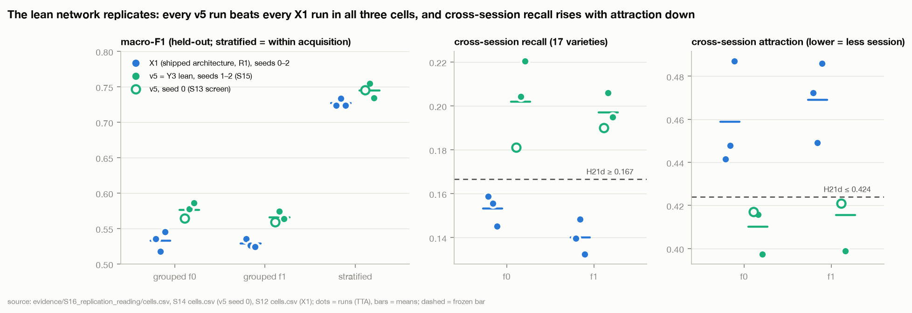
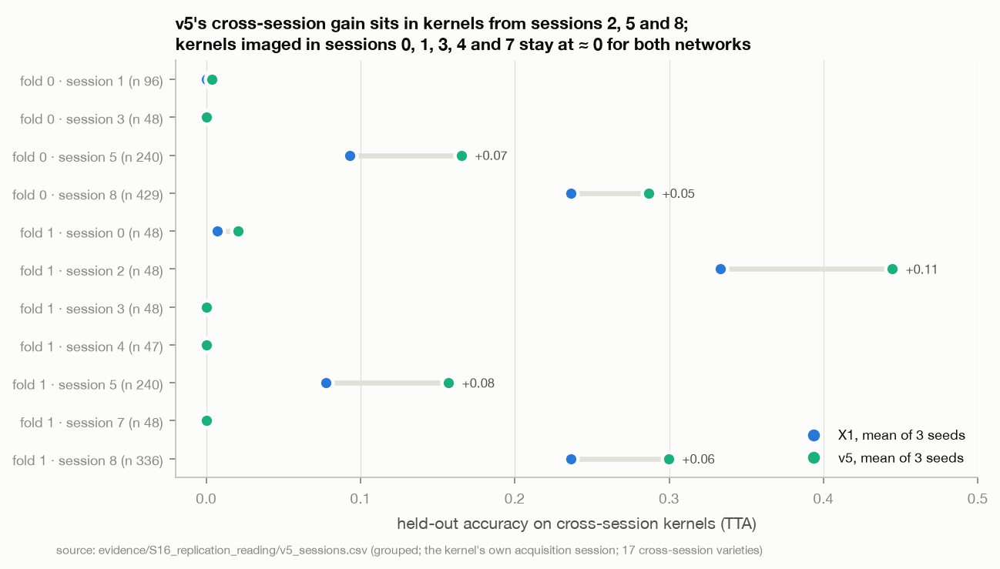
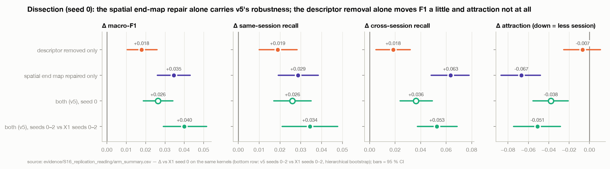

# S16 · Reading S15 — the lean network replicates and becomes SeedNet v5; its robustness comes from the spatial repair

| | |
|---|---|
| **Status** | complete (analysis + next-round design). **No training or model code was changed.** The next GPU round (S17: v5's tier-1 row, a 64-band screen, a 4 × 4 end-map screen) is frozen in [`preregistration_s16.json`](../../evidence/S16_replication_reading/preregistration_s16.json) (SHA-256 `3b623c45…`, full hash in the `.sha256` beside it) |
| **Dates** | 2026-10-03 |
| **Commits** | the cells ran on `52fba4f` (S15 runner) with training code byte-identical to `aed5257` (digest `fade41e5…`), Kaggle T4 × 2, torch 2.10.0+cu128, `dirty: false` everywhere. This study's scripts, evidence, figures and page are uncommitted at the time of writing |
| **Data** | the 10 S15 cells (`outputs/experiments_u430k32/s15/`); S13's seed-0 Y3 cells and the S11 X1 cells as references; `dataset_u430k32` (refl-215 axis, uniform430 k = 32), grouped folds 0, 1 and stratified |
| **Code** | [`evidence/S16_replication_reading/code/`](../../evidence/S16_replication_reading/code/) — `s16common.py`, `extract_cells.py`, `hypotheses.py`, `dissection.py`, `v5_profile.py`, `runtime_probe.py`, `freeze_s17.py`; figures `tools/build_assets.py::fig_s16` |
| **Raw outputs** | `outputs/experiments_u430k32/s15/` (the cells) · `s13/Y3/` (seed 0) · `s11/X1/` (reference) |
| **Evidence** | [`evidence/S16_replication_reading/`](../../evidence/S16_replication_reading/) |
| **Findings** | F83–F89; F74 confirmed; F67 superseded for v5; F48, F49, F75, F81 annotated · **Decisions** D35–D37; D24, D29 annotated · **Hypotheses** H21a–H21e, H22a, H22b read; H23, H24a–c, H25a–b frozen |

## 1 · Question
**Read S15 exactly as frozen (`preregistration_s14.json`, S15 §8's reading map), check that the cells are what they
claim, explain each verdict, and decide what the project does with the lean network — and what the next GPU round
should ask.**

Tests H21a–H21e (Y3 replication) and H22a/H22b (Y5 dissection). Could confirm or withdraw F74/F75 (the S13 screening
pass), F67 (the network ≈ a linear model across bundles), F49 (the chemometric blocks are inert); could close D29's
deferred default switch.

## 2 · Why
S15 part 2 ran in one Kaggle session on 2026-10-03: 10 GPU cells, 265 min of training against an estimate of 266. S14
froze what each outcome means; S16 applies it and asks where the gain lives, because the next round depends on the
mechanism.

## 3 · Hypotheses read (as frozen)

| ID | Frozen claim | Measured | 95 % interval | Outcome | Route (frozen) |
|---|---|---|---|---|---|
| H21a | Y3 grouped F1, 6 runs (seeds 0–2) ≥ 0.5108 | **0.571** | 0.559…0.579 | **supported** (clear) | with H21b → **adopt: SeedNet v5** |
| H21b | Y3 stratified F1, 3 runs ≥ 0.7090 | **0.745** | 0.724…0.760 | **supported** (clear) | |
| H21c | fresh seeds: Y3 − X1 (0.528496) ≥ +0.020, CI excludes 0 | **+0.047** (0.575 vs 0.528) | +0.034…+0.060 | **supported** (clear) | the paper may claim a grouped gain (G3) |
| H21d | fresh seeds: cross ≥ 0.1666 **and** attraction ≤ 0.4240 | cross **0.206**, attraction **0.410** | 0.190…0.222 · 0.384…0.437 | **supported** (cross clear; attraction marginal) | the paper may claim raised cross-session recall and lowered attraction |
| H21e | fresh seeds: Y3 − X1 stratified (0.728593) ≥ +0.018 | **+0.016** (0.744 vs 0.729) | −0.005…+0.037 | **rejected** (marginal) | within-acquisition gain **not claimed** |
| H22a | `desc_only` grouped, seed 0 ≥ 0.5508 | **0.553** (0.568 / 0.538) | 0.537…0.569 (screen) | **supported** (marginal) | H22a ∧ H22b → *either removal alone suffices (non-additive); both kept; attribution redundant* |
| H22b | `spatial_repair` grouped, seed 0 ≥ 0.5508 | **0.570** (0.575 / 0.565) | 0.554…0.586 (screen) | **supported** (clear) | |

Intervals: hierarchical bootstrap (runs within fold and arm, held-out kernels within fold shared by both arms; 2,000
draws) for H21a–H21e, as the frozen metric clause asks; S14's screen interval (kernel bootstrap ⊕ X1's run sd / √n) for
the one-seed dissection. *Clear* = the interval does not cross the threshold. H21a/H21b are read on seeds 0–2 as the
parent froze them; H21c–H21e on seeds 1–2 only (the seed-0 cells motivated them). **D28's reversal check:**
`desc_only`'s folds straddle 0.5508 (+0.018 / −0.013), each within the 0.020 margin, so the clause ("by more than the
margin") does not fire; H22a is read, and flagged marginal (`hypotheses.json → H22a.d28_straddle`).

## 4 · Method
Held-out rows were scored once by each cell's own final evaluation; S16 aggregates them and selects nothing on them.

1. **Integrity** (`extract_cells.py`): the three frozen hashes; commit, dirty flag, training-code digest and runtime
   against S13's; per-cell seed and parameter count as frozen; the regime *as applied* against R1 + each arm's intent
   (stated independently of the runner); the guards; macro-F1, cross-session recall and attraction re-derived from the
   saved predictions; the fresh-seed X1 reference re-derived from the cells it names.
2. **Frozen hypotheses** (`hypotheses.py`) with hierarchical-bootstrap and screen intervals; beside them (deciding
   nothing): all-seed deltas (gate G3), the seed-0 cells' rank among Y3's seeds (winner's curse), Y3's run-level sd,
   dissection deltas against X1 s0 and Y3 s0 on the same kernels.
3. **Dissection profile** (`dissection.py`): each half's F1 / same / cross / attraction, calib, clean fit, pathway
   influence, training-rows κ per pathway, ECE; additivity; per-session rescue; error and per-class similarity to Y3.
4. **v5 at three seeds** (`v5_profile.py`): run-level separation from X1, 3-seed ensembles, error structure, per-class
   and per-session change, the generalisation ladder, the linear bar (S12 F67), pathway use.
5. **Next round** (`runtime_probe.py`, `freeze_s17.py`): per-step cost of each candidate arm (CPU, no data), then the
   S17 file frozen from the v5 reference values in the evidence, before any S17 code exists.

## 5 · Results

### 5.1 Integrity — the cells are what they claim
| check | result |
|---|---|
| frozen files | `88b377c5…` (S12), `ef598213…` (S13), `9e182670…` (S14) verify |
| commit / dirty / code | all 10 cells `52fba4f`, `dirty: false`; `frozen_cell.json → code_identity`: digest `fade41e5…` = `aed5257`'s, 129 files |
| runtime | torch 2.10.0+cu128, Tesla T4, world size 2 — S13's, so H21a/H21b may pool the seed-0 cells (preregistration guard 3) |
| seeds / parameters | as frozen (Y3 1, 2; Y5 0); 2,725,700 (Y3), 2,808,230 (`desc_only`), 2,766,948 (`spatial_repair`) — S15 part 1's numbers |
| regime as applied | 0 deviations from R1 + each arm's intent |
| scored | 10/10; every held-out kernel once (4,311 / 4,309 grouped, 2,588 stratified); F1, cross and attraction re-derived = `run.json`; `summary.json` agrees |
| fresh-seed X1 reference | re-derived from the X1 cells: 0.528496 / 0.728593 (cross 0.145363, attraction 0.467445) = the frozen values |
| clip guard (> 0.01 outside epoch 1 and overflow epochs) | fires literally in 4 cells (1–3 epochs each), from 2–14 clipped group-steps per run — negligible, as F71c/F73 |
| stop epoch < 160 | `desc_only` f1 (stopped 143, best epoch 103, clean fit 0.970 — the only cell below 0.997); reported |
| best epoch = last | none; skipped batches 0; non-finite steps 4–6 per run (fp16 overflow, discarded) |
| wall clock | 265 min of training (estimate 266, cap 287) |

### 5.2 Replication — v5 holds on fresh seeds, and seed 0 was its worst


- **Every v5 run beats every X1 run in all three cells.** Grouped f0: v5 {0.565, 0.577, 0.586} vs X1 {0.535, 0.518,
  0.546}; f1 {0.559, 0.574, 0.564} vs {0.535, 0.526, 0.524}; stratified {0.746, 0.754, 0.734} vs {0.724, 0.734, 0.724}.
  Under exchangeability each cell has probability 1/20, jointly 1/8,000 (`v5_separation.csv`). The stratified margin is
  thin: v5's worst run equals X1's best (0.7343 vs 0.7337).
- **No winner's curse.** S14 read H21c–H21e on fresh seeds because seed 0 had motivated them. Seed 0 turned out to be
  v5's *lowest* seed in both folds (F1 rank 3 of 3; `seed_variance.csv`): fresh seeds give 0.575 against seed 0's 0.562.
- **G3 met.** All seeds: +0.040 grouped (CI +0.029…+0.051) against 2σ = 0.020 — the first architecture change since the
  audit to clear the project's improvement gate on fresh seeds.
- **v5's seed spread is X1's.** Grouped F1 sd 0.0102 (X1 0.0099); same-session 0.009 (0.014); cross 0.014 (0.010);
  attraction 0.012 (0.020); stratified 0.010 (0.006). These are the S17 margins (2·max(sd, 0.009)).
- **Within the acquisition the gain is not confirmed.** Fresh seeds +0.016 (CI −0.005…+0.037) misses H21e's +0.018 bar;
  all seeds +0.018 (CI +0.002…+0.033). v5 is a cross-bundle improvement first.

### 5.3 Robustness — the claim axis moves, but only where it already moved
- Fresh seeds: cross-session recall **0.206** vs X1's 0.145 (Δ +0.061, CI +0.045…+0.077); attraction **0.410** vs 0.467
  (Δ −0.058, CI −0.087…−0.029). All seeds: same-session +0.034, cross +0.053, attraction −0.051 (`arm_summary.csv`).
- **Who is rescued** (3-seed means, `v5_sessions.csv`, figure below): cross-session kernels imaged in sessions 5
  (+0.07 / +0.08), 8 (+0.05 / +0.06) and 2 (+0.11). Kernels imaged in sessions 0, 1, 3, 4 and 7 stay at ≈ 0 for both
  networks; 8 of the 17 cross-session varieties are still at ≤ 0.05 recall (`v5_per_class.csv`). v5 strengthens the
  directional transfer S09 found (F39); it does not open new session pairs.
- **The robustness is systematic.** A 3-seed ensemble lifts v5's F1 (+0.016 grouped → 0.587; +0.029 stratified → 0.774)
  but leaves cross-session recall and attraction where single runs put them (0.205 / 0.412) (`v5_ensembles.csv`).



### 5.4 Dissection — the spatial end-map repair carries the robustness


Seed 0, each half against X1 s0 on the same kernels (`arm_summary.csv`, `matched_deltas.csv`, `dissection_*.csv`):

| | Δ F1 | Δ same | Δ cross | Δ attraction | spatial influence | calib F1 | clean fit |
|---|---:|---:|---:|---:|---:|---:|---:|
| `desc_only` (descriptor → SNV + morph) | +0.018 (+0.011…+0.026) | +0.019 | +0.018 (+0.005…+0.032) | −0.007 (−0.025…+0.011) | 69 % | 0.730 | 0.997 / 0.970 |
| `spatial_repair` (tail ends at 2 × 2, no CBAM on it) | **+0.035** (+0.026…+0.043) | +0.029 | **+0.063** (+0.048…+0.078) | **−0.067** (−0.087…−0.048) | 75 % | 0.730 | 0.999 / 1.000 |
| v5, seed 0 (both) | +0.026 | +0.026 | +0.036 | −0.038 | 74 % | 0.724 | 0.999 |
| v5, seeds 0–2 vs X1 seeds 0–2 | +0.040 | +0.034 | +0.053 | −0.051 | 75 % (X1 63 %) | 0.733 (X1 0.711) | 1.000 (0.980) |

- **The robustness is the spatial repair's.** Alone it reproduces v5's F1 (0.570 vs v5's 3-seed 0.571) and its whole
  cross-session move (0.213 / 0.390 vs 0.199 / 0.413); it rescues session-5 kernels best of any arm (0.20 vs X1 0.10).
  Against v5 s0 on the same kernels it is at least as good on F1, cross and attraction (F1 +0.010 / +0.006, cross +0.046 / +0.009, attraction −0.038 / −0.020).
- **The descriptor removal is a simplification, not a lever.** F1 +0.018 (fold 0 +0.033, fold 1 +0.003 — the fold whose
  run stopped early at epoch 143), cross +0.018, attraction unchanged. F49 called the blocks inert; removing them costs
  nothing and may add a little — they were not *harmful* (S14 §11's test of that is negative).
- **Non-additive, as the frozen rule says.** The halves' F1 gains sum to +0.052; v5 s0 gained +0.026 (and +0.040 over
  three seeds). With the spatial repair in place, removing the descriptor adds nothing measurable.
- **The spectral-output κ halving is not the descriptor's doing.** κ of the spectral output falls 0.132 → 0.061 in
  `desc_only` *and* 0.132 → 0.056 in `spatial_repair` (which keeps the full descriptor): it is a property of how the joint
  network trains once either change is made, not a cleaner spectral input. Influence moves toward the spatial pathway in
  both (+6 and +12 points).
- **Whose solution.** Per-class changes correlate with v5's at 0.60 (`spatial_repair`) vs 0.47 (`desc_only`); error-set
  Jaccard with X1 s0 0.68 vs 0.72 (`dissection.json`).

### 5.5 v5 against the linear bar and on the ladder
- **v5 is no longer "a linear model across bundles."** No-TTA grouped 0.562 vs shrinkage LDA on within-kernel quantiles +
  morph 0.518 (S12 F67): **+0.044** (X1: +0.005) (`v5_profile.json → linear_bar`).
- **The gain grows with distance from the training bundle**, as S14 saw at one seed: clean fit 1.000 (X1 0.980), calib
  F1 +0.023, held-out same-session +0.034, F1 +0.040, cross +0.053. Held-out ECE 0.100 vs 0.131 grouped, 0.020 vs 0.030
  stratified (`v5_ladder.csv`).
- **κ stays blind.** Training-rows κ of v5's embedding 0.340 (X1 ≈ 0.34) while held-out attraction fell 0.05 — D32's
  reading holds on six more networks.
- **v5's seeds disagree more than X1's** (error Jaccard 0.73 vs 0.76; errors made by all three seeds 63 % vs 67 % of
  their union), which is why its ensemble gains more (`v5_errors.csv`).

## 6 · Findings
Recorded in [FINDINGS](../../FINDINGS.md).

| ID | Finding | Strength |
|---|---|---|
| F83 | The S15 cells are clean: 10/10 on `52fba4f`, `dirty: false`, training code = `aed5257` (digest), S13's runtime, seeds and parameters as frozen, no regime deviation, every rederivation exact; one cell stopped before epoch 160 (`desc_only` f1) | E4 |
| F84 | The lean network replicates and beats X1 beyond seed spread: grouped 0.571 (6 runs), stratified 0.745 (3); fresh seeds +0.047 (CI +0.034…+0.060); every v5 run above every X1 run in all 3 cells (p = 1/8,000); seed 0 was v5's worst seed; G3 met (+0.040 vs 2σ 0.020) | E4 |
| F85 | v5's robustness gain replicates — fresh-seed cross-session 0.206 vs 0.145, attraction 0.410 vs 0.467 — but only in sessions that already transferred (2, 5, 8); kernels from sessions 0, 1, 3, 4, 7 stay at ≈ 0 and 8/17 cross-session varieties at ≤ 0.05; ensembling does not move it | E4 (gain) / E3 (breakdown) |
| F86 | The within-acquisition gain is not confirmed: fresh seeds +0.016 (CI −0.005…+0.037; H21e rejected), all seeds +0.018 (CI +0.002…+0.033); v5's worst stratified run equals X1's best | E4 |
| F87 | The spatial end-map repair alone carries v5's robustness and its F1 (+0.035, cross +0.063, attraction −0.067 vs X1 s0); the descriptor removal alone gives +0.018 F1 and no attraction change; the halves are non-additive; the spectral-output κ halves under either change | E3 (screen) |
| F88 | v5's seed structure: run sd equals X1's on F1 (0.010); its seeds disagree more (error Jaccard 0.73 vs 0.76), so a 3-seed ensemble gains more (0.587 grouped, 0.774 stratified) — without moving cross-session recall or attraction | E3 (post hoc) |
| F89 | v5 is +0.044 over the best linear control across bundles (no-TTA 0.562 vs quantile-LDA 0.518; X1 +0.005); its gain grows from calib (+0.023) to held-out (+0.040), with lower ECE and an unchanged training-rows κ | E3 |

**Status changes.** F74 → *confirmed* (F84). F67 → *superseded for v5* by F89 (stands for X1). F48 annotated: its repair
is what carries the robustness (F87). F49 annotated: removing the blocks is neutral to slightly positive, not a lever.
F75 annotated: attribution answered by F87. F81 annotated: κ blind on six more networks (F89).

## 7 · Decisions
- **[D35](../../DECISIONS.md) · S15 read as frozen → SeedNet v5.** H21a ∧ H21b: the lean architecture under R1 is the
  reference form and the base of every later arm; X1 becomes a historical comparator. The paper may claim the grouped
  gain (H21c) and the cross-session gain (H21d); it does not claim a within-acquisition gain (H21e). Attribution as
  frozen (redundant), with F87's robustness attribution reported as a one-seed observation. v5 rows: single-run mean ±
  sd over folds × seeds primary, 3-seed ensemble a labelled secondary row.
- **[D36](../../DECISIONS.md) · The config default becomes v5 in S17 part 1, behind G-neutral.** Closes D29 deviation 1;
  earlier runners are pinned to their own commits.
- **[D37](../../DECISIONS.md) · S17 is frozen: v5's tier-1 row + two screens.** §9.

## 8 · Where this leaves the project

| evidence status | the score (grouped F1) | the claim (cross-session) |
|---|---|---|
| **demonstrated** | v5 = 0.571 grouped / 0.745 stratified at 3 seeds, +0.040 over X1 (G3 met on fresh seeds); +0.044 over the best linear control | v5 raises cross-session recall to 0.20 and lowers attraction to 0.41 (H21d) — the first joint network to move both |
| **strongly suggested** | the gain is the spatial repair's (F87, one seed, large effect on every axis) | the gain is directional: it amplifies the transfer into sessions 2, 5, 8 that X1 already had; it opens no new session |
| **plausible** | a larger end map continues the trend (extent) — or the repair was a one-step fix (trainability): S17 Z3 decides | more bands either add variety signal or the NIR session offset (F40): S17 Z2 decides |
| **unknown** | v5's within-acquisition tier at 80/20 (S17 Z1); whether TabPFN-3 or a pixel-set encoder reaches 0.57 (CPU) | anything for sessions 0, 1, 3, 4, 7 without new information (RGB shape, transfer standards, a third bundle) |

## 9 · Next steps

### 9.1 S17 — frozen now
[`preregistration_s16.json`](../../evidence/S16_replication_reading/preregistration_s16.json), SHA-256
`3b623c45c559962c36b59383ddf6a636da9a087e41523d8d5c455e81954b9d3e`, frozen before any S17 cell or runner exists.
Reference = v5 at seeds 0–2: grouped 0.570816 (sd 0.0102), cross 0.199401 (sd 0.0138), attraction 0.412773 (sd 0.0121),
stratified 0.744788 (sd 0.0100); margins 2·max(sd, 0.009). **7 GPU runs ≈ 4.3 h (≤ 4.6 h), one Kaggle session.**

| arm | cells | hypotheses | decides |
|---|---|---|---|
| **Z1 · v5 tier-1 row** (FW-37) | 80/20 stratified, seeds 0, 1, 2 (3) | **H23** v5 80/20 − v5 70/30 ≤ +0.030 (H15's form) | the D16 tier-1 row; whether v5, unlike X1 (F80), gains from more same-acquisition data |
| **Z3 · 4 × 4 end map** (FW-38) | tail `[2,2,1,1]` (v5's rules), grouped f0, f1, seed 0 (2; screen) | **H25a** F1 ≥ 0.5504 · **H25b** cross ≥ 0.2270 **and** attraction ≤ 0.3886 | extent (dose–response → replicate) vs trainability (v5 stays; one-step repair) |
| **Z2 · 64 bands** (FW-03) | uniform430 k64, grouped f0, f1, seed 0 (2; screen) | **H24a** F1 ≥ 0.5504 · **H24b** F1 ≥ 0.5912 · **H24c** cross ≥ 0.1718 **and** attraction ≤ 0.4369 | k32 stays (non-inferior or worse) vs more bands as a lever (superior without session cost → replicate + screen 215) vs a session-laden gain |

Runtime: Z1 ≈ 39 min × 3, Z3 ≈ 25.5 × 2, Z2 ≈ 45 × 2 — S13/S15 wall clocks scaled by the per-step cost ratios measured
in `runtime_probe.json` (k64 1.71 × v5, 4 × 4 end map 0.99 ×, X1 1.09 ×). Order: Z1 → Z3 → Z2 (Z2 needs a second dataset
attached; without it, it is skipped and runs in a later session). Every cell carries v5 explicitly, so it composes the
same with or without D36's switch (checked: all 7 compose to the intended keys).

**S17 part 1 (implementation, next session):**
1. D36: switch the defaults (`configs/model/seed_net.yaml` → `snv_morph`, `[2,2,2,1]`, `3`; R1's `single.*` and
   `grad_clip`) behind G-neutral against `aed5257` + the v5 overrides (S11/S13's harness: per-step losses, tensors,
   held-out predictions); pin the new digest; give `run_frozen.py` and `run_s13.py` the digest refusal `run_s15.py` has.
2. `experiments/s17.py` + `scripts/run_s17.py` from this file (verify it and its three parents; v5 + arm change; the k64
   manifest and row-id checks; `--check`, `--cfg-job`, 2-rank `torchrun` of each arm as S15).
3. **PI action:** `python scripts/build_presliced_dataset.py --set uniform430_k64 --out ./dataset_u430k64
   --kaggle-id <user>/rice-hsi-u430k64` (≈ 4.6 GB) and attach it on Kaggle beside `rice-hsi-u430k32`.
4. Commit + push (Kaggle clones `main`), run, read in S18 with this folder's scripts as the template.

### 9.2 Beside the GPU round (not frozen; ordered by expected information per hour)
- **CPU, any time:** TabPFN-3 on kernel summaries (FW-28) and the pixel-set encoder (FW-27), each under its own frozen
  file. The bar is now v5: 0.571 grouped (0.562 no-TTA), calib F1 0.733.
- **The largest remaining lever is still new information.** v5 transfers only along session pairs that already
  transferred (F85): RGB-resolution shape (FW-18, the raw archive — a PI decision), transfer standards (FW-29), a third
  bundle per variety (FW-12).
- **Not pursued:** replicating the dissection (H22's rule; v5 keeps both halves and the robustness attribution is clear
  at screen level); more 70/30 stratified seeds to revisit H21e (it was frozen and read); the 215-band cube before H24b.

## 10 · Threats to validity
1. **The dissection is one seed.** F87's attribution rests on 2 runs per half; the effects (+0.063 cross, −0.067
   attraction) are 4–6 × the run sd, but `desc_only`'s fold 1 stopped early (epoch 143) — its F1 may be understated.
2. **Two sessions, one runtime.** H21a/H21b pool S13's seed-0 cells with S15's; same digest, same torch and GPU (F83), and
   seed 0 is v5's lowest seed, so pooling does not inflate.
3. **Matched deltas are only partly paired.** Different modules → different initial weights at the same seed.
4. **The per-session and per-class breakdowns are post hoc** (E3): 17 varieties, 47–429 kernels per session cell.
5. **Session ↔ variety confounding** (S12 §10.4) still applies to every cross-session number; only 17 varieties carry it.
6. **The runtime estimate for k64** scales a CPU per-step ratio; the data path doubles too. S17 part 1 should time one
   epoch on Kaggle before the session (the cap leaves ≈ 7 h of the 12 h limit unused).
7. **k = 32, one band axis, one runtime** — every network number so far (Z2 is the first step off it).

## 11 · What would change these conclusions
- A frozen round on v5 at ≥ 3 seeds falling below X1's grouped mean → D35 reversed (no sign of it: v5's worst run beats
  X1's best).
- Z3 meeting H25a ∧ H25b → the robustness is a dose-response in the end map's extent: F87's "one-step repair" reading is
  replaced, and v6 is screened by replication.
- Z2 meeting H24b ∧ H24c → D04/D11 under review again; the 215-band cube becomes worth its cost.
- `desc_only` and `spatial_repair` replicated at seeds 1–2 with `desc_only` ≥ `spatial_repair` on cross-session recall
  → F87's attribution withdrawn.
- Any cross-session recall > 0.05 on kernels from sessions 0, 1, 3, 4, 7 → F85's "directional only" is wrong.

## 12 · Reproduce
From the repository root (CPU; needs `outputs/experiments_u430k32/{s11,s13,s15}/` and S12/S14's evidence):
```bash
E=docs/research/evidence/S16_replication_reading/code
python $E/extract_cells.py     # seconds — cells.csv, curves.csv, integrity.json
python $E/hypotheses.py        # ≈ 10 s  — hypotheses.json, arm_summary.csv, matched_deltas.csv, seed_variance.csv
python $E/dissection.py        # seconds — dissection_*.csv, dissection.json (needs cells.csv)
python $E/v5_profile.py        # seconds — v5_*.csv, v5_profile.json (needs cells.csv)
python $E/runtime_probe.py     # ≈ 1 min — runtime_probe.json (no data)
python $E/freeze_s17.py        # refuses to overwrite a different frozen file; re-running reproduces the same bytes
python docs/research/tools/build_assets.py --figures
shasum -a 256 docs/research/evidence/S16_replication_reading/preregistration_s16.json   # 3b623c45…
```

## 13 · Provenance
Cells: `outputs/experiments_u430k32/s15/{Y3,Y5}/<variant>__f<fold>_s<seed>/` (`results/run.json`, logits, predictions,
`session_probe.json`, `clean_fit.json`, `metrics.jsonl`, `frozen_cell.json`, `sweep.log`) and `s15/summary.json`;
references `s13/Y3/` and `s11/X1/`. Checkpoints stay in `outputs/`. Every table on this page is a file in the evidence
folder; every figure names its source.
