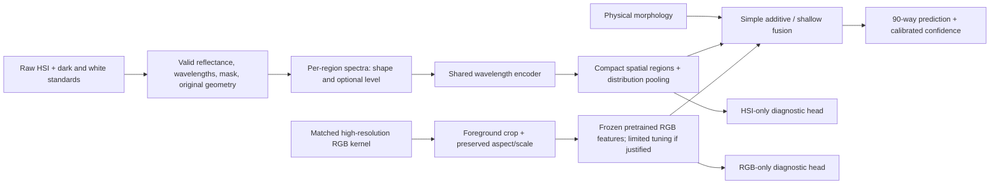

# Proposed next-generation system and research route

2026-10-03. **Design proposal, not a trained model or an established novel method.**
The provisional decisions here have explicit reversal tests in
[experiments_and_paper.md](experiments_and_paper.md). Literature keys resolve in
[the verified ledger](../../evidence/S19_next_generation_strategy/literature.csv).

## 1. Decision

Retain v5 as an immutable reference and potential efficient deployment model.
Substantially redesign the candidate around **complementary seed measurements**:
a compact wavelength-aware HSI encoder of within-seed spectral distributions and
geometry, plus a pretrained high-resolution RGB encoder. Start with independently
strong branches and simple fusion. Make calibration-supported nuisance handling a
separate, falsifiable contribution; do not sell generic multimodal attention as
novelty. The largest realistic robustness opportunity combines this representation
with a crossed acquisition design and a locked new-session test.

The decision on final 32/64/215 input is deliberately unresolved. **Use all 215
valid measurements as a research reference; provisionally use 195 ≥430 nm for the
main full-coverage spectral candidate and test the 20 blue-edge bands separately.**
Deploy the smallest measured-noninferior budget. 32 remains the only replicated
neural budget, 64 is a useful screen, and full-band HSI is not inherently too costly
when represented as spectra/regions rather than a deep 215×64×64 3D feature volume.
These are research choices, not conclusions that 195 or 215 is optimal.

## 2. Candidate data flow

Object-level pairing is sufficient for the first experiment. Pixelwise registration,
HSI super-resolution and cross-pixel attention are optional later work, not entry
requirements. Preserve original spatial coordinates, scale and aspect ratio; verify
paired identity using the acquisition grid and registration residuals.

## 3. HSI representation: physically indexed, compact, testable

For masked pixel or region p, measured reflectance r(p,λ) exists only at λ in Λ.
Use a shape channel `s_p = (r_p − mean_Λ(r_p))/(sd_Λ(r_p)+ε)` and, in an explicit
ablation, a small level channel `l_p = [mean_Λ(r_p), sd_Λ(r_p)]` (or log-positive
level with a documented handling of nonpositive calibrated values). Fit all
additional scales on training data. This separates a nuisance-sensitive measurement
from normalized shape; it does not assume that either channel is pure chemistry.

Encode physical wavelength and valid-interval identity along with reflectance:

`h_p = Σ_j a_pj φ(s_pj, λ_j, Δλ_j, interval_j)`.

A minimal implementation uses shared small MLP/1D blocks with λ features, masked
weighted pooling and bounded local interactions. A continuous-kernel alternative
uses `Kθ(λ_i−λ_j)` within each measured interval. Set local edges to zero across
the 102.7-nm hole; permit a later global interaction explicitly marked by distance.
Weights may represent sampling measure if approximating integrals, but do not
assign a huge quadrature weight across an unobserved gap. For irregular band sets,
construct weights separately within each interval and normalize. Global comparisons
of separated wavelengths are physically meaningful; pretending adjacent stored
indices are adjacent wavelengths is the avoidable assumption.

The invariance of a sum/mean over unordered pixel tokens follows directly from
commutativity; Deep Sets and attention MIL provide established frameworks [L15–L17].
This is a representation rationale, not proof of increased recognition accuracy.
A plain pixel bag cannot express spatial arrangement. Compare three nested models:

1. mean/quantile spectra + original morphology with shrinkage LDA, RBF-SVM or
   regularized multinomial logistic regression;
2. shared spectral encoder + mean/variance pooling across masked pixels;
3. the same encoder applied to a small object-aligned spatial grid (e.g. 4×4
   occupied regions), followed by a shallow 2D block or small attention pool.

These controls distinguish distributional information from location. Regions should
be defined from geometry without labels, retain occupancy and within-region variance,
and handle foreground masks explicitly. Use consistent head-tail ambiguity handling
(two orientations or sign-invariant features), rather than treating an unstable
principal-axis direction as a biological label. Never include scan ID/session/date
as classifier input. Absolute sensor position belongs in a nuisance diagnostic,
not a hidden predictor.

A tractable prototype starts at 128–256 sampled foreground spectra per kernel,
feature width 64, ≤16 occupied spatial regions, and a 128-dimensional HSI output.
These are initial engineering bounds to profile and freeze, not optimized settings.
At 256 spectra×215 bands this processes 16 times fewer spatial spectra than a full
64×64 cube; activation/memory savings must still be measured. Compare 128/256
sampling stability on training/calibration data before choosing a budget. Preserve
small regions that may contain informative structures; do not claim random pixel
sampling retains all morphology.

**Pretrained alternative before custom complexity:** evaluate a frozen HyperSL
spectral embedding [L13] on mean/region spectra, plus a linear/shallow head. Verify
wavelength units, range, normalization, license and training-data provenance; the
383-nm edge may fall outside a model's supported range. Missing intervals must be
masked or omitted as supported, not interpolated silently. HyperSIGMA/HyperFree are secondary options if this lightweight transfer works
[L11–L12]. HyperFM targets atmospheric/cloud properties and is lower-priority
watchlist material [L14].
Theisen–Neubert [L14T] supports testing remote-to-proximal transfer; it does not
establish transfer to rice varieties.

## 4. RGB: complementary measurement before complex fusion

Reconstruct all 180 scan-to-RGB associations into explicit kernel-level identities.
Preserve tight foreground masks, original aspect ratio, crop scale and physical
morphology; remove plate edges, labels, empty grid cells and acquisition background.
Use a sufficiently detailed crop, initially 224–384 pixels depending on measured
seed occupancy, without claiming this is native sensor resolution. Record original
pixels per kernel and registration/exclusion statistics.

Probe frozen DINOv3 small/appropriate released features [L18] against a modest
pretrained ConvNeXt [L19] baseline. Pin exact checkpoint, pretraining source and
license; model names alone are not reproducibility. Compare foreground RGB,
grayscale/shape, silhouette+morphology, and downsampled RGB at HSI-equivalent
resolution using a fixed small control list. These tests ask whether extra detail,
color or simply masking explains a gain. Color is itself acquisition-sensitive;
blind strong color jitter may erase variety cues. Do not infer RGB robustness from
HSI failures or natural-image pretraining alone.

Start frozen because effective acquisition diversity is small even though there
are 8,624 kernels. Only fine-tune a final block or a small adapter after a frozen
probe demonstrates useful signal. Compare with the frozen branch at matched splits
and compute. Training a large ViT from scratch is low priority; RiceSeedNet [L08]
shows transformers have already been applied to rice, not that scale solves this
repository's missing support.

## 5. Fusion and learning objective

First train per-modality heads and report their errors. Baseline fusion is
`z = α z_HSI + (1−α) z_RGB` with a fixed equal-weight control and a small calibration-
selected grid. Fit modality temperatures on allowed calibration rows; never tune α
on the 17 cross-session confirmation classes. S14 showed that in-session calibration
can favor a shortcut-rich modality, so report robustness tradeoffs and choose the
selection rule before seeing confirmation outcomes.

Next compare concatenated normalized HSI/RGB/morph features with a shallow head
against that logit baseline. Initial joint objective is standard class-balanced
cross-entropy (classes are nearly balanced), with separately logged unimodal losses
only if needed to prevent branch neglect. Measure gradients, branch-only accuracy,
missing-modality performance and error complementarity. Add modulation such as OGM
[L22] only when the branch demonstrably degrades under joint training; gradient
imbalance is not automatically an error. Separate branch optimizers/late fusion
alone already failed as a robustness fix in S14.

A small cross-modal interaction can follow **only** if aligned local regions provide
complementarity beyond simple fusion. A learned quality gate is not default: white
reference quality and brightness can predict session and thus class in this dataset.
If used, restrict gate inputs to independently validated reliability measures,
freeze their construction and test whether it collapses to session prediction.
Do not present generic gated 2D-RGB/3D-HSI fusion as a contribution: a 2026 90-variety
paper already describes that design [L06].

## 6. Robustness grounded in measurement

A useful measurement model is `I(p,λ)=g_s(p,λ) R_y(p,λ)+d_s(p,λ)+ε`.
A white tile estimates only some factors in g and d; differences in seed curvature,
illumination geometry and camera response need not cancel. Test residual dependence
on scan position, spectral level, white-tile shape and smooth within-kernel fields.
Standards-only estimates provide a route independent of variety labels, but one
tile per scan may not identify full spatial corrections.

If a low-dimensional residual nuisance family is measured from training standards
or a separate calibration experiment, define transformations `T_η` that stay within
that measured range and preserve a physical seed's identity. Then test
`L = L_class + β E_η ||f(T_η x)−f(x)||²` against the same model without consistency.
Use a fixed β shortlist selected within train/calib. A consistency loss guarantees
nothing unless the transformation is class-preserving. Require controls for generic
smooth jitter, matched regularization strength, and loss of same-session detail.
Never estimate nuisance basis vectors by subtracting class-confounded session means
and call them illumination. Never remove bands solely for high session predictivity.

SPDDA's spectral-spatial augmentation [L26] is a comparator idea, not permission to
resample across missing measurements. MixStyle [L25] already failed locally in one
specific implementation; retry only after evidence that a different perturbation
matches the measured nuisance. DANN/IRM/Group DRO require a support argument; the
class-session deterministic relation makes unconditional invariance contradictory
to perfect classification on present training support [repository review §6].
New crossed acquisitions or external standards are the cleanest way to learn which
changes are nuisance. Test-time adaptation is a separate deployment regime and may
use target data only when explicitly disclosed and separately reported.

## 7. What to reject, defer or reverse

| Route | Current decision | Evidence needed to revisit |
|---|---|---|
| Bigger SeedNet, deeper attention everywhere | Reject as main direction | Specific representational failure not explained by training fit or acquisition shortcuts |
| More epochs / remove regularizers | Reject as main direction | New branch genuinely underfits; S12 already tested this for existing SeedNet |
| Supervised band-selection sweep | Defer | Full-band information gain and a selector beating uniform/random under nested training-only selection |
| Mamba/SSM substitution | Defer | Sequence/scene size makes measured attention/conv cost binding, and matched simple model loses; 32–215 bands alone is weak motivation [L10] |
| KAN, hypergraphs, MoE, diffusion augmentation | Defer | Stable local structure or nuisance evidence and a fair lower-complexity control; small-dataset novelty of module names is insufficient |
| Hyperspectral super-resolution from RGB | Defer | Verified pixel registration and a benefit beyond object-level fusion; reconstructed wavelengths are not new measurements |
| CLIP/text class-name supervision | Reject for now | Independent botanical/genetic descriptions with signal; arbitrary variety identifiers carry little semantic supervision |
| Class prototypes / supervised contrastive loss | Optional controlled comparison | Evidence of better between-session structure; same-class positives currently share session and can reinforce it |
| Masked self-supervision trained on all scans | Exclude from inductive tier | Declare transductive protocol separately; train-only masking can still learn session reconstruction [L20] |
| TabPFN-3.5 descriptor model | Conditional baseline | Verify 90-class support, resource/license availability and exact version; not an assumed CPU-only solution [L30] |
| Retain only HSI | Valid fallback | RGB fails pairing/quality or adds no replicated benefit; choose efficient HSI on measured tradeoff |
| RGB-only deployment | Valid fallback | RGB matches fused accuracy and transfer within frozen noninferiority margin; complexity of HSI must earn its cost |

The publication opportunity is a falsifiable claim about **what transfers** under
measurement shift, backed by complementary resolution and explicit band geometry.
Architecture names and equations make the proposal implementable; they do not prove
novelty or a performance advantage. Those must survive the experiments and a final
focused novelty check before submission.
