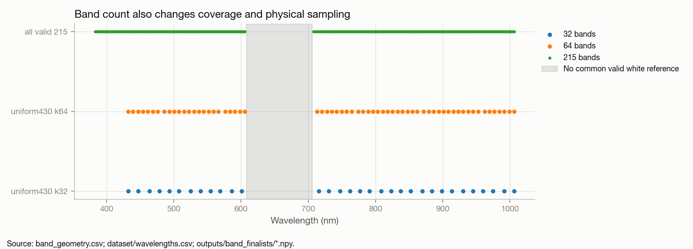
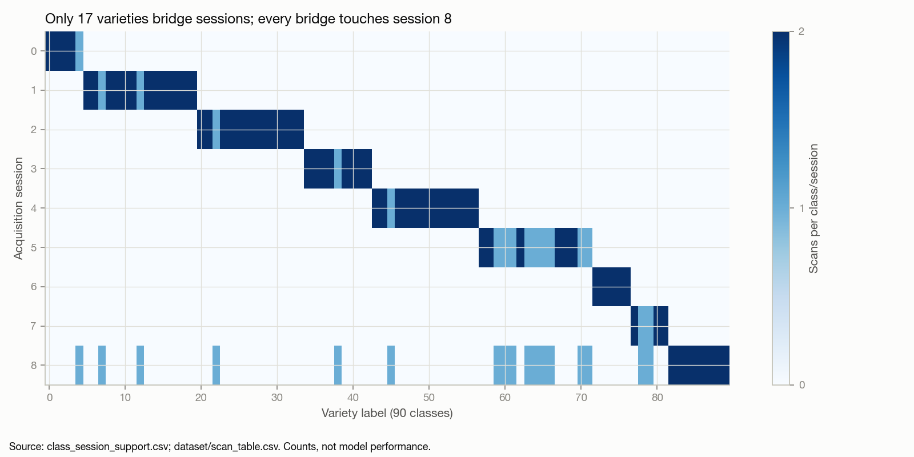

# Repository evidence and first-principles reassessment

Dated 2026-10-03; descriptive synthesis, not a new predictive experiment. Source
commit `52fba4f4698e0a8948b00a4a83f3893ae793e55b`; the working tree already contained
S16 research changes. Historical studies remain unchanged. Evidence paths below
are relative to `docs/research/` unless otherwise indicated.

## 1. Coverage and provenance

This review covers the scientific chain S00–S16, the F/D/H/FW registers, acquisition
and engineering documentation, calibration/segmentation/split/model implementations,
configs and frozen runner designs, saved result summaries and local data metadata.
The [inventory](../../evidence/S19_next_generation_strategy/inventory.csv) maps the
repository's code, tests, notebooks, datasets, documents and outputs, with hashes
for small provenance files. The [run inventory](../../evidence/S19_next_generation_strategy/run_inventory.csv)
lists 59 `run.json` files; these are neural run artifacts, not a count of all proxy
fits. S03 alone reports 9,066 proxy fits. Study evidence also contains
CPU analyses, confirmation designs, diagnostics and neutral regression checks.

Coverage is scientific and source-oriented, not a claim to have executed every
notebook, reread every tensor/checkpoint or independently reproduced every training
run. S19 reuses S16's prediction-integrity checks and copies its aggregate table;
it does not re-score held-out predictions. Legacy notebooks and narrative
architecture docs describe historical states; current source plus each run's frozen
configuration determines what actually ran. Training defaults still predate v5;
D36's S17 neutral gate is required before changing them.

## 2. Acquisition and preprocessing

The [dataset record](https://zenodo.org/records/3241923) describes 90 Vietnamese rice
varieties, 96 kernels per variety, two scans of 48 arranged in an 8-by-6 grid, nine
acquisition batches in 2017. RGB uses a Fujifilm X-M1; HSI uses a Specim V10E with
Hamamatsu ORCA-05G. There are 256 nominal VIS–NIR bands, an in-scene Spectralon tile,
session dark references and a calibration chessboard. The record explains one
corrupt NDC1 acquisition/re-capture; it does not establish why every other
cross-session pair exists. Provenance for seed lot, growing environment, storage,
moisture and genotype is insufficient for independence claims. Do not infer these
from a variety name.

Current extraction yields **8,624 kernels**, 180 scans, nine sessions; 16 of the
nominal 8,640 are absent. Raw HSI crops use the seed region (first 600 rows), then
segmentation, connected components and ordering. Typical original seed supports
are only hundreds of pixels; resizing to 64×64 does not create fine structure.
Alpha-aware resizing avoids diluting edges with background, and masks give exact
zero exterior. Eight saved morphometrics preserve some size/shape lost by crop
normalisation. A future RGB pairing must persist scan/grid row/grid column and
original centroid/box, not assume that the nth surviving HSI component is the nth
RGB seed. The 16 omissions make naive list pairing unsafe.

Radiometry uses dark-corrected signal divided by the scan's white reference:
`R = (I − D)/(W − D)` with configured reference reflectance 1.0. S07 locates the
tile in all 180 scans. White-reference saturation at 4095 DN means 41 bands have
no universally usable session reference; the shared axis retains 215 bands.
This is a reflectance estimate, not a certificate of removal of spatial
illumination, specular reflection, sensor nonuniformity or biological batch effects.
No experiment isolates calibration as the sole cause of gains between SNV-era
proxies and later reflectance networks.

**New audit:** `radiometry.json` uses **zero-based** instrument indices 92–132,
608.027778–705.805556 nm. The valid endpoints adjacent to the hole are
605.583333 and 708.250000 nm. Do not treat the compressed axis as regularly sampled
or synthesize this missing interval as measured data. `white_spectra.npz` shows
38,697/38,700 retained scan-band white references are own-scan, three use session
shape and none remain unresolved. The three fills are at 605.583333 nm in scan IDs
reported in `calibration_sources.json`; selected k32/k64 source counts are reported
there too. A strict inductive rebuild should fit any pooled reference using allowed
training standards, or exclude the affected band in a sensitivity check. Own-scene
white/dark calibration is a valid deployment input if the protocol declares it.
The common valid axis was determined globally without class labels; freeze it as
an instrument/QC convention and disclose this preprocessing history.

**Raw assets are now available locally.** `dataset/rice_hsi.zip` is 17.26 GB and has
584 entries. Central-directory matching finds one RGB image for each of 180 HSI
scan stems; every paired image header is 4896×3264. Chessboard assets and index.csv
also exist. This updates earlier S12/S14/S16 statements that the archive was absent.
It does not yet prove pixel or individual-seed registration. The audit did not
read all compressed payloads or validate archive-wide CRC/MD5. The extracted
`dataset/patches.npy` full-215 cube is absent; the k32 cube and source metadata are
present. Rebuilding full-band data is an engineering task, not a download blocker.
Background descriptions differ across sources; inspect actual pixels before
asserting a black/white acquisition background or designing segmentation rules.

## 3. What each historical phase established

| Study | Evidence and result | Valid inference / boundary |
|---|---|---|
| S00 pre-refactor | Four-branch SpectralQuadNet, about 5.19M parameters; spectral towers, scalar descriptor, 3D/2D CNN, transformer, bilinear fusion, subcentre ArcFace and three stages. Claimed 87.8%/89.4% TTA accuracy lacks a reproducible source run. | Historical motivation, no defensible modern benchmark. |
| S01 independent audit | Saved macro-F1 .847 came from patch-stratified overlapping scans, label-dependent band selection and about 944 checkpoint opportunities. Extra stages cost ~65% compute for ~.005 gain. | Leakage/selection invalidate an acquisition-generalisation headline. Asymmetric branch dropout confounds causal branch-importance claims. |
| S02 revision | Grouped two-fold protocol, inner calibration, single-stage two-path SeedNet; old controls retained. | Correctness established before training; proposed checks A3/A8 not thereby completed. |
| S03 proxy bands | 9,066 SNV-256 proxy configurations; mean-spectral LDA favours broad coverage. | No inference of optimal bands for current reflectance neural model. |
| S04 compute | Pre-slicing, mmap, Metal decomposition, fp16, T4×2 DDP and resume engineering. | Makes studies feasible; throughput is hardware/regime dependent. |
| S05 frozen band study | Uniform sampling strong; CNN proxy best around 24–64 (.45–.458), full .437; LDA full .419. PCA high redundancy; supervised selectors do not beat uniform430 by the required margin. | Redundant variance does not imply redundant discriminative signal. Frozen rule selected 24; shipping uniform430 k32 is a documented deviation, not an established optimum. |
| S06 confound | 73 same-session classes, 17 cross-session; near-zero cross recall for SNV proxies, attraction to training-session classes 71–78%. | Class/session association dominates these experiments. Removing session-correlated bands also removes class signal. Not proof that every later model must fail. |
| S07 calibration | Own-scene white tiles; 215 common valid reflectance bands after saturation exclusion. | Better radiometric footing, not removal of all acquisition effects. |
| S08 confirmation | Twelve k32 reflectance network runs, grouped two folds×three seeds and stratified references. | Band-budget neural comparison remained unrun; draft H8–H11 were not frozen evidence. |
| S09 forensics | Grouped .530±.009 versus stratified .712±.033; same/cross recall .648/.152. LDA mean+morph .485. Exploratory full 215 mean-spectrum LDA .371 versus k32 .331. | Hypotheses: unused distribution/spatial/RGB information, fit deficit, acquisition shift. Some fit-based causal interpretations were later rejected. |
| S10 mechanisms | Only 3.6% cumulative LR on clean-label objective; aux weights differed from prose. 1×1 spatial tail created 327,680 dead taps; CBAM used too large a kernel at tiny maps. Descriptor extras nearly inert. | Specific repair targets. Raw level is heavily normalised but can influence front ECA; “no level anywhere” is too absolute. |
| S11 instrumentation | Neutral changes, clean-fit/gradient/logit/provenance telemetry, DDP deduplication, frozen X1/X2/X4. | Duplicate-score bias was tiny; valid comparison machinery, no model gain. |
| S12 reading | Fit-first .98–.99 training fit but grouped .531, stratified .727; all regularisers off fits 1.0 and generalises worse. Quantile+morph LDA .518 no-TTA. Spectral-only cross .214 but lower overall .431. | More capacity/fitting is not the main lever. Spatial representation helps class recognition and carries acquisition cues. Level adds same-session signal while harming cross-session transfer. |
| S13 execution | Atomic checkpoint/barrier fixes and a hashed 10-cell screen for decoupling, masked MixStyle, lean network, 80/20. | Previously raced spatial-only artifact corrected; operational success is distinct from scientific outcomes. |
| S14 reading | Y1 decoupled fusion .545 but cross .134: fails robustness. Y2 MixStyle weakens useful spatial features without lowering session κ. Y3 lean .562/.746 passes. 80/20 .728 ≈70/30 .727. | Fusion results depend on regime and calibration support. No repeat of generic style mixing without a different mechanism. More kernels from existing scans gave little benefit. |
| S15 replication | Ten frozen cells, byte-identical training code digest, clean recorded revision, T4×2, 265 minutes. | Strong provenance for replication and one-seed dissection. |
| S16 reading | v5 .570816 grouped, .744788 stratified; cross .199401; replicated fresh-seed grouped delta +.046839 and cross +.060968 over X1. | v5 is reference. Within-acquisition gain fails its fresh-seed hypothesis. Spatial repair carries the dissection's robustness, but changes stride and CBAM together; pooling alone is not isolated. |

All study pages and associated evidence remain authoritative for exact definitions,
confidence intervals, deviations and negative results. S16 copied table:
[s16_summary_reference.csv](../../evidence/S19_next_generation_strategy/s16_summary_reference.csv).

## 4. Current model and information bottlenecks

SeedNet v5 is defined by R1 plus `spectral_descriptor=snv_morph`,
`spatial_tail_strides=[2, 2, 2, 1]`, `cbam_min_hw=3`; 2,725,700 parameters versus
2,849,478 for the preceding reference. A masked spectral descriptor and morphology
branch is fused with the learned spatial-spectral branch; auxiliary objectives and
classification heads remain controlled by the frozen configuration. R1 changes the
training regime; do not conflate “architecture v5” with default YAML composition.
The spectral branch's stable summaries discard much local heterogeneity. The 3D
stem mixes spectra and space before an efficient 2D tail, whose final map is now
2×2. A compact repaired representation outperformed a larger flawed one.

There is evidence for **under-exploited information**, not proof that any proposed
encoder can extract it robustly:

- Pixel-distribution quantiles beat simple mean spectra; v5 now beats that linear
  control by .044 no-TTA. Spatial arrangement adds something beyond summaries, but
  local brightness and low-frequency structure also encode acquisition.
- Thin structures, surface texture, husk/tip detail and geometry are poorly
  represented by low-resolution HSI resizing. The available RGB supplies a distinct
  measurement at much higher spatial resolution; usefulness needs matched ablation.
- k32 discards measured spectral samples. Full-band LDA's exploratory advantage
  makes additional spectra worth testing, but prior proxy curves warn of noise and
  regularisation costs. A physical wavelength representation is currently absent
  from index-based 3D convolution across the large missing interval.
- Absolute reflectance level may carry both variety and illumination information.
  SNV invariance is helpful but lossy; unrestricted level restoration already has
  a negative local robustness precedent. A controlled level branch needs a test.
- Calibrated acquisition standards, spatial shading and sensor-column effects are
  not equivalent to instance mean/variance. Their measurable contribution must be
  established before choosing a correction or augmentation.

## 5. Band count is currently a confounded treatment

| Input | Range (nm) | Below 430 | Median gap (nm) | Largest gap (nm) | Float16 8624×C×64×64 |
|---|---:|---:|---:|---:|---:|
| uniform430 k32 | 432.028–1006.472 | 0 | 14.667 | 114.889 | 2.11 GiB |
| uniform430 k64 | 432.028–1006.472 | 0 | 7.333 | 107.556 | 4.21 GiB |
| full valid 215 | 383.222–1006.472 | 20 | 2.444 | 102.667 | 14.15 GiB |

These are actual stored wavelengths, correcting earlier shorthand ending at
~999 nm. **Only eight selected bands overlap between k32 and k64.** Compare the
historical sets for continuity, but use a separately frozen nested32→64 axis for
an information-budget test. Also compare 195 valid bands at ≥430 nm with all 215,
otherwise adding blue-edge coverage is confounded with denser sampling.

The current stem changes spectral stride from (2, 2, 1) at 32 to (2, 2, 2) at 64 and
(8, 2, 2) at 215; the first kernel becomes 15 rather than 7 at full count. It reduces
the spectral dimension to about 7–8 before folding into channels. Thus a negative
full-band result in this stem would not prove absence of additional information.
Use fixed-width wavelength-aware spectral features or parameter-matched 1D models
alongside native v5. Full-band spectra over selected pixels/regions are much cheaper
than retaining 215 channels through every 3D spatial activation.

## 6. Evaluation and identifiability

Grouped splitting holds one scan per variety out and reverses the two bundles in
two folds. Its val/test halves form **one** confirmation set; they are not two
independent acquisitions. Inner calibration falls back to kernels from the sole
training scan for every class. It is not session-disjoint or scan-disjoint from
training. Stratified 70/30 and 80/20 estimate additional kernels from familiar
acquisitions; legitimate for that estimand, optimistic for new-session deployment.
Do not dismiss all within-acquisition signal as meaningless or equate all errors
with session recognition.

New support audit: 17 cross-session pairs are 0–8:1, 1–8:2, 2–8:1, 3–8:1,
4–8:1, 5–8:9, 7–8:2 varieties. Session 6 has no bridge. All grouped training classes
appear in exactly one session. In an additive model `x = μ_class + δ_session + ε`,
the 90+9-column class/session design has rank 90 in either training fold, and rank
97 over all scans (two connected components). The full rank is descriptive only;
using both bundles for nuisance estimation would use confirmation data. Flexible
class×session interactions are even less identifiable.

A useful exact implication: in grouped training, session `S=g(Y)` is a deterministic
function of variety. If representation Z perfectly predicts Y, then `H(S|Z)=0`,
so `I(Z;S)=H(S)>0` whenever several sessions occur. Strict unconditional session
independence and perfect variety recognition cannot both hold on that distribution.
This does **not** say an adversarial algorithm cannot run, that external knowledge
cannot help, or that empirical transfer is impossible. It says the observed support
does not identify arbitrary class-preserving session removal. Group DRO reweights
observed groups but cannot manufacture missing class×session combinations. Source
and target label marginals differ substantially, further weakening generic alignment.

S16's cross improvements are real on these saved splits, yet concentrate in sessions
2/5/8; five cross-session destinations remain near zero, and eight of 17 varieties
remain ≤.05. A three-seed ensemble improves grouped/stratified F1 to .587/.774 while
barely changing cross recall: diversity is not fixing the dominant transfer failure.
The 17-variety subgroup is not a randomized counterfactual for the other 73; the
observed gap combines domain and class-composition effects. Two reversed folds are
not independent acquisitions; new seeds are not new biological samples.

No numerical Bayes/performance ceiling can be estimated here. As an illustration
only, if cross recall stayed .199401 and all 73 same-session classes became perfect,
macro recall would be `(73 + 17×.199401)/90 = .848776`. This is neither a macro-F1
bound nor a physical dataset ceiling. High aggregate scores can hide poor transfer.

## 7. Corrections and limits carried forward

S19 narrows broad historical prose without rewriting the studies: “more bands are
not better” applies to the tested SNV proxies; “all cross recall is zero” predates
reflectance/v5; “network no better than quantile LDA” predates v5; “cannot see level”
has an ECA caveat; “session-adversarial heads cannot work” is an identifiability
warning, not a theorem about every practical objective. The one-seed spatial repair
combines two changes, not a clean proof of spatial pooling alone.

S16's fresh-seed replication supports reproducibility of a chosen architecture.
Its rank-based exchangeability calculation is not an independent-session significance
claim; prioritize matched effects and uncertainty instead. Repeated frozen rounds
have used the same finite acquisitions to motivate later hypotheses. This is a
transparent research sequence, but it does not leave a globally untouched final
test. A locked new acquisition is the strongest protection against accumulated
selection bias. Claims of robust variety identity across lots, years, sites or
instruments require corresponding held-out units; current metadata cannot establish
those claims.

## 8. Source map for implementation and unresolved biological questions

Repository-relative implementation anchors: `src/spectralquadnet/data/prep/config.py`,
`radiometry.py`, `white_tile.py`, `segmentation.py`, `patch_extraction.py` and
`preslice.py`; `src/spectralquadnet/data/loaders.py` for partition fallbacks;
`src/spectralquadnet/models/spectral_seed_net.py` and `src/spectralquadnet/models/branches/spatial_cnn.py`;
`src/spectralquadnet/bandstudy/finalists.py` for physical axis selection;
`dataset/{scan_table.csv,radiometry.json,white_spectra.npz,wavelengths.csv}` and
`outputs/band_finalists/` for actual data provenance. The authoritative S17 parent
is `docs/research/evidence/S16_replication_reading/preregistration_s16.json`.

S09 identified recurrent difficult varieties (0BC15, 30NBP, 41TB13, 49KB16, 51NBK, 52NPT1)
and a session-dominated failure involving class70. These are diagnostic leads for
prospective sampling, not proof of genetic relatedness or impossibility of visual
separation. Obtain cultivar pedigrees/identity and controlled lot/environment metadata
before biological interpretation. Spectral importance does not identify starch,
protein or moisture causally without an assay/control; wavelengths in this sensor
window and RGB appearance can correlate with several physical factors.
