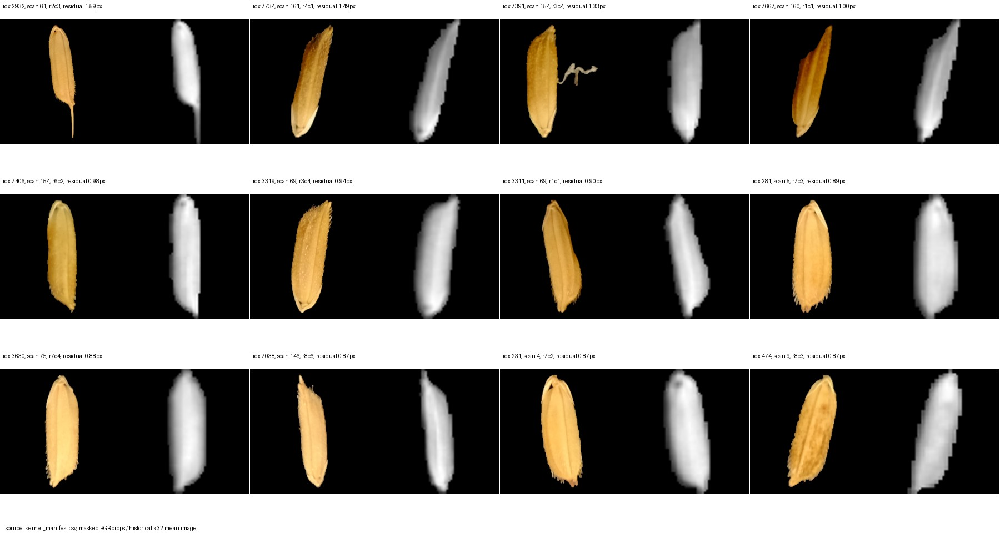
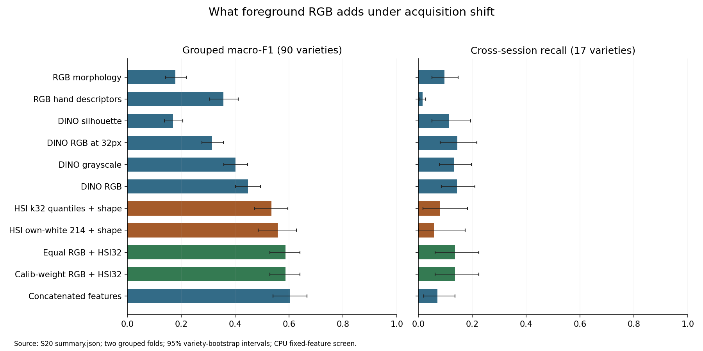

# S20 · Validated RGB pathway and complementary-information screen

2026-10-04 · **Complete: assets, CPU experiments and analysis. No new GPU training.**
[S19 strategy](../S19_next_generation_strategy/README.md) → S20 →
[S21 corrected folds](../S21_complementary_rgb/README.md) →
[S22 prepared GPU rebaseline](../S22_complementary_v5/README.md).

RGB carries useful appearance information and improves matched HSI baselines through
simple probability averaging. It does not replace HSI, establish individual-kernel
interactions, or establish cross-session improvement over v5. An audit also found
that the historical grouped folds are not complementary; S21 repairs coverage in a
separately frozen follow-up. This is evidence on repeatedly used acquisitions.

## Data gate: passed with documented limits

The 17.3-GB source archive passed its published MD5 and all 584 member CRC checks.
All 180 unique RGB scans contain the expected 48 objects. The versioned pathway pairs
all **8,624 retained HSI kernels** by scan and unique 8×6 grid cell, preserving the
16 original HSI exclusions without shifting identities. Every historical k32 float16
patch value, mask and morphology value agrees exactly. No retained row was dropped.
Mean scan correspondence RMSE is **0.28188 HSI pixels**; maximum pair residual is
1.58511 pixels (2.496% of row pitch); the smallest alternative-orientation ratio is
8.6358. This establishes object correspondence, not pixel registration or independent
biological lot identity.

Native masks, foreground 224×224 RGB crops, descriptors, full 215-band compact spectral
summaries and 4×4 occupied-region spectra are complete in `dataset_rgb_hsi_v3`.
A strict 214-band axis excludes the wavelength with three pooled-white references.
A dense full-band cube remains optional. Label-free visual review rejected v1/v2
before scoring and checked the final atlas, worst pairs and three complete native
crop scans. Masks are estimates; pixel-level annotation is absent.

EXIF establishes a capture change: sessions 0–7 use f/4; all 33 session-8 scans use
f/1.6–2.2. Every cross-session bridge touches session 8. This is evidence of an
acquisition difference, not proof of its causal contribution to errors. Metadata
and plate position are excluded from predictors.

## Frozen CPU experiment

The [preregistration](../../evidence/S20_rgb_pathway/preregistration.json)
(SHA-256 `c2d4f18394bd031530ba438b4ef2cad04a5b56a97f2eee2cad6a96b67951607a`)
contains 30 arms over two historical grouped folds: RGB shape/color/texture,
DINOv2-S/14 RGB/grayscale/32-pixel/silhouette, HSI quantile and mean/SNV controls,
concatenation, calibrated probability fusion, shuffled pairing, and three existing
v5 TTA seeds with/without RGB. Four frozen feature caches ran on CPU. Train-only
scaling and shrinkage LDA export numeric inference coefficients; calibration uses
only held-aside training-scan rows. No neural fine-tuning or held-out-selected weights.
All selected temperatures are inside the prespecified grid (1–4); calibration chose
equal weights in both folds.

| Selected arm | Macro-F1 | Same-session recall | Cross-session recall |
|---|---:|---:|---:|
| RGB hand descriptors | .356958 | .456355 | .014706 |
| DINO silhouette | .169616 | .183823 | .112771 |
| DINO RGB | .447312 | .525483 | .143312 |
| HSI k32 quantiles + shape | .534861 | .668904 | .079861 |
| HSI strict full214 quantiles + shape | .557974 | .712050 | .058211 |
| Equal RGB + HSI k32 | .587118 | .717631 | .135047 |
| Concatenated RGB/HSI features | .604499 | .758916 | .071078 |
| Historical v5 TTA, three-seed logit reconstruction | .570796 | .682888 | .199197 |
| Equal v5 + RGB, same three HSI seeds | .611691 | .728353 | .208687 |

[All 30 arms, intervals and contrasts](results.md) ·
[Saved predictions and metrics](../../evidence/S20_rgb_pathway/COMPLETED.json).

RGB versus silhouette improves F1 by **.277696**, paired 95% class interval
[.242646, .310566]. Equal RGB/HSI32 adds **.052257** [.032143, .073375]; cross recall
adds .055186 [.003676, .115900]. Against the stronger v5 reference, fusion adds
**.040896** [.026310, .055735], but cross recall adds only .009490
[−.039544, .058211]. All three v5 seeds pass the frozen point-direction gate;
this is not statistically supported cross-session improvement or three independent
RGB replications.

Six ties introduced by saved float16 logits explain the tiny difference from S16's
original-prediction baseline .570816/.682841/.199401. The saved
[quantization audit](../../evidence/S20_rgb_pathway/historical_logit_quantization.json)
checks every changed row. S16's published values are not replaced.

Full spectra improve aggregate fit but fail the transfer gate: nested64 loses
cross recall versus nested32; full214 mean loses versus mean32. Fixed classifier
family does not mean fixed parameter count when dimensionality changes. This does
not rule out every nonlinear spectral encoder. RGB color/resolution improvements
are largely within-session. Concatenation improves F1 but reduces cross recall
relative to late fusion. Within-scan shuffled RGB fusion is actually better in F1
than matched fusion (matched minus shuffled −.012322 [−.018202, −.006458]); no
individual-kernel interaction advantage is established. That class-pure scan control
is a diagnostic, not a deployment algorithm.

## Protocol discovery and explicit post-freeze correction

The original grouped splitter interleaves group-order and variable-size patch draws
in one RNG stream. Its two folds hold out **6,848 unique rows**, repeat **1,772** and
never hold out **1,776**. Thirty-seven classes repeat the same held-out scan,
including seven of the 17 cross-session classes. Each fold is group-disjoint:
this is a coverage defect, not within-fold train/test leakage. Historical matched
comparisons remain comparisons on their actual saved rows.

The frozen S20 plan's phrase “both directions” is therefore too strong. It is
preserved as executed; the correction is recorded here and in the
[coverage audit](../../evidence/S20_rgb_pathway/fold_coverage_audit.json).
S20 intervals retain both selected folds of each variety, not necessarily both
acquisition directions. S21 independently keys group order and patch sampling and
scores every row once. Old v5 networks cannot be reused on S21's different training
scans, motivating S22. Historical source, study files and frozen plans remain intact.

## Decisions, limitations and reproducibility

H32/H33/H34 pass their bounded gates; H35 fails the required transfer component.
Retain HSI k32 and simple late fusion as candidates; defer joint attention, learned
gating and full-band expansion until mechanism-specific evidence warrants them.
S21 checks the same broad conclusions under exhaustive coverage. The next neural
comparison is six v5 fits on those repaired partitions, then fixed RGB fusion.

Intervals are 2,000 paired resamples of per-variety contributions, preserving original
precision denominators and averaging fold scores. They quantify heterogeneity of
these varieties, not uncertainty over new sessions. Multiple contrasts, repeatedly
used acquisitions, 17 bridge classes and unauditable foundation-model pretraining
overlap limit confirmatory claims. No independent-session or lot test was created.
NumPy emitted matrix-product warnings: all saved coefficients and probabilities are
finite, normalized, and explicit sums equal BLAS on train/calib checks; the low-level
warning cause is unresolved and logs are retained. No refit was used to hide warnings.

[Implementation and data contract](implementation.md) · [Reproduce and validate](reproduce.md) ·
[Current handoff](../../RESEARCH_PROGRESS.md) · [F97–F103](../../FINDINGS.md) ·
[D41–D44](../../DECISIONS.md).
