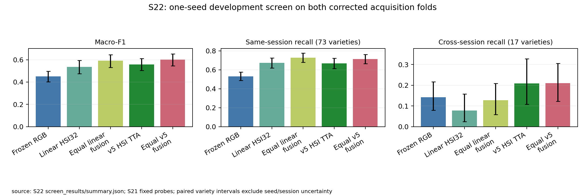
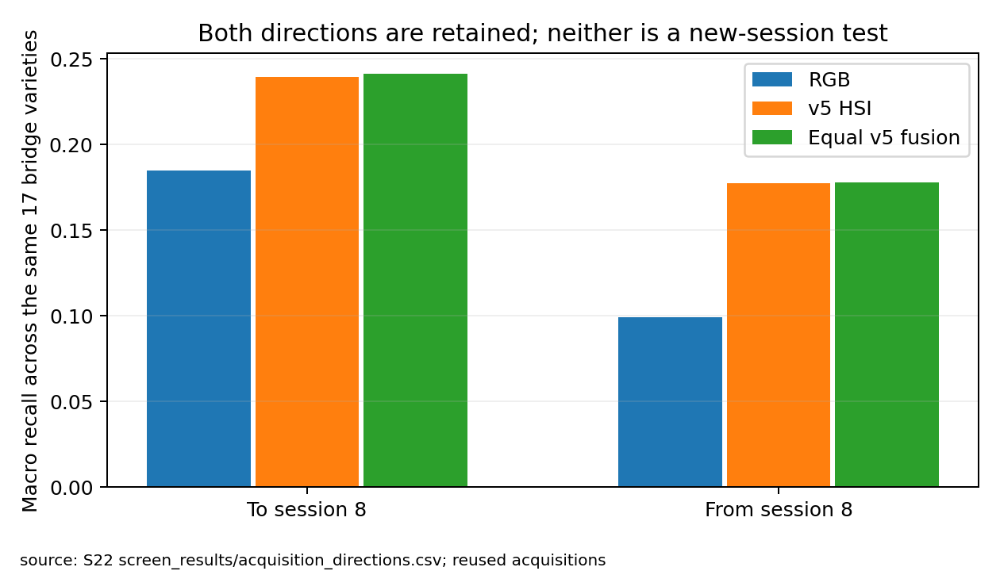

# S22 · Corrected-fold v5 and RGB fusion development screen

2026-10-05 · **Complete: two corrected-fold HSI fits, seed 0, and fixed equal RGB fusion.**
H40-screen passes; original three-seed H40 is not evaluated. The result advances
the minimal learned S23 candidate, rather than expanding this intermediate baseline.

## What ran and why

The [compute amendment02](amendment02.md) explicitly replaces the six-cell initial
allocation with **folds 0/1 × seed 0**. The original frozen JSON and evidence remain
unchanged. S20's historical fusion gain was positive at all three existing seeds,
with two-fold mean gains .046404/.039623/.036660 and descriptive SD .004995. S21's
corrected-fold linear fusion gains were .062663/.051278. This justified an efficient
two-fit architecture screen; it did not establish corrected-fold seed variance.

The completed cells use [amendment05](amendment05.md): original R1/k32 v5,
2,725,700 parameters, SNV/morphology, strides `[2,2,2,1]`, CBAM minimum 3,
batch 128, maximum 200 epochs, patience 40, calib-only live/EMA selection and
historical TTA. Two Tesla T4s, DDP world size 2, fp16/GradScaler; Python 3.13.15,
Torch 2.11.0+cu128, CUDA 12.8. Final single-view/TTA inference explicitly uses
fp32; saved logits are serialized float16. This environment is recorded, not assumed identical
to the historical host. The private CUDA bootstrap took **2,839.98 s (47.33 min)**
including both cells and archive generation. This is wall time, not a billing claim.

| Cell | Train / calib / held-out rows | Epochs completed | Selected epoch/source | Calib F1 |
|---|---|---|---|---|
| fold 0, seed 0 | 3,681 / 630 / 4,313 | 189 | 149 / live | .722472 |
| fold 1, seed 0 | 3,683 / 630 / 4,311 | 177 | 137 / live | .716832 |

Both stopped at patience 40. All **8,624 kernels are held out exactly once per arm**;
scan groups stay disjoint. The 17 bridges are evaluated in both acquisition directions.
Fold 0 contains 6 bridges toward session 8 and 11 away; fold 1 reverses those counts.
Folds are therefore not synonymous with global session directions.

Two preserved local attempts precede the complete CUDA cells: amendment02's loader
terminated before epoch 1, and amendment03's workerless MPS attempt was interrupted
after six epochs because of runtime. Neither produced held-out evaluation; neither
enters this result. They remain explicit execution history, not hidden failed fits.

## Corrected-fold results

F1 and recall below are on [0,1]. Means average the two fold metrics. RGB and linear
HSI/fusion are the already established, unchanged S21 controls on these exact rows.

| Predictor | Fold 0 F1 | Fold 1 F1 | Mean F1 | Same-session recall | Cross-session recall |
|---|---:|---:|---:|---:|---:|
| Frozen RGB probe | .444608 | .456433 | .450520 | .531532 | .142046 |
| Linear HSI32 | .525388 | .544311 | .534850 | .672893 | .077941 |
| Equal linear HSI32/RGB fusion | .588051 | .595589 | .591820 | .727895 | .127858 |
| v5 HSI, TTA | .557860 | .559958 | .558909 | .668534 | .208578 |
| Equal v5/RGB fusion | **.603199** | **.599991** | **.601595** | .715099 | .209490 |

Against v5 HSI, fusion gains **.045339/.040033 F1** on the two folds: mean
**+.042686**, paired variety interval **[.027554,.057266]**. Same-session recall
gains +.046565 [.031891,.062523]. Mean accuracy increases .581400→.619317.
H40-screen passes the sealed effect-size, interval, fold-consistency and mean-cross
point-direction criteria. It does **not** establish a transfer gain: cross deltas
are +.019634/−.017810, mean **+.000912 [−.047802,.049617]**.

The neural HSI control adds +.024059 F1 [.002952,.046193] and +.130637 cross recall
[.071066,.196219] over linear HSI32. Neural fusion exceeds linear fusion by only
.009775 F1 [−.007516,.027802], but its cross recall is higher by +.081632
[.038124,.134942]. This is a useful representation tradeoff, not evidence that
every extra neural component is necessary or that extra bands should be adopted.

## Acquisition direction and complementarity

| Destination direction, same 17 bridges | RGB recall | v5 HSI recall | Equal v5 fusion recall | Fusion minus HSI interval |
|---|---:|---:|---:|---|
| Toward session 8 | .184722 | .239461 | .241258 | +.001797 [−.061275,.064886] |
| Away from session 8 | .099369 | .177696 | .177722 | +.000026 [−.051419,.050245] |

Fusion's near-zero mean transfer gain is visible in both direction averages.
Toward session 8 it improves 7 varieties and harms 6; away it improves 7 and harms 7.
This differs from the consistent cross gains over the weaker linear HSI probe in
S21. RGB usefulness depends on the HSI representation and class/acquisition case.

RGB alone is correct while v5 is wrong on **11.15%/11.95%** of all held-out kernels;
v5 alone is correct on 24.07%/23.75%. Their descriptive correctness oracle reaches
69.49%/69.89% accuracy, compared with v5's 58.34%/57.94%. The oracle is diagnostic,
not a deployable selector. Fusion rescues 7.93%/8.40% and harms 3.94%/4.80% of all
kernels relative to HSI. On the cross-session subset, rescues/harms are
6.26%/4.29% on fold 0 and 7.50%/9.35% on fold 1. Complementary errors exist, but
averaging does not reliably improve transfer.

S20/S21 also show RGB appearance beyond silhouette and no advantage of correct
kernel pairing over within-scan shuffling. These observations justify learning a
small additive correction, not kernel-specific cross-attention or a large new encoder.

## Development decision and confirmation

Advance [S23's fixed 23,514-parameter additive residual head](../S23_frozen_multimodal/README.md)
over frozen HSI/RGB features. It starts exactly at calibrated equal fusion, uses
training-only scales/gradients, calibration selection with epoch 0 eligible, and
one head seed on both corrected folds. It must improve the matched single-view
anchor and compete with this TTA reference; aggregate F1 cannot excuse a cross-recall
loss. No hyperparameter sweep or automatic baseline seed expansion is authorized.

The S22 gain is large enough to retain fusion and justify this learned screen.
It does not require immediate three-seed replication of an intermediate baseline.
If a final learned architecture or fixed fusion is selected, confirm it and matched
HSI/fusion controls at seeds 0/1/2 on both folds. Reuse shared encoder fits for
probability controls. Confirm relevant trainable RGB and mechanism controls;
deterministic probe refits are not replication. See the [conditional queue](confirmation_queue.md).

All intervals resample saved variety contributions, retaining fold pairing. They
exclude encoder/head seed variance and independent-session uncertainty. These are
reused development acquisitions, and all 17 bridges touch session 8. New crossed
sessions/lots and a locked external evaluation remain necessary for broad claims.

## Evidence and reproduction

Training plan SHA256: `1dd50dae26f356ac963b4713ae5820a5476ede2129f8c554178a09abc7ea7f95`.
Separate analysis-code05 receipt preserves the scorer and its rules. Complete CUDA
marker, runtime/source receipt, checkpoint digests, resolved configs, stopping and
selection manifests are archived in `evidence/S22_complementary_v5/screen_synthesis/`.
Full local checkpoints/logits remain in `outputs/s22_complementary_v5/f*_s0/`.

Guarded metrics, predictions, calibration, hypothesis, coverage, class contributions,
direction metrics and complementarity live in
`evidence/S22_complementary_v5/screen_results/`; comparative paired intervals and
direction deltas are in `screen_synthesis/`. All archives have file-hash manifests.
The TTA baseline uses original saved predictions. Float16 logit serialization changes
1/3 argmaxes per fold; this is recorded rather than silently redefining that baseline.

Replay is read-only from those artifacts. The original once-only analyzer/archive
commands refuse overwrite; use existing archives for review and figure regeneration.
The GPU bootstrap builder and exact dispatch file hashes are retained. Historical
S20/S21 results, the original S22 contract, amendments and partial attempts are preserved.

Follow-up is complete: [S23](../S23_frozen_multimodal/results.md) implements the
small learned candidate; [S24](../S24_branch_multimodal/results.md) checks branch
removals; [S25](../S25_head_seed_screen/results.md) selectively assesses head
initialization; [S26](../S26_tta_anchor/results.md) rejects the fixed anchor swap
without new held-out scoring. The next proposed step is [S27](../S27_tta_trained_head/README.md).
