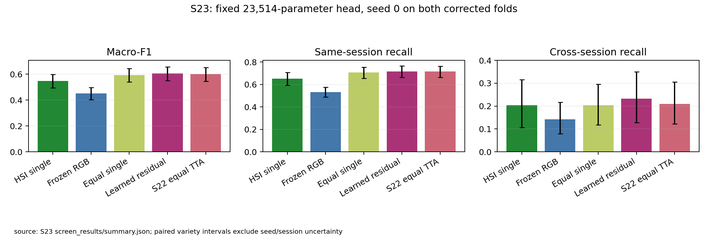
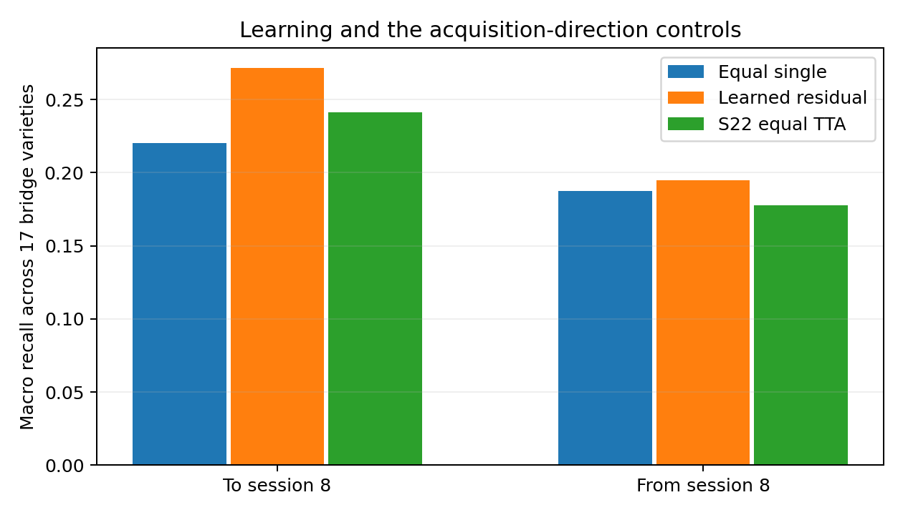

# S23 · Small learned multimodal correction screen

2026-10-05 · **Complete: one fixed head seed on both corrected folds.**
H41-screen and the recorded practical point-estimate gate pass. The head is
provisional: its margin over stronger TTA fusion is small and uncertain.

## Architecture, allocation and execution

The prospectively specified additive head has **23,514 trainable parameters**:
HSI256 and RGB384 independently project to 32-D/GELU, sum, dropout .2 and a shared
90-class readout. Log calibrated equal probabilities supply the anchor; a zero
readout starts exactly at that anchor. Both encoders and the RGB probe are frozen.
There is no cross-attention or learned feature interaction between modalities.

S22's H40-screen pass triggered a separately frozen source/input plan, SHA256
`46cdecf0c7e114c5ce78fd3ed055571be2638c224bc9e99cd834496121f2cdb7`.
Only head seed 0 on both folds ran, with selected S22 seed-0 HSI checkpoints.
AdamW lr .001, weight decay .01, residual-square penalty .1, batch 256, cap 100,
patience 15; no sweep. Train-only scales and gradients, calibration macro-F1
selection with epoch 0 eligible. Held-out extraction follows recorded selection.
The full CPU run, including frozen feature extraction, took **410.86 s (6.85 min)**.
No new encoder fit was bought.

| Fold | Selected epoch | Anchor calib F1 | Selected calib F1 | Encoder source | HSI/RGB temperature |
|---|---:|---:|---:|---|---|
| 0 | 6 | .762154 | .789418 | live | 1 / 2 |
| 1 | 10 | .759960 | .783242 | live | 1 / 2 |

## Corrected-fold results

Means average both folds; the matched controls use CPU fp32 single-view inference.
S22's TTA result is an additional practical comparator, not the matched learning
effect. Every predictor holds all 8,624 kernels out exactly once across the folds.

| Predictor | Fold 0 F1 | Fold 1 F1 | Mean F1 | Same recall | Cross recall |
|---|---:|---:|---:|---:|---:|
| HSI single-view | .548278 | .543559 | .545919 | .652112 | .203717 |
| Frozen RGB | .444608 | .456433 | .450520 | .531532 | .142046 |
| Equal single-view fusion | .597482 | .589581 | .593532 | .706630 | .203975 |
| Learned additive correction | **.607767** | **.600857** | **.604312** | .716135 | .233252 |
| S22 equal TTA fusion | .603199 | .599991 | .601595 | .715099 | .209490 |

Learned minus matched equal-single F1 is **+.010780 [.002308,.019329]**, with
+.010285/+.011276 fold gains. Cross recall gains +.012229/+.046324, mean
**+.029276 [−.002958,.065573]**. H41 passes its preregistered ≥.01 mean F1,
positive interval and fold gains, and nonnegative mean-cross criteria. The cross
interval still spans zero: transfer improvement is not established.

Against S22 TTA fusion, F1 gains only **+.002717 [−.005946,.011384]** and cross
recall +.023761 [−.006863,.057479]. Both fold F1 and cross point deltas are positive,
so the recorded adoption gate passes. It is a development point-estimate rule,
not evidence of confirmed superiority over the practical baseline.

## Acquisition direction and numerical audit

| Same 17 bridge varieties | Equal single recall | Learned recall | S22 equal TTA recall |
|---|---:|---:|---:|
| Toward session 8 | .220425 | .271650 | .241258 |
| Away from session 8 | .187526 | .194853 | .177722 |

The larger point gain is toward session 8. Both directions remain in the screen;
these reused acquisitions cannot support a broad novel-session claim.

The CPU HSI logits match CUDA single-view inference closely: maximum absolute
differences <.003905, zero calibration argmax disagreements, and 2/0 held-out
argmax disagreements on folds 0/1. This includes serialization/numerical effects;
the matched learning comparison uses one CPU recipe throughout. The RGB control
has **zero prediction disagreements with S21**. All 8,624 exported probe logits
per fold are finite, with maximum absolute magnitude <147. NumPy emitted matmul
warning flags, but saved arithmetic/finite checks do not show nonfinite predictions.
Those warnings and audit receipts are preserved; no source guard was bypassed.

## Architecture decision and replication

Retain this head as a provisional candidate. Its ≥.01 gain over matched averaging
is worth testing mechanistically, but the .0027 margin over TTA does not justify
immediate expensive encoder-seed replication of every variant. Advance the bounded
[S24 correction-branch ablation](../S24_branch_multimodal/README.md), using existing
encoders and one head seed across both folds. This tests whether both learned
feature branches are needed and can reduce the next architecture before confirmation.

If a final learned head is selected, sample both encoder and head seeds 0/1/2 on
both corrected folds, alongside matched HSI/fixed-fusion and relevant mechanism
controls. Three heads on encoder 0 measure only head variance. Deterministic RGB
probe refits are not replication. New crossed sessions/lots remain a separate
requirement. The [confirmation queue](../S22_complementary_v5/confirmation_queue.md)
specifies how shared encoders avoid redundant baseline fits.

## Saved evidence

Full heads/scales and completed artifacts: `outputs/s23_frozen_multimodal/`.
Compact metrics, predictions, learning curves, checkpoint-selection receipts,
inference audits, paired intervals, direction analysis and complete hash manifests:
`evidence/S23_frozen_multimodal/screen_results/`. Archived arithmetic replays on
all saved rows. The S23 parent plan, S22 outcomes and earlier attempts are immutable.
All variety intervals exclude encoder/head initialization and new-session variance.

Follow-up: [S24](../S24_branch_multimodal/results.md) finds no qualifying smaller
correction; [S25](../S25_head_seed_screen/results.md) confirms cheap head sensitivity,
not encoder replication. [S26](../S26_tta_anchor/results.md) rejects anchor substitution
on calib. The next proposed architecture step is [S27](../S27_tta_trained_head/README.md).
Final inference precision is fp32, with float16 logit serialization; see the
[precision receipt](../../evidence/S23_frozen_multimodal/engineering/precision_clarification.json).
