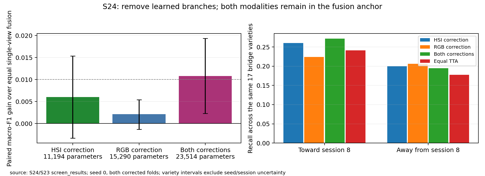

# S24 · Learned correction branch removals

2026-10-05 · **Complete: four cheap head fits, zero new encoder fits.**
Neither smaller correction qualifies. The strict H42 necessity gate fails;
the full S23 head remains provisional and advances to selective head sensitivity.

Plan SHA256: `48c8b74076a18fcd76eda245be85f5dfcb5c739b700f7381bc409fcc6c298b1d`.
Both corrected folds and head seed 0; unchanged S23 recipe/scales/temperatures.
Both modalities remain in the equal probability anchor. Only the learned feature
correction branch is removed. Frozen feature extraction plus all four head fits
took **338.94 s (5.65 min)** on CPU. The cache is retained for later head work.

| Correction | Active parameters | Fold 0 F1 | Fold 1 F1 | Mean F1 | Cross recall |
|---|---:|---:|---:|---:|---:|
| HSI feature only | 11,194 | .603583 | .595506 | .599544 | .230106 |
| RGB feature only | 15,290 | .601714 | .589581 | .595648 | .215005 |
| Both features, saved S23 | 23,514 | .607767 | .600857 | .604312 | .233252 |
| Equal single anchor | 0 additional | .597482 | .589581 | .593532 | .203975 |
| Equal TTA reference | 0 additional | .603199 | .599991 | .601595 | .209490 |

HSI correction gains +.006013 F1 [−.003292,.015349] over equal-single; RGB
correction gains +.002116 [−.001318,.005413]. Neither meets ≥.01 and a positive
interval. Neither qualifies for practical simplification; their mean F1 is below
the stronger TTA reference. The RGB correction's fold-1 checkpoint is **epoch 0**,
so its predictions there exactly retain the original anchor.

The full S23 head exceeds HSI correction by **+.004767 [.001701,.007868]** and
RGB correction by **+.008664 [.000140,.016806]**. H42 requires ≥.005 against
each removal control. The HSI margin falls short by .000233, so **H42 fails**;
do not round it into a pass or call both branches proven necessary. The positive
class intervals nevertheless suggest a modest advantage of jointly training the
additive correction. These controls remove parameters as well as branches;
they are not capacity-matched causal isolation or a kernel-interaction test.

Selected epochs HSI/RGB: 10/9 on fold 0, 7/0 on fold 1. Both checkpoint decisions
precede held-out extraction. Every arm holds all 8,624 kernels out once across
the corrected folds. Metrics replay from saved predictions; direction metrics,
paired intervals, curves, selections and hash manifests are archived under
`evidence/S24_branch_multimodal/screen_results/`. Full heads and source caches
remain in `outputs/s24_branch_multimodal/`.

Do not replicate these rejected simplifications automatically. Retain S23's full
head provisionally and use the cached features for [S25's selected-head sensitivity](../S25_head_seed_screen/README.md).
Any eventual paper claim about both branches must receive matched mechanism
confirmation. These class intervals exclude encoder/head and new-session variance.

