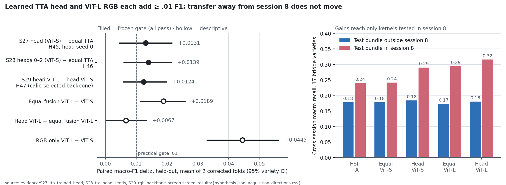

# S29 · Frozen RGB backbone capacity in the selected multimodal system

| | |
|---|---|
| **Status** | complete — H47-screen passes; DINOv2 ViT-L/14 replaces ViT-S/14 |
| **Dates** | 2026-10-05 |
| **Data** | S20 masked 224 × 224 RGB crops (all 8,624 kernels); S21 corrected folds; S22 seed-0 v5 TTA logits; S27 train-TTA cache |
| **Code** | `scripts/run_rgb_backbone_screen.py` (extract · freeze · run); `evidence/S29_rgb_backbone_screen/code/` |
| **Raw outputs** | `outputs/s28_rgb_features/` (features; named before renumbering), `outputs/s29_rgb_backbone_screen/` |
| **Evidence** | [`evidence/S29_rgb_backbone_screen/`](../../evidence/S29_rgb_backbone_screen/) · [figure](../../figures/S29_rgb_backbone_screen/system_progression.png) |
| **Registers** | F111–F113 · D51–D52 · H47-screen |

## 1 · Question and trigger

Is the multimodal system limited by its fusion form or by its weakest representation?
RGB is the weaker modality (DINOv2-S probe .4505 against v5 TTA .5591). S20/S21 show that RGB detail
matters a great deal: 224 px beats 32 px by .127 F1, and colour beats grayscale by .050. Yet the
encoder was the smallest DINOv2, ViT-S/14, chosen as a tractable first probe (D43), with
DINOv3/ConvNeXt comparisons explicitly deferred (FW-40). The S27 bottleneck diagnostic on
saved predictions points at representations rather than the fusion rule:
- 61% of the fused macro-recall deficit is in the 73 same-session classes.
- An either-modality oracle reaches .697 accuracy against .619 fused.
- 69% of cross-session kernels are wrong in *both* modalities.

## 2 · Design history (disclosed)

This screen was first drafted while S27 was running, as "S28", conditional on S27 *failing*. It
compared backbones only under fixed equal fusion. Label-free feature extraction for ViT-B/14 and
ViT-L/14 ran during that period: no partition or label was read. Its script version is archived
as `code/extract_stage_version.py`, with a hash equal to the one in `provenance.json`. S27 passed,
so before freezing the study was renumbered S29 and redesigned at the **system level**: each new
backbone also receives the S27 TTA-trained head. No probe, fusion or head outcome existed at
redesign time.

## 3 · Frozen design (plan SHA-256 `ee51803a6f054549d1d122702133dff70e9b3c5f86dc8b1c8cc48dcf431aa01f`)

- **Features:** public DINOv2 ViT-B/14 (768-D) and ViT-L/14 (1024-D) class tokens, using the
  identical S20 transform: masked 224 crop, ImageNet normalization, eval mode, no TTA. Extraction
  ran on Apple MPS fp32 (ViT-B 285 s, ViT-L 839 s). A re-extraction of ViT-S on MPS matches the
  S20 CPU features to 6.3e-5 absolute (relative 5.9e-6). Checkpoint URLs and SHA-256s are in
  `provenance.json`.
- **Probe:** the S21 recipe unchanged (train-only scaling + shrinkage LDA; calib log-loss
  temperature on the S21 grid). Selected temperatures: ViT-S 2.0, ViT-B/L 4.0 on both folds.
- **Arms:** RGB only (S/B/L); fixed equal v5-TTA fusion (S/B/L); system arms:
  - `head_s`, the saved S27 head, reused;
  - `head_b` and `head_l`, the S27 recipe via the shared helper, head seed 0, `rgb_dim` 768/1024,
    with 35,802 / 43,994 parameters against 23,514.
- **Candidate:** the backbone with the higher two-fold mean *calibration* F1 of its selected head,
  written to `selection.json` before held-out scoring. ViT-L .7959 vs ViT-B .7848 → **ViT-L**.
- **Replay audit:** ViT-S probabilities reproduce S21 (max difference 0.0). `equal_s`
  reproduces S22 and `head_s` reproduces S27 with zero disagreements.
- **H47-screen (system):** `head_candidate − head_s`: mean F1 ≥ .01, paired variety CI > 0,
  positive F1 on each fold, mean cross delta ≥ 0. Transfer support also needs cross CI > 0.

## 4 · Results (held-out, both corrected folds; probes + 4 heads in 4.45 s)

| Arm | Fold 0 F1 | Fold 1 F1 | Mean F1 | Same recall | Cross recall | Cross-error session attraction |
|---|---:|---:|---:|---:|---:|---:|
| HSI v5 TTA alone | .558033 | .560164 | .559098 | .668820 | .208578 | .549 |
| RGB ViT-S (S21 probe) | .444608 | .456433 | .450520 | .531532 | .142046 | .482 |
| RGB ViT-B | .464998 | .483836 | .474417 | .560436 | .144550 | .475 |
| RGB ViT-L | .484596 | .505488 | .495042 | .574647 | .175841 | .455 |
| Equal fusion ViT-S (S22 system) | .603199 | .599991 | .601595 | .715099 | .209490 | .581 |
| Equal fusion ViT-B | .609520 | .608189 | .608854 | .721988 | .223010 | .592 |
| Equal fusion ViT-L | .624812 | .616097 | .620455 | .731834 | .233346 | .571 |
| Head ViT-S (S27 system) | .615717 | .613721 | .614719 | .729846 | .236887 | .574 |
| Head ViT-B | .608348 | .611008 | .609678 | .723555 | .236410 | .578 |
| **Head ViT-L (selected)** | **.628906** | **.625395** | **.627150** | .740818 | .247998 | .580 |

The HSI-alone row argmaxes the saved float16 TTA logits; S22's original predictions give
.557860 / .559958 (float16 ties, already audited in S22).

**H47-screen: pass.** Head ViT-L − head ViT-S **+.012431 F1 [.005679, .019846]**, fold gains
+.013189 / +.011674, cross **+.011111 [−.007364, .033104]**. Transfer is not supported.

| Descriptive paired contrast (both folds) | ΔF1 [95% variety CI] | Δcross recall [CI] |
|---|---:|---:|
| RGB-only ViT-L − ViT-S | +.0445 [.0329, .0563] | **+.0338 [.0064, .0638]** |
| RGB-only ViT-B − ViT-S | +.0239 [.0134, .0349] | +.0025 [−.0122, .0166] |
| Equal fusion ViT-L − ViT-S | +.0189 [.0113, .0259] | +.0239 [−.0000, .0490] |
| Equal fusion ViT-B − ViT-S | +.0073 [.0004, .0141] | +.0135 [−.0078, .0386] |
| Head ViT-B − head ViT-S | −.0050 [−.0111, .0007] | −.0005 [−.0158, .0135] |
| **Head ViT-L − equal fusion ViT-L** | **+.0067 [.0001, .0133]** | +.0147 [−.0074, .0380] |

Acquisition directions (17 bridge varieties each), outside → in session 8: HSI TTA .178 → .240;
equal ViT-L .173 → .294; head ViT-L .180 → .316. **Away-from-session-8 recall is .173–.196 for
every system tested in S27–S29.**



## 5 · Findings

- **F111.** RGB backbone capacity is a real lever. ViT-L raises RGB-only F1 by .0445 and, alone among
  RGB changes so far, raises RGB cross recall with an interval above zero (+.034). Gains are
  monotone S < B < L for RGB alone but not inside the head (ViT-B head < ViT-S head).
- **F112.** The learned head's margin shrinks as the anchor strengthens: +.0131 over equal ViT-S
  versus +.0067 [.0001, .0133] over equal ViT-L. That is below the .01 practical threshold, from
  one head seed and one encoder. Fixed equal fusion with ViT-L (.6205) alone already exceeds the
  S27 learned system (.6147). Part of the head's value was compensating for weak RGB features.
- **F113.** Across S27–S29, every gain in cross recall comes from kernels whose test bundle is in
  session 8. Away-from-session-8 recall does not move (.17–.20). Cross-error session attraction
  stays 57–59% in every fused system, against 14% chance.

## 6 · Decisions

[D51](../../DECISIONS.md): ViT-L/14 replaces ViT-S/14 as the frozen RGB encoder. The selected
development system is the TTA-trained head on ViT-L (per H47). Fixed equal ViT-L fusion is its
mandatory matched control, and whether the head is retained is decided at confirmation.
[D52](../../DECISIONS.md): stop development screening on reused acquisitions. The next compute is
the matched final confirmation ([S30 brief](../S30_final_confirmation/README.md)); the next
scientific experiment is crossed acquisitions.

## 7 · Threats to validity

- One HSI encoder seed per fold; class intervals exclude encoder and new-session variance.
- The ViT-L head has 87% more parameters than the ViT-S head.
- The candidate was chosen on calibration from two backbones, with a mild optimism the gate
  thresholds absorb.
- DINOv2's LVD-142M pretraining overlap with these images cannot be audited.
- The 224 px crop ceiling was not varied.
- All tests reuse acquisitions already used across S20–S28 (benchmark development, not a locked test).

## 8 · Reproduce

```sh
PYTHONPATH=src:scripts OPENBLAS_NUM_THREADS=1 python scripts/run_rgb_backbone_screen.py extract  # ~19 min MPS (already run)
PYTHONPATH=src:scripts OPENBLAS_NUM_THREADS=1 python scripts/run_rgb_backbone_screen.py freeze
PYTHONPATH=src:scripts OPENBLAS_NUM_THREADS=1 python scripts/run_rgb_backbone_screen.py run      # ~5 s
PYTHONPATH=src python docs/research/evidence/S27_tta_trained_head/code/archive_screen.py \
  outputs/s29_rgb_backbone_screen configs/research/s29_rgb_backbone_screen.json \
  docs/research/evidence/S29_rgb_backbone_screen/screen_results outputs/s28_rgb_features/provenance.json
python docs/research/evidence/S29_rgb_backbone_screen/code/draw_figures.py
```

DINOv2 checkpoints come from `dl.fbaipublicfiles.com` (Apache-2.0) into `~/.cache/torch/hub/checkpoints/`.
The extract stage refuses an existing feature folder.
