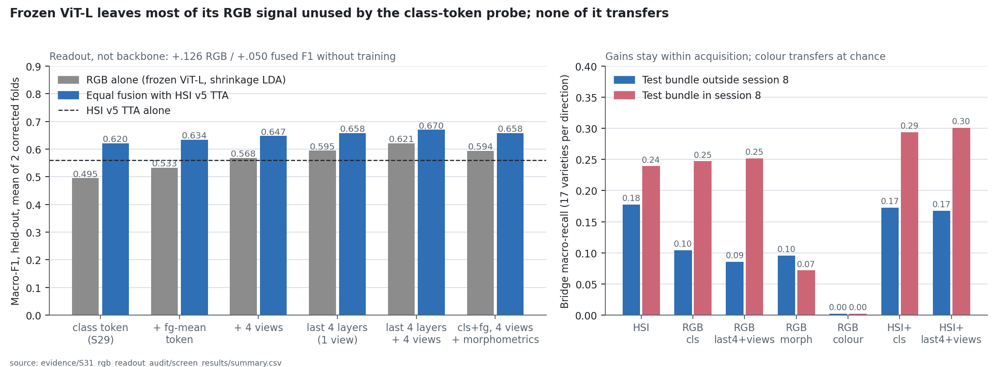

# S31 · What RGB information does the frozen ViT-L class-token probe leave unused?

| | |
|---|---|
| **Status** | complete — H48-screen **fails on its cross clause only** (+.126 F1 RGB-only, cross −.007); readout finding retained as F114 |
| **Dates** | 2026-10-05 |
| **Data** | S20 masked 224 × 224 RGB crops (all 8,624 kernels); native JPEGs (acquisition audit only); S21 corrected folds; S22 seed-0 v5 TTA logits |
| **Code** | `scripts/run_rgb_readout_audit.py` (extract · freeze · run); `src/spectralquadnet/experiments/{rgb_readout,screen_metrics}.py`; `evidence/S31_rgb_readout_audit/code/` |
| **Raw outputs** | `outputs/s31_rgb_readouts/` (features, 4.5 GB token cache), `outputs/s31_rgb_readout_audit/` |
| **Evidence** | [`evidence/S31_rgb_readout_audit/`](../../evidence/S31_rgb_readout_audit/) |
| **Registers** | F114–F117 · D53–D54 · H48–H49 |

## 1 · Question

S29's RGB branch is a shrinkage-LDA probe on the frozen ViT-L class token of one view. Before
training anything, how much RGB information is already present in the frozen backbone but unused
by that readout (patch tokens, intermediate layers, orientation views), and which explicit RGB
cues does the crop discard (absolute size, colour)? Opened under [D53](../../DECISIONS.md),
which reopened bounded development at the owner's direction; tests H48/H49.

## 2 · Why

- Kernels cover only 45–133 of the 256 patch positions (median 74); the class token summarises
  a mostly black crop. DINOv2's own linear evaluation concatenates the class token with pooled
  patch tokens.
- The crop rescales every kernel to fill 224 px, so absolute size is invisible to the backbone.
- S29 never varied the readout (threats §7 there).

## 3 · Label-free acquisition audit (run before any scoring)

Two audits read images and session ids only (no variety label). Both outputs are in the evidence folder:
[`acquisition_audit.csv`](../../evidence/S31_rgb_readout_audit/acquisition_audit.csv) and
`code/acquisition_audit.py`.

1. **The cameras are geometrically locked.** The plate-grid pitch in RGB pixels divided by the pitch in HSI
   pixels is 5.43 ± 0.03 in every session (within-session SD ≤ .007), including session 8, whose
   physical seed spacing is 6–14% tighter. Pixel morphometrics are therefore metric across
   sessions, and RGB and HSI morphometrics correlate .99. v5 already consumes the HSI
   morphometrics (F33/F63).
2. **Session 8's RGB acquisition differs measurably, and in a physically simulatable way:**
   - kernel-core Laplacian variance (fine texture) is 28 in session 8 against 48–64 elsewhere;
     on the 224 crops, 28.6 against 48.3–60.9;
   - on the crops, Gaussian blur σ ≈ 0.5 px brings other sessions to that level (51.4 → 30.8);
   - near-saturated red (≥ 250) covers 4% of kernel pixels against 14–21% elsewhere;
   - the plate background is darker and bluer (red 37 vs 59–71) while kernel colour is similar,
     so the plate itself or its lighting differs. Background-referenced colour normalisation
     would therefore be unsafe.
   - Plate-background red separates the two regimes perfectly (session 8 ≤ 50.4, all others ≥ 52.8).
   - This matches the EXIF record: f/1.6–2.2 in session 8, f/4 elsewhere (S20).
3. **No bridge variety has training rows from two sessions in either fold.** Within-variety
   acquisition contrasts are absent from training, so acquisition invariance cannot be learned
   from supervision. It must come from inductive bias, augmentation or variety-free signals.

## 4 · Frozen design (plan SHA-256 `29ef87f32804848f8f1361586db2632e8a3e97edde8688878db1c094ac7af75f`)

- **Features** (label-free, Apple MPS fp32, 12.5–17.8 min per view; 4.5 GB float16 final-token cache kept for later readouts):
  - DINOv2 ViT-L/14 on the unchanged S20 crops; blocks 21–24, each with DINOv2's final norm;
  - per block, the class token and the foreground-weighted mean patch token. A patch's weight is
    its fraction of nonzero pixels.
  - Views: identity, horizontal flip, vertical flip, 180° rotation.
  - The identity-view block-24 class token reproduces S29's `dino_l` **exactly** (max |Δ| = 0.0 on all 8,624 rows).
- **Readouts** (S21 probe: train-only scaling + shrinkage LDA; calib temperature):
  - `cls` = S29 (replayed: 0 disagreements for RGB and equal fusion);
  - `cls_fg`;
  - `last4` (8,192-D);
  - `cls_fg_tta` and `last4_tta`, with features averaged over the four views.
  - Diagnostics: `morph` (8 metric morphometrics, log size terms), `colour` (15 Lab statistics),
    `cls_fg_tta_morph`.
- **Candidate:** the highest two-fold calib F1 among the four new readouts, `last4_tta`
  (.7851 vs .7401 / .7081 / .6589). It was written to `selection.json` before held-out scoring.
- **H48-screen:** candidate − `cls` on RGB alone: ΔF1 ≥ .02, CI > 0, both folds, **cross Δ ≥ 0**.
  H49 descriptive.
- **Disclosure:** the extract stage ran from an earlier revision of the runner whose `extract()`
  differed only by a type-ignore comment. The freeze/run stages were added while extraction ran;
  no label or partition was read before freezing.

## 5 · Results (held-out, both corrected folds; CPU probes 2.4 h under contention)

| Arm | RGB-only F1 | + equal fusion with v5 TTA | Fused same / cross recall | Fused from / to session 8 |
|---|---:|---:|---:|---:|
| HSI v5 TTA alone | — | .5591 | .6688 / .2086 | .178 / .240 |
| `cls` (S29 ViT-L probe) | .4950 | .6205 | .7318 / .2333 | .173 / .294 |
| `cls_fg` | .5332 | .6335 | .7477 / .2315 | .168 / .295 |
| `cls_fg_tta` | .5683 | .6474 | .7655 / .2346 | .169 / .300 |
| `last4` | .5946 | .6582 | .7779 / .2315 | .172 / .291 |
| **`last4_tta` (candidate)** | **.6208** | **.6702** | .7935 / .2344 | .168 / .301 |
| `cls_fg_tta_morph` | .5939 | .6581 | .7772 / .2377 | .175 / .300 |
| `morph` alone | .1723 | .5544 | .6637 / .2098 | .180 / .240 |
| `colour` alone | .1253 | .5440 | .6624 / .1684 | .165 / .171 |

**H48-screen: fail, on the cross clause only.** `last4_tta` − `cls` (RGB alone) is
**+.1258 F1 [.1068, .1447]**, with fold gains +.1224 / +.1291, but cross Δ is **−.0070**
[−.0259, .0123]. RGB-only from-session-8 recall falls from .104 to .086. Under the frozen rule, S32's
frozen reference and S34's frozen component therefore remain `cls`. The readout result is kept
as a finding (F114); it is not the adopted reference.

| Descriptive paired contrast (both folds) | ΔF1 [95% variety CI] | Δcross [CI] |
|---|---:|---:|
| `cls_fg` − `cls` (foreground pooling) | +.0381 [.0320, .0448] | +.0067 [−.0025, .0159] |
| `cls_fg_tta` − `cls` (+ four views) | +.0732 [.0622, .0853] | +.0066 [−.0088, .0245] |
| `last4` − `cls` (+ blocks 21–23) | +.0995 [.0842, .1147] | −.0044 [−.0258, .0146] |
| equal `last4_tta` − equal `cls` (system) | +.0497 [.0398, .0588] | +.0011 [−.0194, .0214] |
| `cls_fg_tta_morph` − `cls_fg_tta` (RGB) | +.0256 [.0200, .0317] | **+.0148 [.0068, .0245]** |
| equal (… + morph) − equal `cls_fg_tta` (system) | +.0106 [.0071, .0143] | +.0031 [−.0098, .0136] |
| equal `morph` − HSI alone | −.0047 [−.0105, .0010] | +.0012 [−.0116, .0147] |
| equal `colour` − HSI alone | −.0151 [−.0226, −.0082] | **−.0402 [−.0598, −.0218]** |

Descriptive, not gated: fixed equal fusion with `last4_tta` (.6702) exceeds the S29 selected
learned system (.6272) by .043. A system-level test of a trained branch is S32/S34's job.



## 6 · Findings

- **F114** — The frozen ViT-L representation holds far more same-acquisition RGB information than
  its class token exposes. Foreground pooling, four views and intermediate blocks raise RGB-only
  F1 by .126 and fixed-fusion F1 by .050 without training. None of it transfers: cross Δ is −.007,
  and the from-session-8 direction falls. [E3: held-out, 2 folds, deterministic]
- **F115** — Intermediate blocks carry the largest share (+.062 over `cls_fg`). Fine texture and
  low-level structure, more than global semantics, discriminate varieties within an acquisition. [E3]
- **F116** — Explicit colour statistics are an acquisition channel. Alone they reach .173 same-session
  recall but .0025 cross (chance), and adding them to HSI lowers cross recall by .040 (CI < 0). [E3]
- **F117** — Metric morphometrics are the one RGB cue that adds transfer to the RGB branch
  (+.015 cross, CI > 0). This is consistent with the locked camera geometry (§3) and F33. At system
  level they are largely redundant with the morphometrics v5 already consumes (+.011 F1, cross n.s.). [E3]

## 7 · Decisions

[D54](../../DECISIONS.md): keep `cls` as the frozen reference under the frozen rule. Record the
multi-layer, foreground, multi-view readout as the design requirement for any trained RGB branch's
head. Treat colour as a session channel that a transfer-oriented design must not lean on.

## 8 · Threats to validity

- Development screen on reused acquisitions. Four candidates were chosen on calib, which is within-session.
- LDA in 8,192-D relies on shrinkage. Calib temperatures selected 8.0, inside the grid.
- The cross-recall intervals span 17 bridge varieties per direction and are wide.
- The acquisition audit's session-level sharpness medians mix variety composition with
  acquisition. The 2× drop across 25 session-8 varieties and the EXIF aperture change make an
  acquisition cause likely, not proven.

## 9 · What would change these conclusions

- A trained branch that recovers F114's gain *and* moves from-session-8 recall would make
  readout-level transfer limits a training artefact.
- Crossed acquisitions showing colour transfer would reverse F116's interpretation.

## 10 · Reproduce

```sh
PYTHONPATH=src:scripts python scripts/run_rgb_readout_audit.py extract   # ~57 min MPS fp32
PYTHONPATH=src:scripts python scripts/run_rgb_readout_audit.py freeze
PYTHONPATH=src:scripts OPENBLAS_NUM_THREADS=4 python scripts/run_rgb_readout_audit.py run   # 1-2.5 h CPU (8,192-D LDA)
PYTHONPATH=src python docs/research/evidence/S27_tta_trained_head/code/archive_screen.py \
  outputs/s31_rgb_readout_audit configs/research/s31_rgb_readout_audit.json \
  docs/research/evidence/S31_rgb_readout_audit/screen_results outputs/s31_rgb_readouts/provenance.json
PYTHONPATH=src python docs/research/evidence/S31_rgb_readout_audit/code/acquisition_audit.py    # label-free, ~5 min
python docs/research/evidence/S31_rgb_readout_audit/code/acquisition_regimes.py
python docs/research/evidence/S31_rgb_readout_audit/code/draw_figures.py
```
