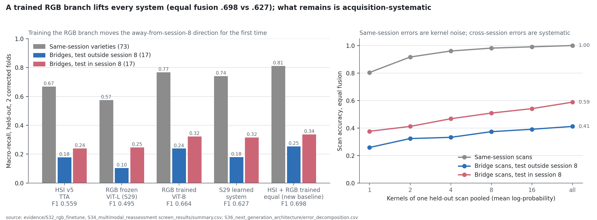

# S32 · How much does a properly trained RGB branch extract beyond frozen DINOv2?

| | |
|---|---|
| **Status** | complete — **H50 and H51 pass**; the trained branch also moves away-from-session-8 recall for the first time (F118) |
| **Dates** | 2026-10-05 |
| **Data** | S20 masked 224 × 224 RGB crops; S21 corrected folds; S22 seed-0 v5 TTA logits for fusion |
| **Code** | `scripts/run_rgb_finetune.py` (profile · freeze · train · run); `src/spectralquadnet/models/rgb_branch.py`; `src/spectralquadnet/experiments/rgb_finetune.py`; tests `tests/unit/test_rgb_branch.py` |
| **Raw outputs** | `outputs/s32_rgb_finetune/<arm>_f<fold>/` (checkpoint, trace, 4-view logits and embeddings for all 8,624 rows), `outputs/s32_rgb_finetune/screen/` |
| **Evidence** | [`evidence/S32_rgb_finetune/`](../../evidence/S32_rgb_finetune/) |
| **Registers** | F118–F121 · D55 · H50–H51 · F113 challenged |

## 1 · Question

Every RGB result so far is a linear probe on a frozen DINOv2 backbone. With a fixed, a-priori
fine-tuning recipe, one seed and both corrected folds, how much more does a trained RGB branch
extract, at what backbone scale? Does the gain survive fusion with HSI v5? Tests H50/H51 under
[D53](../../DECISIONS.md).

## 2 · Design choices fixed before training (and why)

- **Foreground tokens.** The branch keeps the class token plus the 128 most-foreground patch
  tokens. Kernels occupy 45–133 of 256 positions (S31), so this drops pure background and roughly
  halves the sequence length. Positional embeddings are added before selection, so geometry is kept.
- **Readout.** The class token concatenated with the foreground-weighted mean token. This is the
  S31 `cls_fg` readout.
- **Recipe** (no search):
  - AdamW, backbone lr 3e-5 with layer decay (0.8 for ViT-B, 0.9 for ViT-L, so the bottom-layer
    rate is similar), head lr 1e-3, weight decay .05;
  - 12 epochs, 1 warm-up epoch, cosine schedule, batch 32;
  - label smoothing .1, stochastic depth .1, bf16 autocast, gradient clip 1.
- **Augmentation** (label-free):
  - the four S31 orientation views;
  - ±8 px shift inside the crop margin;
  - ±10% foreground exposure/contrast with clipping. Session 8 differs in exposure and clipping
    (S31 §3), and hue is left untouched because colour carries variety signal.
- **Selection.** The epoch with the best identity-view calib macro-F1; the temperature on calib
  4-view logits; the backbone with the higher two-fold calib F1. All three are chosen before any
  held-out scoring.
- **Cells.** ViT-B/14 and ViT-L/14 × folds 0/1, seed 0. Multi-seed confirmation is reserved for the
  final system (D53).
- **Frozen plan** `configs/research/s32_rgb_finetune.json`, SHA-256
  `251465cc1fe5aa2d94f18b6ce731132055f5a86b3a03797c574dd70b5e230738`. It was frozen before S31
  was scored, with the reference *rule* (S31 candidate if H48 passes, else `cls`) resolved at
  scoring time from S31's sealed outputs. H48 failed, so the reference is `cls`, the S29 ViT-L probe.
- **Memory deviation, profiled before freezing:** full ViT-L fine-tuning thrashes swap on the
  16 GB machine. ViT-L therefore tunes its top 8 of 24 blocks; with 0.9 layer decay the frozen
  blocks' rates would have been ≤ 1.3e-5. ViT-B is fully fine-tuned. This is in the plan.

## 3 · Compute (Apple M5 MPS, bf16; CPU shared with unrelated processes)

| Cell | Epoch time | Best epoch | Calib F1 (id / 4-view) | Wall |
|---|---:|---:|---:|---:|
| ViT-B f0 | 3.3–4.0 min | 11 (last) | .7751 / .7893 | 48.5 min |
| ViT-B f1 | 3.5–3.9 min | 10 | .7844 / .8172 | 48.0 min |
| ViT-L (top 8) f0 | 3.5–4.9 min | 11 (last) | .7780 / .8016 | 62.8 min |
| ViT-L (top 8) f1 | 3.8–5.0 min | 10 | .7871 / .8010 | 61.3 min |

Calib-selected candidate: **ViT-B** (two-fold calib .8032 vs .8013). In two cells the best epoch
was the last of the 12, so the fixed schedule may be conservative. That is not tested here.

## 4 · Results (held-out, both corrected folds, seed 0)

| Arm | F1 | Same / cross recall | From / to session 8 | Session attraction |
|---|---:|---:|---:|---:|
| HSI v5 TTA | .5591 | .6688 / .2086 | .178 / .240 | .549 |
| Frozen ViT-L probe (reference, S29) | .4950 | .5746 / .1758 | .104 / .247 | .455 |
| Fine-tuned ViT-B, 1 view | .6499 | .7522 / .2682 | .236 / .301 | .482 |
| **Fine-tuned ViT-B, 4 views** | **.6642** | .7672 / **.2812** | **.239** / .323 | .479 |
| Fine-tuned ViT-L (top 8), 4 views | .6589 | .7657 / .2678 | .210 / .326 | .486 |
| Equal fusion, frozen reference (S29) | .6205 | .7318 / .2333 | .173 / .294 | .571 |
| **Equal fusion, fine-tuned ViT-B** | **.6977** | **.8108 / .2953** | **.254** / .337 | .529 |
| Equal fusion, fine-tuned ViT-L | .7011 | .8168 / .2935 | .231 / .357 | .523 |

**H50-screen: pass.** Fine-tuned ViT-B TTA − frozen reference: **+.1692 F1 [.1511, .1868]**
(folds +.1739 / +.1644), **cross +.1053 [.0549, .1539]**.
**H51-screen: pass.** Equal fusion: **+.0773 [.0646, .0898]** (folds +.0732 / +.0813), **cross
+.0619 [.0221, .0999]**. Transfer support holds for both, with cross CI > 0.

| Descriptive contrast | ΔF1 [CI] | Δcross [CI] |
|---|---:|---:|
| fine-tuned ViT-B − frozen ViT-B probe (training at matched backbone) | +.1898 [.1684, .2084] | +.1366 [.0739, .1972] |
| fine-tuned ViT-L (top 8) − frozen ViT-L probe | +.1638 [.1463, .1801] | +.0920 [.0527, .1306] |
| fine-tuned ViT-L − ViT-B (4 views) | −.0053 [−.0141, .0032] | −.0133 [−.0428, .0157] |
| 4 views − 1 view (ViT-B) | +.0143 [.0097, .0188] | +.0129 [.0044, .0222] |
| fine-tuned ViT-B RGB alone − HSI v5 TTA | +.1051 [.0736, .1364] | +.0726 [−.0433, .1775] |
| equal fused ViT-B − HSI v5 TTA | +.1386 [.1154, .1612] | +.0867 [.0213, .1543] |



Complementarity with HSI (fine-tuned ViT-B): either-modality oracle accuracy .774 / .781 against
.713 fused; both modalities are wrong on 65% / 56% of cross kernels and 13% / 14% of same-session kernels.

## 5 · Findings

- **F118** — A properly trained RGB branch is the strongest single modality and the first change
  to move transfer away from session 8. Fine-tuned ViT-B with foreground tokens reaches RGB-only
  F1 .664 and cross .281. Away-from-session-8 recall is .239, against ≤ .104 for every frozen RGB
  readout and .178 for HSI. **F113's "no model change moves it" is challenged.** [E3: held-out, 2 folds, 1 seed]
- **F119** — Equal fusion with v5 gives .698 F1 and cross .295, with fused away-from-session-8
  recall .254 (S22–S31 range: .17–.20), and does so with zero learned fusion parameters. [E3]
- **F120** — Under this recipe, training rather than capacity is the lever. Partial ViT-L equals
  ViT-B (−.005), while training adds +.16–.19 at matched backbones. [E3; partial ViT-L only]
- **F121** — Headroom is now in kernels both modalities miss. The either-oracle (.78) is only
  ≈ .07 above fusion; 56–65% of cross kernels are wrong in both. [E3, descriptive]

## 6 · Decision

[D55](../../DECISIONS.md): the fine-tuned foreground-token ViT-B branch replaces frozen DINOv2 as
the RGB baseline of the next architecture. Equal fusion with v5 is the new multimodal baseline,
pending S34's gate against the S29 learned system.

## 7 · Threats to validity

- One seed. A development screen on reused acquisitions.
- The 12-epoch schedule ended at its best epoch in two cells, so the branch may be undertrained.
- ViT-L was only partially tuned, so F120 does not cover full ViT-L fine-tuning (GPU).
- Calib selects epochs within-session.
- The augmentation includes ±10% exposure jitter motivated by the session-8 audit. Part of the
  transfer gain may come from it rather than from training per se; S33 isolates blur only.
- Seventeen bridge varieties per direction.

## 8 · Reproduce

```sh
PYTHONPATH=src:scripts python scripts/run_rgb_finetune.py profile --backbone vitb   # synthetic, label-free
PYTHONPATH=src:scripts python scripts/run_rgb_finetune.py freeze                    # before S31 scoring
for a in vitb vitl; do for f in 0 1; do
  PYTHONPATH=src:scripts python scripts/run_rgb_finetune.py train --arm $a --fold $f; done; done   # ~3.7 h MPS
PYTHONPATH=src:scripts python scripts/run_rgb_finetune.py run
PYTHONPATH=src python docs/research/evidence/S27_tta_trained_head/code/archive_screen.py \
  outputs/s32_rgb_finetune/screen configs/research/s32_rgb_finetune.json docs/research/evidence/S32_rgb_finetune/screen_results
```
